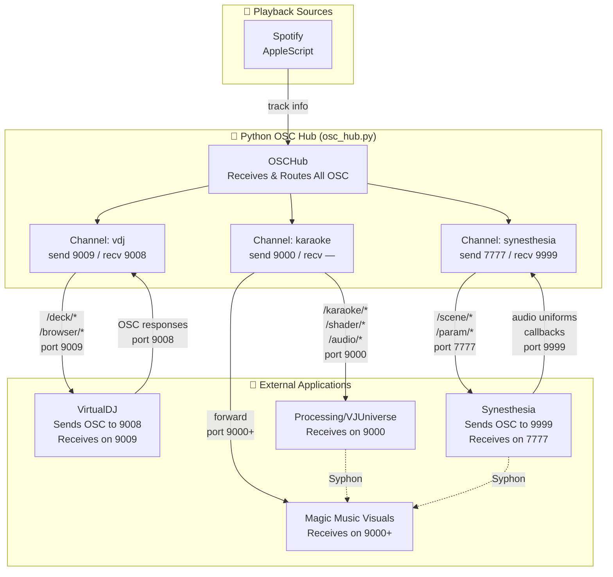
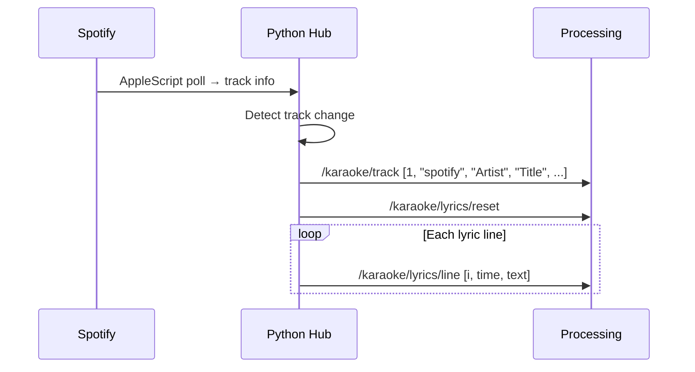
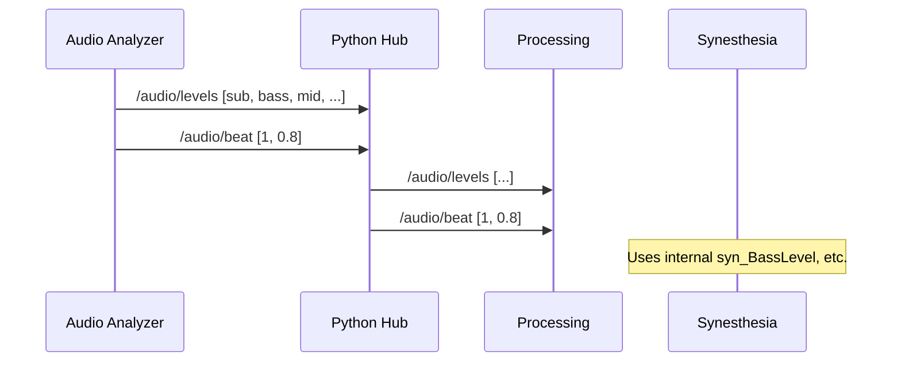

# OSC Architecture

## Overview

This VJ system uses OSC (Open Sound Control) over UDP for real-time communication between audio sources, playback monitors, a central Python hub, and visual applications.

**Design Principle:** Central hub pattern — the python-vj `osc_hub.py` binds to receive ports (9008, 9999) to listen for incoming OSC from VDJ and Synesthesia, then routes and forwards messages. The hub also sends control messages to external applications on their respective ports (9009 for VDJ, 7777 for Synesthesia, 9000 for Processing/MMV).

---

## Architecture Diagram



---

## Port Allocation

| Port | Direction | Who Listens | Purpose |
|------|-----------|-------------|---------|
| **7777** | Python Hub → Synesthesia | Synesthesia | Scene/param control commands |
| **9999** | Synesthesia → Python Hub | **Python Hub** | Audio uniforms, callbacks, events |
| **9008** | VirtualDJ → Python Hub | **Python Hub** | VDJ OSC responses, status |
| **9009** | Python Hub → VirtualDJ | VirtualDJ | VDJ OSC commands (PRO license) |
| **9000** | Python Hub → Processing/MMV | Processing/MMV | Karaoke, audio, shaders |

> **Why a central hub?** The Python Hub is the **single listener** on ports 9999 and 9008, receiving OSC from Synesthesia and VirtualDJ. This centralizes all incoming data, allows processing/routing/forwarding, and avoids port conflicts. The hub then sends control messages and forwards data to other applications.

---

## Channel Architecture

The Python hub (`osc_hub.py`) manages three typed channels:

```python
VDJ         = ChannelConfig("vdj",         "127.0.0.1", send=9009, recv=9008)
SYNESTHESIA = ChannelConfig("synesthesia", "127.0.0.1", send=7777, recv=9999)
KARAOKE     = ChannelConfig("karaoke",     "127.0.0.1", send=9000, recv=None)
```

### Usage Pattern

```python
from osc_hub import osc

osc.start()

# Send to different targets
osc.vdj.send("/deck/1/play")
osc.synesthesia.send("/scene/load", "my_scene")
osc.karaoke.send("/karaoke/track", 1, "spotify", "Artist", "Title", "Album", 200.0, 1)

# Query with response
result = osc.vdj.query("/deck/1/get_time", timeout=1.0)
```

---

## Message Namespaces

| Prefix | Direction | Purpose |
|--------|-----------|---------|
| `/karaoke/*` | Hub → Consumers | Track info, lyrics, position |
| `/shader/*` | Hub → Consumers | Shader load commands, bindings |
| `/audio/*` | Hub → Consumers | Real-time audio analysis |
| `/vdj/*` | Bidirectional | VirtualDJ OSC control & status |
| `/scene/*` | Hub → Synesthesia | Scene loading |
| `/param/*` | Hub → Synesthesia | Parameter control |
| `/pipeline/*` | Hub → Consumers | Processing step status |

---

## Data Flow Scenarios

### Scenario 1: Track Change (Spotify → Processing)



### Scenario 2: Audio Analysis → Visuals



---

## Message Reference

### Karaoke Messages

| Address | Args | Description |
|---------|------|-------------|
| `/karaoke/track` | `[active, source, artist, title, album, duration, has_lyrics]` | Track info (0/1, string×4, float, 0/1) |
| `/karaoke/pos` | `[position_sec, is_playing]` | Playback position |
| `/karaoke/lyrics/reset` | — | Clear lyrics buffer |
| `/karaoke/lyrics/line` | `[index, time_sec, text]` | Single lyric line |
| `/karaoke/line/active` | `[index]` | Currently active line (-1 if none) |
| `/karaoke/refrain/reset` | — | Clear refrain buffer |
| `/karaoke/refrain/line` | `[index, time_sec, text]` | Refrain line |
| `/karaoke/refrain/active` | `[index, text]` | Active refrain |

### Shader Messages

| Address | Args | Description |
|---------|------|-------------|
| `/shader/load` | `[name, energy, valence]` | Load shader (string, 0-1, -1 to 1) |
| `/shader/audio_binding` | `[uniform, source, mod, mult, smooth, base, min, max]` | Audio binding config |

### Audio Messages

| Address | Args | Description |
|---------|------|-------------|
| `/audio/levels` | `[sub, bass, low_mid, mid, high_mid, presence, air, rms]` | 8 frequency bands |
| `/audio/beat` | `[is_onset, flux]` | Beat detection |
| `/audio/bpm` | `[tempo, confidence]` | Tempo estimate |
| `/audio/structure` | `[buildup, drop, trend, brightness]` | Song structure |

---

## Network Topology

```
┌─────────────────────────────────────────────────────────────────────┐
│                         macOS Machine                               │
├─────────────────────────────────────────────────────────────────────┤
│                                                                     │
│   ┌──────────────┐     ┌──────────────────────────────────────┐    │
│   │ Spotify      │────▶│ Python VJ Console (osc_hub.py)       │    │
│   │ (AppleScript)│     │ CENTRAL OSC HUB & ROUTER             │    │
│   └──────────────┘     │                                      │    │
│                        │  Listening on (receives):            │    │
│   ┌──────────────┐     │  • port 9999 ← Synesthesia          │    │
│   │ VirtualDJ    │────▶│  • port 9008 ← VirtualDJ            │    │
│   │ Sends to 9008│     │                                      │    │
│   │ Listens 9009 │◀────│  Sending to (transmits):            │    │
│   └──────────────┘     │  • port 9009 → VirtualDJ            │    │
│                        │  • port 7777 → Synesthesia          │    │
│   ┌──────────────┐     │  • port 9000 → Processing/MMV       │    │
│   │ Synesthesia  │────▶│                                      │    │
│   │ Sends to 9999│     └──────────────┬───────────────────────┘    │
│   │ Listens 7777 │◀───────────────────┘                           │
│   └──────┬───────┘                                                 │
│          │                    ┌──────────────┐                     │
│          │                    │ Processing   │                     │
│          │                    │ Listens 9000 │◀────────────────────┤
│          │                    └──────┬───────┘                     │
│          │                           │                             │
│          │           ┌───────────────┴──────────────┐              │
│          │           │         Syphon                │              │
│          │           │    (frame sharing)            │              │
│          └───────────┴────────────┬──────────────────┘              │
│                                   ▼                                 │
│                          ┌──────────────────┐                       │
│                          │ Magic Music      │                       │
│                          │ Visuals          │                       │
│                          │ Listens 9000+    │                       │
│                          │ (Syphon mixer)   │                       │
│                          └────────┬─────────┘                       │
│                                   ▼                                 │
│                              Projector                              │
└─────────────────────────────────────────────────────────────────────┘
```

---

## Implementation Guidelines

### Message Format

All OSC messages use **flat arrays** (no nested structures):

```text
/category/subcategory/event [arg1, arg2, arg3, ...]
```

Arguments are primitives only: `int`, `float`, `string`.

### Rate Limiting

| Message Type | Rate |
|--------------|------|
| Position updates | 1 Hz |
| Audio levels | 60 Hz |
| Track info | On change only |
| Beat detection | On beat only |

### Namespace Separation

Keep namespaces distinct to avoid collisions:
- `/syn/*` — Synesthesia-specific
- `/song/*` — Song metadata
- `/karaoke/*` — Karaoke system
- `/vdj/*` — VirtualDJ
- `/audio/*` — Audio analysis

---

## Troubleshooting

| Issue | Check |
|-------|-------|
| No OSC received | Is hub running? Check port bindings. |
| Port conflict | Only one process can bind to each port. |
| Messages not forwarded | Verify channel is started in hub. |
| VDJ not responding | Requires VirtualDJ PRO license for OSC. |

### Debug Commands

```bash
# Monitor OSC traffic on port 9000
python -c "
import pyliblo3 as liblo
s = liblo.ServerThread(9000)
s.add_method(None, None, lambda p, a, t, s: print(f'{p} {a}'))
s.start()
import time; time.sleep(3600)
"

# Test send to Processing
python -c "
import pyliblo3 as liblo
liblo.send(liblo.Address('127.0.0.1', 9000), '/test', 1, 2, 3)
"
```

---

## Related Documentation

- [vj-console-spec/03-osc-protocol.md](vj-console-spec/03-osc-protocol.md) — Full message specification
- [python-vj/docs/guides/osc-visual-mapping.md](python-vj/docs/guides/osc-visual-mapping.md) — VJ software mapping guide
- [docs/setup/live-vj-setup-guide.md](docs/setup/live-vj-setup-guide.md) — Full Syphon/Magic pipeline setup
