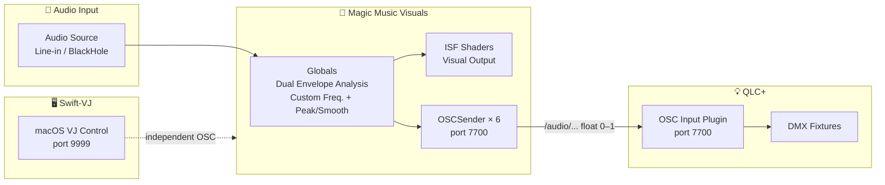
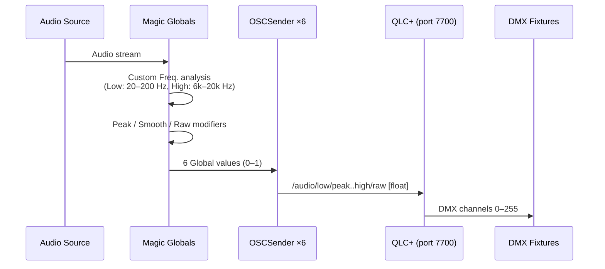

# OSC Architecture

## Overview

This VJ system uses OSC (Open Sound Control) over UDP for real-time communication between audio analysis, lighting control, and VJ control applications — all running on a single macOS machine.

**Current Stack:**

| Component | Role |
|-----------|------|
| **Magic Music Visuals** | Audio analysis via Globals (Custom Freq. + Peak/Smooth modifiers), visual rendering, OSC output via OSCSender modules |
| **QLC+** | Receives OSC from Magic on port 7700, controls DMX lighting fixtures |
| **Swift-VJ** | macOS VJ control app — karaoke, shader management, playback monitoring (separate OSC on port 9999) |

---

## Architecture Diagram


```mermaid
flowchart LR
    subgraph Audio["🎵 Audio Input"]
        MIC[Audio Source<br/>Line-in / BlackHole]
    end

    subgraph Magic["🎨 Magic Music Visuals"]
        direction TB
        GLOBALS[Globals<br/>Dual Envelope Analysis<br/>Custom Freq. + Peak/Smooth]
        ISF[ISF Shaders<br/>Visual Output]
        OSC_OUT[OSCSender × 6<br/>port 7700]
        GLOBALS --> ISF
        GLOBALS --> OSC_OUT
    end

    subgraph QLC["💡 QLC+"]
        QLC_IN[OSC Input Plugin<br/>port 7700]
        DMX[DMX Fixtures]
        QLC_IN --> DMX
    end

    subgraph SwiftVJ["🖥️ Swift-VJ"]
        SWJ[macOS VJ Control<br/>port 9999]
    end

    MIC --> GLOBALS
    OSC_OUT -->|"/audio/..." float 0–1| QLC_IN
    SWJ -.->|independent OSC| Magic
```

---

## Port Allocation

| Port | Sender | Receiver | Purpose |
|------|--------|----------|---------|
| **7700** | Magic (OSCSender) | QLC+ (OSC Input Plugin) | Audio envelope → DMX control |
| **9999** | Swift-VJ | Swift-VJ (internal) | Karaoke, shader, playback OSC |

---

## Magic → QLC+ (Audio Envelope Control)

### Message Format

```
/audio/<band>/<type>  [float 0.0–1.0]
```

- Magic sends **descriptive OSC paths** — any valid OSC address works
- **Value** — float 0.0–1.0, mapped by QLC+ to DMX 0–255
- QLC+ accepts **any arbitrary OSC path** as input and internally hashes it to a 16-bit channel number
- The `/universe/dmx/channel` format is **only** for QLC+ OSC *output* (sending DMX values out), not input
- Use the **Input Profile Editor wizard** (auto-detect) or **Channel Calculator** to map paths to QLC+ channels

### The 6 Envelope Values

Magic's dual-envelope audio analysis produces 6 output Globals, each sent via a dedicated OSCSender module:

| Global | Description | OSC Address |
|--------|-------------|-------------|
| **LowPeak** | Low band peak-hold (fast attack, slow decay) | `/audio/low/peak` |
| **LowAvg** | Low band smoothed average (EMA) | `/audio/low/avg` |
| **LowRaw** | Low band raw value (unprocessed) | `/audio/low/raw` |
| **HighPeak** | High band peak-hold | `/audio/high/peak` |
| **HighAvg** | High band smoothed average | `/audio/high/avg` |
| **HighRaw** | High band raw value | `/audio/high/raw` |

For full details on the dual-envelope system (frequency cutoffs, modifiers, Globals wiring), see [docs/reference/magic-dual-envelope-audio-analysis.md](docs/reference/magic-dual-envelope-audio-analysis.md).

### Data Flow


```mermaid
sequenceDiagram
    participant Audio as Audio Source
    participant Magic as Magic Globals
    participant OSC as OSCSender ×6
    participant QLC as QLC+ (port 7700)
    participant DMX as DMX Fixtures

    Audio->>Magic: Audio stream
    Magic->>Magic: Custom Freq. analysis<br/>(Low: 20–200 Hz, High: 6k–20k Hz)
    Magic->>Magic: Peak / Smooth / Raw modifiers
    Magic->>OSC: 6 Global values (0–1)
    OSC->>QLC: /audio/low/peak..high/raw [float]
    QLC->>DMX: DMX channels 0–255
```

---

## Swift-VJ OSC

Swift-VJ operates independently from the Magic → QLC+ pipeline. It communicates on its own ports:

| Port | Direction | Purpose |
|------|-----------|---------|
| **9999** | Inbound to Swift-VJ | Audio data, callbacks |
| **9009** | Swift-VJ → VirtualDJ | VDJ commands (send) |
| **9010** | VirtualDJ → Swift-VJ | VDJ responses (receive) |

### Message Namespaces

| Prefix | Purpose |
|--------|---------|
| `/karaoke/*` | Track info, lyrics, position |
| `/shader/*` | Shader load commands |
| `/audio/*` | Audio analysis data |
| `/textler/*` | Text overlay control |

All messages use **flat arrays** — primitives only (`int`, `float`, `string`), no nested structures.

---

## Implementation Guidelines

### Message Format

```text
/category/subcategory/event [arg1, arg2, arg3, ...]
```

### Rate Expectations

| Message Type | Rate |
|--------------|------|
| Audio envelopes (Magic → QLC+) | 60 Hz (every frame) |
| Track info | On change only |
| Beat detection | On beat only |

---

## Troubleshooting

| Issue | Check |
|-------|-------|
| QLC+ not receiving OSC | Is port 7700 configured in QLC+ OSC Input Plugin? |
| No audio response in Magic | Check Globals panel — are output Globals linked to Audio Source? |
| Port conflict | Only one process can bind to each port |
| OSC paths not mapped | Use Input Profile Editor wizard (auto-detect) or Channel Calculator to map OSC paths to QLC+ channels |

### Debug: Monitor OSC Traffic

```bash
# Listen on port 7700 (what QLC+ receives)
python3 -c "
from pythonosc.dispatcher import Dispatcher
from pythonosc.osc_server import ThreadingOSCUDPServer
d = Dispatcher()
d.set_default_handler(lambda addr, *args: print(f'{addr} {args}'))
ThreadingOSCUDPServer(('127.0.0.1', 7700), d).serve_forever()
"
```

---

## Related Documentation

- [docs/reference/magic-dual-envelope-audio-analysis.md](docs/reference/magic-dual-envelope-audio-analysis.md) — Full dual-envelope system design (Globals, modifiers, wiring)
- [docs/setup/live-vj-setup-guide.md](docs/setup/live-vj-setup-guide.md) — Live VJ rig setup
- [swift-vj/README.md](swift-vj/README.md) — Swift-VJ documentation

### Archived (Legacy)

The previous architecture used a Python OSC hub (`osc_hub.py`) to route messages between Synesthesia, VirtualDJ, Processing/VJUniverse, and Magic. That system has been replaced by the direct Magic → QLC+ pipeline above. Legacy docs are preserved in `archive/` and `docs/_archive/`.
