# OSC Architecture

## Overview

This VJ system uses OSC (Open Sound Control) over UDP for real-time communication between audio sources, playback monitors, a central Python hub, and visual applications.

**Design Principle:** Central hub pattern — one process binds to each port, then fans out to multiple consumers.

---

## Architecture Diagram

```mermaid
flowchart TB
    subgraph Sources["🎵 Playback Sources"]
        SPOT[Spotify<br/>AppleScript]
    end
    
    subgraph PyHub["🐍 Python OSC Hub (osc_hub.py)"]
        direction TB
        HUB_CORE[OSCHub<br/>Central Router]
        CH_VDJ[Channel: vdj<br/>send 9009 / recv 9008]
        CH_SYN[Channel: synesthesia<br/>send 7777 / recv 9999]
        CH_KAR[Channel: karaoke<br/>send 9000 / recv —]
        HUB_CORE --> CH_VDJ
        HUB_CORE --> CH_SYN
        HUB_CORE --> CH_KAR
    end
    
    subgraph Consumers["🎨 Visual Consumers"]
        VDJ_APP[VirtualDJ<br/>OSC PRO port 9009]
        PROC[Processing Sketches<br/>OscAudioVisualizer<br/>KaraokeOverlay<br/>port 9000]
        SYN[Synesthesia<br/>port 7777 in / 9999 out]
        MMV[Magic Music Visuals<br/>port 9000+]
    end
    
    %% Source connections
    SPOT -->|track info| HUB_CORE
    
    %% Hub to consumers
    CH_VDJ -->|/deck/*<br/>/browser/*| VDJ_APP
    VDJ_APP -->|responses| CH_VDJ
    CH_KAR -->|/karaoke/*<br/>/shader/*<br/>/audio/*| PROC
    CH_KAR -->|forward| MMV
    CH_SYN -->|/scene/*<br/>/param/*| SYN
    SYN -->|audio uniforms| CH_SYN
    
    %% Syphon video (not OSC but completes picture)
    PROC -.->|Syphon| MMV
    SYN -.->|Syphon| MMV
```



---

## Port Allocation

| Port | Direction | Application | Purpose |
|------|-----------|-------------|---------|
| **7777** | → Synesthesia | Python Hub | Scene/param control |
| **9999** | ← Synesthesia | Python Hub | Audio uniforms, callbacks |
| **9008** | ← VirtualDJ | Python Hub | VDJ OSC responses |
| **9009** | → VirtualDJ | Python Hub | VDJ OSC commands (PRO license) |
| **9000** | → Processing/MMV | Python Hub | Karaoke, audio, shaders |

> **Why a central hub?** Only one process can bind to a UDP port. The hub listens once and forwards to multiple destinations, avoiding port conflicts.

---

## Channel Architecture

The Python hub (`osc_hub.py`) manages three typed channels:

```python
VDJ         = ChannelConfig("vdj",         "127.0.0.1", send=9009, recv=9008)
SYNESTHESIA = ChannelConfig("synesthesia", "127.0.0.1", send=7777, recv=9999)
KARAOKE     = ChannelConfig("karaoke",     "127.0.0.1", send=9000, recv=None)
```

### Usage Pattern

```python
from osc_hub import osc

osc.start()

# Send to different targets
osc.vdj.send("/deck/1/play")
osc.synesthesia.send("/scene/load", "my_scene")
osc.karaoke.send("/karaoke/track", 1, "spotify", "Artist", "Title", "Album", 200.0, 1)

# Query with response
result = osc.vdj.query("/deck/1/get_time", timeout=1.0)
```

---

## Message Namespaces

| Prefix | Direction | Purpose |
|--------|-----------|---------|
| `/karaoke/*` | Hub → Consumers | Track info, lyrics, position |
| `/shader/*` | Hub → Consumers | Shader load commands, bindings |
| `/audio/*` | Hub → Consumers | Real-time audio analysis |
| `/vdj/*` | Bidirectional | VirtualDJ OSC control & status |
| `/scene/*` | Hub → Synesthesia | Scene loading |
| `/param/*` | Hub → Synesthesia | Parameter control |
| `/pipeline/*` | Hub → Consumers | Processing step status |

---

## Data Flow Scenarios

### Scenario 1: Track Change (Spotify → Processing)

```mermaid
sequenceDiagram
    participant SP as Spotify
    participant PY as Python Hub
    participant PR as Processing
    
    SP->>PY: AppleScript poll → track info
    PY->>PY: Detect track change
    PY->>PR: /karaoke/track [1, "spotify", "Artist", "Title", ...]
    PY->>PR: /karaoke/lyrics/reset
    loop Each lyric line
        PY->>PR: /karaoke/lyrics/line [i, time, text]
    end
```



### Scenario 2: Audio Analysis → Visuals


---

## Message Reference

### Karaoke Messages

| Address | Args | Description |
|---------|------|-------------|
| `/karaoke/track` | `[active, source, artist, title, album, duration, has_lyrics]` | Track info (0/1, string×4, float, 0/1) |
| `/karaoke/pos` | `[position_sec, is_playing]` | Playback position |
| `/karaoke/lyrics/reset` | — | Clear lyrics buffer |
| `/karaoke/lyrics/line` | `[index, time_sec, text]` | Single lyric line |
| `/karaoke/line/active` | `[index]` | Currently active line (-1 if none) |
| `/karaoke/refrain/reset` | — | Clear refrain buffer |
| `/karaoke/refrain/line` | `[index, time_sec, text]` | Refrain line |
| `/karaoke/refrain/active` | `[index, text]` | Active refrain |

### Shader Messages

| Address | Args | Description |
|---------|------|-------------|
| `/shader/load` | `[name, energy, valence]` | Load shader (string, 0-1, -1 to 1) |
| `/shader/audio_binding` | `[uniform, source, mod, mult, smooth, base, min, max]` | Audio binding config |

### Audio Messages

| Address | Args | Description |
|---------|------|-------------|
| `/audio/levels` | `[sub, bass, low_mid, mid, high_mid, presence, air, rms]` | 8 frequency bands |
| `/audio/beat` | `[is_onset, flux]` | Beat detection |
| `/audio/bpm` | `[tempo, confidence]` | Tempo estimate |
| `/audio/structure` | `[buildup, drop, trend, brightness]` | Song structure |

---

## Network Topology

```
┌─────────────────────────────────────────────────────────────────────┐
│                         macOS Machine                               │
├─────────────────────────────────────────────────────────────────────┤
│                                                                     │
│   ┌──────────────┐     ┌──────────────────────────────────┐        │
│   │ Spotify      │────▶│ Python VJ Console (osc_hub.py)   │        │
│   │ (AppleScript)│     │                                  │        │
│   └──────────────┘     │  Channels:                       │        │
│                        │  • vdj:        9009 → / ← 9008   │        │
│                        │  • synesthesia: 7777 → / ← 9999  │        │
│                        │  • karaoke:    9000 →            │        │
│                        └────────────┬───────────────┬─────┘        │
│                                     │               │              │
│                                     ▼               ▼              │
│   ┌──────────────┐     ┌────────────────┐   ┌──────────────┐       │
│   │ VirtualDJ    │◀───▶│ Synesthesia    │   │ Processing   │       │
│   │ port 9009    │     │ port 7777/9999 │   │ port 9000    │       │
│   └──────────────┘     └───────┬────────┘   └──────┬───────┘       │
│                                │                    │              │
│                        ┌───────┴────────────────────┴───────┐      │
│                        │              Syphon                │      │
│                        │         (frame sharing)            │      │
│                        └───────────────┬────────────────────┘      │
│                                        ▼                           │
│                               ┌──────────────────┐                 │
│                               │ Magic Music      │                 │
│                               │ Visuals          │                 │
│                               │ (Syphon mixer)   │                 │
│                               └────────┬─────────┘                 │
│                                        ▼                           │
│                                   Projector                        │
└─────────────────────────────────────────────────────────────────────┘
```

---

## Implementation Guidelines

### Message Format

All OSC messages use **flat arrays** (no nested structures):

```text
/category/subcategory/event [arg1, arg2, arg3, ...]
```

Arguments are primitives only: `int`, `float`, `string`.

### Rate Limiting

| Message Type | Rate |
|--------------|------|
| Position updates | 1 Hz |
| Audio levels | 60 Hz |
| Track info | On change only |
| Beat detection | On beat only |

### Namespace Separation

Keep namespaces distinct to avoid collisions:
- `/syn/*` — Synesthesia-specific
- `/song/*` — Song metadata
- `/karaoke/*` — Karaoke system
- `/vdj/*` — VirtualDJ
- `/audio/*` — Audio analysis

---

## Troubleshooting

| Issue | Check |
|-------|-------|
| No OSC received | Is hub running? Check port bindings. |
| Port conflict | Only one process can bind to each port. |
| Messages not forwarded | Verify channel is started in hub. |
| VDJ not responding | Requires VirtualDJ PRO license for OSC. |

### Debug Commands

```bash
# Monitor OSC traffic on port 9000
python -c "
import pyliblo3 as liblo
s = liblo.ServerThread(9000)
s.add_method(None, None, lambda p, a, t, s: print(f'{p} {a}'))
s.start()
import time; time.sleep(3600)
"

# Test send to Processing
python -c "
import pyliblo3 as liblo
liblo.send(liblo.Address('127.0.0.1', 9000), '/test', 1, 2, 3)
"
```

---

## Related Documentation

- [vj-console-spec/03-osc-protocol.md](vj-console-spec/03-osc-protocol.md) — Full message specification
- [python-vj/docs/guides/osc-visual-mapping.md](python-vj/docs/guides/osc-visual-mapping.md) — VJ software mapping guide
- [docs/setup/live-vj-setup-guide.md](docs/setup/live-vj-setup-guide.md) — Full Syphon/Magic pipeline setup
