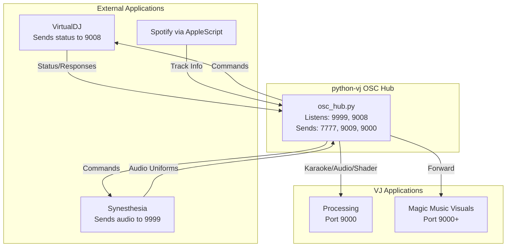
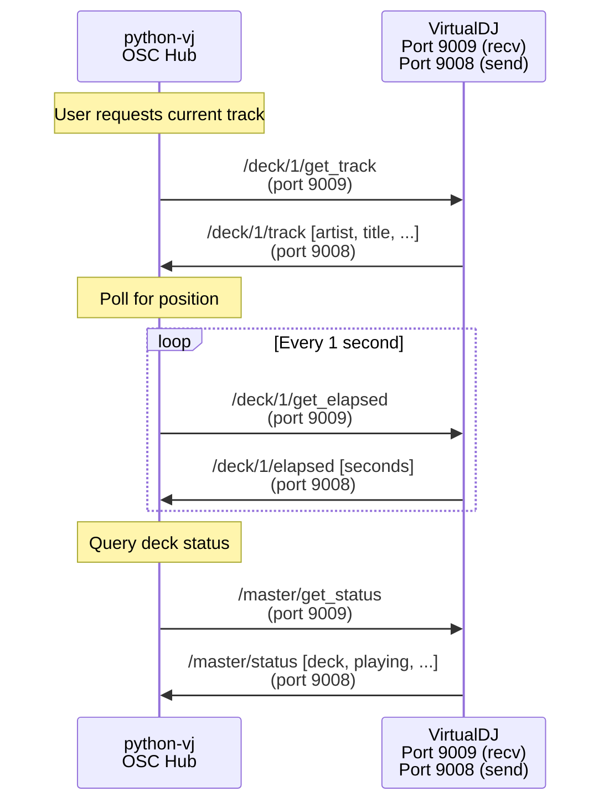
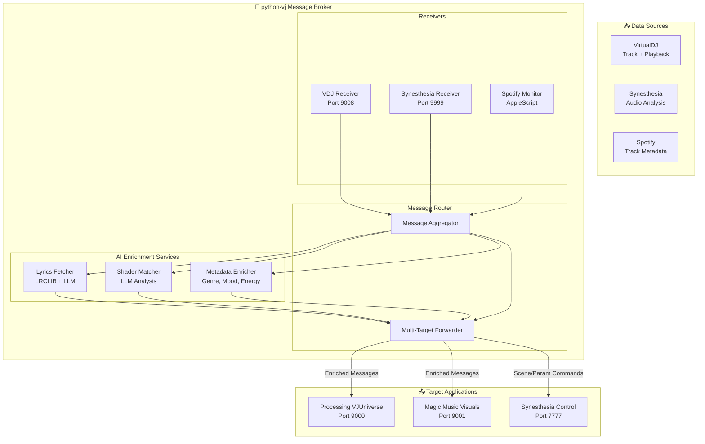
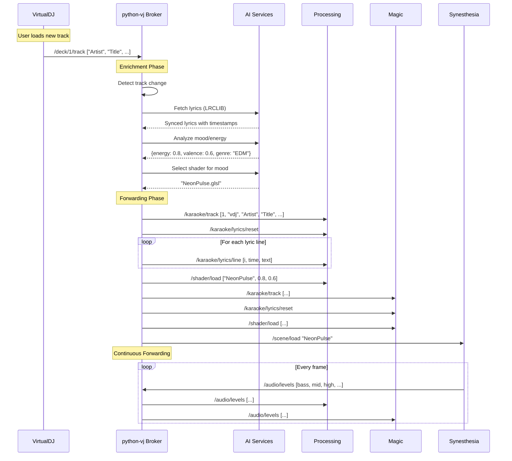
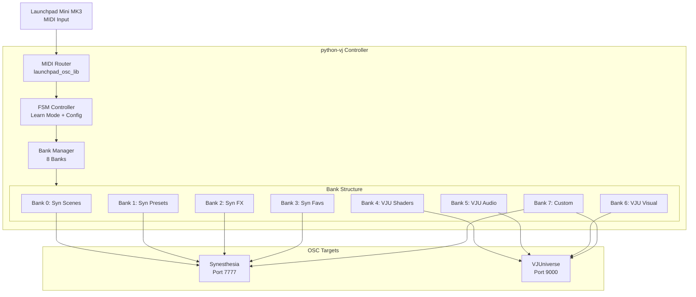

# OSC Future Architecture Plan

**Status:** Planning Document (Not Implemented)  
**Last Updated:** 2024-12-18

This document outlines the planned evolution of the OSC architecture for the synesthesia-visuals VJ system, transforming python-vj into a comprehensive OSC hub and message broker.

---

## Executive Summary

The python-vj application will evolve from a simple OSC sender to a **central message broker** that:
1. **Receives** OSC from VirtualDJ and Synesthesia (already implemented)
2. **Queries** VirtualDJ for track metadata and playback status (planned)
3. **Enriches** messages with AI-generated metadata (lyrics, shader selection, song info)
4. **Forwards** all data to Processing VJUniverse and Magic Music Visuals
5. **Controls** both Synesthesia and VJUniverse via dedicated Launchpad banks

---

## Current State (As-Is)

### Current Architecture



### Current Capabilities

**✅ Implemented:**
- Central listening on ports 9999 (Synesthesia) and 9008 (VDJ)
- Bidirectional communication with Synesthesia (send commands, receive audio data)
- Spotify monitoring via AppleScript
- Karaoke engine with lyrics fetching (LRCLIB + LLM fallback)
- OSC message forwarding to Processing/MMV on port 9000
- Shader selection via AI (Ollama/LM Studio)

**❌ Not Yet Implemented:**
- Querying VDJ for current track/elapsed time
- Enriching VDJ data with lyrics and metadata
- Comprehensive message forwarding architecture
- Launchpad control of both Synesthesia and VJUniverse

---

## Step 02: VirtualDJ Query/Control System

### Overview

Enable python-vj to **actively query** VirtualDJ for playback information instead of waiting passively for status updates. This provides real-time track info, elapsed time, and deck status on demand.

### Architecture



### Planned OSC Messages (VDJ Query Protocol)

#### Queries (Python Hub → VDJ, port 9009)

| Address | Args | Description |
|---------|------|-------------|
| `/deck/{N}/get_track` | — | Request current track metadata from deck N |
| `/deck/{N}/get_elapsed` | — | Request elapsed time in seconds |
| `/deck/{N}/get_duration` | — | Request total track duration |
| `/deck/{N}/get_status` | — | Request play/pause/cue status |
| `/master/get_status` | — | Request master deck info (which deck is active) |
| `/browser/get_focus` | — | Request currently focused track in browser |

#### Responses (VDJ → Python Hub, port 9008)

| Address | Args | Description |
|---------|------|-------------|
| `/deck/{N}/track` | `[artist, title, album, bpm, key]` | Track metadata response |
| `/deck/{N}/elapsed` | `[seconds]` | Current position |
| `/deck/{N}/duration` | `[seconds]` | Total track length |
| `/deck/{N}/status` | `[playing, paused, cue_set]` | Playback state (0/1 flags) |
| `/master/status` | `[active_deck, crossfader_pos]` | Master deck info |
| `/browser/focus` | `[artist, title, album]` | Browser focused track |

### Implementation Strategy

**Phase 1: Basic Queries (Week 1)**
1. Extend `osc.vdj.query()` method (already exists in hub.py)
2. Add VDJ query methods to VDJMonitor adapter
3. Test query/response round-trip with VDJ PRO

**Phase 2: Polling Service (Week 2)**
1. Create VDJPoller orchestrator for periodic queries
2. Implement 1Hz position updates
3. Add track change detection via polling

**Phase 3: Integration (Week 3)**
1. Merge VDJPoller with existing KaraokeEngine
2. Replace AppleScript monitoring with VDJ queries
3. Update UI to show VDJ query status

### Configuration

```python
# python-vj/config.yaml (planned)
vdj:
  polling:
    enabled: true
    interval_sec: 1.0  # Query position every 1 second
    track_change_detection: true
  query_timeout_sec: 2.0
  fallback_to_applescript: true  # If VDJ unavailable
```

### Error Handling

- **Timeout**: If VDJ doesn't respond within 2 seconds, log warning and continue
- **Missing Response**: Fall back to AppleScript monitoring if VDJ unavailable
- **Partial Data**: Handle incomplete metadata gracefully (empty strings)
- **Rate Limiting**: Throttle queries to max 10/second to avoid overload

---

## Step 03: Message Forwarding & Enrichment Architecture

### Overview

Transform python-vj into a **message broker** that receives raw data from multiple sources, enriches it with AI-generated metadata, and forwards comprehensive messages to all VJ applications.

### Architecture Diagram



### Data Flow Example: Track Change



### Message Enrichment Pipeline

#### Stage 1: Raw Data Reception
- VDJ track info (artist, title, BPM, key)
- Synesthesia audio (levels, spectrum, beat)
- Spotify metadata (album art, popularity)

#### Stage 2: AI Enrichment
**Lyrics Pipeline:**
1. Query LRCLIB for synced lyrics
2. If not found, generate with LLM (Whisper + GPT)
3. Parse timestamps and text
4. Detect refrains using LLM analysis

**Shader Selection Pipeline:**
1. Analyze track mood (energy, valence, danceability)
2. Extract genre and tempo
3. Query LLM for shader recommendation
4. Return shader name + parameters

**Metadata Enrichment:**
1. Genre classification (LLM + Spotify data)
2. Energy level (0-1)
3. Mood valence (-1 to 1)
4. Visual category tags (psychedelic, geometric, organic, etc.)

#### Stage 3: Message Forwarding
**Target: Processing VJUniverse (port 9000)**
- `/karaoke/track` - Full track info + enrichment
- `/karaoke/lyrics/*` - Synced lyrics with refrains
- `/shader/load` - Shader selection + bindings
- `/audio/*` - Real-time audio forwarded from Synesthesia
- `/meta/energy` - Energy level for visual intensity
- `/meta/mood` - Mood valence for color palette

**Target: Magic Music Visuals (port 9001)**
- Same messages as Processing
- Additional `/mmv/layer/*` commands for layer control

**Target: Synesthesia (port 7777)**
- `/scene/load` - Load scene based on mood
- `/param/*` - Control parameters based on energy

### Forwarding Rules

| Source | Target(s) | Transformation |
|--------|-----------|----------------|
| Synesthesia `/audio/*` | Processing, MMV | Forward unchanged |
| VDJ `/deck/*/track` | Processing, MMV | Enrich with lyrics + shader |
| Spotify track change | Processing, MMV, Synesthesia | Generate full metadata package |
| Python internal `/pipeline/*` | Processing, MMV | Progress updates |
| Launchpad events | Synesthesia, Processing | Control commands |

### Configuration

```python
# python-vj/config.yaml (planned)
message_broker:
  targets:
    - name: "processing"
      host: "127.0.0.1"
      port: 9000
      enabled: true
      forward:
        - "/karaoke/*"
        - "/audio/*"
        - "/shader/*"
        - "/meta/*"
    
    - name: "mmv"
      host: "127.0.0.1"
      port: 9001
      enabled: false  # Optional second monitor
      forward:
        - "/karaoke/*"
        - "/audio/*"
        - "/mmv/*"
    
    - name: "synesthesia"
      host: "127.0.0.1"
      port: 7777
      enabled: true
      forward:
        - "/scene/*"
        - "/param/*"
  
  enrichment:
    lyrics:
      enabled: true
      sources: ["lrclib", "llm"]
      llm_fallback: true
    
    shader_selection:
      enabled: true
      llm_model: "llama3.2:latest"
      update_on_track_change: true
    
    metadata:
      enabled: true
      include_genre: true
      include_mood: true
```

### Implementation Phases

**Phase 1: Message Router (Week 1)**
1. Create `MessageBroker` orchestrator
2. Implement multi-target forwarding
3. Add forwarding rules engine

**Phase 2: Enrichment Pipeline (Week 2)**
1. Integrate existing LyricsFetcher
2. Integrate existing ShaderMatcher
3. Add metadata enricher

**Phase 3: Aggregation (Week 3)**
1. Create MessageAggregator domain model
2. Merge VDJ + Spotify + Synesthesia data
3. Generate unified track change messages

**Phase 4: Configuration (Week 4)**
1. Add YAML config support
2. Hot-reload forwarding rules
3. UI for enabling/disabling targets

---

## Step 04: Launchpad Controller Architecture

### Overview

The Launchpad Mini MK3 becomes the **primary hardware controller** for the entire VJ system, with banks dedicated to controlling both Synesthesia and Processing VJUniverse.

### Bank Allocation Strategy

```
┌─────────────────────────────────────────────────────────────┐
│           Launchpad Mini MK3 - 8 Banks Total                │
├─────────────────────────────────────────────────────────────┤
│  Banks 0-3: Synesthesia Control (4 banks)                   │
│  Banks 4-7: VJUniverse Control (4 banks)                    │
└─────────────────────────────────────────────────────────────┘
```

### Detailed Bank Configuration

#### Synesthesia Banks (0-3)

**Bank 0: Scene Selection** (Top button: Up)
- 8×8 grid = 64 scene slots
- Each pad triggers `/scene/load {scene_name}`
- Active scene = bright LED, others = dim
- Mode: SELECTOR (radio buttons)

**Bank 1: Presets** (Top button: Down)
- 8×8 grid = 64 preset slots per scene
- Each pad triggers `/presets/{preset_name}`
- Active preset = bright LED
- Mode: SELECTOR (resets when scene changes)

**Bank 2: Global Effects** (Top button: Left)
- Row 0-3: Toggle effects (strobe, bloom, mirror, etc.)
- Row 4-5: Color/hue controls (SELECTOR)
- Row 6-7: Intensity/speed modifiers (TOGGLE)
- OSC targets: `/controls/global/*`, `/controls/meta/hue`

**Bank 3: Favorites** (Top button: Right)
- Quick access to favorite scenes across all banks
- Each pad = favorite slot
- Mode: SELECTOR
- OSC targets: `/favslots/{N}`

#### VJUniverse Banks (4-7)

**Bank 4: Shader Selection** (Top button: Session)
- 8×8 grid = 64 shader slots
- Each pad triggers shader load in Processing VJUniverse
- OSC: `/shader/load {name, energy, valence}`
- Active shader = bright LED
- Mode: SELECTOR

**Bank 5: Audio Bindings** (Top button: Drums)
- Row 0-2: Audio source selection (bass, mid, high, level)
- Row 3-4: Modulation type (add, multiply, threshold)
- Row 5-7: Parameter mapping to audio
- OSC: `/shader/audio_binding {uniform, source, mod, ...}`
- Mode: TOGGLE + SELECTOR

**Bank 6: Visual Controls** (Top button: Keys)
- Row 0-3: Particle system controls
- Row 4-5: Post-processing effects
- Row 6-7: Layer blend modes
- OSC: `/vjuniverse/particle/*`, `/vjuniverse/post/*`
- Mode: TOGGLE

**Bank 7: Custom Actions** (Top button: User)
- User-programmable actions
- Record mode for custom OSC sequences
- Macro support (one pad = multiple OSC messages)
- Mode: ONE_SHOT + recordable

### Control Flow Diagram



### Bank Switching Behavior

**Top Row (y=-1) Controls:**
```
[Up]    [Down]  [Left]  [Right] [Sess]  [Drums] [Keys]  [User]
Bank 0  Bank 1  Bank 2  Bank 3  Bank 4  Bank 5  Bank 6  Bank 7
Syn     Syn     Syn     Syn     VJU     VJU     VJU     Custom
Scenes  Presets FX      Favs    Shaders Audio   Visual  Actions
```

**LED Indicators:**
- Active bank = Green (bright)
- Other Synesthesia banks (0-3) = Blue (dim)
- Other VJUniverse banks (4-7) = Purple (dim)
- Empty banks = Off

**Persistence:**
- Active scene (Bank 0) persists across all banks
- Active shader (Bank 4) persists across VJU banks
- Group state (SELECTOR) shared globally

### Learn Mode for VJUniverse Control

Since VJUniverse doesn't send OSC callbacks like Synesthesia, use **manual mapping**:

1. Press Scene button (x=8, y=7) to enter Learn Mode
2. Select empty pad
3. Manually enter OSC address: `/shader/load`
4. Set args template: `["{shader_name}", 0.8, 0.5]`
5. Choose pad mode (SELECTOR, TOGGLE, ONE_SHOT)
6. Assign colors
7. Save

### Processing VJUniverse OSC Protocol

**New messages for Launchpad control:**

| Address | Args | Description |
|---------|------|-------------|
| `/shader/load` | `[name, energy, valence]` | Load shader by name |
| `/shader/next` | — | Next shader in list |
| `/shader/prev` | — | Previous shader |
| `/shader/random` | — | Random shader selection |
| `/shader/audio_binding` | `[uniform, source, mod, mult, ...]` | Bind uniform to audio |
| `/vjuniverse/particle/emit` | `[count]` | Emit N particles |
| `/vjuniverse/particle/clear` | — | Clear all particles |
| `/vjuniverse/post/blur` | `[amount]` | Set blur amount (0-1) |
| `/vjuniverse/post/feedback` | `[amount]` | Set feedback (0-1) |
| `/vjuniverse/layer/blend` | `[mode]` | Blend mode (add, multiply, screen) |

### Configuration Updates

**Update vj-console-spec/07-launchpad-osc-lib.md:**

Add new section:

```markdown
### Bank Allocation for Live Performance

| Bank | Top Button | Primary Target | Purpose | Grid Layout |
|------|------------|----------------|---------|-------------|
| 0 | Up | Synesthesia | Scene selection | 8×8 scene grid |
| 1 | Down | Synesthesia | Preset selection | 8×8 preset grid |
| 2 | Left | Synesthesia | Global effects | Effect toggles |
| 3 | Right | Synesthesia | Favorites | Quick scenes |
| 4 | Session | VJUniverse | Shader selection | 8×8 shader grid |
| 5 | Drums | VJUniverse | Audio bindings | Binding controls |
| 6 | Keys | VJUniverse | Visual controls | Post-FX, layers |
| 7 | User | Both | Custom macros | User-defined |

### Cross-Bank Group Persistence

Some groups persist across bank switches:
- `scenes` group: Active scene from Bank 0 stays active in all banks
- `shaders` group: Active shader from Bank 4 stays active in VJU banks 5-6
- Colors/hue settings persist globally

### Synesthesia Integration (Banks 0-3)

Banks 0-3 use **bidirectional OSC** with Synesthesia:
- Send: `/scene/load`, `/presets/*`, `/controls/*` to port 7777
- Receive: Scene change callbacks, preset changes from port 9999
- LED sync: Automatically update LEDs when Synesthesia changes state

### VJUniverse Integration (Banks 4-7)

Banks 4-7 use **send-only OSC** to VJUniverse:
- Send: `/shader/*`, `/vjuniverse/*` to port 9000
- No receive: VJUniverse doesn't send callbacks
- LED management: Controller maintains state locally
```

### Implementation Phases

**Phase 1: Bank Structure (Week 1)**
1. Extend `banks.py` to support 8 banks
2. Add bank metadata (target, purpose, layout)
3. Implement bank persistence

**Phase 2: Synesthesia Banks (Week 2)**
1. Configure Banks 0-3 with Synesthesia mappings
2. Test bidirectional sync with Synesthesia
3. Implement group persistence

**Phase 3: VJUniverse Banks (Week 3)**
1. Configure Banks 4-7 with VJUniverse mappings
2. Add manual mapping UI for non-bidirectional control
3. Test shader loading and audio binding

**Phase 4: Integration (Week 4)**
1. Add bank switching indicators
2. Implement cross-bank persistence
3. Create default configuration files

---

## Implementation Timeline

### Overall Roadmap (12 Weeks)

**Weeks 1-3: VDJ Query System (Step 02)**
- Week 1: Basic query infrastructure
- Week 2: Polling service
- Week 3: Integration with karaoke engine

**Weeks 4-7: Message Forwarding (Step 03)**
- Week 4: Message router core
- Week 5: Enrichment pipeline
- Week 6: Aggregation
- Week 7: Configuration system

**Weeks 8-11: Launchpad Controller (Step 04)**
- Week 8: Bank structure
- Week 9: Synesthesia banks
- Week 10: VJUniverse banks
- Week 11: Integration and testing

**Week 12: Final Integration & Documentation**
- End-to-end testing
- Performance optimization
- Documentation updates
- Tutorial videos

---

## Dependencies

### Python Packages (Already Installed)
- `pyliblo3` - OSC communication
- `mido` - MIDI handling
- `textual` - Terminal UI
- `pyyaml` - Configuration

### External Applications
- **VirtualDJ PRO** - OSC control requires PRO license
- **Synesthesia** - Already integrated
- **Processing 4.x** - For VJUniverse
- **Launchpad Mini MK3** - Hardware controller

### AI Services
- **LM Studio** or **Ollama** - LLM for enrichment (already configured)
- **LRCLIB API** - Lyrics fetching (already integrated)

---

## Risk Mitigation

### Technical Risks

**Risk: VDJ OSC not responding**
- Mitigation: Implement timeout + fallback to AppleScript
- Fallback: Continue with Spotify monitoring

**Risk: Message forwarding latency**
- Mitigation: Use async/await for non-blocking forwarding
- Target: <10ms forwarding latency

**Risk: Launchpad MIDI conflicts**
- Mitigation: Dedicated MIDI routing, clear ownership
- Bank 0-3 = Synesthesia-aware, Bank 4-7 = VJUniverse-aware

**Risk: OSC port conflicts**
- Mitigation: Already solved - central hub binds once
- All forwarding uses hub's send channels

### Operational Risks

**Risk: Configuration complexity**
- Mitigation: Provide default configs for common setups
- Provide setup wizard in VJ console

**Risk: Learning curve for performers**
- Mitigation: Clear LED indicators per bank
- Visual feedback for all actions
- Tutorial mode in Learn phase

---

## Success Criteria

### Technical Goals
- [ ] VDJ queries respond within 100ms (p95)
- [ ] Message forwarding latency <10ms (p95)
- [ ] Zero dropped OSC messages during performance
- [ ] Launchpad response time <20ms (LED update after button press)

### User Experience Goals
- [ ] Single command to start entire system
- [ ] Visual feedback for all Launchpad actions
- [ ] Bank switching <100ms with no LED flicker
- [ ] Learn mode requires <30 seconds to map new pad

### Integration Goals
- [ ] All VJ apps receive synchronized messages
- [ ] Lyrics appear in sync with audio (<100ms drift)
- [ ] Shader changes reflected in all outputs
- [ ] Cross-application state persistence (scenes, active shader)

---

## Open Questions

1. **VDJ OSC Protocol**: Does VirtualDJ support all planned query messages? Need to verify with PRO version.

2. **Message Rate**: What is acceptable OSC message rate for forwarding? Current Synesthesia sends ~60 Hz audio. Should we throttle?

3. **MMV Integration**: Does Magic Music Visuals accept same OSC messages as Processing, or does it need custom protocol?

4. **Launchpad Firmware**: Does Launchpad Mini MK3 support LED animations (pulse, fade) or only static colors?

5. **Configuration Format**: YAML vs JSON for configuration? Current codebase uses JSON for some configs.

---

## References

- [Current OSC Architecture](OSC.md)
- [OSC Protocol Spec](vj-console-spec/03-osc-protocol.md)
- [Launchpad OSC Lib Spec](vj-console-spec/07-launchpad-osc-lib.md)
- [Python VJ Hub Implementation](python-vj/osc/hub.py)
- [Processing VJUniverse](processing-vj/src/VJUniverse/)
- [VirtualDJ OSC Documentation](https://www.virtualdj.com/wiki/OSC.html)

---

**Document Status:** Planning Complete - Ready for Implementation Review  
**Next Step:** Review with team, prioritize phases, begin Step 02 implementation
