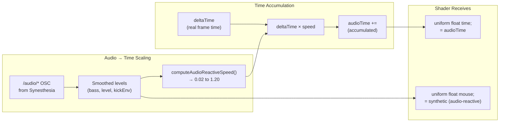
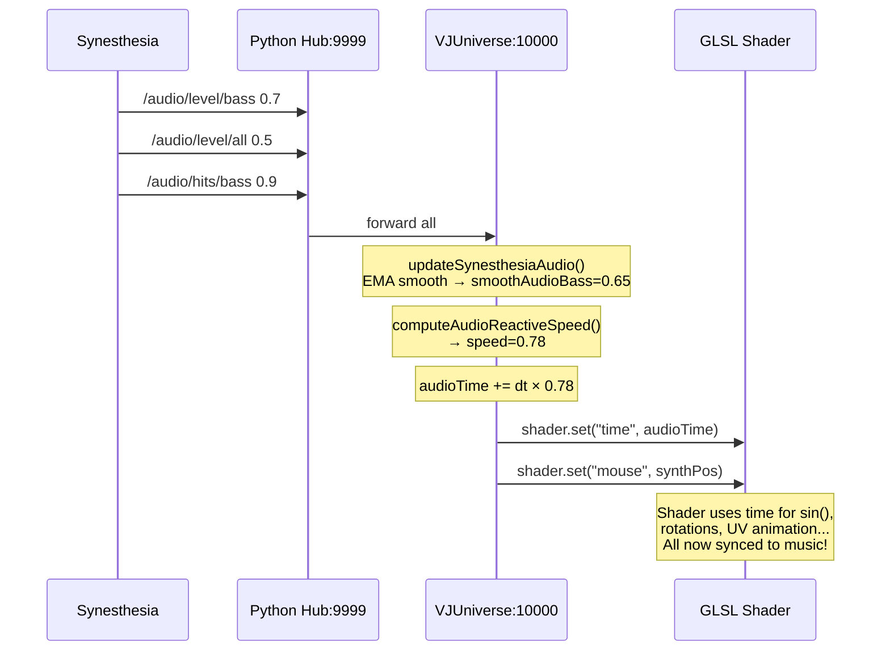

# VJUniverse Shader Audio Reactivity

> **What ACTUALLY makes shaders react to music**

Standard GLSL shaders (Shadertoy-style) don't know about audio uniforms. They just use `time`. VJUniverse makes them audio-reactive by **manipulating the `time` uniform itself**.

---

## The Core Mechanism

**Shaders use `time` for animation. VJUniverse feeds them `audioTime` instead of real time.**



---

## What Shaders Actually Receive

### The Two Uniforms That Matter

| Uniform | Value | How It's Audio-Reactive |
|---------|-------|-------------------------|
| `time` | `audioTime` | Accumulated time scaled by audio speed (0.02–1.20×) |
| `mouse` | synthetic | Figure-8 motion modulated by bass, energy, beat |

**That's it.** Existing shaders that use `time` for animation automatically become audio-reactive because `time` runs faster during loud/energetic sections and nearly freezes during silence.

### The Time Accumulation (VJUniverse.pde line 274)

```java
// Every frame:
float targetSpeed = computeAudioReactiveSpeed();  // 0.02 – 1.20
smoothedAudioSpeed = lerp(smoothedAudioSpeed, targetSpeed, 0.35);
audioTime += deltaTime * smoothedAudioSpeed;

// Then passed to shader:
shader.set("time", audioTime);  // NOT millis()/1000!
```

---

## Speed Calculation Algorithm

```java
float computeAudioReactiveSpeed() {
    // Blend overall loudness with bass emphasis
    float volumeDriver = smoothAudioLevel * 0.65 + smoothAudioBass * 0.35;
    
    // Map to speed range: silence=0.02, loud=1.20
    float targetSpeed = 0.02 + volumeDriver * (1.20 - 0.02);
    
    // Asymmetric ramp: slow climb, fast decay
    if (targetSpeed > rampedSpeed) {
        rampedSpeed = lerp(rampedSpeed, targetSpeed, 0.008);  // Slow up
    } else {
        rampedSpeed = lerp(rampedSpeed, targetSpeed, 0.025);  // Fast down
    }
    
    // Add beat punch
    float beatBoost = max(kickEnv, beatPhaseAudio) * 0.15;
    beatBoostAccum = max(beatBoostAccum * 0.92, beatBoost);
    
    return constrain(rampedSpeed + beatBoostAccum, 0.02, 1.20);
}
```

### Speed Values by Audio State

| Audio State | Speed | Effect on Shader |
|-------------|-------|------------------|
| Silence | 0.02 | Animation nearly frozen |
| Quiet passage | 0.15–0.35 | Slow, ambient motion |
| Normal music | 0.50–0.80 | Active animation |
| Loud/energetic | 0.90–1.20 | Fast, intense motion |
| On beat hit | +0.15 transient | Momentary acceleration |

---

## Synthetic Mouse

Shaders that use `mouse` for interaction get an audio-reactive figure-8 (Lissajous) motion:

```java
float[] calcSynthMousePosition(float time, float energySlow, float bass, float mid, float beat) {
    float t = time * 0.3;  // Base rotation speed
    t += beat * 0.4;       // Phase shift on beats
    
    // Figure-8 curve
    float fig8X = sin(t);
    float fig8Y = sin(t * 2.0);
    
    // Audio-modulated radius
    float radiusX = 0.12 + energySlow * 0.18 + bass * 0.12;
    float radiusY = 0.12 + energySlow * 0.18 + mid * 0.08;
    
    return new float[] {
        0.5 + fig8X * radiusX,  // Centered, clamped 0.05–0.95
        0.5 + fig8Y * radiusY
    };
}
```

---

## Data Flow Summary



---

## Key Files

| File | What It Does |
|------|--------------|
| [VJUniverse.pde](../VJUniverse.pde) L274 | `audioTime += deltaTime * frameSpeed` |
| [VJUniverse.pde](../VJUniverse.pde) L459 | `s.set("time", audioTime)` |
| [SynesthesiaAudioOSC.pde](../SynesthesiaAudioOSC.pde) L448 | `computeAudioReactiveSpeed()` |

---

## Bottom Line

**Shaders don't need to know about audio.** VJUniverse time-stretches reality itself:

- Silence → time crawls (0.02×)
- Loud music → time rushes (1.20×)
- Beat hits → time jumps

Any shader using `time` automatically pulses with the music.
