# Magic Music Visuals: Master Pipeline Guide

A complete, production-ready pipeline for live VJ performance using Magic Music Visuals (MMV). This guide provides a coherent, copy-paste-ready setup with precise naming, expressions, and detailed diagrams.

## Table of Contents

1. [High-Level Pipeline Overview](#high-level-pipeline-overview)
2. [MIDImix Controller Mapping](#midimix-controller-mapping)
3. [Audio Analysis Globals](#audio-analysis-globals)
4. [Energy and Beat Globals](#energy-and-beat-globals)
5. [Buildup and Drop Controls](#buildup-and-drop-controls)
6. [Generator Bank System](#generator-bank-system)
7. [Scene Structures](#scene-structures)
8. [Karaoke Integration](#karaoke-integration)
9. [Main Scene Assembly](#main-scene-assembly)
10. [Quick Reference](#quick-reference)

---

## High-Level Pipeline Overview

This pipeline uses a modular bus architecture for clean signal flow and audio-reactive control:

**Components:**
- **2 generator buses**: `GEN_BUS_A`, `GEN_BUS_B` (crossfaded by buildup/drop)
- **1 mask bus**: `MASK_BUS` (applies masks and karaoke text overlay)
- **1 FX bus**: `FX_BUS` (global distortion, warp, color processing)
- **Karaoke input**: Via Syphon from external app
- **MIDI controller**: Akai MIDImix for all manual controls
- **Globals**: Audio bands, energy, buildup, drop, bus selection, randomization

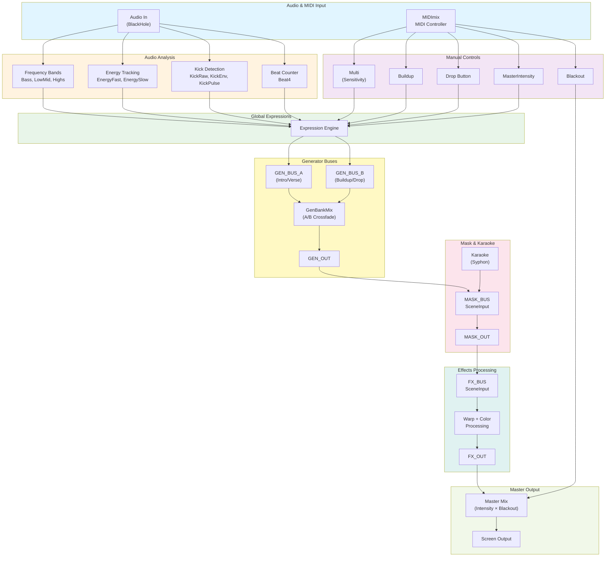

**Conceptual Signal Flow:**

```
Audio → Bands + Energy + Kick + Beat4
           ↓
MIDImix → Multi, Buildup, Drop, Master
           ↓
      Globals/Expressions
           ↓
    ┌──────────────┐
    │  GEN_BUS_A   │ (Intro/Verse shaders)
    └──────────────┘
           ↓
    ┌──────────────┐
    │  GEN_BUS_B   │ (Buildup/Drop shaders)
    └──────────────┘
           ↓
   Mix(A,B) with GenBankMix → GEN_OUT
           ↓
    ┌──────────────┐
    │  MASK_BUS    │ (GEN_OUT + Karaoke text)
    └──────────────┘
           ↓
    ┌──────────────┐
    │   FX_BUS     │ (Warp, color processing)
    └──────────────┘
           ↓
  Master control → Screen
```

---

## MIDImix Controller Mapping

The Akai MIDImix provides 8 strips with faders, knobs, and buttons, plus a master fader. This section defines the **exact** CC numbers and roles for each control.

### Strip 8: Global Master Controls

**Purpose**: Overall sensitivity, buildup, randomization, and master intensity.

| Control | CC# | Global Name | Range | Purpose |
|---------|-----|-------------|-------|---------|
| Knob 1 | 24 | `Multi` | 0.3–2.0 | Audio sensitivity multiplier |
| Knob 2 | 25 | `Buildup` | 0.0–1.0 | Manual buildup level |
| Knob 3 | 26 | `RandGlobalAmt` | 0.0–1.0 | Global randomization amount |
| Fader | 27 | `MasterIntensity` | 0.0–1.0 | Master effect intensity |
| Button A (lower) | Note 27 | `Drop` | 0/1 toggle | Drop trigger |
| Button B (upper) | Note 43 | `Blackout` | 0/1 toggle | Emergency blackout |

### Strip 1: Generator Bank Controls

**Purpose**: Generator bus selection, density, randomization.

| Control | CC# | Global Name | Range | Purpose |
|---------|-----|-------------|-------|---------|
| Knob 1 | 16 | `GenBankManual` | 0.0–1.0 | Manual A/B crossfade |
| Knob 2 | 17 | `GenLayerDensity` | 0.0–1.0 | Layer visibility density |
| Knob 3 | 18 | `GenRandAmt` | 0.0–1.0 | Generator randomization amount |
| Fader | 19 | `GenIntensityManual` | 0.0–1.0 | Generator intensity control |
| Button A | Note 1 | `GenRandomize` | Bang | Randomize gen indices |
| Button B | Note 17 | `GenRandLock` | 0/1 toggle | Lock randomization |

### Strip 2: Mask Bus Controls

**Purpose**: Mask strength, karaoke opacity, randomization.

| Control | CC# | Global Name | Range | Purpose |
|---------|-----|-------------|-------|---------|
| Knob 1 | 20 | `MaskAmountManual` | 0.0–1.0 | Mask strength control |
| Knob 2 | 21 | `KaraokeOpacityManual` | 0.0–1.0 | Karaoke text opacity |
| Knob 3 | 22 | `MaskRandAmt` | 0.0–1.0 | Mask randomization amount |
| Fader | 23 | `MaskBusMix` | 0.0–1.0 | Mask bus mix level |
| Button A | Note 2 | `MaskRandomize` | Bang | Randomize mask index |
| Button B | Note 18 | `MaskRandLock` | 0/1 toggle | Lock mask randomization |

### Strip 3: FX Bus Controls

**Purpose**: Effects processing (warp, color shift).

| Control | CC# | Global Name | Range | Purpose |
|---------|-----|-------------|-------|---------|
| Knob 1 | 28 | `FXAmountManual` | 0.0–1.0 | FX intensity control |
| Knob 2 | 29 | `FXWarpManual` | 0.0–1.0 | Warp/distortion amount |
| Knob 3 | 30 | `FXColorShiftManual` | 0.0–1.0 | Color shift amount |
| Fader | 31 | `FXBusMix` | 0.0–1.0 | FX bus mix level |
| Button A | Note 3 | `FXRandomize` | Bang | Randomize FX selection |
| Button B | Note 19 | `FXRandLock` | 0/1 toggle | Lock FX randomization |

### Strips 4–7: Reserved for Expansion

These strips are available for:
- Camera controls (position, zoom, rotation)
- Color palette selection
- Special effect triggers
- Scene-specific parameters

---

## Audio Analysis Globals

All audio analysis uses **Source 0** (main stereo audio input, typically BlackHole).

**Note**: In all expressions below, `x` refers to the incoming value at that stage of the modifier chain.

### Multi (Overall Sensitivity)

**Multi** – Source: MIDI CC #24 (Strip 8 / Knob 1)

Modifiers:
1. **Expression**: `0.3 + x * 1.7`

**Result**: Knob position [0,1] → Multi ≈ [0.3, 2.0]

**Purpose**: Global sensitivity multiplier for all audio bands.

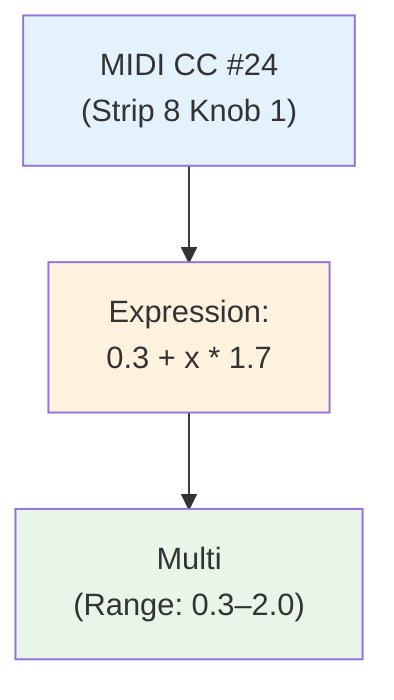

---

### Frequency Bands

#### Bass

**Bass** – Source 0 / Feature: Freq. Range 20–120 Hz

Modifiers:
1. **Smooth**: `0.15`
2. **Expression**: `min(max(x * Multi * 2.0, 0), 1)`

**Purpose**: Kick drum and sub-bass detection.

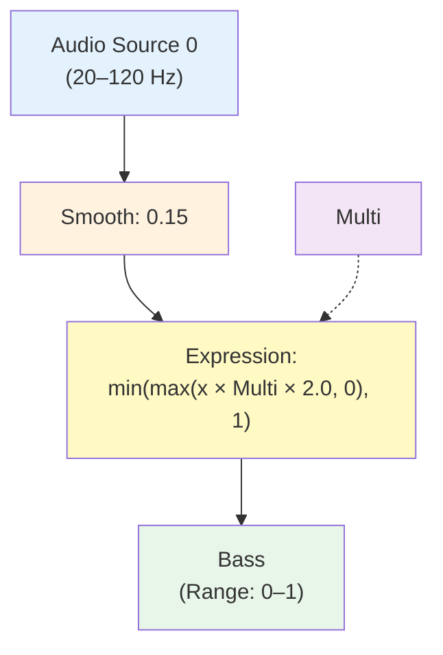

#### LowMid

**LowMid** – Source 0 / Feature: Freq. Range 120–350 Hz

Modifiers:
1. **Smooth**: `0.15`
2. **Expression**: `min(max(x * Multi * 2.0, 0), 1)`

**Purpose**: Body of drums and low synth tones.

#### Highs

**Highs** – Source 0 / Feature: Freq. Range 2000–6000 Hz

Modifiers:
1. **Smooth**: `0.15`
2. **Expression**: `min(max(x * Multi * 2.0, 0), 1)`

**Purpose**: Brightness, hi-hats, cymbals, detail.

**Optional Additional Bands**:
- **VoiceMid** (350–2000 Hz) – Vocals and lead synth presence
- **VeryHigh** (6000–20000 Hz) – Air, sparkle, fine detail

---

### MasterIntensity

**MasterIntensity** – Source: MIDI CC #27 (Strip 8 / Fader)

Modifiers:
1. **Smooth**: `0.3`

**Purpose**: Master control for overall effect intensity.

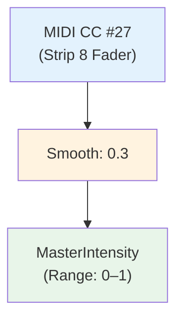

---

## Energy and Beat Globals

### Energy Tracking

#### EnergyFast (Instant Intensity)

**EnergyFast** – Source: Expression-only (no audio source)

Modifiers:
1. **Expression**: `Bass * 0.5 + LowMid * 0.3 + Highs * 0.2`
2. **Smooth**: `0.4`
3. **Expression**: `min(max(x, 0), 1)`

**Purpose**: Real-time "how loud is it right now" indicator.

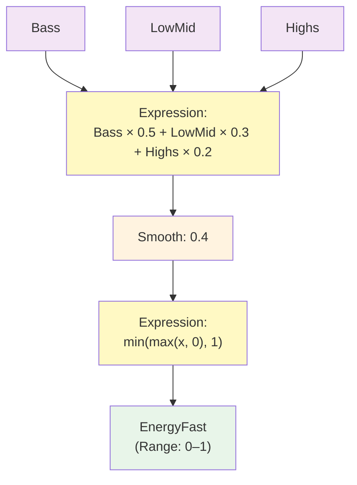

#### EnergySlow (Build-Up Level)

**EnergySlow** – Source: EnergyFast / Feature: Value

Modifiers:
1. **Average**: `4.0` (seconds)
2. **Expression**: `min(max(x, 0), 1)`

**Purpose**: Averaged energy over time for gradual intensity changes.

**Use for**: Layer count, geometry complexity, slowly growing brightness/feedback.

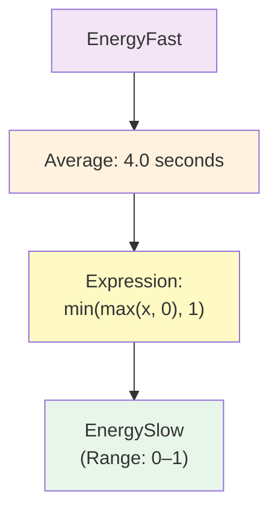

---

### Kick Detection

#### KickRaw

**KickRaw** – Source 0 / Feature: Freq. Range 40–120 Hz

Modifiers:
1. **Smooth**: `0.05`
2. **Peak**: `0.5`

**Purpose**: Raw kick transient detection.

#### KickEnv

**KickEnv** – Source: KickRaw / Feature: Value

Modifiers:
1. **Smooth**: `0.35`
2. **Expression**: `min(x * 2.0, 1)`

**Purpose**: Smooth envelope that bumps on each kick and decays between beats.

#### KickPulse

**KickPulse** – Source: KickEnv / Feature: Value

Modifiers:
1. **Threshold**: `0.6` (outputs 0 or 1)
2. **Trigger (Integer)**: Threshold `0.5` (optional for clean pulses)

**Purpose**: Binary kick trigger for one-shot events (flashes, step changes).

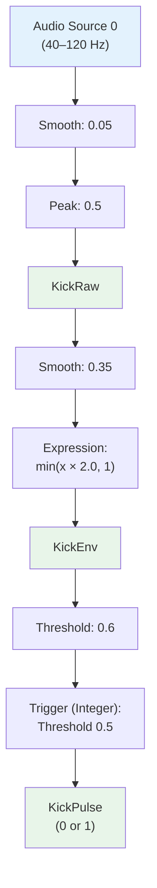

---

### Beat Counter

#### Beat4 (4-Beat Counter)

**Beat4** – Source: KickPulse / Feature: Value

Modifiers:
1. **Trigger (Integer)**: Threshold `0.5`
2. **Increase**: Step `1`
3. **Wrap**: `4.0`

**Result**: Cycles through 0 → 1 → 2 → 3 → 0 (repeating) in sync with kicks.

**Typical Usage in Expressions**:
- `Beat4 == 0` → "bar 1" accents
- `Beat4 % 2` → every second beat
- `1 + 0.2 * (Beat4 == 0)` → boost on first beat

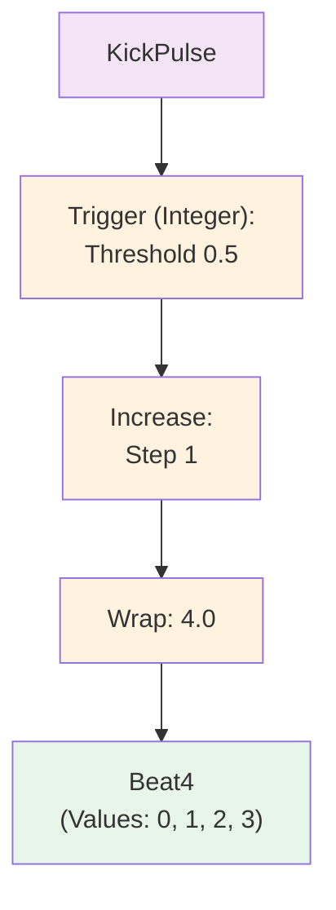

---

## Buildup and Drop Controls

### Buildup

**Buildup** – Source: MIDI CC #25 (Strip 8 / Knob 2)

Modifiers:
1. **Smooth**: `0.5`
2. **Expression**: `min(max(x, 0), 1)`

**Purpose**: Manual control for building tension before a drop.

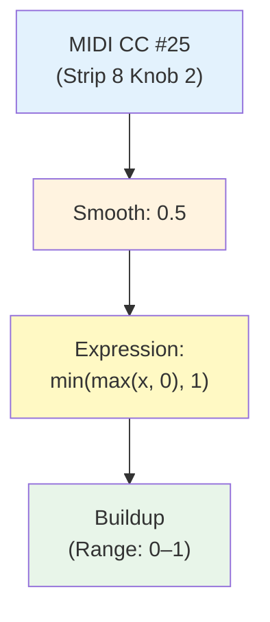

---

### Drop (Toggle)

**Drop** – Source: MIDI Note 27 (Strip 8 / Button A)

Modifiers:
1. **Trigger (Integer)**: Threshold `0.5`
2. **Wrap**: `2.0`

**Result**: Toggles between 0 and 1 on each button press.

**Purpose**: Activate "drop" mode for heavy visuals.

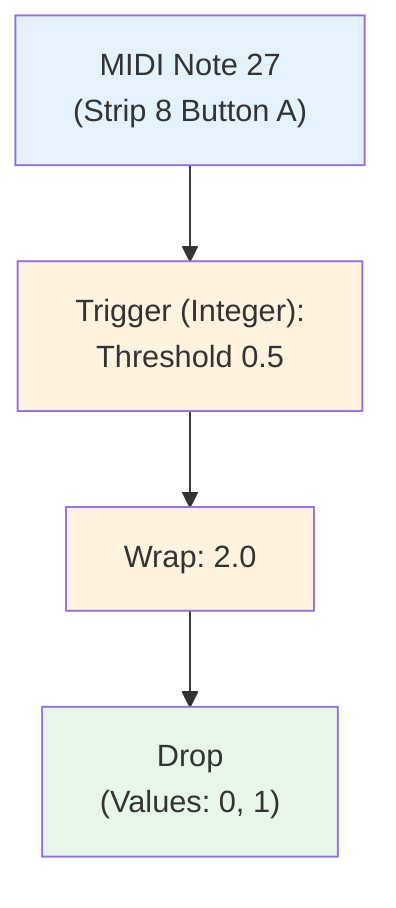

---

### DropPulse (One-Shot Spike)

**DropPulse** – Source: MIDI Note 27 (same as Drop)

Modifiers:
1. **Threshold**: `0.5`

**Result**: Spike at press (0→1 only while button is pressed).

**Purpose**: Trigger randomization or one-shot effects on drop.

---

### Blackout (Emergency Kill)

**Blackout** – Source: MIDI Note 43 (Strip 8 / Button B)

Modifiers:
1. **Trigger (Integer)**: Threshold `0.5`
2. **Wrap**: `2.0`

**Result**: Toggles between 0 (normal) and 1 (blackout).

**Purpose**: Emergency "kill all visuals" button.

---

## Generator Bank System

The generator bank system provides two independent shader buses (A and B) that are crossfaded based on song energy and manual control.

**Architecture**:
- **GEN_BUS_A**: "Intro/Verse" look (calmer, geometric patterns)
- **GEN_BUS_B**: "Buildup/Drop" look (intense, chaotic patterns)
- Each bus contains N shaders (e.g., 3) with index-based selection
- Crossfade between A and B driven by `GenBankMix`

### GenBankMix (A/B Crossfade)

#### GenBankManual

**GenBankManual** – Source: MIDI CC #16 (Strip 1 / Knob 1)

Modifiers:
1. **Smooth**: `0.3`

**Purpose**: Manual control for A→B crossfade.

#### GenBankMix (Derived)

**GenBankMix** – Source: Expression-only

Modifiers:
1. **Expression**: `min(max(0.5 * Buildup + 0.5 * GenBankManual + Drop * (1 - Buildup), 0), 1)`

**Effect**:
- `Buildup` and `GenBankManual` both push from A→B
- `Drop` forces toward B even if `Buildup` is low
- Range: 0.0 (100% A) → 1.0 (100% B)

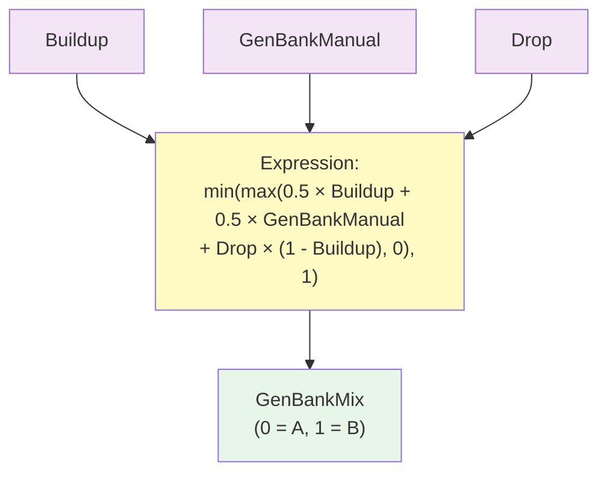

---

### Slot Index and Randomization (Per Bus)

For each generator bus (A and B), we need index selection and randomization.

**Example for GEN_BUS_A** (assuming 3 shaders: slots 0, 1, 2):

#### GenA_Index_Base

**GenA_Index_Base** – Source: MIDI CC #17 (Strip 1 / Knob 2) or Expression

Modifiers:
1. **Expression**: `floor(x * 3)`

**Result**: Manual selection of slots 0, 1, or 2.

#### GenA_Index_Offset

**GenA_Index_Offset** – Source: DropPulse / Feature: Value

Modifiers:
1. **Trigger (Random)**
2. **Expression**: `floor(x * 3)`

**Purpose**: Randomize offset on drop (0, 1, or 2).

#### GenA_Index

**GenA_Index** – Source: Expression-only

Modifiers:
1. **Expression**: `(GenA_Index_Base + GenA_Index_Offset) % 3`

**Result**: Final active slot index (0, 1, or 2).

**Repeat for GEN_BUS_B**:
- `GenB_Index_Base`
- `GenB_Index_Offset`
- `GenB_Index`

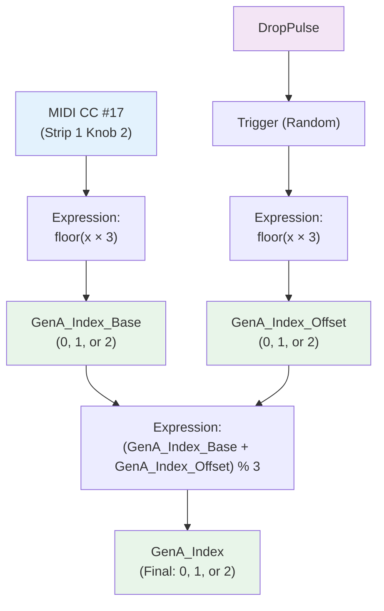

---

### Slot Weights (Hard Switch)

For each slot in a bus, create a weight global:

**For GEN_BUS_A**:

**GenA_Slot0_Weight** – Source: Expression-only
- **Expression**: `GenA_Index == 0`

**GenA_Slot1_Weight** – Source: Expression-only
- **Expression**: `GenA_Index == 1`

**GenA_Slot2_Weight** – Source: Expression-only
- **Expression**: `GenA_Index == 2`

**Result**: Only one weight is 1, others are 0.

**Alternative (Soft Crossfade)**:

For smooth transitions between slots:

```
GenA_Slot0_Weight = max(1 - abs(GenA_Index - 0), 0)
GenA_Slot1_Weight = max(1 - abs(GenA_Index - 1), 0)
GenA_Slot2_Weight = max(1 - abs(GenA_Index - 2), 0)
```

---

### Generator Intensity

#### GenIntensityManual

**GenIntensityManual** – Source: MIDI CC #19 (Strip 1 / Fader)

Modifiers:
1. **Smooth**: `0.3`

#### GenIntensity (Derived)

**GenIntensity** – Source: Expression-only

Modifiers:
1. **Expression**: `min(max(GenIntensityManual * (0.6 + 0.4 * EnergyFast) * (0.6 + 0.4 * Buildup) * (1 + 0.7 * Drop), 0), 2)`

**Effect**: Generator strength reacts to manual control, energy, buildup, and drop.

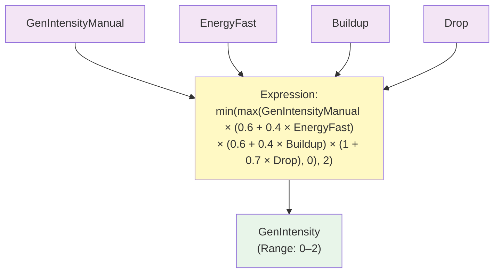

---

### Randomization Pattern

For any parameter that should blend manual and random control:

```
ParamFinal = ManualParam * (1 - RandGlobalAmt * GenRandAmt)
           + RandParam * RandGlobalAmt * GenRandAmt
```

Where:
- `ManualParam` = manual control value
- `RandParam` = randomized value (from Trigger (Random))
- `RandGlobalAmt` = global randomization amount (MIDI CC #26)
- `GenRandAmt` = generator-specific randomization amount (MIDI CC #18)

---

## Scene Structures

### GEN_BUS_A Scene

**Purpose**: "Intro/Verse" generator bus with calmer, geometric patterns.

**Structure**:

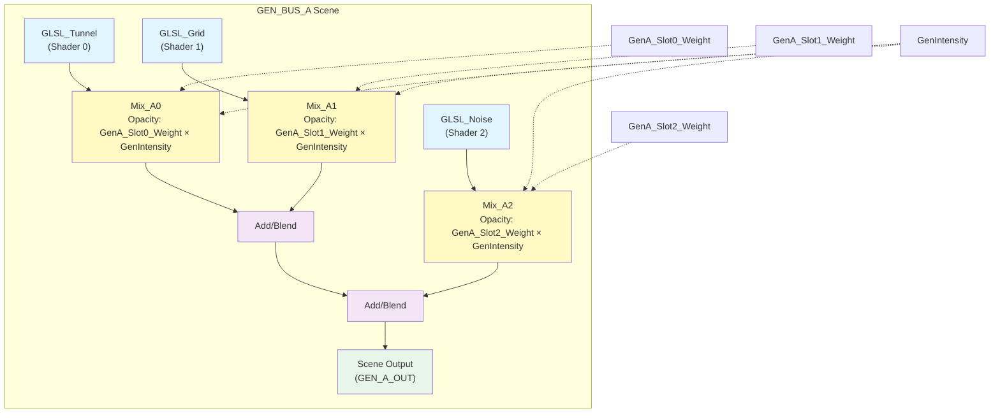

**Implementation**:

1. **Create Scene**: `GEN_BUS_A`

2. **Add 3 GLSLShader modules**:
   - `GLSL_Tunnel`
   - `GLSL_Grid`
   - `GLSL_Noise`

3. **Add Mix modules after each shader**:
   - `Mix_A0`: Input A = `GLSL_Tunnel`, Input B = black
     - Opacity parameter: Link to expression `GenA_Slot0_Weight * GenIntensity`
   - `Mix_A1`: Input A = black, Input B = `GLSL_Grid`
     - Opacity parameter: `GenA_Slot1_Weight * GenIntensity`
   - `Mix_A2`: Input A = black, Input B = `GLSL_Noise`
     - Opacity parameter: `GenA_Slot2_Weight * GenIntensity`

4. **Add Add/Blend modules**:
   - `Blend_A1`: Combine `Mix_A0` + `Mix_A1`
   - `Blend_A2`: Combine `Blend_A1` + `Mix_A2`

5. **Scene Output**: `Blend_A2` output

---

### GEN_BUS_B Scene

**Purpose**: "Buildup/Drop" generator bus with intense, chaotic patterns.

**Structure**: Same as GEN_BUS_A, but with different shaders:
- `GLSL_RadialRings`
- `GLSL_PulseTunnel`
- `GLSL_Fractal`

Use globals:
- `GenB_Slot0_Weight`, `GenB_Slot1_Weight`, `GenB_Slot2_Weight`
- `GenIntensity` (shared with A)

---

### MASK_BUS Scene

**Purpose**: Apply masks and composite karaoke text over generator output.

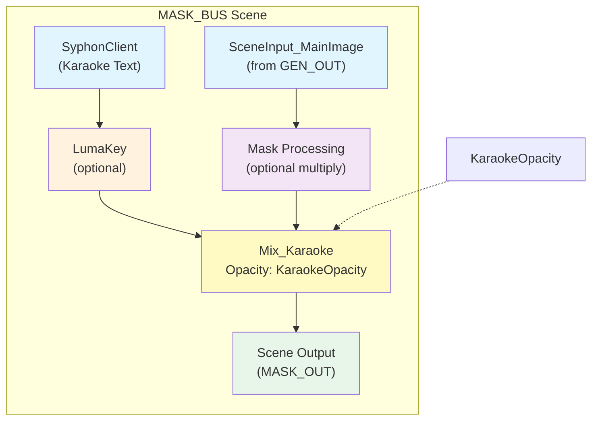

**Implementation**:

1. **Create Scene**: `MASK_BUS`

2. **Add SceneInput**:
   - Module: `SceneInput_MainImage`
   - This receives the generator output from main scene

3. **Add SyphonClient**:
   - Module: `SyphonClient`
   - Configure sender/server to your karaoke app

4. **Optional LumaKey**:
   - If karaoke is white text on black background
   - Adjust threshold so black becomes transparent

5. **Add Mask Processing** (optional):
   - Create mask generators (radial vignette, stripes, etc.)
   - Use `Multiply` blend to apply mask to main image
   - Control strength with `MaskAmount` global

6. **Add Mix_Karaoke**:
   - Input A: Masked main image
   - Input B: Karaoke (after LumaKey)
   - Opacity: Link to `KaraokeOpacity` global

7. **Scene Output**: `Mix_Karaoke` output

**Globals for MASK_BUS**:

#### KaraokeOpacityManual

**KaraokeOpacityManual** – Source: MIDI CC #21 (Strip 2 / Knob 2)

Modifiers:
1. **Smooth**: `0.3`

#### KaraokeOpacity (Derived)

**KaraokeOpacity** – Source: Expression-only

Modifiers:
1. **Expression**: `min(max(KaraokeOpacityManual * (0.5 + 0.5 * EnergySlow), 0), 1)`

**Effect**: Karaoke opacity reacts to manual control and song energy.

#### MaskAmountManual

**MaskAmountManual** – Source: MIDI CC #20 (Strip 2 / Knob 1)

Modifiers:
1. **Smooth**: `0.3`

#### MaskAmount (Derived)

**MaskAmount** – Source: Expression-only

Modifiers:
1. **Expression**: `MaskAmountManual * (0.5 + 0.5 * Buildup)`

**Effect**: Mask strength increases with buildup.

---

### FX_BUS Scene

**Purpose**: Global distortion, warp, and color processing.

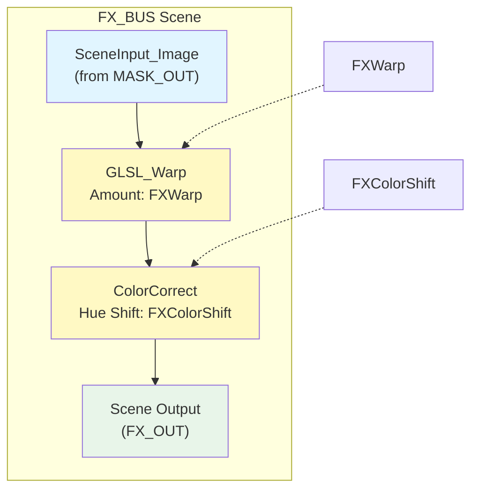

**Implementation**:

1. **Create Scene**: `FX_BUS`

2. **Add SceneInput**:
   - Module: `SceneInput_Image`

3. **Add GLSL_Warp** (distortion effect):
   - Connect `SceneInput_Image` → `GLSL_Warp`
   - Link warp amount parameter to `FXWarp` global

4. **Add ColorCorrect**:
   - Connect `GLSL_Warp` → `ColorCorrect`
   - Link hue/saturation parameters to `FXColorShift` global

5. **Scene Output**: `ColorCorrect` output

**Globals for FX_BUS**:

#### FXAmountManual

**FXAmountManual** – Source: MIDI CC #28 (Strip 3 / Knob 1)

Modifiers:
1. **Smooth**: `0.3`

#### FXAmount (Derived)

**FXAmount** – Source: Expression-only

Modifiers:
1. **Expression**: `FXAmountManual * (0.5 + 0.5 * EnergyFast) * (0.5 + 0.5 * Buildup) * (1 + 0.5 * Drop)`

**Effect**: FX intensity reacts to manual control, energy, buildup, and drop.

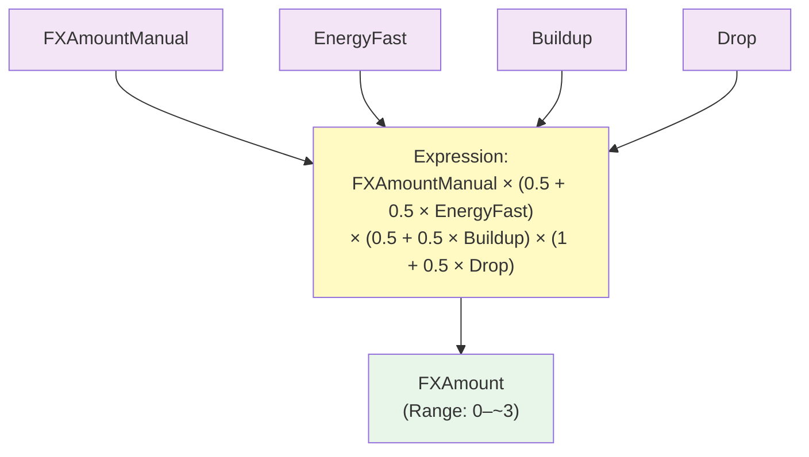

#### FXWarpManual

**FXWarpManual** – Source: MIDI CC #29 (Strip 3 / Knob 2)

Modifiers:
1. **Smooth**: `0.3`

#### FXWarp (Derived)

**FXWarp** – Source: Expression-only

Modifiers:
1. **Expression**: `FXWarpManual * FXAmount`

#### FXColorShiftManual

**FXColorShiftManual** – Source: MIDI CC #30 (Strip 3 / Knob 3)

Modifiers:
1. **Smooth**: `0.3`

#### FXColorShift (Derived)

**FXColorShift** – Source: Expression-only

Modifiers:
1. **Expression**: `FXColorShiftManual * (0.5 + 0.5 * EnergySlow)`

---

## Karaoke Integration

The karaoke text overlay is integrated into the `MASK_BUS` scene via Syphon.

### Karaoke App Setup

Use any app that can output text via Syphon, such as:
- VDMX
- Processing sketch with text rendering
- MadMapper with text module
- After Effects with Syphon plugin

**Recommended Format**:
- White text on black background
- Full HD resolution (1920×1080)
- Large, bold font for readability

### MASK_BUS Integration

In the `MASK_BUS` scene:

1. **SyphonClient** receives karaoke feed
2. **LumaKey** (optional) makes black background transparent
3. **Mix** composites karaoke over generator image
4. **KaraokeOpacity** controls visibility

**Key Feature**: Karaoke opacity is audio-reactive:

```
KaraokeOpacity = KaraokeOpacityManual * (0.5 + 0.5 * EnergySlow)
```

**Effect**: Text becomes more visible during high-energy sections.

### Alternative: Karaoke as Mask

To make visuals visible **only inside the text**:

1. Use karaoke feed as a mask texture
2. Apply via `Multiply` blend instead of overlay
3. Result: Generators visible only where text exists

---

## Main Scene Assembly

The main scene connects all buses and applies master controls.

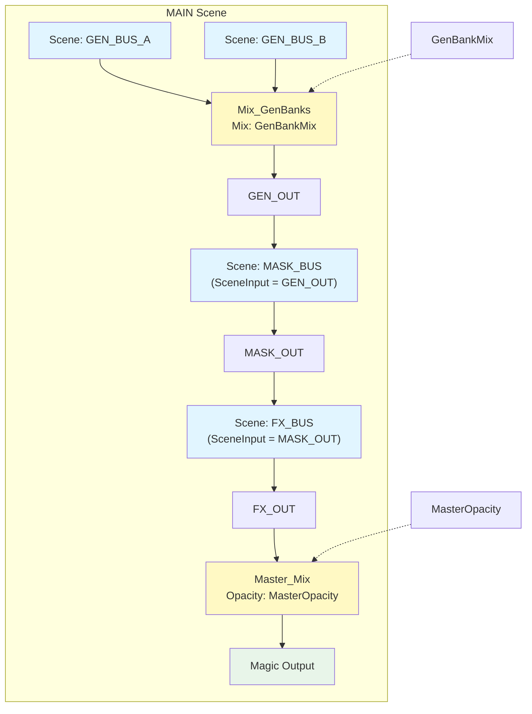

**Implementation**:

1. **Add Scene Modules**:
   - `Scene: GEN_BUS_A` → GenA module
   - `Scene: GEN_BUS_B` → GenB module
   - `Scene: MASK_BUS` → MaskBus module
   - `Scene: FX_BUS` → FxBus module

2. **Generator Bank Mix**:
   - Add `Mix` module: `Mix_GenBanks`
   - Input A: GenA output
   - Input B: GenB output
   - Mix parameter: Link to `GenBankMix` global
   - Output: `GEN_OUT`

3. **Connect to Mask Bus**:
   - Connect `GEN_OUT` to `MaskBus.SceneInput_MainImage`
   - MaskBus output: `MASK_OUT`

4. **Connect to FX Bus**:
   - Connect `MASK_OUT` to `FxBus.SceneInput_Image`
   - FxBus output: `FX_OUT`

5. **Master Mix**:
   - Add `Mix` or `Multiply` module: `Master_Mix`
   - Input: `FX_OUT`
   - Opacity parameter: Link to `MasterOpacity` global

6. **Connect to Magic Output**:
   - Connect `Master_Mix` to Magic output module

**MasterOpacity Global**:

**MasterOpacity** – Source: Expression-only

Modifiers:
1. **Expression**: `min(max(MasterIntensity * (1 - Blackout), 0), 1)`

**Effect**:
- When `Blackout = 1`, `MasterOpacity = 0` (screen goes black)
- When `Blackout = 0`, `MasterOpacity = MasterIntensity` (normal operation)

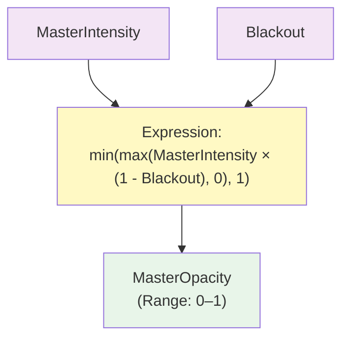

---

## Quick Reference

### Complete Global List

| Global Name | Source | Type | Range | Purpose |
|-------------|--------|------|-------|---------|
| `Multi` | MIDI CC #24 | Derived | 0.3–2.0 | Audio sensitivity |
| `Bass` | Audio 20–120 Hz | Audio | 0–1 | Kick/bass detection |
| `LowMid` | Audio 120–350 Hz | Audio | 0–1 | Drum body |
| `Highs` | Audio 2k–6k Hz | Audio | 0–1 | Hi-hats, brightness |
| `EnergyFast` | Expression | Derived | 0–1 | Instant intensity |
| `EnergySlow` | EnergyFast avg | Derived | 0–1 | Averaged intensity |
| `KickRaw` | Audio 40–120 Hz | Audio | 0–1 | Raw kick transient |
| `KickEnv` | KickRaw | Derived | 0–1 | Kick envelope |
| `KickPulse` | KickEnv | Derived | 0/1 | Binary kick trigger |
| `Beat4` | KickPulse | Derived | 0–3 | 4-beat counter |
| `MasterIntensity` | MIDI CC #27 | Manual | 0–1 | Master intensity |
| `Buildup` | MIDI CC #25 | Manual | 0–1 | Buildup level |
| `Drop` | MIDI Note 27 | Toggle | 0/1 | Drop toggle |
| `DropPulse` | MIDI Note 27 | Pulse | 0/1 | Drop spike |
| `Blackout` | MIDI Note 43 | Toggle | 0/1 | Emergency blackout |
| `GenBankManual` | MIDI CC #16 | Manual | 0–1 | A/B manual mix |
| `GenBankMix` | Expression | Derived | 0–1 | A/B final mix |
| `GenIntensityManual` | MIDI CC #19 | Manual | 0–1 | Gen manual intensity |
| `GenIntensity` | Expression | Derived | 0–2 | Gen final intensity |
| `GenA_Index` | Expression | Derived | 0–2 | Gen A active slot |
| `GenB_Index` | Expression | Derived | 0–2 | Gen B active slot |
| `MaskAmountManual` | MIDI CC #20 | Manual | 0–1 | Mask manual strength |
| `MaskAmount` | Expression | Derived | 0–1 | Mask final strength |
| `KaraokeOpacityManual` | MIDI CC #21 | Manual | 0–1 | Karaoke manual opacity |
| `KaraokeOpacity` | Expression | Derived | 0–1 | Karaoke final opacity |
| `FXAmountManual` | MIDI CC #28 | Manual | 0–1 | FX manual amount |
| `FXAmount` | Expression | Derived | 0–~3 | FX final amount |
| `FXWarpManual` | MIDI CC #29 | Manual | 0–1 | Warp manual amount |
| `FXWarp` | Expression | Derived | 0–~3 | Warp final amount |
| `FXColorShiftManual` | MIDI CC #30 | Manual | 0–1 | Color shift manual |
| `FXColorShift` | Expression | Derived | 0–1 | Color shift final |
| `MasterOpacity` | Expression | Derived | 0–1 | Master output opacity |

---

### Expression Quick Reference

**Audio Bands**:
```
min(max(x * Multi * 2.0, 0), 1)
```

**Energy Fast**:
```
Bass * 0.5 + LowMid * 0.3 + Highs * 0.2
```

**Energy Slow**:
```
Average(EnergyFast, 4.0)
```

**GenBankMix**:
```
min(max(0.5 * Buildup + 0.5 * GenBankManual + Drop * (1 - Buildup), 0), 1)
```

**GenIntensity**:
```
min(max(GenIntensityManual * (0.6 + 0.4 * EnergyFast) * (0.6 + 0.4 * Buildup) * (1 + 0.7 * Drop), 0), 2)
```

**FXAmount**:
```
FXAmountManual * (0.5 + 0.5 * EnergyFast) * (0.5 + 0.5 * Buildup) * (1 + 0.5 * Drop)
```

**MasterOpacity**:
```
min(max(MasterIntensity * (1 - Blackout), 0), 1)
```

---

### Scene Signal Flow

```
GEN_BUS_A ──┐
            ├─→ Mix(GenBankMix) → GEN_OUT
GEN_BUS_B ──┘
                     ↓
              MASK_BUS(GEN_OUT + Karaoke) → MASK_OUT
                     ↓
              FX_BUS(Warp + Color) → FX_OUT
                     ↓
              Master_Mix(MasterOpacity) → Magic Output
```

---

### Tips for Live Performance

1. **Start with defaults**:
   - `GenBankMix = 0` (Bus A)
   - `Buildup = 0`
   - `Drop = 0`
   - `MasterIntensity = 0.7`

2. **During verse**:
   - Keep `Buildup` low (0–0.3)
   - `GenBankMix` stays near A
   - Adjust `GenIntensity` for subtle movement

3. **During buildup**:
   - Gradually increase `Buildup` to 1.0
   - `GenBankMix` automatically crossfades to B
   - `FXAmount` increases naturally

4. **On drop**:
   - Press `Drop` button (toggles to 1)
   - `GenBankMix` forced to B
   - `GenIntensity` and `FXAmount` spike
   - Consider randomizing generators

5. **Emergency controls**:
   - `Blackout` button for instant screen blackout
   - `MasterIntensity` fader for quick dimming

---

## Related Documentation

- [Magic Music Visuals Guide](magic-music-visuals-guide.md) - Core concepts, modules, audio reactivity
- [Live VJ Setup Guide](live-vj-setup-guide.md) - Full rig setup with Syphon, BlackHole, MIDI
- [MIDI Controller Setup](midi-controller-setup.md) - MIDImix and Launchpad configuration

---

## Credits

This pipeline architecture is designed for live VJ performance with Magic Music Visuals, emphasizing:
- Modular bus structure for clean signal flow
- Audio-reactive controls with manual overrides
- Smooth crossfades between song stages (intro, verse, buildup, drop)
- Karaoke/text overlay integration via Syphon
- Emergency controls for live safety

Adapt CC numbers, expressions, and shader choices to your specific setup and musical style.
