# Magic Music Visuals: Master Pipeline Guide

A complete, production-ready pipeline for live VJ performance using Magic Music Visuals (MMV). This guide provides a coherent, copy-paste-ready setup with precise naming, expressions, and detailed diagrams featuring the **SongStyle** adaptation system.

## Table of Contents

1. [Audio, MIDI, and Syphon Setup](#audio-midi-and-syphon-setup)
2. [Global Controls](#global-controls)
3. [Core Audio Bands and Energy](#core-audio-bands-and-energy)
4. [Kick Detection and Beat Tracking](#kick-detection-and-beat-tracking)
5. [Generator Bank System](#generator-bank-system)
6. [Scene Structures](#scene-structures)
7. [Main Scene Assembly](#main-scene-assembly)
8. [Operating the Pipeline](#operating-the-pipeline)
9. [Shader Configuration Examples](#shader-configuration-examples)
10. [Quick Reference](#quick-reference)

---

## Audio, MIDI, and Syphon Setup

### Audio Input

**Use a loopback device** (e.g., BlackHole / Soundflower) to route your DJ/DAW master output to Magic.

**Configuration:**
1. Install BlackHole (2ch or 16ch)
2. Create a Multi-Output Device in Audio MIDI Setup (speakers + BlackHole)
3. Set system output to Multi-Output Device
4. In Magic:
   - Open **Input Sources**
   - Set **Source 0** to the loopback device
   - Use **mono** or **left channel** for all audio features

**Assumption:** All audio-driven globals use **Source 0** unless stated otherwise.

### MIDI (Akai MIDImix)

1. Connect MIDImix via USB
2. Enable it as MIDI input in Magic
3. Use **MIDI Learn** on each MIDI-driven global
4. Keep CC/Note layout stable between projects for consistency

### Syphon Karaoke Input

1. Enable Syphon output in your karaoke/text app
2. In **MASK_BUS** scene:
   - Add a **SyphonClient** module
   - Select the karaoke source
   - Optionally add **LumaKey** to remove black background

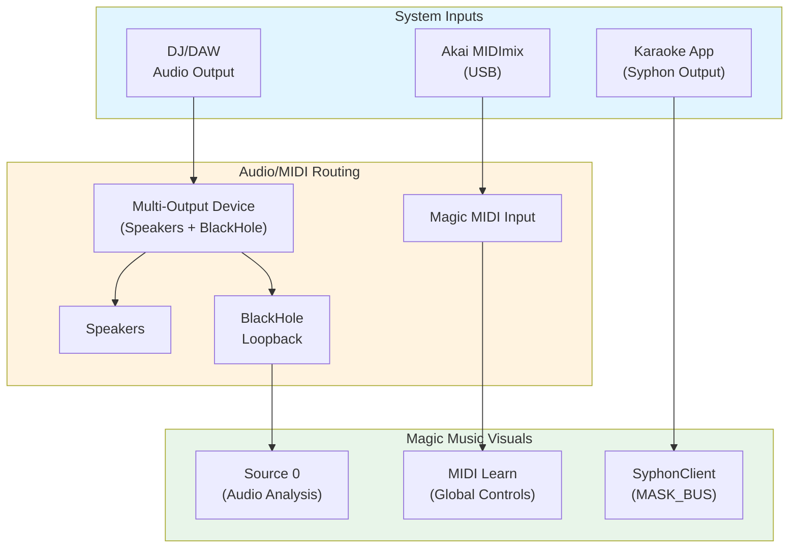
```mermaid
flowchart TD
    subgraph INPUTS["System Inputs"]
        AUDIO_SYS["DJ/DAW<br/>Audio Output"]
        MIDI_HW["Akai MIDImix<br/>(USB)"]
        KARAOKE_APP["Karaoke App<br/>(Syphon Output)"]
    end
    
    subgraph ROUTING["Audio/MIDI Routing"]
        AUDIO_SYS --> MULTIOUT["Multi-Output Device<br/>(Speakers + BlackHole)"]
        MULTIOUT --> SPEAKERS["Speakers"]
        MULTIOUT --> BLACKHOLE["BlackHole<br/>Loopback"]
        MIDI_HW --> MIDI_IN["Magic MIDI Input"]
    end
    
    subgraph MAGIC["Magic Music Visuals"]
        BLACKHOLE --> SRC0["Source 0<br/>(Audio Analysis)"]
        MIDI_IN --> MIDI_LEARN["MIDI Learn<br/>(Global Controls)"]
        KARAOKE_APP --> SYPHON_CLIENT["SyphonClient<br/>(MASK_BUS)"]
    end
    
    style INPUTS fill:#e1f5ff
    style ROUTING fill:#fff3e0
    style MAGIC fill:#e8f5e9
```

---

## Global Controls

All expressions use `clamp(value, min, max)` for range limiting.

**Note:** In modifier chains, `x` refers to the incoming value at that stage.

### Meta Controls

#### Multi (Global Audio Sensitivity)

**Multi** – Source: MIDImix Strip 8 / Knob 1

Modifiers:
1. **Smooth**: `0.3`
2. **Expression**: `Multi = 0.3 + x * 1.7`

**Result:** Knob position [0,1] → Multi range [0.3, 2.0]

**Purpose:** Global audio sensitivity multiplier for all frequency bands.

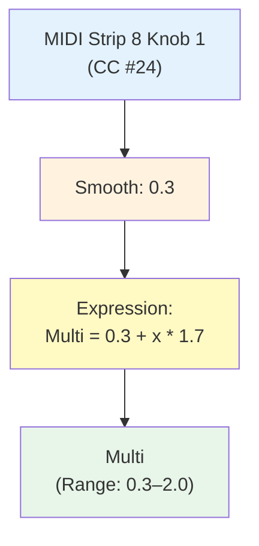
```mermaid
flowchart TD
    MIDI_M["MIDI Strip 8 Knob 1<br/>(CC #24)"] --> SMOOTH_M["Smooth: 0.3"]
    SMOOTH_M --> EXPR_M["Expression:<br/>Multi = 0.3 + x * 1.7"]
    EXPR_M --> MULTI["Multi<br/>(Range: 0.3–2.0)"]
    
    style MIDI_M fill:#e3f2fd
    style SMOOTH_M fill:#fff3e0
    style EXPR_M fill:#fff9c4
    style MULTI fill:#e8f5e9
```

---

#### SongStyle (Track Personality / Adaptation)

**SongStyle** – Source: MIDImix Strip 7 / Knob 1

Modifiers:
1. **Smooth**: `0.3`
2. **Expression**: `SongStyle = clamp(x, 0, 1)`

**Interpretation:**
- **0.0** → Bass-focused, slower kick response, less randomization
- **1.0** → Highs/mids-focused, faster kick response, more randomization

**Purpose:** Global track adaptation knob that affects energy mixing, kick envelope speed, and randomization strength.

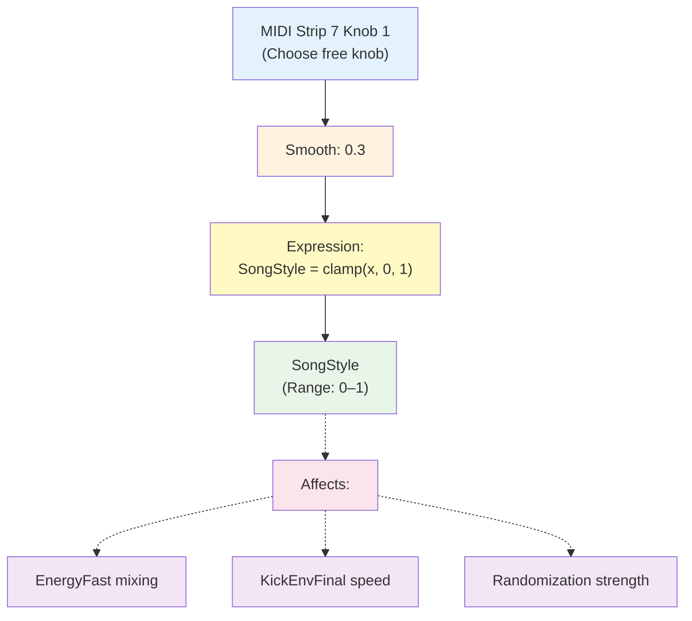
```mermaid
flowchart TD
    MIDI_SS["MIDI Strip 7 Knob 1<br/>(Choose free knob)"] --> SMOOTH_SS["Smooth: 0.3"]
    SMOOTH_SS --> EXPR_SS["Expression:<br/>SongStyle = clamp(x, 0, 1)"]
    EXPR_SS --> SONGSTYLE["SongStyle<br/>(Range: 0–1)"]
    
    SONGSTYLE -.-> EFFECTS["Affects:"]
    EFFECTS -.-> EFF1["EnergyFast mixing"]
    EFFECTS -.-> EFF2["KickEnvFinal speed"]
    EFFECTS -.-> EFF3["Randomization strength"]
    
    style MIDI_SS fill:#e3f2fd
    style SMOOTH_SS fill:#fff3e0
    style EXPR_SS fill:#fff9c4
    style SONGSTYLE fill:#e8f5e9
    style EFFECTS fill:#fce4ec
    style EFF1 fill:#f3e5f5
    style EFF2 fill:#f3e5f5
    style EFF3 fill:#f3e5f5
```

---

#### Buildup

**Buildup** – Source: MIDImix Strip 8 / Knob 2

Modifiers:
1. **Smooth**: `0.5`
2. **Expression**: `Buildup = clamp(x, 0, 1)`

**Purpose:** Manual control for building tension before a drop.

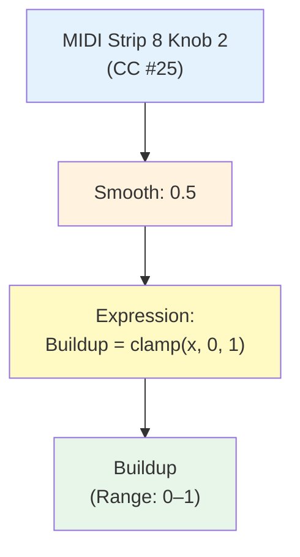
```mermaid
flowchart TD
    MIDI_B["MIDI Strip 8 Knob 2<br/>(CC #25)"] --> SMOOTH_B["Smooth: 0.5"]
    SMOOTH_B --> EXPR_B["Expression:<br/>Buildup = clamp(x, 0, 1)"]
    EXPR_B --> BUILDUP["Buildup<br/>(Range: 0–1)"]
    
    style MIDI_B fill:#e3f2fd
    style SMOOTH_B fill:#fff3e0
    style EXPR_B fill:#fff9c4
    style BUILDUP fill:#e8f5e9
```

---

#### Drop (Latched Drop State)

**Drop** – Source: MIDImix Strip 8 / Button A (lower)

Modifiers:
1. **Trigger (Integer)**: Threshold `0.5`
2. **Wrap**: `2.0`

**Result:** Toggles between 0 and 1 on each button press.

**Purpose:** Activate "drop" mode for maximum intensity.

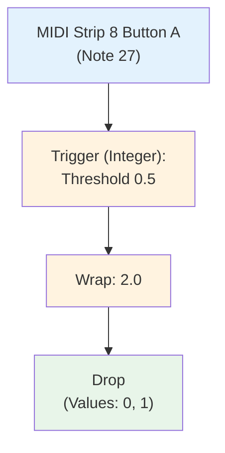
```mermaid
flowchart TD
    MIDI_D["MIDI Strip 8 Button A<br/>(Note 27)"] --> TRIG_D["Trigger (Integer):<br/>Threshold 0.5"]
    TRIG_D --> WRAP_D["Wrap: 2.0"]
    WRAP_D --> DROP["Drop<br/>(Values: 0, 1)"]
    
    style MIDI_D fill:#e3f2fd
    style TRIG_D fill:#fff3e0
    style WRAP_D fill:#fff3e0
    style DROP fill:#e8f5e9
```

---

#### DropPulse (One-Shot Edge)

**DropPulse** – Source: same button as Drop (MIDImix Strip 8 / Button A)

Modifiers:
1. **Threshold**: `0.5`

**Result:** Spike at press (0→1 only while button is pressed).

**Purpose:** Trigger randomization on drop.

---

#### Blackout

**Blackout** – Source: MIDImix Strip 8 / Button B (upper)

Modifiers:
1. **Trigger (Integer)**: Threshold `0.5`
2. **Wrap**: `2.0`

**Result:** Toggles between 0 (normal) and 1 (blackout).

**Purpose:** Emergency "kill all visuals" button.

---

#### MasterIntensity

**MasterIntensity** – Source: MIDImix Strip 8 / Fader

Modifiers:
1. **Smooth**: `0.3`
2. **Expression**: `MasterIntensity = clamp(x, 0, 1)`

**Purpose:** Master control for overall output intensity.

---

#### RandGlobalAmt (Global Random Strength)

**RandGlobalAmt** – Source: MIDImix Strip 8 / Knob 3

Modifiers:
1. **Smooth**: `0.3`
2. **Expression**: `RandGlobalAmt = clamp(x, 0, 1)`

**Purpose:** Global randomization amount affecting all randomized parameters.

---

## Core Audio Bands and Energy

### Frequency Bands

All bands use **Source 0** with the specified frequency range.

#### Bass

**Bass** – Source: Source 0 / Freq. Range 20–120 Hz

Modifiers:
1. **Smooth**: `0.15`
2. **Expression**: `Bass = clamp(x * Multi * 2.0, 0, 1)`

**Purpose:** Kick drum and sub-bass detection.

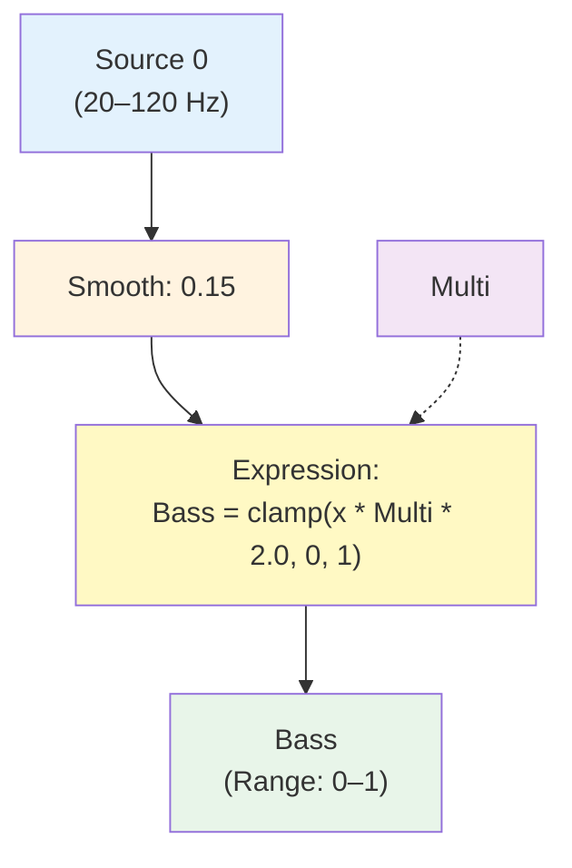
```mermaid
flowchart TD
    AUDIO_B["Source 0<br/>(20–120 Hz)"] --> SMOOTH_B1["Smooth: 0.15"]
    SMOOTH_B1 --> EXPR_B1["Expression:<br/>Bass = clamp(x * Multi * 2.0, 0, 1)"]
    MULTI_B["Multi"] -.-> EXPR_B1
    EXPR_B1 --> BASS["Bass<br/>(Range: 0–1)"]
    
    style AUDIO_B fill:#e3f2fd
    style SMOOTH_B1 fill:#fff3e0
    style EXPR_B1 fill:#fff9c4
    style MULTI_B fill:#f3e5f5
    style BASS fill:#e8f5e9
```

---

#### LowMid

**LowMid** – Source: Source 0 / Freq. Range 120–350 Hz

Modifiers:
1. **Smooth**: `0.15`
2. **Expression**: `LowMid = clamp(x * Multi * 2.0, 0, 1)`

**Purpose:** Drum body and low synth tones.

---

#### Highs

**Highs** – Source: Source 0 / Freq. Range 2000–6000 Hz

Modifiers:
1. **Smooth**: `0.15`
2. **Expression**: `Highs = clamp(x * Multi * 2.0, 0, 1)`

**Purpose:** Hi-hats, cymbals, brightness, detail.

**Optional:** Add **VoiceMid** (350–2000 Hz) and **VeryHigh** (6000–20000 Hz) using the same pattern.

---

### Energy Tracking

#### EnergyFast (SongStyle-Aware Band Mix)

**EnergyFast** – Source: none (Expression-only)

Modifiers:
1. **Expression**:
```
EnergyFast_raw = Bass * (0.6 - 0.4 * SongStyle)
               + LowMid * (0.2 + 0.2 * SongStyle)
               + Highs * (0.2 + 0.2 * SongStyle);

EnergyFast = clamp(EnergyFast_raw, 0, 1);
```

**Optional:** Add `Smooth: 0.4` modifier after Expression if you want calmer response.

**Effect:**
- **SongStyle = 0.0**: `Bass * 0.6 + LowMid * 0.2 + Highs * 0.2` (bass-focused)
- **SongStyle = 1.0**: `Bass * 0.2 + LowMid * 0.4 + Highs * 0.4` (highs/mids-focused)

**Purpose:** Real-time intensity that adapts to track personality.

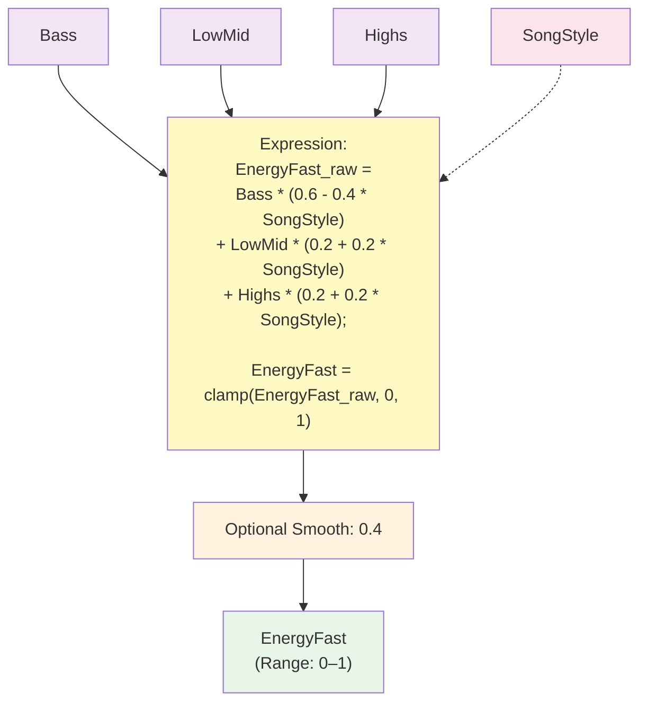
```mermaid
flowchart TD
    BASS_IN["Bass"] --> EXPR_EF["Expression:<br/>EnergyFast_raw =<br/>Bass * (0.6 - 0.4 * SongStyle)<br/>+ LowMid * (0.2 + 0.2 * SongStyle)<br/>+ Highs * (0.2 + 0.2 * SongStyle);<br/><br/>EnergyFast = clamp(EnergyFast_raw, 0, 1)"]
    LOWMID_IN["LowMid"] --> EXPR_EF
    HIGHS_IN["Highs"] --> EXPR_EF
    SONGSTYLE_IN["SongStyle"] -.-> EXPR_EF
    
    EXPR_EF --> SMOOTH_EF["Optional Smooth: 0.4"]
    SMOOTH_EF --> ENERGYFAST["EnergyFast<br/>(Range: 0–1)"]
    
    style BASS_IN fill:#f3e5f5
    style LOWMID_IN fill:#f3e5f5
    style HIGHS_IN fill:#f3e5f5
    style SONGSTYLE_IN fill:#fce4ec
    style EXPR_EF fill:#fff9c4
    style SMOOTH_EF fill:#fff3e0
    style ENERGYFAST fill:#e8f5e9
```

---

#### EnergySlow

**EnergySlow** – Source: EnergyFast / Feature Value

Modifiers:
1. **Average**: `4.0` (seconds)
2. **Expression**: `EnergySlow = clamp(x, 0, 1)`

**Purpose:** Averaged intensity for gradual changes (layer count, complexity, feedback).

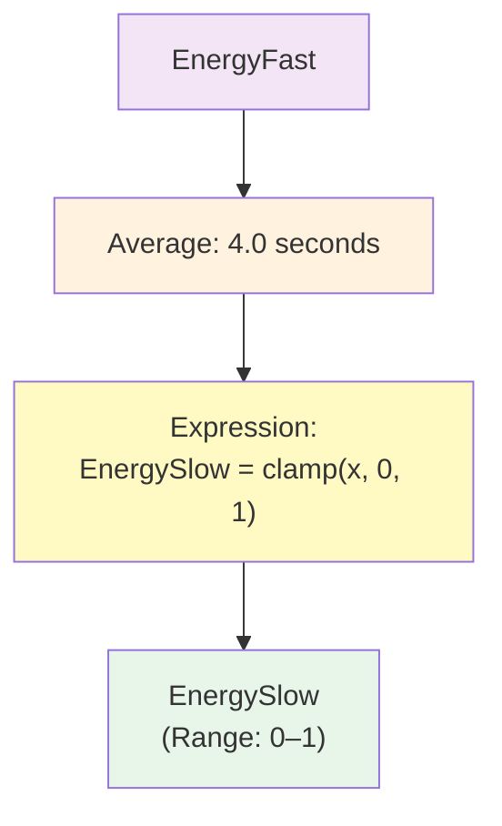
```mermaid
flowchart TD
    ENERGYFAST_IN["EnergyFast"] --> AVG_ES["Average: 4.0 seconds"]
    AVG_ES --> EXPR_ES["Expression:<br/>EnergySlow = clamp(x, 0, 1)"]
    EXPR_ES --> ENERGYSLOW["EnergySlow<br/>(Range: 0–1)"]
    
    style ENERGYFAST_IN fill:#f3e5f5
    style AVG_ES fill:#fff3e0
    style EXPR_ES fill:#fff9c4
    style ENERGYSLOW fill:#e8f5e9
```

---

## Kick Detection and Beat Tracking

### Kick Envelope Chain

#### KickRaw

**KickRaw** – Source: Source 0 / Freq. Range 40–120 Hz

Modifiers:
1. **Smooth**: `0.05`
2. **Peak**: `0.5`

**Purpose:** Raw kick transient detection.

---

#### KickEnvSlow

**KickEnvSlow** – Source: KickRaw / Feature Value

Modifiers:
1. **Smooth**: `0.6`

**Purpose:** Slow kick envelope for bass-heavy tracks.

---

#### KickEnvFast

**KickEnvFast** – Source: KickRaw / Feature Value

Modifiers:
1. **Smooth**: `0.15`

**Purpose:** Fast kick envelope for bright, snappy tracks.

---

#### KickEnvFinal (SongStyle Blend)

**KickEnvFinal** – Source: none (Expression-only)

Modifiers:
1. **Expression**:
```
KickEnvFinal = clamp(
    KickEnvSlow * (1 - SongStyle) + KickEnvFast * SongStyle,
    0, 1
);
```

**Effect:**
- **SongStyle = 0.0**: Uses KickEnvSlow (slower, more sustained response)
- **SongStyle = 1.0**: Uses KickEnvFast (faster, snappier response)

**Purpose:** Adaptive kick envelope that matches track character.

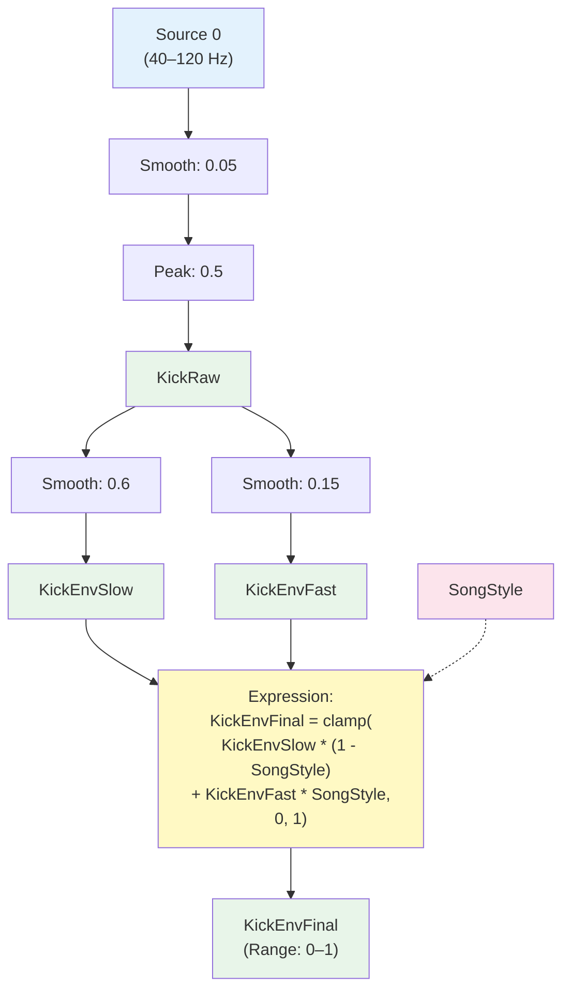
```mermaid
flowchart TD
    AUDIO_K["Source 0<br/>(40–120 Hz)"] --> SMOOTH_KR["Smooth: 0.05"]
    SMOOTH_KR --> PEAK_K["Peak: 0.5"]
    PEAK_K --> KICKRAW["KickRaw"]
    
    KICKRAW --> SMOOTH_KS["Smooth: 0.6"]
    SMOOTH_KS --> KICKENVSLOW["KickEnvSlow"]
    
    KICKRAW --> SMOOTH_KF["Smooth: 0.15"]
    SMOOTH_KF --> KICKENVFAST["KickEnvFast"]
    
    KICKENVSLOW --> EXPR_KEF["Expression:<br/>KickEnvFinal = clamp(<br/>KickEnvSlow * (1 - SongStyle)<br/>+ KickEnvFast * SongStyle,<br/>0, 1)"]
    KICKENVFAST --> EXPR_KEF
    SONGSTYLE_K["SongStyle"] -.-> EXPR_KEF
    EXPR_KEF --> KICKENVFINAL["KickEnvFinal<br/>(Range: 0–1)"]
    
    style AUDIO_K fill:#e3f2fd
    style KICKRAW fill:#e8f5e9
    style KICKENVSLOW fill:#e8f5e9
    style KICKENVFAST fill:#e8f5e9
    style SONGSTYLE_K fill:#fce4ec
    style EXPR_KEF fill:#fff9c4
    style KICKENVFINAL fill:#e8f5e9
```

---

### Beat Tracking

#### KickPulse

**KickPulse** – Source: KickEnvFinal / Feature Value

Modifiers:
1. **Threshold**: `0.6`
2. **Trigger (Integer)**: Threshold `0.5`

**Result:** Clean 0→1 pulses on each kick attack.

**Purpose:** Binary kick trigger for one-shot events.

---

#### Beat4 (4-Step Counter)

**Beat4** – Source: KickPulse / Feature Value

Modifiers:
1. **Trigger (Integer)**: Threshold `0.5`
2. **Increase**: Step `1`
3. **Wrap**: `4.0`

**Result:** Sequence 0, 1, 2, 3, 0, 1, …

**Purpose:** 4-beat counter for structured patterns.

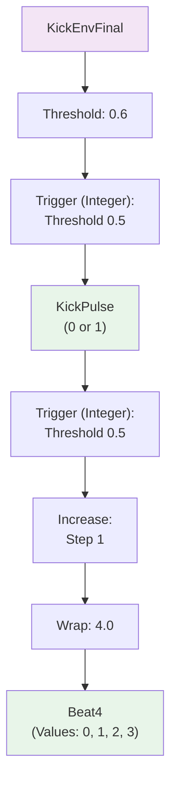
```mermaid
flowchart TD
    KICKENVFINAL_IN["KickEnvFinal"] --> THRESH_KP["Threshold: 0.6"]
    THRESH_KP --> TRIG_KP["Trigger (Integer):<br/>Threshold 0.5"]
    TRIG_KP --> KICKPULSE["KickPulse<br/>(0 or 1)"]
    
    KICKPULSE --> TRIG_B4["Trigger (Integer):<br/>Threshold 0.5"]
    TRIG_B4 --> INC_B4["Increase:<br/>Step 1"]
    INC_B4 --> WRAP_B4["Wrap: 4.0"]
    WRAP_B4 --> BEAT4["Beat4<br/>(Values: 0, 1, 2, 3)"]
    
    style KICKENVFINAL_IN fill:#f3e5f5
    style KICKPULSE fill:#e8f5e9
    style BEAT4 fill:#e8f5e9
```

---

## Generator Bank System

Two generator scenes (GEN_BUS_A and GEN_BUS_B) with N slots each (example: N = 3).

### Generator Bank Mix (A vs B)

#### GenBankManual

**GenBankManual** – Source: MIDImix Strip 1 / Knob 1

Modifiers:
1. **Smooth**: `0.3`

**Purpose:** Manual A/B crossfade control.

---

#### GenBankMix

**GenBankMix** – Source: none (Expression-only)

Modifiers:
1. **Expression**:
```
// Base crossfade from A to B:
mix_base = 0.5 * Buildup + 0.5 * GenBankManual;

// Drop forces towards B:
GenBankMix = clamp(mix_base + Drop * (1 - mix_base), 0, 1);
```

**Effect:**
- Buildup and GenBankManual both push from A→B
- Drop forces toward B even if Buildup is low
- Range: 0.0 (100% A) → 1.0 (100% B)

**Purpose:** Automatic and manual generator bus crossfade.

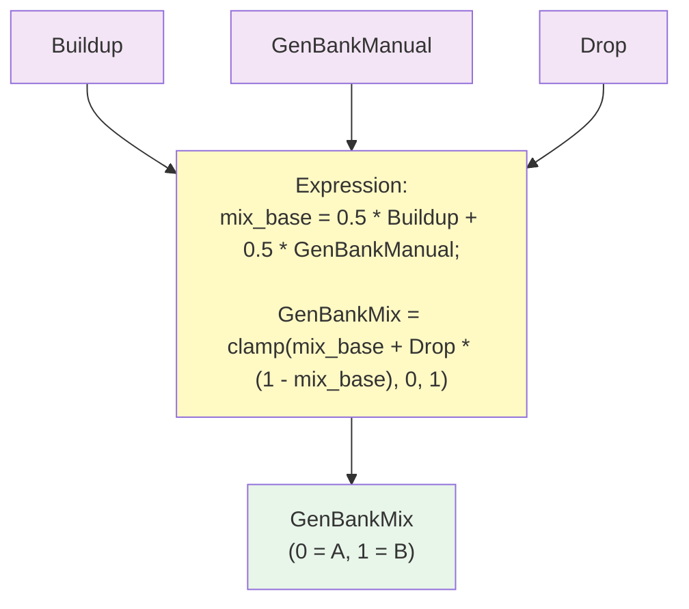
```mermaid
flowchart TD
    BUILDUP_IN["Buildup"] --> EXPR_GBM["Expression:<br/>mix_base = 0.5 * Buildup + 0.5 * GenBankManual;<br/><br/>GenBankMix = clamp(mix_base + Drop * (1 - mix_base), 0, 1)"]
    GENBANKMAN["GenBankManual"] --> EXPR_GBM
    DROP_IN["Drop"] --> EXPR_GBM
    
    EXPR_GBM --> GENBANKMIX["GenBankMix<br/>(0 = A, 1 = B)"]
    
    style BUILDUP_IN fill:#f3e5f5
    style GENBANKMAN fill:#f3e5f5
    style DROP_IN fill:#f3e5f5
    style EXPR_GBM fill:#fff9c4
    style GENBANKMIX fill:#e8f5e9
```

---

### Slot Index and Randomization

#### GenSlotIndexBase

**GenSlotIndexBase** – Source: MIDImix Strip 1 / Knob 2

Modifiers:
1. **Expression**: `GenSlotIndexBase = floor(x * N)`

where N = number of shaders per bus (e.g., 3)

**Purpose:** Manual selection of generator slots.

---

#### GenA_Index_Offset / GenB_Index_Offset

**GenA_Index_Offset** – Source: DropPulse

Modifiers:
1. **Trigger (Random)**
2. **Expression**: `GenA_Index_Offset = floor(x * N)`

**GenB_Index_Offset** – Same pattern (duplicate for independent randomization)

**Purpose:** Randomize generator selection on drop.

---

#### GenA_Index / GenB_Index

**GenA_Index** – Source: none (Expression-only)

Modifiers:
1. **Expression**: `GenA_Index = (GenSlotIndexBase + GenA_Index_Offset) % N`

**GenB_Index** – Source: none (Expression-only)

Modifiers:
1. **Expression**: `GenB_Index = (GenSlotIndexBase + GenB_Index_Offset) % N`

**Purpose:** Final active slot index (0, 1, or 2 for N=3).

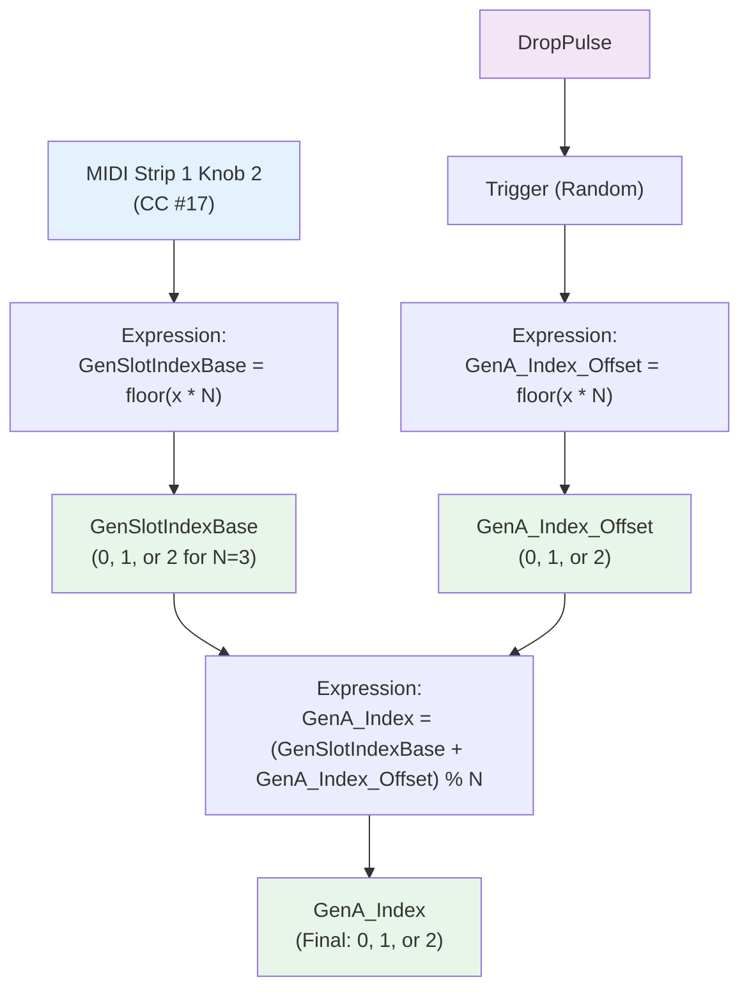
```mermaid
flowchart TD
    MIDI_GSI["MIDI Strip 1 Knob 2<br/>(CC #17)"] --> EXPR_BASE["Expression:<br/>GenSlotIndexBase = floor(x * N)"]
    EXPR_BASE --> GENSLOTBASE["GenSlotIndexBase<br/>(0, 1, or 2 for N=3)"]
    
    DROPPULSE_IN["DropPulse"] --> TRIG_RAND["Trigger (Random)"]
    TRIG_RAND --> EXPR_RAND["Expression:<br/>GenA_Index_Offset = floor(x * N)"]
    EXPR_RAND --> GENOFFSET["GenA_Index_Offset<br/>(0, 1, or 2)"]
    
    GENSLOTBASE --> EXPR_FINAL["Expression:<br/>GenA_Index = (GenSlotIndexBase + GenA_Index_Offset) % N"]
    GENOFFSET --> EXPR_FINAL
    EXPR_FINAL --> GENINDEX["GenA_Index<br/>(Final: 0, 1, or 2)"]
    
    style MIDI_GSI fill:#e3f2fd
    style DROPPULSE_IN fill:#f3e5f5
    style GENSLOTBASE fill:#e8f5e9
    style GENOFFSET fill:#e8f5e9
    style GENINDEX fill:#e8f5e9
```

---

### Slot Weights

#### Hard Switch Pattern

For GEN_BUS_A:

**GenA_Slot0_Weight** – Expression: `GenA_Slot0_Weight = (GenA_Index == 0) ? 1 : 0`

**GenA_Slot1_Weight** – Expression: `GenA_Slot1_Weight = (GenA_Index == 1) ? 1 : 0`

**GenA_Slot2_Weight** – Expression: `GenA_Slot2_Weight = (GenA_Index == 2) ? 1 : 0`

For GEN_BUS_B: Use GenB_SlotX_Weight with GenB_Index.

#### Crossfade Pattern (Alternative)

For smooth transitions:

```
GenA_Slot0_Weight = max(1 - abs(GenA_Index - 0), 0);
GenA_Slot1_Weight = max(1 - abs(GenA_Index - 1), 0);
GenA_Slot2_Weight = max(1 - abs(GenA_Index - 2), 0);
```

---

### Generator Intensity

#### GenIntensityManual

**GenIntensityManual** – Source: MIDImix Strip 1 / Fader

Modifiers:
1. **Smooth**: `0.3`

---

#### GenRandAmt (Per-Generator Random Amount)

**GenRandAmt** – Source: MIDImix Strip 1 / Knob 3

Modifiers:
1. **Smooth**: `0.3`
2. **Expression**: `GenRandAmt = clamp(x, 0, 1)`

---

#### GenIntensity

**GenIntensity** – Source: none (Expression-only)

Modifiers:
1. **Expression**:
```
GenIntensity_raw = GenIntensityManual
                 * (0.6 + 0.4 * EnergyFast)
                 * (0.6 + 0.4 * Buildup)
                 * (1.0 + 0.7 * Drop);

GenIntensity = clamp(GenIntensity_raw, 0, 2);
```

**Purpose:** Audio-reactive generator strength with buildup/drop boost.

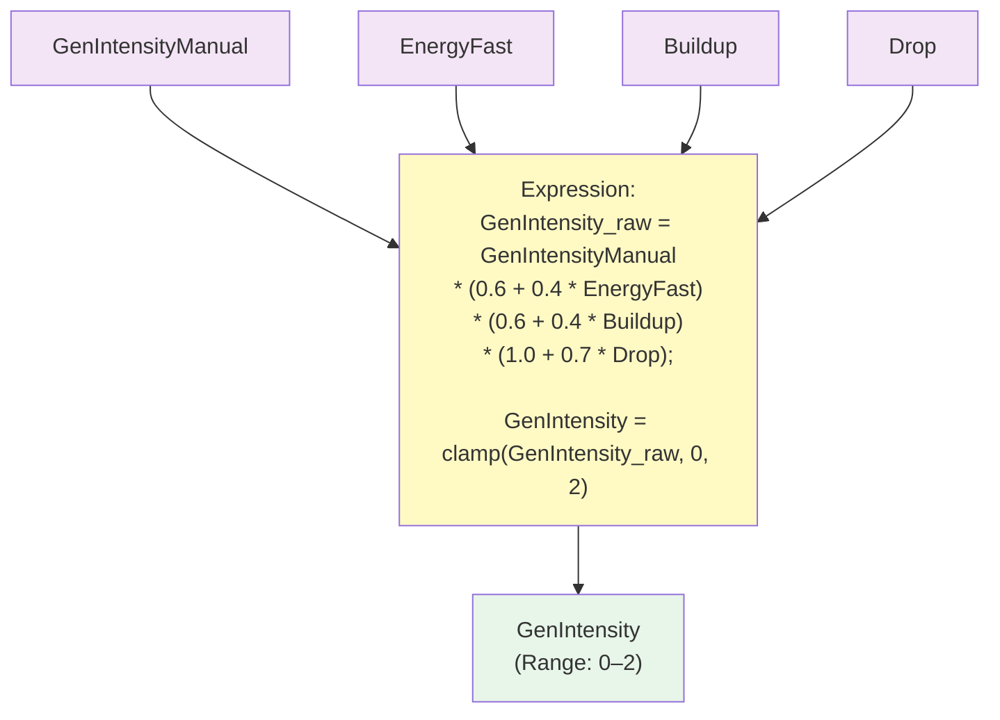
```mermaid
flowchart TD
    GENMAN["GenIntensityManual"] --> EXPR_GI["Expression:<br/>GenIntensity_raw = GenIntensityManual<br/>* (0.6 + 0.4 * EnergyFast)<br/>* (0.6 + 0.4 * Buildup)<br/>* (1.0 + 0.7 * Drop);<br/><br/>GenIntensity = clamp(GenIntensity_raw, 0, 2)"]
    ENERGYFAST_GI["EnergyFast"] --> EXPR_GI
    BUILDUP_GI["Buildup"] --> EXPR_GI
    DROP_GI["Drop"] --> EXPR_GI
    
    EXPR_GI --> GENINTENSITY["GenIntensity<br/>(Range: 0–2)"]
    
    style GENMAN fill:#f3e5f5
    style ENERGYFAST_GI fill:#f3e5f5
    style BUILDUP_GI fill:#f3e5f5
    style DROP_GI fill:#f3e5f5
    style EXPR_GI fill:#fff9c4
    style GENINTENSITY fill:#e8f5e9
```

---

### Per-Parameter Randomization Pattern

For any randomizable generator parameter:

**Setup:**
- Manual control global: `GenParam_Manual`
- Random global: `GenParam_Rand` (Source: DropPulse or Beat4 via Trigger (Random))

**Effective Randomization:**
```
EffectiveRand = RandGlobalAmt * GenRandAmt * (0.3 + 0.7 * SongStyle);
```

**Final Parameter:**
```
GenParam_Final = GenParam_Manual * (1 - EffectiveRand)
               + GenParam_Rand * EffectiveRand;
```

**Effect:**
- **SongStyle = 0.0**: EffectiveRand limited to 30% of RandGlobalAmt * GenRandAmt
- **SongStyle = 1.0**: EffectiveRand uses full RandGlobalAmt * GenRandAmt

---

## Scene Structures

### GEN_BUS_A Scene

**Scene Name:** `GEN_BUS_A`

**Purpose:** "Intro/Verse" generator bus with calmer, geometric patterns.

**Modules:**
1. **GLSL_A0**, **GLSL_A1**, **GLSL_A2** (three generator shaders)
2. **Mix_A0**, **Mix_A1**, **Mix_A2** (one after each shader)
3. **Mix_A01** (combine Mix_A0 + Mix_A1)
4. **GEN_A_OUT** (combine Mix_A01 + Mix_A2)

**Configuration:**

**Mix_A0:**
- Input A: GLSL_A0
- Input B: black
- Opacity: `GenA_Slot0_Weight * GenIntensity`

**Mix_A1:**
- Input A: black
- Input B: GLSL_A1
- Opacity: `GenA_Slot1_Weight * GenIntensity`

**Mix_A2:**
- Input A: black
- Input B: GLSL_A2
- Opacity: `GenA_Slot2_Weight * GenIntensity`

**Mix_A01:**
- Type: Add/Blend
- Input A: Mix_A0
- Input B: Mix_A1

**GEN_A_OUT:**
- Type: Add/Blend
- Input A: Mix_A01
- Input B: Mix_A2
- **Scene Output:** GEN_A_OUT

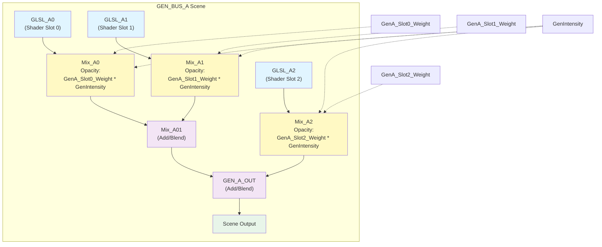
```mermaid
flowchart TD
    subgraph GEN_A["GEN_BUS_A Scene"]
        SHADER_A0["GLSL_A0<br/>(Shader Slot 0)"] --> MIX_A0["Mix_A0<br/>Opacity:<br/>GenA_Slot0_Weight * GenIntensity"]
        SHADER_A1["GLSL_A1<br/>(Shader Slot 1)"] --> MIX_A1["Mix_A1<br/>Opacity:<br/>GenA_Slot1_Weight * GenIntensity"]
        SHADER_A2["GLSL_A2<br/>(Shader Slot 2)"] --> MIX_A2["Mix_A2<br/>Opacity:<br/>GenA_Slot2_Weight * GenIntensity"]
        
        MIX_A0 --> MIX_A01["Mix_A01<br/>(Add/Blend)"]
        MIX_A1 --> MIX_A01
        MIX_A01 --> GEN_A_OUT["GEN_A_OUT<br/>(Add/Blend)"]
        MIX_A2 --> GEN_A_OUT
        
        GEN_A_OUT --> OUTPUT_A["Scene Output"]
    end
    
    SLOT0_W["GenA_Slot0_Weight"] -.-> MIX_A0
    SLOT1_W["GenA_Slot1_Weight"] -.-> MIX_A1
    SLOT2_W["GenA_Slot2_Weight"] -.-> MIX_A2
    GEN_INT["GenIntensity"] -.-> MIX_A0
    GEN_INT -.-> MIX_A1
    GEN_INT -.-> MIX_A2
    
    style SHADER_A0 fill:#e1f5ff
    style SHADER_A1 fill:#e1f5ff
    style SHADER_A2 fill:#e1f5ff
    style MIX_A0 fill:#fff9c4
    style MIX_A1 fill:#fff9c4
    style MIX_A2 fill:#fff9c4
    style MIX_A01 fill:#f3e5f5
    style GEN_A_OUT fill:#f3e5f5
    style OUTPUT_A fill:#e8f5e9
```

---

### GEN_BUS_B Scene

**Scene Name:** `GEN_BUS_B`

**Purpose:** "Buildup/Drop" generator bus with intense, chaotic patterns.

**Structure:** Same as GEN_BUS_A but with:
- Shaders: GLSL_B0, GLSL_B1, GLSL_B2
- Weights: GenB_Slot0_Weight, GenB_Slot1_Weight, GenB_Slot2_Weight
- Output: GEN_B_OUT

---

### MASK_BUS Scene (with Karaoke)

**Scene Name:** `MASK_BUS`

**Purpose:** Apply masks and composite karaoke text over generator output.

**Modules:**
1. **SceneInput_MainImage** (receives GEN_OUT from MAIN)
2. **Syphon_Karaoke** (SyphonClient)
3. **LumaKey_Karaoke** (optional - remove black background)
4. **GLSL_Mask0** (or multiple mask generators)
5. **MaskCombined** (combine masks via Add/Multiply)
6. **Mix_Karaoke** (overlay karaoke on masked image)

**Globals:**

**MaskAmountManual** – Source: MIDImix Strip 2 / Knob 1

Modifiers:
1. **Smooth**: `0.3`

**KaraokeOpacityManual** – Source: MIDImix Strip 2 / Knob 2

Modifiers:
1. **Smooth**: `0.3`

**MaskRandAmt** – Source: MIDImix Strip 2 / Knob 3

Modifiers:
1. **Smooth**: `0.3`

**MaskBusMix** – Source: MIDImix Strip 2 / Fader

Modifiers:
1. **Smooth**: `0.3`

**Derived Globals:**

**MaskAmount:**
```
MaskAmount = MaskAmountManual * (0.5 + 0.5 * Buildup);
```

**KaraokeOpacity:**
```
KaraokeOpacity = clamp(
    KaraokeOpacityManual * (0.5 + 0.5 * EnergySlow),
    0, 1
);
```

**Pipeline:**
```
SceneInput_MainImage
  → Multiply with (MaskCombined * MaskAmount)
  → MASK_BASE

MASK_BASE
  → Mix_Karaoke (A = MASK_BASE, B = KaraokeText)
       Opacity = KaraokeOpacity
  → MASK_OUT (scene output)
```

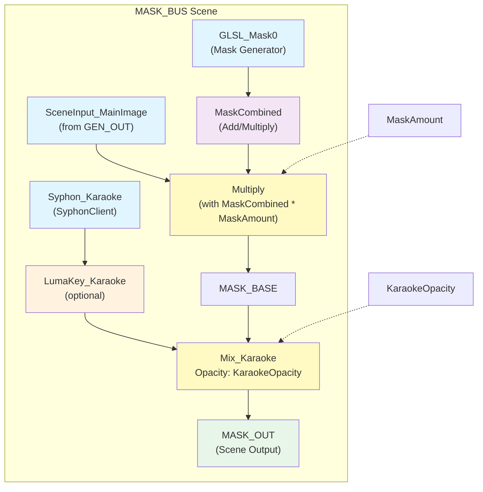
```mermaid
flowchart TD
    subgraph MASK_SCENE["MASK_BUS Scene"]
        SCENE_IN["SceneInput_MainImage<br/>(from GEN_OUT)"] --> MASK_MULT["Multiply<br/>(with MaskCombined * MaskAmount)"]
        
        MASK_GEN["GLSL_Mask0<br/>(Mask Generator)"] --> MASK_COMB["MaskCombined<br/>(Add/Multiply)"]
        MASK_COMB --> MASK_MULT
        
        MASK_MULT --> MASK_BASE["MASK_BASE"]
        
        SYPHON_K["Syphon_Karaoke<br/>(SyphonClient)"] --> LUMA_K["LumaKey_Karaoke<br/>(optional)"]
        LUMA_K --> MIX_K["Mix_Karaoke<br/>Opacity: KaraokeOpacity"]
        
        MASK_BASE --> MIX_K
        MIX_K --> MASK_OUT["MASK_OUT<br/>(Scene Output)"]
    end
    
    MASK_AMT["MaskAmount"] -.-> MASK_MULT
    KAR_OP["KaraokeOpacity"] -.-> MIX_K
    
    style SCENE_IN fill:#e1f5ff
    style SYPHON_K fill:#e1f5ff
    style MASK_GEN fill:#e1f5ff
    style LUMA_K fill:#fff3e0
    style MASK_COMB fill:#f3e5f5
    style MASK_MULT fill:#fff9c4
    style MIX_K fill:#fff9c4
    style MASK_OUT fill:#e8f5e9
```

---

### FX_BUS Scene

**Scene Name:** `FX_BUS`

**Purpose:** Global warp and color processing.

**Modules:**
1. **SceneInput_Image** (receives MASK_OUT from MAIN)
2. **GLSL_Warp** (distortion effect)
3. **ColorCorrect** (hue/saturation)
4. **Mix_FX** (optional - fade FX in/out with FXBusMix)

**Globals:**

**FXAmountManual** – Source: MIDImix Strip 3 / Knob 1

Modifiers:
1. **Smooth**: `0.3`

**FXWarpManual** – Source: MIDImix Strip 3 / Knob 2

Modifiers:
1. **Smooth**: `0.3`

**FXColorShiftManual** – Source: MIDImix Strip 3 / Knob 3

Modifiers:
1. **Smooth**: `0.3`

**FXBusMix** – Source: MIDImix Strip 3 / Fader

Modifiers:
1. **Smooth**: `0.3`

**Derived Globals:**

**FXAmount:**
```
FXAmount = FXAmountManual
         * (0.5 + 0.5 * EnergyFast)
         * (0.5 + 0.5 * Buildup)
         * (1.0 + 0.5 * Drop);
```

**FXWarp:**
```
FXWarp = FXWarpManual * FXAmount;
```

**FXColorShift:**
```
FXColorShift = FXColorShiftManual * (0.5 + 0.5 * EnergySlow);
```

**Pipeline:**
```
SceneInput_Image
  → GLSL_Warp (strength = FXWarp)
  → ColorCorrect (hue = FXColorShift)
  → Mix_FX (opacity = FXBusMix) [optional]
  → FX_OUT (scene output)
```

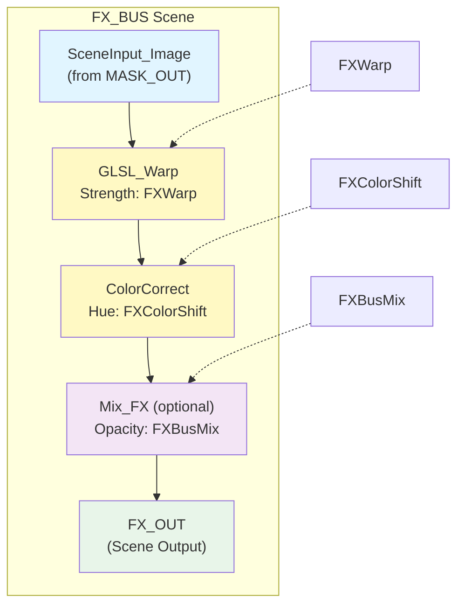
```mermaid
flowchart TD
    subgraph FX_SCENE["FX_BUS Scene"]
        SCENE_IN_FX["SceneInput_Image<br/>(from MASK_OUT)"] --> WARP["GLSL_Warp<br/>Strength: FXWarp"]
        WARP --> COLOR["ColorCorrect<br/>Hue: FXColorShift"]
        COLOR --> MIX_FX["Mix_FX (optional)<br/>Opacity: FXBusMix"]
        MIX_FX --> FX_OUT["FX_OUT<br/>(Scene Output)"]
    end
    
    FX_WARP_G["FXWarp"] -.-> WARP
    FX_COLOR_G["FXColorShift"] -.-> COLOR
    FX_MIX_G["FXBusMix"] -.-> MIX_FX
    
    style SCENE_IN_FX fill:#e1f5ff
    style WARP fill:#fff9c4
    style COLOR fill:#fff9c4
    style MIX_FX fill:#f3e5f5
    style FX_OUT fill:#e8f5e9
```

---

## Main Scene Assembly

**Scene Name:** `MAIN`

**Purpose:** Connect all buses and apply master controls.

**Modules:**
1. **GenA** (Scene: GEN_BUS_A)
2. **GenB** (Scene: GEN_BUS_B)
3. **Mix_Gen** (crossfade A/B with GenBankMix)
4. **MaskBus** (Scene: MASK_BUS)
5. **FxBus** (Scene: FX_BUS)
6. **MasterOut** (final mix with master opacity)

**Pipeline:**

```
GenA output → Mix_Gen (Input A)
GenB output → Mix_Gen (Input B)
  Mix_Gen.Opacity = GenBankMix
  → GEN_OUT

GEN_OUT → MaskBus.SceneInput_MainImage
  → MASK_OUT

MASK_OUT → FxBus.SceneInput_Image
  → FX_OUT

FX_OUT → MasterOut
  MasterOpacity = clamp(MasterIntensity * (1 - Blackout), 0, 1)
  → OUTPUT (to Magic output module)
```

**MasterOpacity Global:**

**MasterOpacity** – Source: none (Expression-only)

Modifiers:
1. **Expression**: `MasterOpacity = clamp(MasterIntensity * (1 - Blackout), 0, 1)`

**Effect:**
- When Blackout = 1, MasterOpacity = 0 (screen goes black)
- When Blackout = 0, MasterOpacity = MasterIntensity (normal operation)

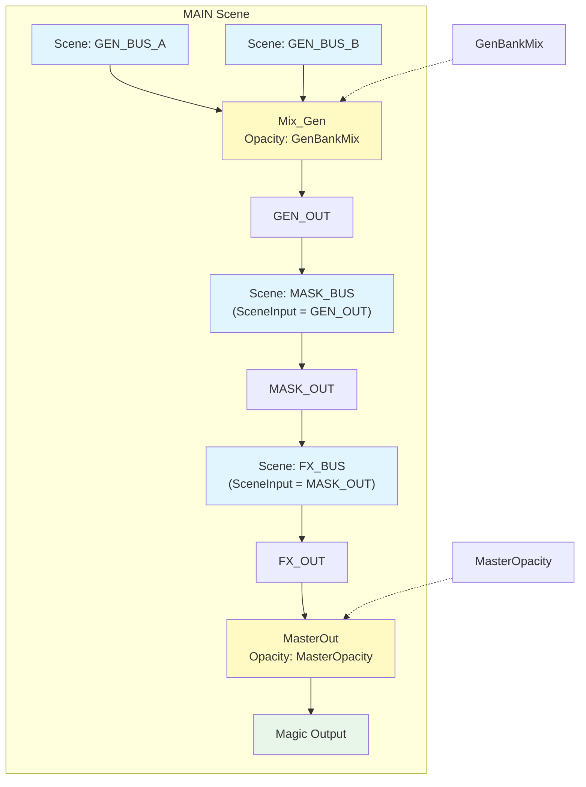
```mermaid
flowchart TD
    subgraph MAIN_SCENE["MAIN Scene"]
        GEN_A_MOD["Scene: GEN_BUS_A"] --> MIX_GEN["Mix_Gen<br/>Opacity: GenBankMix"]
        GEN_B_MOD["Scene: GEN_BUS_B"] --> MIX_GEN
        MIX_GEN --> GEN_OUT_NODE["GEN_OUT"]
        
        GEN_OUT_NODE --> MASK_MOD["Scene: MASK_BUS<br/>(SceneInput = GEN_OUT)"]
        MASK_MOD --> MASK_OUT_NODE["MASK_OUT"]
        
        MASK_OUT_NODE --> FX_MOD["Scene: FX_BUS<br/>(SceneInput = MASK_OUT)"]
        FX_MOD --> FX_OUT_NODE["FX_OUT"]
        
        FX_OUT_NODE --> MASTER_MIX["MasterOut<br/>Opacity: MasterOpacity"]
        MASTER_MIX --> MAGIC_OUT["Magic Output"]
    end
    
    GENBANKMIX_G["GenBankMix"] -.-> MIX_GEN
    MASTER_OP_G["MasterOpacity"] -.-> MASTER_MIX
    
    style GEN_A_MOD fill:#e1f5ff
    style GEN_B_MOD fill:#e1f5ff
    style MASK_MOD fill:#e1f5ff
    style FX_MOD fill:#e1f5ff
    style MIX_GEN fill:#fff9c4
    style MASTER_MIX fill:#fff9c4
    style MAGIC_OUT fill:#e8f5e9
```

---

## Operating the Pipeline

### Preparing for a Track

1. **Set MasterIntensity** ~ 0.7
2. **Set Multi** ~ 0.8–1.0
3. **Set SongStyle** according to track type:
   - Deep/subby techno → SongStyle ≈ 0.2
   - Bright, vocal EDM → SongStyle ≈ 0.8
4. **Set Buildup** = 0
5. **Ensure Drop** = 0, **Blackout** = 0
6. **Choose starting generator** via GenSlotIndexBase (Strip 1 / Knob 2)

### While Playing

#### Using SongStyle

**For bass-heavy tracks (SongStyle near 0):**
- EnergyFast responds mostly to Bass
- KickEnvFinal uses more smoothing → slower motion
- Randomization strength limited (min 0.3 factor)

**For bright/complex tracks (SongStyle near 1):**
- EnergyFast responds more to Highs/LowMid
- KickEnvFinal uses faster profile → snappier movement
- Randomization up to full effect

#### Using Buildup

- Gradually increase Buildup to 1.0 during musical buildups
- Crossfades GEN_BUS_A → GEN_BUS_B
- Increases intensity (Gen, Mask, FX)
- Maps to GenBankMix, MaskAmount, FXAmount

#### Using Drop and DropPulse

**Press Drop at musical drop** → Drop = 1:
- Extra multipliers in Gen/FX expressions
- GenBankMix forced towards B
- DropPulse triggers randomization:
  - GenA_Index_Offset / GenB_Index_Offset updated via Trigger(Random)
  - New shader selections happen exactly at drop

#### Using Randomization

**Control with RandGlobalAmt and per-bus GenRandAmt / MaskRandAmt:**
- For subtle sets: keep RandGlobalAmt low
- For glitchy/noisy sets: turn it up
- SongStyle affects randomization strength (0.3–1.0 factor)

---

## Quick Reference

### Complete Global List

| Global Name | Source | Type | Range | Purpose |
|-------------|--------|------|-------|---------|
| `Multi` | MIDI Strip 8 Knob 1 | Derived | 0.3–2.0 | Audio sensitivity |
| `SongStyle` | MIDI Strip 7 Knob 1 | Manual | 0–1 | Track adaptation |
| `Buildup` | MIDI Strip 8 Knob 2 | Manual | 0–1 | Buildup level |
| `Drop` | MIDI Strip 8 Button A | Toggle | 0/1 | Drop state |
| `DropPulse` | MIDI Strip 8 Button A | Pulse | 0/1 | Drop spike |
| `Blackout` | MIDI Strip 8 Button B | Toggle | 0/1 | Emergency blackout |
| `MasterIntensity` | MIDI Strip 8 Fader | Manual | 0–1 | Master intensity |
| `RandGlobalAmt` | MIDI Strip 8 Knob 3 | Manual | 0–1 | Global random amount |
| `Bass` | Audio 20–120 Hz | Audio | 0–1 | Kick/bass |
| `LowMid` | Audio 120–350 Hz | Audio | 0–1 | Drum body |
| `Highs` | Audio 2k–6k Hz | Audio | 0–1 | Hi-hats, brightness |
| `EnergyFast` | Expression | Derived | 0–1 | SongStyle-aware intensity |
| `EnergySlow` | EnergyFast avg | Derived | 0–1 | Averaged intensity |
| `KickRaw` | Audio 40–120 Hz | Audio | 0–1 | Raw kick transient |
| `KickEnvSlow` | KickRaw | Derived | 0–1 | Slow kick envelope |
| `KickEnvFast` | KickRaw | Derived | 0–1 | Fast kick envelope |
| `KickEnvFinal` | Expression | Derived | 0–1 | SongStyle-blended kick |
| `KickPulse` | KickEnvFinal | Derived | 0/1 | Binary kick trigger |
| `Beat4` | KickPulse | Derived | 0–3 | 4-beat counter |
| `GenBankManual` | MIDI Strip 1 Knob 1 | Manual | 0–1 | A/B manual mix |
| `GenBankMix` | Expression | Derived | 0–1 | A/B final mix |
| `GenSlotIndexBase` | MIDI Strip 1 Knob 2 | Manual | 0–N-1 | Slot base index |
| `GenA_Index_Offset` | DropPulse + Random | Derived | 0–N-1 | GenA random offset |
| `GenB_Index_Offset` | DropPulse + Random | Derived | 0–N-1 | GenB random offset |
| `GenA_Index` | Expression | Derived | 0–N-1 | GenA active slot |
| `GenB_Index` | Expression | Derived | 0–N-1 | GenB active slot |
| `GenIntensityManual` | MIDI Strip 1 Fader | Manual | 0–1 | Gen manual intensity |
| `GenRandAmt` | MIDI Strip 1 Knob 3 | Manual | 0–1 | Gen random amount |
| `GenIntensity` | Expression | Derived | 0–2 | Gen final intensity |
| `MaskAmountManual` | MIDI Strip 2 Knob 1 | Manual | 0–1 | Mask manual strength |
| `MaskAmount` | Expression | Derived | 0–1 | Mask final strength |
| `KaraokeOpacityManual` | MIDI Strip 2 Knob 2 | Manual | 0–1 | Karaoke manual opacity |
| `KaraokeOpacity` | Expression | Derived | 0–1 | Karaoke final opacity |
| `MaskRandAmt` | MIDI Strip 2 Knob 3 | Manual | 0–1 | Mask random amount |
| `MaskBusMix` | MIDI Strip 2 Fader | Manual | 0–1 | Mask bus mix |
| `FXAmountManual` | MIDI Strip 3 Knob 1 | Manual | 0–1 | FX manual amount |
| `FXWarpManual` | MIDI Strip 3 Knob 2 | Manual | 0–1 | Warp manual amount |
| `FXColorShiftManual` | MIDI Strip 3 Knob 3 | Manual | 0–1 | Color shift manual |
| `FXBusMix` | MIDI Strip 3 Fader | Manual | 0–1 | FX bus mix |
| `FXAmount` | Expression | Derived | 0–~3 | FX final amount |
| `FXWarp` | Expression | Derived | 0–~3 | Warp final amount |
| `FXColorShift` | Expression | Derived | 0–1 | Color shift final |
| `MasterOpacity` | Expression | Derived | 0–1 | Master output opacity |

---

### MIDImix Controller Layout

#### Strip 8: Global Master
| Control | CC/Note | Global | Purpose |
|---------|---------|--------|---------|
| Knob 1 | CC #24 | Multi | Audio sensitivity |
| Knob 2 | CC #25 | Buildup | Buildup control |
| Knob 3 | CC #26 | RandGlobalAmt | Global randomization |
| Fader | CC #27 | MasterIntensity | Master intensity |
| Button A | Note 27 | Drop / DropPulse | Drop trigger |
| Button B | Note 43 | Blackout | Emergency blackout |

#### Strip 7: Track Adaptation
| Control | CC/Note | Global | Purpose |
|---------|---------|--------|---------|
| Knob 1 | (Choose free) | SongStyle | Track personality |

#### Strip 1: Generator Bank
| Control | CC/Note | Global | Purpose |
|---------|---------|--------|---------|
| Knob 1 | CC #16 | GenBankManual | A/B crossfade |
| Knob 2 | CC #17 | GenSlotIndexBase | Slot selection |
| Knob 3 | CC #18 | GenRandAmt | Gen randomization |
| Fader | CC #19 | GenIntensityManual | Gen intensity |

#### Strip 2: Mask Bus
| Control | CC/Note | Global | Purpose |
|---------|---------|--------|---------|
| Knob 1 | CC #20 | MaskAmountManual | Mask strength |
| Knob 2 | CC #21 | KaraokeOpacityManual | Karaoke opacity |
| Knob 3 | CC #22 | MaskRandAmt | Mask randomization |
| Fader | CC #23 | MaskBusMix | Mask bus mix |

#### Strip 3: FX Bus
| Control | CC/Note | Global | Purpose |
|---------|---------|--------|---------|
| Knob 1 | CC #28 | FXAmountManual | FX intensity |
| Knob 2 | CC #29 | FXWarpManual | Warp amount |
| Knob 3 | CC #30 | FXColorShiftManual | Color shift |
| Fader | CC #31 | FXBusMix | FX bus mix |

---

### Key Expression Quick Reference

**Multi:**
```
Multi = 0.3 + x * 1.7
```

**SongStyle:**
```
SongStyle = clamp(x, 0, 1)
```

**EnergyFast (SongStyle-aware):**
```
EnergyFast_raw = Bass * (0.6 - 0.4 * SongStyle)
               + LowMid * (0.2 + 0.2 * SongStyle)
               + Highs * (0.2 + 0.2 * SongStyle);
EnergyFast = clamp(EnergyFast_raw, 0, 1);
```

**KickEnvFinal (SongStyle blend):**
```
KickEnvFinal = clamp(
    KickEnvSlow * (1 - SongStyle) + KickEnvFast * SongStyle,
    0, 1
);
```

**GenBankMix:**
```
mix_base = 0.5 * Buildup + 0.5 * GenBankManual;
GenBankMix = clamp(mix_base + Drop * (1 - mix_base), 0, 1);
```

**GenIntensity:**
```
GenIntensity_raw = GenIntensityManual
                 * (0.6 + 0.4 * EnergyFast)
                 * (0.6 + 0.4 * Buildup)
                 * (1.0 + 0.7 * Drop);
GenIntensity = clamp(GenIntensity_raw, 0, 2);
```

**EffectiveRand (SongStyle-aware randomization):**
```
EffectiveRand = RandGlobalAmt * GenRandAmt * (0.3 + 0.7 * SongStyle);
```

**MasterOpacity:**
```
MasterOpacity = clamp(MasterIntensity * (1 - Blackout), 0, 1);
```

---

### Scene Signal Flow

```
GEN_BUS_A ──┐
            ├→ Mix(GenBankMix) → GEN_OUT
GEN_BUS_B ──┘
                 ↓
         MASK_BUS(GEN_OUT + Karaoke) → MASK_OUT
                 ↓
         FX_BUS(Warp + Color) → FX_OUT
                 ↓
         MasterOut(MasterOpacity) → Magic Output
```

---

## Shader Configuration Examples

This section provides concrete examples of built-in Magic shaders and ISF effects configured for the pipeline.

### Generator Shaders (GEN_BUS_A - Intro/Verse)

#### Example: GLSL_A0 - Tunnel Effect

**Built-in Shader:** Tunnel / Radial Warp

**Parameters:**
- **Center X**: `0.5`
- **Center Y**: `0.5`
- **Speed**: Link to expression `0.5 + Bass * 0.5`
  - Result: Slower at rest, speeds up with bass
- **Zoom**: Link to expression `1.0 + KickEnvFinal * 0.3`
  - Result: Pulses in/out with kicks
- **Rotation**: Link to expression `time * (0.1 + EnergyFast * 0.2)`
  - Result: Rotates faster during high energy
- **Color Hue**: Link to expression `Beat4 * 0.25`
  - Result: Cycles through colors every 4 beats

---

#### Example: GLSL_A1 - Grid Pattern

**Built-in Shader:** Grid / Bars

**Parameters:**
- **Grid Size X**: `8.0`
- **Grid Size Y**: `8.0`
- **Line Thickness**: Link to expression `0.1 + LowMid * 0.1`
  - Result: Thicker lines during mid frequencies
- **Animation Speed**: Link to expression `0.3 + EnergySlow * 0.7`
  - Result: Gradually speeds up with energy
- **Color 1 Hue**: `0.6` (cyan)
- **Color 2 Hue**: `0.0` (red)
- **Color Mix**: Link to expression `0.5 + sin(time * 0.5) * 0.5`
  - Result: Oscillates between two colors

---

#### Example: GLSL_A2 - Noise/Static

**Built-in Shader:** Noise / Perlin Noise

**Parameters:**
- **Scale**: `10.0`
- **Octaves**: `4`
- **Speed**: Link to expression `0.2 + Highs * 0.8`
  - Result: Faster movement with high frequencies
- **Brightness**: Link to expression `0.5 + EnergyFast * 0.5`
  - Result: Brighter during high energy
- **Contrast**: `1.5`

---

### Generator Shaders (GEN_BUS_B - Buildup/Drop)

#### Example: GLSL_B0 - Radial Rings

**Built-in Shader:** Rings / Circle Strobe

**Parameters:**
- **Ring Count**: Link to expression `5.0 + floor(EnergyFast * 10.0)`
  - Result: More rings during high energy (5–15 rings)
- **Ring Speed**: Link to expression `1.0 + Drop * 2.0`
  - Result: Speeds up dramatically during drop
- **Ring Width**: Link to expression `0.5 - KickEnvFinal * 0.3`
  - Result: Pulses thinner with kicks
- **Color Hue**: Link to expression `time * 0.5 + Drop * 0.25`
  - Result: Color shift, faster during drop
- **Brightness**: Link to expression `0.7 + KickPulse * 0.3`
  - Result: Flash on kick pulses

---

#### Example: GLSL_B1 - Fractal/Mandelbrot

**Built-in Shader:** Fractal Zoom / Julia Set

**Parameters:**
- **Zoom Level**: Link to expression `2.0 + Buildup * 3.0 + Drop * 5.0`
  - Result: Zooms in during buildup, extreme zoom on drop
- **Iteration Count**: Link to expression `50 + floor(EnergyFast * 50)`
  - Result: More detail with energy (50–100 iterations)
- **Color Offset**: Link to expression `time * 0.2`
  - Result: Slowly cycling color palette
- **X Offset**: Link to expression `sin(time * 0.3) * 0.2`
- **Y Offset**: Link to expression `cos(time * 0.3) * 0.2`
  - Result: Gentle drift through fractal space

---

#### Example: GLSL_B2 - Pulse/Strobe

**Built-in Shader:** Flash / Strobe

**Parameters:**
- **Frequency**: Link to expression `4.0 + EnergyFast * 12.0`
  - Result: Slower pulses at low energy, rapid strobe at high energy
- **Duty Cycle**: Link to expression `0.3 + KickEnvFinal * 0.4`
  - Result: Longer flashes on kicks
- **Color**: Link to expression `hsv(time * 0.5, 1.0, 1.0)`
  - Result: Rainbow cycling
- **Intensity**: Link to expression `GenIntensity`
  - Result: Controlled by overall generator intensity

---

### Mask Generators (MASK_BUS)

#### Example: GLSL_Mask0 - Radial Vignette

**Built-in Shader:** Vignette / Gradient Radial

**Parameters:**
- **Center X**: `0.5`
- **Center Y**: `0.5`
- **Inner Radius**: Link to expression `0.3 + MaskAmountManual * 0.4`
  - Result: Smaller spotlight with more masking
- **Outer Radius**: `1.0`
- **Feather**: `0.3`
- **Invert**: `false`
  - Result: Dark edges, bright center

---

#### Example: GLSL_Mask1 - Stripes/Bars

**Built-in Shader:** Bars / Stripes

**Parameters:**
- **Stripe Count**: Link to expression `5.0 + floor(Beat4 * 2.5)`
  - Result: 5, 7, 10, 12 stripes cycling every 4 beats
- **Angle**: Link to expression `time * 0.1 + KickEnvFinal * 0.2`
  - Result: Slowly rotating, pulses on kicks
- **Stripe Width**: `0.5`
- **Feather**: `0.1`

---

### FX Shaders (FX_BUS)

#### Example: GLSL_Warp - Displacement/Distortion

**ISF Shader:** Displacement Map / Wave Distortion

**Parameters:**
- **Displacement Amount**: Link to global `FXWarp`
  - Driven by: `FXWarpManual * FXAmount`
  - Result: Audio-reactive warp strength
- **Wave Frequency**: `5.0`
- **Wave Speed**: Link to expression `0.5 + EnergyFast * 1.0`
  - Result: Faster waves during high energy
- **Direction**: Link to expression `time * 0.1`
  - Result: Rotating warp direction

---

#### Example: ColorCorrect - Hue Shift

**Built-in Module:** Color Controls / HSL Adjust

**Parameters:**
- **Hue Shift**: Link to global `FXColorShift`
  - Driven by: `FXColorShiftManual * (0.5 + 0.5 * EnergySlow)`
  - Result: Gradual hue rotation, stronger during high energy
- **Saturation**: Link to expression `1.0 + Buildup * 0.5`
  - Result: More saturated during buildup (1.0–1.5)
- **Brightness**: `1.0`
- **Contrast**: Link to expression `1.0 + Drop * 0.3`
  - Result: Higher contrast during drop

---

### Common ISF Effects

#### Kaleidoscope

**ISF:** Kaleidoscope.fs

**Parameters:**
- **Segments**: Link to expression `6.0 + floor(Beat4 * 2.0)`
  - Result: 6, 8, 10, 12 segments cycling
- **Angle**: Link to expression `time * 0.2`
  - Result: Slowly rotating
- **Center X**: `0.5 + sin(time * 0.3) * 0.1`
- **Center Y**: `0.5 + cos(time * 0.3) * 0.1`
  - Result: Gently drifting center

**Use in:** GEN_BUS_B for drop visuals

---

#### RGB Shift / Chromatic Aberration

**ISF:** RGB Shift.fs

**Parameters:**
- **Red Offset X**: Link to expression `Bass * 0.02`
- **Green Offset X**: `0.0`
- **Blue Offset X**: Link to expression `-Bass * 0.02`
  - Result: Bass-reactive horizontal color separation
- **Offset Y**: Link to expression `KickPulse * 0.01`
  - Result: Vertical glitch on kick pulses

**Use in:** FX_BUS for glitch effects

---

#### Blur / Gaussian Blur

**Built-in:** Blur

**Parameters:**
- **Blur Radius**: Link to expression `(1.0 - GenIntensity) * 10.0`
  - Result: Sharper when generators are intense, blurry when subtle
- **Quality**: `High`

**Alternative Expression for Dream Effect:**
- **Blur Radius**: Link to expression `5.0 + EnergySlow * 15.0`
  - Result: More blur during high energy for dream/psychedelic effect

**Use in:** FX_BUS or as post-processing

---

#### Feedback Delay

**Built-in:** Feedback / Trail

**Parameters:**
- **Feedback Amount**: Link to expression `0.8 + Buildup * 0.15`
  - Result: More trails during buildup (0.8–0.95)
- **Decay**: `0.95`
- **Mix**: Link to expression `0.3 + Drop * 0.4`
  - Result: Stronger feedback during drop

**Use in:** FX_BUS for psychedelic trails

---

### Parameter Linking Patterns

#### Audio-Reactive Speed
```
Speed = BaseSpeed + AudioGlobal * Multiplier

Examples:
- Rotation: time * (0.1 + EnergyFast * 0.3)
- Animation: 0.5 + Bass * 1.5
- Zoom: 1.0 + KickEnvFinal * 0.5
```

#### Energy-Based Complexity
```
Complexity = MinValue + EnergyGlobal * Range

Examples:
- Particle Count: 100 + floor(EnergyFast * 400)
- Fractal Iterations: 50 + floor(EnergySlow * 100)
- Grid Density: 5 + EnergyFast * 15
```

#### Beat-Synchronized Changes
```
Value = BaseValue + floor(Beat4 * StepSize) * StepAmount

Examples:
- Color Hue: Beat4 * 0.25  (cycles 0, 0.25, 0.5, 0.75)
- Pattern Index: floor(Beat4 * 0.5) (changes every 2 beats)
- Stripe Count: 4 + Beat4 * 2  (4, 6, 8, 10)
```

#### Kick-Triggered Pulses
```
Pulse = BaseValue + KickPulse * PulseAmount

Examples:
- Flash: KickPulse * 0.3
- Scale: 1.0 + KickEnvFinal * 0.2
- Brightness: 0.7 + KickPulse * 0.3
```

#### SongStyle-Adaptive Parameters
```
Adaptive = LowValue * (1 - SongStyle) + HighValue * SongStyle

Examples:
- Smoothness: 5.0 * (1 - SongStyle) + 1.0 * SongStyle
  (Smoother for bass-heavy, sharper for bright tracks)
- Color Saturation: 0.7 * (1 - SongStyle) + 1.0 * SongStyle
  (Less saturated for bass, more for bright)
```

---

### Performance Tips

1. **Start Simple**: Begin with 2–3 shaders per bus, add more once stable
2. **GPU Monitoring**: Watch frame rate, reduce shader complexity if drops occur
3. **Precompute Where Possible**: Use globals for shared calculations
4. **Layer Management**: Use slot weights to smoothly transition between shaders
5. **Test Across Music**: Verify shaders work with different genres and energy levels

---

## Related Documentation

- [Magic Music Visuals Guide](magic-music-visuals-guide.md) - Core concepts, modules, audio reactivity
- [Live VJ Setup Guide](live-vj-setup-guide.md) - Full rig setup with Syphon, BlackHole, MIDI
- [MIDI Controller Setup](midi-controller-setup.md) - MIDImix and Launchpad configuration

---

## Credits

This pipeline architecture features:
- **SongStyle** - Global track adaptation system affecting energy mixing, kick response, and randomization
- **Modular bus structure** - Clean separation of generators, masking, and effects
- **Audio-reactive controls** - Dynamic responses to frequency bands and energy
- **Manual overrides** - Complete MIDI control via Akai MIDImix
- **Smooth crossfades** - Between song stages (intro, verse, buildup, drop)
- **Karaoke/text overlay** - Syphon integration with audio-reactive opacity
- **Emergency controls** - Blackout and master intensity for live safety

Adapt CC numbers, expressions, and shader choices to your specific setup and musical style.
