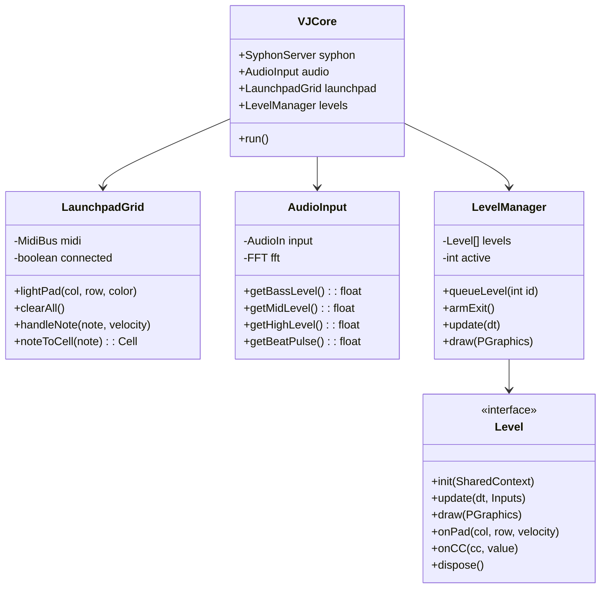

# Processing VJ Games Development Guide

This guide covers how to create interactive VJ games and visuals using Processing (Java) with MIDI controller input from the Launchpad Mini Mk3.

## Prerequisites

- [Processing 4.x](https://processing.org/download) — use **Intel/x64 build** on Apple Silicon for Syphon compatibility
- [The MidiBus library](http://www.smallbutdigital.com/projects/themidibus/)
- [PixelFlow library](https://diwi.github.io/PixelFlow/) - GPU-accelerated effects (fluid simulation, particles, image processing)
- [Syphon library](https://github.com/Syphon/Processing) — frame sharing to VJ software
- Launchpad Mini Mk3 in Programmer mode

> **Renderer:** Always use `P3D` even for 2D-style games. P3D is required for Syphon and enables 3D camera moves, particle depth, perspective zoom/orbit, and GPU shaders.

## Installing The MidiBus

1. Open Processing
2. Go to **Sketch → Import Library → Manage Libraries**
3. Search for "The MidiBus"
4. Click **Install**

---

## VJ Output Design Principles

**All Processing projects are designed for live VJ performance.** The screen output goes via Syphon to visual mixing software where it will be layered, blended, and composited with other sources. Follow these critical guidelines:

### 1. Resolution: Always 1920×1080 (Full HD) with P3D

```java
void settings() {
  size(1920, 1080, P3D);  // Full HD, P3D required for Syphon
}
```

- **Always use P3D** — even for 2D-style games, P3D enables:
  - Syphon frame sharing (required)
  - 3D camera moves (zoom, orbit, perspective shifts)
  - GPU particle effects and shaders
  - Depth-based compositing
- Never use smaller resolutions (800×800, 1280×720, etc.)
- Full HD ensures crisp output on projectors and screens
- Aspect ratio 16:9 matches standard displays

### 2. No Controller UI on Screen

**The screen output should NEVER reveal that it's Launchpad-controlled.** Do not display:

- ❌ "Launchpad Connected" / "Mouse Mode" status text
- ❌ Grid representations showing controller layout
- ❌ Score counters, lives, or game state text
- ❌ Instructions ("Press SPACE to explode")
- ❌ Debug info or developer overlays

The audience sees only the visual output—pure graphics with no visible game mechanics.

### 3. Design for Overlay & Blend Compositing

Projects will be layered using blend modes (Add, Screen, Multiply, etc.) in VJ software. Design accordingly:

- **Black backgrounds** (`background(0)`) — black becomes transparent in Add/Screen blend modes
- **High contrast elements** — white/bright colors punch through overlays
- **Monochrome is powerful** — black and white visuals composite cleanly
- **Avoid filled UI rectangles** — they block layers underneath

```java
void draw() {
  background(0);  // Black = transparent in additive blending
  
  // Draw bright elements that will composite well
  stroke(255);    // White for maximum contrast
  noFill();       // Outlines blend better than filled shapes
}
```

### 4. Crazy Particle Effects

VJ visuals should be **dramatic and dynamic**. Emphasize:

- **Particle explosions** — hundreds/thousands of particles
- **Trails and motion blur** — semi-transparent backgrounds for ghosting
- **GPU acceleration** — use PixelFlow for fluid simulations and massive particle counts
- **Constant motion** — always-moving visuals even without input
- **Audio reactivity** — respond to beats and frequencies

```java
// Semi-transparent background for trail effect
void draw() {
  // Ghost trail - don't fully clear, let particles leave traces
  fill(0, 20);  // Black with low alpha
  rect(0, 0, width, height);
  
  // Update and draw particle systems
  for (Particle p : particles) {
    p.update();
    p.display();
  }
}
```

### 5. Dual Output: Window + Syphon

Processing runs in a **normal visible window** that the performer sees, while **Syphon sends the same frame** to VJ mixing software (Magic, Synesthesia, Resolume, etc.):

```
┌─────────────────────────────────────────────────────┐
│  Processing Window (performer's screen)             │
│  ┌───────────────────────────────────────────────┐  │
│  │                                               │  │
│  │          Your visual output                   │──┼──► Syphon ──► VJ Software ──► Projector
│  │                                               │  │
│  └───────────────────────────────────────────────┘  │
└─────────────────────────────────────────────────────┘
```

- **Processing window:** visible on your monitor for live preview and debugging
- **Syphon output:** zero-copy GPU share to Magic/Synesthesia for mixing and projection
- **Both show the same frame** — what you see is what the audience gets

### 6. Separation of Controller and Visual Logic

Keep MIDI/controller handling completely separate from visual output:

- **Launchpad LEDs** — feedback for the performer (private)
- **Screen output** — visuals for the audience (public via Syphon)

The performer sees both; the audience sees only the screen.

---

## Basic Structure

### Minimal MIDI Setup

```java
import themidibus.*;
import codeanticode.syphon.*;

MidiBus launchpad;
boolean hasLaunchpad = false;
SyphonServer syphon;

void settings() {
  size(1920, 1080, P3D);  // Full HD, P3D required for Syphon
}

void setup() {
  // MIDI setup with auto-detection
  initMidi();
  
  // Syphon output for VJ pipeline
  syphon = new SyphonServer(this, "ProcessingGame");
  
  // Clear all pads at startup
  clearAllPads();
}

void initMidi() {
  String[] inputs = MidiBus.availableInputs();
  String[] outputs = MidiBus.availableOutputs();
  
  String lpIn = null, lpOut = null;
  for (String dev : inputs) {
    if (dev != null && dev.toLowerCase().contains("launchpad")) lpIn = dev;
  }
  for (String dev : outputs) {
    if (dev != null && dev.toLowerCase().contains("launchpad")) lpOut = dev;
  }
  
  if (lpIn != null && lpOut != null) {
    try {
      launchpad = new MidiBus(this, lpIn, lpOut);
      hasLaunchpad = true;
    } catch (Exception e) {
      hasLaunchpad = false;
    }
  }
}

void draw() {
  background(0);
  // Your visual code here
  
  syphon.sendScreen();  // Always at end of draw()
}

void noteOn(int channel, int pitch, int velocity) {
  // Handle pad press
  println("Note On: " + pitch + " velocity: " + velocity);
}

void noteOff(int channel, int pitch, int velocity) {
  // Handle pad release
  println("Note Off: " + pitch);
}

void clearAllPads() {
  if (!hasLaunchpad || launchpad == null) return;
  for (int row = 1; row <= 8; row++) {
    for (int col = 1; col <= 8; col++) {
      int note = row * 10 + col;
      launchpad.sendNoteOn(0, note, 0);
    }
  }
}

void keyPressed() {
  // Keyboard fallback when Launchpad unavailable
  println("Key pressed: " + key);
}
```

---

## Launchpad Grid Utilities

### Grid Coordinate System

```java
// Convert MIDI note to grid position (0-7, 0-7)
PVector noteToGrid(int note) {
  int col = (note % 10) - 1;
  int row = (note / 10) - 1;
  return new PVector(col, row);
}

// Convert grid position to MIDI note
int gridToNote(int col, int row) {
  return (row + 1) * 10 + (col + 1);
}

// Check if note is a valid pad (not scene launch button)
boolean isValidPad(int note) {
  int col = note % 10;
  int row = note / 10;
  return col >= 1 && col <= 8 && row >= 1 && row <= 8;
}
```

### LED Control

```java
// Launchpad color palette (simplified)
final int COLOR_OFF = 0;
final int COLOR_RED = 5;
final int COLOR_ORANGE = 9;
final int COLOR_YELLOW = 13;
final int COLOR_GREEN = 21;
final int COLOR_CYAN = 37;
final int COLOR_BLUE = 45;
final int COLOR_PURPLE = 53;
final int COLOR_PINK = 57;
final int COLOR_WHITE = 3;

void lightPad(int col, int row, int colorIndex) {
  if (!hasLaunchpad || launchpad == null) return;  // Guard MIDI calls
  int note = gridToNote(col, row);
  launchpad.sendNoteOn(0, note, colorIndex);
}

void clearPad(int col, int row) {
  lightPad(col, row, COLOR_OFF);
}

void lightAllPads(int colorIndex) {
  for (int row = 0; row < 8; row++) {
    for (int col = 0; col < 8; col++) {
      lightPad(col, row, colorIndex);
    }
  }
}
```

---

## Example Games

### 1. Whack-a-Mole

A simple reaction game where pads light up and players must hit them quickly.

```java
import themidibus.*;
import codeanticode.syphon.*;

MidiBus launchpad;
boolean hasLaunchpad = false;
SyphonServer syphon;

int targetCol = -1, targetRow = -1;
int score = 0;
int lastSpawnTime = 0;
int spawnInterval = 1000; // ms

void settings() {
  size(1920, 1080, P3D);  // Full HD, P3D required for Syphon
}

void setup() {
  textSize(48);
  textAlign(CENTER, CENTER);
  
  initMidi();
  syphon = new SyphonServer(this, "WhackAMole");
  
  clearAllPads();
  spawnTarget();
}

void initMidi() {
  String[] inputs = MidiBus.availableInputs();
  String[] outputs = MidiBus.availableOutputs();
  
  String lpIn = null, lpOut = null;
  for (String dev : inputs) {
    if (dev != null && dev.toLowerCase().contains("launchpad")) lpIn = dev;
  }
  for (String dev : outputs) {
    if (dev != null && dev.toLowerCase().contains("launchpad")) lpOut = dev;
  }
  
  if (lpIn != null && lpOut != null) {
    try {
      launchpad = new MidiBus(this, lpIn, lpOut);
      hasLaunchpad = true;
    } catch (Exception e) {
      hasLaunchpad = false;
    }
  }
}

void draw() {
  background(0);
  
  // Draw score
  fill(255);
  text("Score: " + score, width/2, 50);
  
  // Draw grid representation
  drawGrid();
  
  // Spawn new target periodically
  if (millis() - lastSpawnTime > spawnInterval) {
    clearTarget();
    spawnTarget();
  }
  
  syphon.sendScreen();  // Always at end of draw()
}

void drawGrid() {
  float cellSize = 100;
  float offsetX = (width - cellSize * 8) / 2;
  float offsetY = 150;
  
  for (int row = 0; row < 8; row++) {
    for (int col = 0; col < 8; col++) {
      float x = offsetX + col * cellSize;
      float y = offsetY + (7 - row) * cellSize; // Flip Y to match Launchpad
      
      if (col == targetCol && row == targetRow) {
        fill(0, 255, 0);
      } else {
        fill(50);
      }
      stroke(100);
      rect(x, y, cellSize - 2, cellSize - 2);
    }
  }
}

void spawnTarget() {
  targetCol = (int)random(8);
  targetRow = (int)random(8);
  lightPad(targetCol, targetRow, 21); // Green
  lastSpawnTime = millis();
}

void clearTarget() {
  if (targetCol >= 0 && targetRow >= 0) {
    clearPad(targetCol, targetRow);
  }
}

void noteOn(int channel, int pitch, int velocity) {
  if (!isValidPad(pitch)) return;
  
  PVector pos = noteToGrid(pitch);
  int col = (int)pos.x;
  int row = (int)pos.y;
  
  handleHit(col, row);
}

void handleHit(int col, int row) {
  if (col == targetCol && row == targetRow) {
    // Hit!
    score++;
    lightPad(col, row, 5); // Flash red
    delay(100);
    clearPad(col, row);
    spawnTarget();
    
    // Speed up as score increases
    spawnInterval = max(300, 1000 - score * 50);
  } else {
    // Miss - flash red
    lightPad(col, row, 5);
    delay(50);
    clearPad(col, row);
  }
}

// Keyboard fallback when no Launchpad
void keyPressed() {
  // Use number keys 1-8 for column, q-i for row
  int col = -1, row = -1;
  if (key >= '1' && key <= '8') col = key - '1';
  if (key == 'q') row = 7;
  if (key == 'w') row = 6;
  if (key == 'e') row = 5;
  if (key == 'r') row = 4;
  if (key == 't') row = 3;
  if (key == 'y') row = 2;
  if (key == 'u') row = 1;
  if (key == 'i') row = 0;
  
  if (col >= 0 && row >= 0) handleHit(col, row);
}

// Mouse fallback
void mousePressed() {
  float cellSize = 100;
  float offsetX = (width - cellSize * 8) / 2;
  float offsetY = 150;
  
  int col = (int)((mouseX - offsetX) / cellSize);
  int row = 7 - (int)((mouseY - offsetY) / cellSize);
  
  if (col >= 0 && col < 8 && row >= 0 && row < 8) {
    handleHit(col, row);
  }
}

// Utility functions
PVector noteToGrid(int note) {
  int col = (note % 10) - 1;
  int row = (note / 10) - 1;
  return new PVector(col, row);
}

int gridToNote(int col, int row) {
  return (row + 1) * 10 + (col + 1);
}

boolean isValidPad(int note) {
  int col = note % 10;
  int row = note / 10;
  return col >= 1 && col <= 8 && row >= 1 && row <= 8;
}

void lightPad(int col, int row, int colorIndex) {
  if (!hasLaunchpad || launchpad == null) return;
  int note = gridToNote(col, row);
  launchpad.sendNoteOn(0, note, colorIndex);
}

void clearPad(int col, int row) {
  lightPad(col, row, 0);
}

void clearAllPads() {
  for (int row = 0; row < 8; row++) {
    for (int col = 0; col < 8; col++) {
      clearPad(col, row);
    }
  }
}
```

### 2. Snake Game

Classic snake game on the Launchpad grid.

```java
import themidibus.*;
import codeanticode.syphon.*;
import java.util.LinkedList;

MidiBus launchpad;
boolean hasLaunchpad = false;
SyphonServer syphon;

LinkedList<PVector> snake = new LinkedList<PVector>();
PVector food;
PVector direction = new PVector(1, 0);
PVector nextDirection = new PVector(1, 0);
int lastMoveTime = 0;
int moveInterval = 300;
boolean gameOver = false;
int score = 0;

void settings() {
  size(1920, 1080, P3D);  // Full HD, P3D required for Syphon
}

void setup() {
  textSize(32);
  textAlign(CENTER, CENTER);
  
  initMidi();
  syphon = new SyphonServer(this, "SnakeGame");
  
  resetGame();
}

void initMidi() {
  String[] inputs = MidiBus.availableInputs();
  String[] outputs = MidiBus.availableOutputs();
  
  String lpIn = null, lpOut = null;
  for (String dev : inputs) {
    if (dev != null && dev.toLowerCase().contains("launchpad")) lpIn = dev;
  }
  for (String dev : outputs) {
    if (dev != null && dev.toLowerCase().contains("launchpad")) lpOut = dev;
  }
  
  if (lpIn != null && lpOut != null) {
    try {
      launchpad = new MidiBus(this, lpIn, lpOut);
      hasLaunchpad = true;
    } catch (Exception e) {
      hasLaunchpad = false;
    }
  }
}

void resetGame() {
  snake.clear();
  snake.add(new PVector(4, 4));
  snake.add(new PVector(3, 4));
  snake.add(new PVector(2, 4));
  
  direction = new PVector(1, 0);
  nextDirection = new PVector(1, 0);
  gameOver = false;
  score = 0;
  
  spawnFood();
  updateLaunchpad();
}

void draw() {
  background(0);
  
  if (gameOver) {
    fill(255, 0, 0);
    text("GAME OVER", width/2, height/2 - 30);
    text("Score: " + score, width/2, height/2 + 30);
    text("Press any pad or SPACE to restart", width/2, height/2 + 90);
    syphon.sendScreen();
    return;
  }
  
  // Move snake
  if (millis() - lastMoveTime > moveInterval) {
    direction = nextDirection.copy();
    moveSnake();
    lastMoveTime = millis();
  }
  
  // Draw grid on screen
  drawGrid();
  
  fill(255);
  text("Score: " + score, width/2, 30);
  
  syphon.sendScreen();  // Always at end of draw()
}

void moveSnake() {
  PVector head = snake.getFirst().copy();
  head.add(direction);
  
  // Wrap around
  if (head.x < 0) head.x = 7;
  if (head.x > 7) head.x = 0;
  if (head.y < 0) head.y = 7;
  if (head.y > 7) head.y = 0;
  
  // Check collision with self
  for (PVector segment : snake) {
    if (segment.x == head.x && segment.y == head.y) {
      gameOver = true;
      flashGameOver();
      return;
    }
  }
  
  snake.addFirst(head);
  
  // Check food
  if (head.x == food.x && head.y == food.y) {
    score++;
    spawnFood();
    // Speed up
    moveInterval = max(100, 300 - score * 10);
  } else {
    snake.removeLast();
  }
  
  updateLaunchpad();
}

void spawnFood() {
  do {
    food = new PVector((int)random(8), (int)random(8));
  } while (isSnakePosition(food));
}

boolean isSnakePosition(PVector pos) {
  for (PVector segment : snake) {
    if (segment.x == pos.x && segment.y == pos.y) {
      return true;
    }
  }
  return false;
}

void updateLaunchpad() {
  // Clear all
  for (int row = 0; row < 8; row++) {
    for (int col = 0; col < 8; col++) {
      lightPad(col, row, 0);
    }
  }
  
  // Draw snake (green, head brighter)
  boolean first = true;
  for (PVector segment : snake) {
    lightPad((int)segment.x, (int)segment.y, first ? 21 : 19);
    first = false;
  }
  
  // Draw food (red pulsing)
  lightPad((int)food.x, (int)food.y, 5);
}

void flashGameOver() {
  // Flash red
  for (int i = 0; i < 3; i++) {
    for (int row = 0; row < 8; row++) {
      for (int col = 0; col < 8; col++) {
        lightPad(col, row, 5);
      }
    }
    delay(200);
    for (int row = 0; row < 8; row++) {
      for (int col = 0; col < 8; col++) {
        lightPad(col, row, 0);
      }
    }
    delay(200);
  }
}

void noteOn(int channel, int pitch, int velocity) {
  if (!isValidPad(pitch)) return;
  
  if (gameOver) {
    resetGame();
    return;
  }
  
  PVector pos = noteToGrid(pitch);
  PVector head = snake.getFirst();
  
  // Determine direction based on pad pressed relative to head
  float dx = pos.x - head.x;
  float dy = pos.y - head.y;
  
  if (abs(dx) > abs(dy)) {
    // Horizontal movement
    if (dx > 0 && direction.x != -1) {
      nextDirection = new PVector(1, 0);
    } else if (dx < 0 && direction.x != 1) {
      nextDirection = new PVector(-1, 0);
    }
  } else {
    // Vertical movement
    if (dy > 0 && direction.y != -1) {
      nextDirection = new PVector(0, 1);
    } else if (dy < 0 && direction.y != 1) {
      nextDirection = new PVector(0, -1);
    }
  }
}

// Keyboard fallback
void keyPressed() {
  if (gameOver && key == ' ') {
    resetGame();
    return;
  }
  if (key == 'w' || keyCode == UP) {
    if (direction.y != -1) nextDirection = new PVector(0, 1);
  }
  if (key == 's' || keyCode == DOWN) {
    if (direction.y != 1) nextDirection = new PVector(0, -1);
  }
  if (key == 'a' || keyCode == LEFT) {
    if (direction.x != 1) nextDirection = new PVector(-1, 0);
  }
  if (key == 'd' || keyCode == RIGHT) {
    if (direction.x != -1) nextDirection = new PVector(1, 0);
  }
}

void drawGrid() {
  float cellSize = 100;
  float offsetX = (width - cellSize * 8) / 2;
  float offsetY = 100;
  
  for (int row = 0; row < 8; row++) {
    for (int col = 0; col < 8; col++) {
      float x = offsetX + col * cellSize;
      float y = offsetY + (7 - row) * cellSize;
      
      fill(30);
      stroke(60);
      
      // Check if snake
      for (int i = 0; i < snake.size(); i++) {
        PVector seg = snake.get(i);
        if ((int)seg.x == col && (int)seg.y == row) {
          fill(i == 0 ? color(0, 200, 0) : color(0, 150, 0));
          break;
        }
      }
      
      // Check if food
      if ((int)food.x == col && (int)food.y == row) {
        fill(255, 0, 0);
      }
      
      rect(x, y, cellSize - 2, cellSize - 2);
    }
  }
}

// Utility functions
PVector noteToGrid(int note) {
  int col = (note % 10) - 1;
  int row = (note / 10) - 1;
  return new PVector(col, row);
}

int gridToNote(int col, int row) {
  return (row + 1) * 10 + (col + 1);
}

boolean isValidPad(int note) {
  int col = note % 10;
  int row = note / 10;
  return col >= 1 && col <= 8 && row >= 1 && row <= 8;
}

void lightPad(int col, int row, int colorIndex) {
  if (!hasLaunchpad || launchpad == null) return;
  int note = gridToNote(col, row);
  launchpad.sendNoteOn(0, note, colorIndex);
}
```

### 3. Simon Says (Memory Game)

```java
import themidibus.*;
import codeanticode.syphon.*;
import java.util.ArrayList;

MidiBus launchpad;
boolean hasLaunchpad = false;
SyphonServer syphon;

ArrayList<Integer> sequence = new ArrayList<Integer>();
int playerIndex = 0;
boolean playerTurn = false;
boolean gameOver = false;
int score = 0;

// Define 4 quadrants with colors
int[][] quadrants = {
  {0, 0, 3, 3},  // Top-left (cols 0-3, rows 4-7)
  {4, 0, 7, 3},  // Top-right
  {0, 4, 3, 7},  // Bottom-left
  {4, 4, 7, 7}   // Bottom-right
};

int[] quadrantColors = {5, 13, 21, 45}; // Red, Yellow, Green, Blue
int[] quadrantDimColors = {1, 9, 17, 41}; // Dim versions

void settings() {
  size(1920, 1080, P3D);  // Full HD, P3D required for Syphon
}

void setup() {
  textSize(32);
  textAlign(CENTER, CENTER);
  
  initMidi();
  syphon = new SyphonServer(this, "SimonSays");
  
  startNewGame();
}

void initMidi() {
  String[] inputs = MidiBus.availableInputs();
  String[] outputs = MidiBus.availableOutputs();
  
  String lpIn = null, lpOut = null;
  for (String dev : inputs) {
    if (dev != null && dev.toLowerCase().contains("launchpad")) lpIn = dev;
  }
  for (String dev : outputs) {
    if (dev != null && dev.toLowerCase().contains("launchpad")) lpOut = dev;
  }
  
  if (lpIn != null && lpOut != null) {
    try {
      launchpad = new MidiBus(this, lpIn, lpOut);
      hasLaunchpad = true;
    } catch (Exception e) {
      hasLaunchpad = false;
    }
  }
}

void startNewGame() {
  sequence.clear();
  playerIndex = 0;
  playerTurn = false;
  gameOver = false;
  score = 0;
  
  showQuadrants();
  delay(500);
  addToSequence();
}

void showQuadrants() {
  clearAllPads();
  for (int q = 0; q < 4; q++) {
    lightQuadrant(q, quadrantDimColors[q]);
  }
}

void lightQuadrant(int q, int colorVal) {
  int[] bounds = quadrants[q];
  for (int col = bounds[0]; col <= bounds[2]; col++) {
    for (int row = bounds[1]; row <= bounds[3]; row++) {
      lightPad(col, row, colorVal);
    }
  }
}

void flashQuadrant(int q) {
  lightQuadrant(q, quadrantColors[q]);
  delay(400);
  lightQuadrant(q, quadrantDimColors[q]);
  delay(200);
}

void addToSequence() {
  sequence.add((int)random(4));
  playSequence();
}

void playSequence() {
  playerTurn = false;
  
  // Clear and wait
  showQuadrants();
  delay(500);
  
  // Play each step
  for (int step : sequence) {
    flashQuadrant(step);
  }
  
  // Player's turn
  playerTurn = true;
  playerIndex = 0;
}

int getQuadrant(int col, int row) {
  for (int q = 0; q < 4; q++) {
    int[] bounds = quadrants[q];
    if (col >= bounds[0] && col <= bounds[2] && 
        row >= bounds[1] && row <= bounds[3]) {
      return q;
    }
  }
  return -1;
}

void handleQuadrantPress(int q) {
  if (q < 0) return;
  
  // Flash the pressed quadrant
  lightQuadrant(q, quadrantColors[q]);
  
  // Check if correct
  if (q == sequence.get(playerIndex)) {
    playerIndex++;
    
    if (playerIndex >= sequence.size()) {
      // Completed sequence!
      score++;
      delay(300);
      showQuadrants();
      delay(500);
      addToSequence();
    } else {
      delay(200);
      lightQuadrant(q, quadrantDimColors[q]);
    }
  } else {
    // Wrong!
    gameOver = true;
    flashGameOver();
  }
}

void noteOn(int channel, int pitch, int velocity) {
  if (!isValidPad(pitch)) return;
  
  if (gameOver) {
    startNewGame();
    return;
  }
  
  if (!playerTurn) return;
  
  PVector pos = noteToGrid(pitch);
  int q = getQuadrant((int)pos.x, (int)pos.y);
  handleQuadrantPress(q);
}

// Keyboard/mouse fallback
void keyPressed() {
  if (gameOver && key == ' ') {
    startNewGame();
    return;
  }
  if (!playerTurn) return;
  
  int q = -1;
  if (key == 'q' || key == '1') q = 0;  // Top-left
  if (key == 'w' || key == '2') q = 1;  // Top-right
  if (key == 'a' || key == '3') q = 2;  // Bottom-left
  if (key == 's' || key == '4') q = 3;  // Bottom-right
  
  if (q >= 0) handleQuadrantPress(q);
}

void mousePressed() {
  if (gameOver) {
    startNewGame();
    return;
  }
  if (!playerTurn) return;
  
  // Map mouse to quadrant
  int q = -1;
  if (mouseX < width/2 && mouseY < height/2) q = 0;
  else if (mouseX >= width/2 && mouseY < height/2) q = 1;
  else if (mouseX < width/2 && mouseY >= height/2) q = 2;
  else if (mouseX >= width/2 && mouseY >= height/2) q = 3;
  
  if (q >= 0) handleQuadrantPress(q);
}

void flashGameOver() {
  for (int i = 0; i < 3; i++) {
    for (int row = 0; row < 8; row++) {
      for (int col = 0; col < 8; col++) {
        lightPad(col, row, 5);
      }
    }
    delay(200);
    clearAllPads();
    delay(200);
  }
}

void draw() {
  background(0);
  
  if (gameOver) {
    fill(255, 0, 0);
    text("GAME OVER!", width/2, height/2 - 30);
    text("Score: " + score, width/2, height/2 + 30);
    text("Press SPACE or any pad to restart", width/2, height/2 + 90);
  } else {
    fill(255);
    text("Score: " + score, width/2, 30);
    
    if (playerTurn) {
      text("Your turn! Repeat the sequence", width/2, height - 30);
    } else {
      text("Watch the sequence...", width/2, height - 30);
    }
  }
  
  drawQuadrants();
  
  syphon.sendScreen();  // Always at end of draw()
}

void drawQuadrants() {
  float size = 400;
  float gap = 20;
  float startX = (width - size * 2 - gap) / 2;
  float startY = 100;
  
  color[] colors = {color(255, 0, 0), color(255, 255, 0), color(0, 255, 0), color(0, 0, 255)};
  
  for (int q = 0; q < 4; q++) {
    int col = q % 2;
    int row = q / 2;
    float x = startX + col * (size + gap);
    float y = startY + row * (size + gap);
    
    fill(red(colors[q])/3, green(colors[q])/3, blue(colors[q])/3);
    stroke(colors[q]);
    strokeWeight(3);
    rect(x, y, size, size, 20);
  }
}

// Utility functions
PVector noteToGrid(int note) {
  int col = (note % 10) - 1;
  int row = (note / 10) - 1;
  return new PVector(col, row);
}

int gridToNote(int col, int row) {
  return (row + 1) * 10 + (col + 1);
}

boolean isValidPad(int note) {
  int col = note % 10;
  int row = note / 10;
  return col >= 1 && col <= 8 && row >= 1 && row <= 8;
}

void lightPad(int col, int row, int colorIndex) {
  if (!hasLaunchpad || launchpad == null) return;
  int note = gridToNote(col, row);
  launchpad.sendNoteOn(0, note, colorIndex);
}

void clearAllPads() {
  for (int row = 0; row < 8; row++) {
    for (int col = 0; col < 8; col++) {
      lightPad(col, row, 0);
    }
  }
}
```

---

## Game Ideas for Launchpad

This section contains game concepts designed specifically for the 8×8 Launchpad grid with visual output via Syphon. Each game idea includes concept description, core mechanics, and implementation hints.

### 4. Flocker (Boids Simulation)

A flock of birds/particles follows the location of pressed pads on the Launchpad. Based on Craig Reynolds' Boids algorithm.

**Concept**:
- A flock of 50-200 "boids" (birds/fish/particles) swim across the screen
- When you press a pad, all boids are attracted to that location
- Multiple pads can be pressed simultaneously for multiple attraction points
- Pads light up based on how many boids are near that grid cell

**Core Mechanics**:
- **Separation**: Boids avoid crowding nearby boids
- **Alignment**: Boids steer toward average heading of neighbors
- **Cohesion**: Boids move toward center of mass of neighbors
- **Attraction**: Pressed pads create attraction points

```java
import themidibus.*;
import codeanticode.syphon.*;
import java.util.ArrayList;

MidiBus launchpad;
boolean hasLaunchpad = false;
SyphonServer syphon;

ArrayList<Boid> flock = new ArrayList<Boid>();
ArrayList<PVector> attractors = new ArrayList<PVector>();
boolean[][] padPressed = new boolean[8][8];

void settings() {
  size(1920, 1080, P3D);  // Full HD, P3D required for Syphon
}

void setup() {
  initMidi();
  syphon = new SyphonServer(this, "Flocker");
  
  // Create initial flock
  for (int i = 0; i < 150; i++) {
    flock.add(new Boid(random(width), random(height)));
  }
  
  clearAllPads();
}

void initMidi() {
  String[] inputs = MidiBus.availableInputs();
  String[] outputs = MidiBus.availableOutputs();
  
  String lpIn = null, lpOut = null;
  for (String dev : inputs) {
    if (dev != null && dev.toLowerCase().contains("launchpad")) lpIn = dev;
  }
  for (String dev : outputs) {
    if (dev != null && dev.toLowerCase().contains("launchpad")) lpOut = dev;
  }
  
  if (lpIn != null && lpOut != null) {
    try {
      launchpad = new MidiBus(this, lpIn, lpOut);
      hasLaunchpad = true;
    } catch (Exception e) {
      hasLaunchpad = false;
    }
  }
}

void draw() {
  background(10);
  
  // Update attractors from pressed pads
  attractors.clear();
  for (int row = 0; row < 8; row++) {
    for (int col = 0; col < 8; col++) {
      if (padPressed[col][row]) {
        float x = map(col, 0, 7, 50, width - 50);
        float y = map(7 - row, 0, 7, 50, height - 50);
        attractors.add(new PVector(x, y));
        
        // Draw attractor point
        fill(255, 100, 100, 150);
        noStroke();
        ellipse(x, y, 40, 40);
      }
    }
  }
  
  // Update and draw flock
  for (Boid b : flock) {
    b.flock(flock);
    b.attractTo(attractors);
    b.update();
    b.edges();
    b.display();
  }
  
  // Update Launchpad LEDs based on boid density
  updateLaunchpadFromDensity();
  
  syphon.sendScreen();  // Always at end of draw()
}

void updateLaunchpadFromDensity() {
  int[][] density = new int[8][8];
  
  // Count boids per grid cell
  for (Boid b : flock) {
    int col = constrain((int)map(b.position.x, 0, width, 0, 8), 0, 7);
    int row = constrain((int)map(b.position.y, 0, height, 0, 8), 0, 7);
    row = 7 - row; // Flip Y
    density[col][row]++;
  }
  
  // Light pads based on density
  for (int row = 0; row < 8; row++) {
    for (int col = 0; col < 8; col++) {
      int count = density[col][row];
      int colorIndex;
      if (padPressed[col][row]) {
        colorIndex = 5; // Red for pressed
      } else if (count > 10) {
        colorIndex = 21; // Bright green
      } else if (count > 5) {
        colorIndex = 17; // Medium green
      } else if (count > 0) {
        colorIndex = 19; // Dim green
      } else {
        colorIndex = 0; // Off
      }
      lightPad(col, row, colorIndex);
    }
  }
}

void noteOn(int channel, int pitch, int velocity) {
  if (!isValidPad(pitch)) return;
  PVector pos = noteToGrid(pitch);
  padPressed[(int)pos.x][(int)pos.y] = true;
}

void noteOff(int channel, int pitch, int velocity) {
  if (!isValidPad(pitch)) return;
  PVector pos = noteToGrid(pitch);
  padPressed[(int)pos.x][(int)pos.y] = false;
}

// Mouse fallback for attractors
void mousePressed() {
  int col = (int)map(mouseX, 0, width, 0, 8);
  int row = 7 - (int)map(mouseY, 0, height, 0, 8);
  if (col >= 0 && col < 8 && row >= 0 && row < 8) {
    padPressed[col][row] = true;
  }
}

void mouseReleased() {
  for (int i = 0; i < 8; i++) {
    for (int j = 0; j < 8; j++) {
      padPressed[i][j] = false;
    }
  }
}

class Boid {
  PVector position, velocity, acceleration;
  float maxSpeed = 4;
  float maxForce = 0.1f;
  
  Boid(float x, float y) {
    position = new PVector(x, y);
    velocity = PVector.random2D().mult(random(2, 4));
    acceleration = new PVector();
  }
  
  void flock(ArrayList<Boid> boids) {
    PVector sep = separate(boids).mult(1.5f);
    PVector ali = align(boids).mult(1.0f);
    PVector coh = cohesion(boids).mult(1.0f);
    acceleration.add(sep).add(ali).add(coh);
  }
  
  void attractTo(ArrayList<PVector> points) {
    for (PVector target : points) {
      PVector desired = PVector.sub(target, position);
      float d = desired.mag();
      if (d < 300) {
        desired.setMag(maxSpeed);
        PVector steer = PVector.sub(desired, velocity);
        steer.limit(maxForce * 2);
        acceleration.add(steer);
      }
    }
  }
  
  PVector separate(ArrayList<Boid> boids) {
    float desiredSeparation = 25;
    PVector steer = new PVector();
    int count = 0;
    for (Boid other : boids) {
      float d = PVector.dist(position, other.position);
      if (d > 0 && d < desiredSeparation) {
        PVector diff = PVector.sub(position, other.position);
        diff.normalize().div(d);
        steer.add(diff);
        count++;
      }
    }
    if (count > 0) steer.div(count);
    if (steer.mag() > 0) {
      steer.setMag(maxSpeed);
      steer.sub(velocity);
      steer.limit(maxForce);
    }
    return steer;
  }
  
  PVector align(ArrayList<Boid> boids) {
    float neighborDist = 50;
    PVector sum = new PVector();
    int count = 0;
    for (Boid other : boids) {
      float d = PVector.dist(position, other.position);
      if (d > 0 && d < neighborDist) {
        sum.add(other.velocity);
        count++;
      }
    }
    if (count > 0) {
      sum.div(count);
      sum.setMag(maxSpeed);
      PVector steer = PVector.sub(sum, velocity);
      steer.limit(maxForce);
      return steer;
    }
    return new PVector();
  }
  
  PVector cohesion(ArrayList<Boid> boids) {
    float neighborDist = 50;
    PVector sum = new PVector();
    int count = 0;
    for (Boid other : boids) {
      float d = PVector.dist(position, other.position);
      if (d > 0 && d < neighborDist) {
        sum.add(other.position);
        count++;
      }
    }
    if (count > 0) {
      sum.div(count);
      PVector desired = PVector.sub(sum, position);
      desired.setMag(maxSpeed);
      PVector steer = PVector.sub(desired, velocity);
      steer.limit(maxForce);
      return steer;
    }
    return new PVector();
  }
  
  void update() {
    velocity.add(acceleration);
    velocity.limit(maxSpeed);
    position.add(velocity);
    acceleration.mult(0);
  }
  
  void edges() {
    if (position.x > width) position.x = 0;
    if (position.x < 0) position.x = width;
    if (position.y > height) position.y = 0;
    if (position.y < 0) position.y = height;
  }
  
  void display() {
    float theta = velocity.heading() + HALF_PI;
    fill(127, 200, 255);
    noStroke();
    pushMatrix();
    translate(position.x, position.y);
    rotate(theta);
    beginShape();
    vertex(0, -6);
    vertex(-3, 6);
    vertex(3, 6);
    endShape(CLOSE);
    popMatrix();
  }
}

// Utility functions
PVector noteToGrid(int note) {
  return new PVector((note % 10) - 1, (note / 10) - 1);
}

int gridToNote(int col, int row) {
  return (row + 1) * 10 + (col + 1);
}

boolean isValidPad(int note) {
  int col = note % 10;
  int row = note / 10;
  return col >= 1 && col <= 8 && row >= 1 && row <= 8;
}

void lightPad(int col, int row, int colorIndex) {
  if (!hasLaunchpad || launchpad == null) return;
  launchpad.sendNoteOn(0, gridToNote(col, row), colorIndex);
}

void clearAllPads() {
  for (int row = 0; row < 8; row++) {
    for (int col = 0; col < 8; col++) {
      lightPad(col, row, 0);
    }
  }
}
```

---

### 5. Virus Grower (Fractal Growth Game)

A virus/organism grows from pressed pads, spreading across the grid. Fight it by pressing infected cells!

**Concept**:
- Press a pad to spawn a "virus" that grows outward like a fractal tree
- Infected pads glow green, spreading pads pulse
- As the virus spreads, newly covered pads turn red (danger zone)
- Press red pads to weaken the virus
- Press the original "heart" pad (yellow) to kill the entire virus
- Multiple viruses can exist simultaneously

**Core Mechanics**:
- **Growth**: Virus spreads to adjacent cells over time
- **Health**: Each virus has health that decreases when you hit red cells
- **Heart**: The origin cell is the weak point - hitting it kills the virus
- **Score**: Points for killing viruses, penalty for full grid infection

```java
import themidibus.*;
import codeanticode.syphon.*;
import java.util.ArrayList;

MidiBus launchpad;
boolean hasLaunchpad = false;
SyphonServer syphon;

ArrayList<Virus> viruses = new ArrayList<Virus>();
int score = 0;
int lastSpawnTime = 0;

void settings() {
  size(1920, 1080, P3D);  // Full HD, P3D required for Syphon
}

void setup() {
  textSize(32);
  textAlign(CENTER, CENTER);
  
  initMidi();
  syphon = new SyphonServer(this, "VirusGrower");
  
  clearAllPads();
}

void initMidi() {
  String[] inputs = MidiBus.availableInputs();
  String[] outputs = MidiBus.availableOutputs();
  
  String lpIn = null, lpOut = null;
  for (String dev : inputs) {
    if (dev != null && dev.toLowerCase().contains("launchpad")) lpIn = dev;
  }
  for (String dev : outputs) {
    if (dev != null && dev.toLowerCase().contains("launchpad")) lpOut = dev;
  }
  
  if (lpIn != null && lpOut != null) {
    try {
      launchpad = new MidiBus(this, lpIn, lpOut);
      hasLaunchpad = true;
    } catch (Exception e) {
      hasLaunchpad = false;
    }
  }
}

void draw() {
  background(10);
  
  // Update all viruses
  for (int i = viruses.size() - 1; i >= 0; i--) {
    Virus v = viruses.get(i);
    v.update();
    v.display();
    
    if (v.isDead()) {
      score += 100;
      flashVictory(v);
      viruses.remove(i);
    } else if (v.hasWon()) {
      score -= 50;
      viruses.remove(i);
      flashDefeat();
    }
  }
  
  // Update Launchpad
  updateLaunchpad();
  
  // Draw score
  fill(255);
  text("Score: " + score, width/2, 30);
  text("Viruses: " + viruses.size(), width/2, 70);
  
  // Draw grid
  drawGrid();
  
  syphon.sendScreen();  // Always at end of draw()
}

void drawGrid() {
  float cellSize = 100;
  float offsetX = (width - cellSize * 8) / 2;
  float offsetY = 150;
  
  for (int row = 0; row < 8; row++) {
    for (int col = 0; col < 8; col++) {
      float x = offsetX + col * cellSize;
      float y = offsetY + (7 - row) * cellSize;
      
      int state = getCellState(col, row);
      
      switch(state) {
        case 0: fill(30); break;           // Empty
        case 1: fill(255, 255, 0); break;  // Heart (yellow)
        case 2: fill(0, 200, 0); break;    // Infected (green)
        case 3: fill(200, 0, 0); break;    // Danger (red)
        case 4: fill(0, 100, 0); break;    // Growing edge
      }
      
      stroke(60);
      rect(x, y, cellSize - 2, cellSize - 2);
    }
  }
}

int getCellState(int col, int row) {
  for (Virus v : viruses) {
    if (v.heartX == col && v.heartY == row) return 1; // Heart
    if (v.isInfected(col, row)) {
      if (v.isEdge(col, row)) return 4; // Growing edge
      return 2; // Infected
    }
    if (v.isDanger(col, row)) return 3; // Danger zone
  }
  return 0; // Empty
}

void updateLaunchpad() {
  for (int row = 0; row < 8; row++) {
    for (int col = 0; col < 8; col++) {
      int state = getCellState(col, row);
      int colorIndex;
      switch(state) {
        case 1: colorIndex = 13; break; // Yellow - heart
        case 2: colorIndex = 21; break; // Green - infected
        case 3: colorIndex = 5; break;  // Red - danger
        case 4: colorIndex = 17; break; // Dim green - edge
        default: colorIndex = 0;        // Off
      }
      lightPad(col, row, colorIndex);
    }
  }
}

void handleCellPress(int col, int row) {
  // Check if hitting a virus
  boolean hitSomething = false;
  for (int i = viruses.size() - 1; i >= 0; i--) {
    Virus v = viruses.get(i);
    
    // Hit heart = kill virus
    if (v.heartX == col && v.heartY == row) {
      score += 200;
      flashVictory(v);
      viruses.remove(i);
      hitSomething = true;
      break;
    }
    
    // Hit danger zone = weaken virus
    if (v.isDanger(col, row)) {
      v.health -= 20;
      v.removeDanger(col, row);
      score += 10;
      hitSomething = true;
    }
  }
  
  // If nothing hit, spawn new virus
  if (!hitSomething && getCellState(col, row) == 0) {
    viruses.add(new Virus(col, row));
  }
}

void noteOn(int channel, int pitch, int velocity) {
  if (!isValidPad(pitch)) return;
  
  PVector pos = noteToGrid(pitch);
  handleCellPress((int)pos.x, (int)pos.y);
}

// Mouse fallback
void mousePressed() {
  float cellSize = 100;
  float offsetX = (width - cellSize * 8) / 2;
  float offsetY = 150;
  
  int col = (int)((mouseX - offsetX) / cellSize);
  int row = 7 - (int)((mouseY - offsetY) / cellSize);
  
  if (col >= 0 && col < 8 && row >= 0 && row < 8) {
    handleCellPress(col, row);
  }
}

void flashVictory(Virus v) {
  // Flash green on the area
  for (int row = 0; row < 8; row++) {
    for (int col = 0; col < 8; col++) {
      if (v.isInfected(col, row) || v.isDanger(col, row)) {
        lightPad(col, row, 21);
      }
    }
  }
}

void flashDefeat() {
  // Flash red on entire grid
  for (int row = 0; row < 8; row++) {
    for (int col = 0; col < 8; col++) {
      lightPad(col, row, 5);
    }
  }
}

class Virus {
  int heartX, heartY;
  int health = 100;
  ArrayList<int[]> infected = new ArrayList<int[]>();
  ArrayList<int[]> danger = new ArrayList<int[]>();
  int lastGrowTime = 0;
  int growInterval = 800;
  
  Virus(int x, int y) {
    heartX = x;
    heartY = y;
    infected.add(new int[]{x, y});
    addDangerAround(x, y);
  }
  
  void update() {
    if (millis() - lastGrowTime > growInterval) {
      grow();
      lastGrowTime = millis();
    }
  }
  
  void grow() {
    if (danger.size() > 0) {
      // Pick random danger cell to infect
      int idx = (int)random(danger.size());
      int[] cell = danger.remove(idx);
      infected.add(cell);
      addDangerAround(cell[0], cell[1]);
    }
  }
  
  void addDangerAround(int x, int y) {
    int[][] neighbors = {{-1,0}, {1,0}, {0,-1}, {0,1}};
    for (int[] n : neighbors) {
      int nx = x + n[0];
      int ny = y + n[1];
      if (nx >= 0 && nx < 8 && ny >= 0 && ny < 8) {
        if (!isInfected(nx, ny) && !isDanger(nx, ny)) {
          danger.add(new int[]{nx, ny});
        }
      }
    }
  }
  
  boolean isInfected(int x, int y) {
    for (int[] cell : infected) {
      if (cell[0] == x && cell[1] == y) return true;
    }
    return false;
  }
  
  boolean isDanger(int x, int y) {
    for (int[] cell : danger) {
      if (cell[0] == x && cell[1] == y) return true;
    }
    return false;
  }
  
  boolean isEdge(int x, int y) {
    // Check if this infected cell is at the edge
    for (int[] d : danger) {
      if (Math.abs(d[0] - x) + Math.abs(d[1] - y) == 1) return true;
    }
    return false;
  }
  
  void removeDanger(int x, int y) {
    for (int i = danger.size() - 1; i >= 0; i--) {
      if (danger.get(i)[0] == x && danger.get(i)[1] == y) {
        danger.remove(i);
        return;
      }
    }
  }
  
  boolean isDead() {
    return health <= 0;
  }
  
  boolean hasWon() {
    return infected.size() >= 50; // Virus wins if too big
  }
  
  void display() {
    // Visual representation handled in main draw
  }
}

// Utility functions
PVector noteToGrid(int note) {
  return new PVector((note % 10) - 1, (note / 10) - 1);
}

int gridToNote(int col, int row) {
  return (row + 1) * 10 + (col + 1);
}

boolean isValidPad(int note) {
  int col = note % 10;
  int row = note / 10;
  return col >= 1 && col <= 8 && row >= 1 && row <= 8;
}

void lightPad(int col, int row, int colorIndex) {
  if (!hasLaunchpad || launchpad == null) return;
  launchpad.sendNoteOn(0, gridToNote(col, row), colorIndex);
}

void clearAllPads() {
  for (int row = 0; row < 8; row++) {
    for (int col = 0; col < 8; col++) {
      lightPad(col, row, 0);
    }
  }
}
```

---

### 6. Particle Painter

Draw with particles! Press pads to spawn particle emitters that create flowing artwork.

**Concept**:
- Each pressed pad becomes a particle emitter
- Particles flow in directions based on pad position (edge pads shoot outward)
- Particles leave trails creating abstract paintings
- Hold multiple pads for complex patterns
- MIDImix faders control particle properties (size, speed, lifetime)

**Implementation Hints**:
- Use PixelFlow for GPU-accelerated particles
- Each pad emits 5-20 particles per frame while pressed
- Particles have color based on grid position
- Trail effect using semi-transparent background

---

### 7. Wave Interference

Create interfering wave patterns from multiple sources.

**Concept**:
- Press a pad to create a ripple/wave source at that location
- Multiple pads create interference patterns (constructive/destructive)
- Pads pulse based on wave amplitude at their location
- Beautiful circular wave patterns on screen
- Great for audio-reactive visuals (wave speed tied to music)

**Implementation Hints**:
- Use sine waves from each active point
- Calculate amplitude as sum of all waves at each screen pixel
- Color based on amplitude (positive = blue, negative = red)
- Launchpad shows amplitude at each cell location

---

### 8. Gravity Wells

Control planetary gravity to guide particles.

**Concept**:
- Particles constantly spawn from edges of screen
- Press pads to create "gravity wells" that attract particles
- Particles orbit around wells, creating swirling patterns
- Multiple wells create chaotic orbital dynamics
- Hold longer = stronger gravity

**Implementation Hints**:
- Simple gravitational formula: F = G * m1 * m2 / r²
- Particles have velocity and acceleration
- Wells accumulate mass while pressed
- Particles leave colorful trails

---

### 9. Light Chaser (Reaction Game)

A light chases around the grid - catch it before it escapes!

**Concept**:
- A single lit pad moves around the grid
- Player must press it before it moves
- Successful hits score points and speed up the game
- Miss too many and game over
- Combo system for consecutive hits

**Implementation Hints**:
- Light moves in patterns (random, snake, spiral)
- Speed increases every 10 hits
- Visual trail shows where light has been
- Screen shows score, combo, and lives

---

### 10. Territory Control

Two-player competitive game for territory.

**Concept**:
- Grid starts neutral (dim)
- Player 1 presses left side pads (turn blue)
- Player 2 presses right side pads (turn red)
- Captured cells slowly "decay" back to neutral
- Player with most territory after time wins

**Implementation Hints**:
- Each cell has ownership value (-1 to 1)
- Pressing pushes value toward your color
- Cells slowly drift back to 0
- Screen shows territory percentage

---

### 11. Drum Sequencer Visual

Turn the Launchpad into a visual drum machine.

**Concept**:
- Each row is a different instrument/color
- A playhead moves across columns (synced to BPM)
- Toggle pads to create patterns
- When playhead hits active pad, visual effect triggers
- Beautiful for live music performance

**Implementation Hints**:
- Sync to MIDI clock or internal tempo
- Each row triggers different visual effect (circles, lines, explosions)
- Pads show pattern state (on/off)
- Playhead column highlighted

---

### 12. Cellular Automata (Game of Life)

Conway's Game of Life controlled by Launchpad.

**Concept**:
- Toggle cells alive/dead by pressing pads
- Press a button to step simulation
- Hold button for continuous evolution
- Watch patterns emerge and evolve
- Classic patterns like gliders, oscillators appear

**Implementation Hints**:
- Standard Game of Life rules
- Press pad = toggle cell state
- Scene button = step/run simulation
- Screen shows larger visualization with cell history

---

### 13. Maze Runner

Navigate a procedurally generated maze.

**Concept**:
- Random maze fills the grid
- Player (bright pad) starts in corner
- Goal (pulsing pad) in opposite corner
- Press adjacent pads to move
- Timer adds pressure

**Implementation Hints**:
- Generate maze using recursive backtracking
- Player can only move to empty adjacent cells
- Walls shown as dim pads
- Screen shows full maze with player position

---

### 14. Sound Reactive Equalizer

Visualize audio as a grid equalizer.

**Concept**:
- Each column represents a frequency band
- Pads light up from bottom based on amplitude
- Colors shift with intensity
- Press pads to "freeze" that frequency for effects

**Implementation Hints**:
- Use Processing Sound library for FFT
- 8 frequency bands (bass to treble)
- Map amplitude to number of lit pads in column
- Syphon output shows smooth frequency visualization

---

## More Game Ideas (Concepts)

Here are additional concepts to explore:

| Game | Description | Difficulty |
|------|-------------|------------|
| **Memory Match** | Flip pairs of colored pads to find matches | Easy |
| **Tron Light Cycles** | Two players leave trails, don't crash! | Medium |
| **Asteroid Field** | Dodge asteroids falling down the grid | Easy |
| **Piano Roll** | Play notes, pads light up as music plays | Medium |
| **Color Mixer** | Press multiple pads to blend colors on screen | Easy |
| **Breakout** | Classic brick breaker on the pad grid | Hard |
| **Tower Defense** | Enemies path through grid, place towers | Hard |
| **Etch-a-Sketch** | Two pads act as X/Y controllers for drawing | Easy |
| **Simon Extreme** | Simon Says with increasing pattern length | Medium |
| **Pong** | Classic pong using rows as paddles | Medium |

---

## Matrix-Based Interactive Experiences

The Launchpad's 8×8 grid is uniquely suited for experiences that treat the pads as:
- **Spatial controls** - Position, area, zones
- **Multi-touch surfaces** - Simultaneous input from multiple points
- **Living maps** - Dynamic worlds that evolve based on interaction
- **Instruments** - Musical and visual performance tools

### Design Principles for Grid-Based Experiences

1. **Every pad should have meaning** - Either as input, feedback, or both
2. **Visual feedback is instant** - LEDs respond immediately to touch
3. **Screen and pads tell different stories** - Pads show state, screen shows beauty
4. **Multi-touch is a superpower** - Design for 2-10 simultaneous inputs
5. **Persistence matters** - Let actions have lasting effects

---

## Deep-Dive Experience Concepts

### 1. Maze Builder + Particle Flow

**Concept**: Draw walls on the grid to create a maze. Particles continuously flow from sources to sinks, finding paths through your maze in real-time.

**How it works**:
- **Empty pads** = open space (particles can flow)
- **Press once** = create wall (pad turns blue)
- **Press wall again** = remove wall
- **Hold corner pad** = spawn particle source (green)
- **Hold opposite corner** = create particle sink (red)
- Particles use pathfinding (A* or flow fields) to navigate
- Screen shows beautiful particle trails flowing through maze

**Visual Output**:
- Particles leave glowing trails as they flow
- Congestion points glow brighter
- Dead ends pulse slowly
- Flow speed varies with path length

```java
// Maze state
int[][] maze = new int[8][8]; // 0=open, 1=wall
PVector source = new PVector(0, 0);
PVector sink = new PVector(7, 7);
ArrayList<Particle> particles = new ArrayList<Particle>();
MidiBus launchpad;
boolean hasLaunchpad = false;

void noteOn(int channel, int pitch, int velocity) {
  if (!isValidPad(pitch)) return;
  
  PVector pos = noteToGrid(pitch);
  int x = (int)pos.x, y = (int)pos.y;
  
  // Toggle wall
  maze[x][y] = 1 - maze[x][y];
  lightPad(x, y, maze[x][y] == 1 ? 45 : 0); // Blue for wall
  
  // Recalculate flow field
  recalculateFlowField();
}

void lightPad(int col, int row, int colorIndex) {
  if (!hasLaunchpad || launchpad == null) return;
  launchpad.sendNoteOn(0, gridToNote(col, row), colorIndex);
}

// ... rest of implementation
```

---

### 2. Conductive Surface

**Concept**: The grid becomes an electronic circuit. Some pads are "power sources", others are "loads". Draw conductive paths to complete circuits and light up the loads.

**How it works**:
- **Fixed source pads** (red) provide power
- **Fixed load pads** (yellow) need power to activate
- **Press empty pads** to create conductive bridges (copper color)
- When a path connects source to load → load activates (green glow)
- Screen shows electricity flowing along paths

**Advanced mechanics**:
- Add resistor pads that dim the output
- Add switch pads (toggle on/off)
- Add capacitor pads (store charge temporarily)
- Multiple simultaneous circuits possible

---

### 3. Terrain Sculptor + Water Simulation

**Concept**: Each pad represents terrain height. Sculpt mountains and valleys, then watch water flow downhill and pool in basins.

**How it works**:
- **Press pad** = raise terrain (pad gets brighter)
- **Long press** = lower terrain (pad gets dimmer)
- Water constantly drips from the sky
- Water flows to lowest adjacent cell
- Pools form in basins (blue pads)
- Rivers emerge naturally

**LED feedback**:
- Height shown by color intensity (dim=low, bright=high)
- Water shown by blue overlay
- Flowing water pulses

**Screen visualization**:
- 3D terrain mesh
- Particle-based water simulation
- Reflections and caustics in pools

---

### 4. Organism Evolution

**Concept**: Grow a digital organism. Each pad is a cell that can become bone, muscle, sensor, or brain. Watch your creation come to life.

**How it works**:
- Start with one "core" cell (yellow)
- **Tap adjacent pad** = add cell to organism
- **Hold pad** = cycle cell type:
  - **Bone** (white) = structure
  - **Muscle** (red) = movement
  - **Sensor** (green) = environmental awareness
  - **Brain** (purple) = decision making
- Organism develops behaviors based on structure
- More sensors = more awareness
- More muscles = more movement
- Brain cells enable learning

**Emergent behaviors**:
- Creatures seek light (screen brightness)
- Creatures avoid obstacles
- Multiple organisms can interact

---

### 5. Sound Sculpture

**Concept**: Each pad is a point in 3D sound space. Press pads to place sound sources. The screen visualizes sound wave interference patterns.

**How it works**:
- **Press pad** = place sound emitter at that position
- Each emitter produces circular waves
- Multiple emitters create interference patterns
- Constructive interference = bright zones
- Destructive interference = dark zones
- Patterns evolve in real-time

**Audio integration**:
- Each emitter has a frequency based on position
- Column = pitch, Row = timbre
- Interference creates complex harmonics
- Output via Syphon for audio-reactive visuals

---

### 6. Magnetic Field Playground

**Concept**: Place magnets (poles) on the grid. Watch magnetic field lines form and evolve. Add iron filings particles that align to the field.

**How it works**:
- **Tap pad** = place North pole (red)
- **Double-tap** = place South pole (blue)
- **Tap again** = remove magnet
- Field lines automatically calculated
- Screen shows beautiful field line visualization
- Particles (iron filings) align and flow along field lines

**Physics**:
- Realistic magnetic field calculation
- Particles experience torque and force
- Multiple magnets create complex patterns

---

### 7. City Lights

**Concept**: You're a city planner controlling street lights. Citizens (particles) walk the streets at night. Light their paths efficiently.

**How it works**:
- Citizens spawn at edges and walk across grid
- Press pads to place street lights
- Lights illuminate adjacent cells
- Citizens prefer lit paths
- Goal: Light the city efficiently (minimize lights, maximize coverage)
- Score based on citizen satisfaction vs power usage

**Gameplay layers**:
- Time-of-day cycle
- Rush hours with more citizens
- Budget constraints
- Crime in dark areas

---

### 8. Quantum Superposition

**Concept**: A particle exists in superposition across multiple pads simultaneously. Press pads to "observe" and collapse the wave function.

**How it works**:
- Particle wave spreads across grid (probability cloud)
- Brighter pads = higher probability
- Press any pad to "observe"
- Wave function collapses to that point (or nearby based on probability)
- Particle then spreads again as new wave

**Advanced features**:
- Multiple entangled particles
- Quantum tunneling through walls
- Interference between particle waves

---

### 9. Neural Network Trainer

**Concept**: Train a tiny neural network using the grid. Input layer on left, output layer on right. Adjust weights by pressing connection points.

**How it works**:
- Left column = input neurons (sensor data)
- Right column = output neurons (actions)
- Middle pads = hidden layer weights
- Press middle pads to strengthen connections
- Network learns to solve simple tasks
- Screen shows network activity in real-time

**Training tasks**:
- Pattern recognition
- Simple classification
- XOR problem

---

### 10. Wind Map Controller

**Concept**: Control wind direction across a world map. Watch how your wind patterns affect weather, clouds, and particles.

**How it works**:
- Each pad represents a wind vector
- Press and drag to set wind direction
- Hold pad to increase wind strength
- Particles (clouds, leaves, dust) flow according to wind field
- Complex patterns emerge from simple inputs

**Visualizations**:
- Vector field arrows
- Particle streams
- Cloud formation and movement
- Weather patterns developing

---

### 11. Ecosystem Simulator

**Concept**: Manage a tiny ecosystem. Place plants, herbivores, and predators. Watch the food chain in action.

**How it works**:
- **Green pads** = plants (reproduce slowly)
- **Yellow pads** = herbivores (eat plants, reproduce, can starve)
- **Red pads** = predators (eat herbivores, reproduce, can starve)
- Press pad to add entity
- Ecosystem evolves based on predator-prey dynamics
- Balance is key - too many predators = collapse

**Dynamics**:
- Plants spread to adjacent empty cells
- Herbivores move toward plants
- Predators hunt herbivores
- Starvation removes entities
- Population graphs on screen

---

### 12. Seismic Drum Machine

**Concept**: A drum machine where hits create seismic waves that propagate across the grid. Waves interact, creating complex rhythmic patterns.

**How it works**:
- Press pad = trigger drum hit + seismic wave
- Wave radiates outward from hit point
- When waves reach other active pads = trigger those drums too
- Polyrhythms emerge from wave interference
- Tempo based on wave propagation speed

**Musical output**:
- Different rows = different drum sounds
- Wave intensity = velocity
- Simultaneous hits create fills
- Synced to Syphon for visual output

---

### 13. Pixel Art World

**Concept**: Paint pixel art on the grid. But your art comes to life - characters walk, water flows, fire spreads.

**How it works**:
- Color palette on scene buttons
- Press pads to paint
- Specific colors have behaviors:
  - **Blue** = water (flows down)
  - **Red/orange** = fire (spreads, consumes)
  - **Green** = grass (grows slowly)
  - **Brown** = dirt (static)
  - **Yellow** = sand (falls like water)
- Create living pixel art scenes

---

### 14. Infection Containment

**Concept**: An infection spreads across the grid. Build quarantine walls to contain it before it reaches the edges.

**How it works**:
- Infection starts in center (red)
- Spreads to adjacent cells every beat
- Press pads to build walls (blue)
- Walls block infection spread
- Goal: Contain infection using minimal walls
- If infection reaches edge = game over

**Strategy elements**:
- Limited wall budget
- Walls take time to build
- Some infections can jump walls
- Multiple infection sources

---

### 15. Gravity Painter

**Concept**: The grid is a canvas floating in space. Place "gravity wells" that pull paint particles, creating cosmic artwork.

**How it works**:
- Paint particles continuously emit from edges
- Press pads to create gravity wells
- Particles orbit wells, leaving color trails
- Multiple wells create complex orbital paths
- Long-press = stronger gravity
- Double-press = repulsor (pushes particles away)

**Artistic output**:
- Spiraling cosmic patterns
- Color based on velocity
- Fade trails over time
- Syphon output for projection

---

### 16. Light Diffusion

**Concept**: The grid is a light diffusion surface. Place light sources and blockers. Watch light spread, reflect, and mix colors.

**How it works**:
- Press pad = place light source
- Hold = cycle colors (RGB)
- Light spreads to adjacent cells each frame
- Intensity decreases with distance
- Multiple lights mix colors
- Place walls to create shadows

**Physics**:
- Light diffuses like heat equation
- Reflective walls bounce light
- Colored lights mix additively
- Screen shows high-res diffusion

---

### 17. Rhythm Garden

**Concept**: A garden where plants grow to the beat. Each pad is a plot. Tend your garden by pressing pads on the beat.

**How it works**:
- Music plays with visible beat indicator
- Press pad on the beat = plant grows
- Press off-beat = plant wilts
- Different positions grow different plants
- Garden evolves over song duration
- Combo system for consecutive on-beat presses

**Visuals**:
- Beautiful garden visualization
- Plants sway to music
- Flowers bloom on perfect hits
- Seasons change with song structure

---

### 18. Ant Colony Simulator

**Concept**: Manage an ant colony. Place food, obstacles, and pheromone trails. Watch emergent behavior.

**How it works**:
- Ants emerge from nest (center pad)
- Press pads to place food (green)
- Long-press = place obstacle (blue)
- Ants find food and leave pheromone trails
- Other ants follow trails
- Efficient paths emerge naturally

**Optimization game**:
- Score based on food collected
- Time limited
- Strategic food placement
- Watch beautiful swarm patterns

---

### 19. Harmonograph

**Concept**: A classic harmonograph drawing machine controlled by the grid. Each pad influences the pendulum.

**How it works**:
- Virtual pendulums draw patterns
- Left column = X pendulum frequency
- Right column = Y pendulum frequency  
- Top row = X phase
- Bottom row = Y phase
- Press pads to adjust parameters
- Watch classic Lissajous-like patterns form

**Artistic output**:
- Complex geometric patterns
- Slowly evolving shapes
- Color cycling
- Record drawings as SVG

---

### 20. Grid Roguelike

**Concept**: A tiny turn-based roguelike on the 8×8 grid. Navigate dungeons, fight monsters, collect loot.

**How it works**:
- Hero starts in corner (bright pad)
- Monsters scattered on grid (red pads)
- Treasure appears (yellow pads)
- Press adjacent pad to move there
- Move onto monster = combat
- Find exit to next level

**Roguelike elements**:
- Fog of war (unexplored = dim)
- HP system
- Different monster types
- Procedural level generation
- Screen shows expanded view with stats

---

## Experience Design Framework

When designing new grid-based experiences, consider:

| Dimension | Questions to Ask |
|-----------|------------------|
| **Input Type** | Tap, hold, double-tap, multi-touch, drag? |
| **Temporal** | Real-time, turn-based, rhythm-based, time-limited? |
| **Spatial** | Position matters? Adjacency? Patterns? Zones? |
| **Persistence** | Actions have lasting effects? Can undo? |
| **Feedback** | Immediate LED response? Delayed revelation? |
| **Emergence** | Simple rules → complex behaviors? |
| **Agency** | Direct control or influence? |
| **Audio** | Sound responsive? Music synced? |
| **Visual Output** | Abstract? Representational? 3D? |
| **Multiplayer** | Cooperative? Competitive? Solo? |

---

## Implementation Template

For any grid-based experience:

```java
import themidibus.*;
import codeanticode.syphon.*;

MidiBus launchpad;
boolean hasLaunchpad = false;
SyphonServer syphon;

// Grid state
int[][] gridState = new int[8][8];
boolean[][] padPressed = new boolean[8][8];

void settings() {
  size(1920, 1080, P3D);  // Full HD, P3D required for Syphon
}

void setup() {
  // MIDI setup with fallback
  initMidi();
  
  // Syphon for visual output
  syphon = new SyphonServer(this, "GridExperience");
  
  clearAllPads();
  initExperience();
}

void initMidi() {
  String[] inputs = MidiBus.availableInputs();
  String[] outputs = MidiBus.availableOutputs();
  
  String lpIn = null, lpOut = null;
  for (String dev : inputs) {
    if (dev != null && dev.toLowerCase().contains("launchpad")) lpIn = dev;
  }
  for (String dev : outputs) {
    if (dev != null && dev.toLowerCase().contains("launchpad")) lpOut = dev;
  }
  
  if (lpIn != null && lpOut != null) {
    try {
      launchpad = new MidiBus(this, lpIn, lpOut);
      hasLaunchpad = true;
    } catch (Exception e) {
      hasLaunchpad = false;
    }
  }
}

void draw() {
  // 1. Update simulation
  updateExperience();
  
  // 2. Update Launchpad LEDs
  updateLaunchpadDisplay();
  
  // 3. Draw screen visualization
  drawVisualization();
  
  // 4. Send to Syphon
  syphon.sendScreen();
}

void noteOn(int channel, int pitch, int velocity) {
  if (!isValidPad(pitch)) return;
  PVector pos = noteToGrid(pitch);
  padPressed[(int)pos.x][(int)pos.y] = true;
  onPadPress((int)pos.x, (int)pos.y);
}

void noteOff(int channel, int pitch, int velocity) {
  if (!isValidPad(pitch)) return;
  PVector pos = noteToGrid(pitch);
  padPressed[(int)pos.x][(int)pos.y] = false;
  onPadRelease((int)pos.x, (int)pos.y);
}

// Override these for your experience
void initExperience() {}
void updateExperience() {}
void updateLaunchpadDisplay() {}
void drawVisualization() {}
void onPadPress(int x, int y) {}
void onPadRelease(int x, int y) {}

// Standard utilities
PVector noteToGrid(int note) {
  return new PVector((note % 10) - 1, (note / 10) - 1);
}

int gridToNote(int col, int row) {
  return (row + 1) * 10 + (col + 1);
}

boolean isValidPad(int note) {
  int col = note % 10;
  int row = note / 10;
  return col >= 1 && col <= 8 && row >= 1 && row <= 8;
}

void lightPad(int col, int row, int colorIndex) {
  if (!hasLaunchpad || launchpad == null) return;
  launchpad.sendNoteOn(0, gridToNote(col, row), colorIndex);
}

void clearAllPads() {
  for (int row = 0; row < 8; row++) {
    for (int col = 0; col < 8; col++) {
      lightPad(col, row, 0);
    }
  }
}

// Keyboard/mouse fallback
void keyPressed() {
  // Implement keyboard controls for when Launchpad is unavailable
}

void mousePressed() {
  // Map mouse to grid for fallback interaction
  float cellSize = min(width, height) / 10.0f;
  float offsetX = (width - cellSize * 8) / 2;
  float offsetY = (height - cellSize * 8) / 2;
  
  int col = (int)((mouseX - offsetX) / cellSize);
  int row = 7 - (int)((mouseY - offsetY) / cellSize);
  
  if (col >= 0 && col < 8 && row >= 0 && row < 8) {
    onPadPress(col, row);
  }
}
```

```java
// Animated rainbow wave
void animateRainbow() {
  int offset = (millis() / 100) % 64;
  
  for (int row = 0; row < 8; row++) {
    for (int col = 0; col < 8; col++) {
      int colorIndex = ((col + row + offset) % 8) * 8;
      lightPad(col, row, colorIndex);
    }
  }
}
```

### Visual Effects Synchronized to Pads

```java
// Visual ripple effect from pad press
ArrayList<Ripple> ripples = new ArrayList<Ripple>();

class Ripple {
  float x, y, radius, maxRadius;
  color c;
  
  Ripple(float x, float y) {
    this.x = x;
    this.y = y;
    this.radius = 0;
    this.maxRadius = 400;
    this.c = color(random(255), random(255), random(255));
  }
  
  void update() {
    radius += 5;
  }
  
  void display() {
    noFill();
    stroke(c, map(radius, 0, maxRadius, 255, 0));
    strokeWeight(3);
    ellipse(x, y, radius * 2, radius * 2);
  }
  
  boolean isDead() {
    return radius > maxRadius;
  }
}

void noteOn(int channel, int pitch, int velocity) {
  if (!isValidPad(pitch)) return;
  
  PVector pos = noteToGrid(pitch);
  // Convert grid to screen position
  float x = map(pos.x, 0, 7, 100, width - 100);
  float y = map(7 - pos.y, 0, 7, 100, height - 100);
  
  ripples.add(new Ripple(x, y));
  
  // Light the pad
  lightPad((int)pos.x, (int)pos.y, (int)random(1, 64));
}

void draw() {
  background(0, 20);
  
  for (int i = ripples.size() - 1; i >= 0; i--) {
    Ripple r = ripples.get(i);
    r.update();
    r.display();
    if (r.isDead()) {
      ripples.remove(i);
    }
  }
}
```

### Integrating with MIDImix

```java
// Use MIDImix controls to affect game parameters
float gameSpeed = 1.0;
float colorIntensity = 1.0;

void controllerChange(int channel, int number, int value) {
  // Fader 1: game speed
  if (number == 20) {
    gameSpeed = map(value, 0, 127, 0.5, 2.0);
  }
  
  // Knob 1: color intensity
  if (number == 28) {
    colorIntensity = map(value, 0, 127, 0.2, 1.0);
  }
}

void draw() {
  // Apply gameSpeed to timing
  moveInterval = (int)(300 / gameSpeed);
  
  // Apply colorIntensity to visuals
  fill(255 * colorIntensity);
}
```

---

## Best Practices

### 1. Separate MIDI Logic from Game Logic
Keep MIDI handling clean and delegate to game methods.

### 2. Handle MIDI Disconnects
Check for MIDI availability and provide fallback input (keyboard).

```java
void keyPressed() {
  // Fallback controls when Launchpad unavailable
  if (key == 'w') nextDirection = new PVector(0, 1);
  if (key == 's') nextDirection = new PVector(0, -1);
  if (key == 'a') nextDirection = new PVector(-1, 0);
  if (key == 'd') nextDirection = new PVector(1, 0);
}
```

### 3. Visual Feedback
Always show the game state on screen, not just on the Launchpad.

### 4. Pad Release Events
Use `noteOff` for games requiring hold/release mechanics.

### 5. Performance
Avoid sending too many MIDI messages per frame. Batch LED updates when possible.

---

## PixelFlow for Advanced Effects

[PixelFlow](https://diwi.github.io/PixelFlow/) is a GPU-accelerated library for Processing that provides powerful visual effects perfect for VJ applications.

### Installing PixelFlow

1. Open Processing
2. Go to **Sketch → Import Library → Manage Libraries**
3. Search for "PixelFlow"
4. Click **Install**

### Key Features

- **Fluid Simulation** - Real-time 2D fluid dynamics
- **Particle Systems** - GPU-accelerated particle effects
- **Optical Flow** - Motion detection and visualization
- **Image Processing** - Blur, bloom, edge detection, etc.
- **SoftBody Dynamics** - Soft body physics simulation

### Example: Fluid Simulation with MIDI Control

```java
import com.thomasdiewald.pixelflow.java.DwPixelFlow;
import com.thomasdiewald.pixelflow.java.fluid.DwFluid2D;
import themidibus.*;
import codeanticode.syphon.*;

DwPixelFlow context;
DwFluid2D fluid;
MidiBus launchpad;
boolean hasLaunchpad = false;
SyphonServer syphon;

void settings() {
  size(1920, 1080, P2D);  // Full HD, P2D for PixelFlow
}

void setup() {
  // Initialize PixelFlow
  context = new DwPixelFlow(this);
  
  // Create fluid simulation
  fluid = new DwFluid2D(context, width, height, 1);
  fluid.param.dissipation_velocity = 0.70f;
  fluid.param.dissipation_density  = 0.99f;
  
  // MIDI setup with auto-detection
  initMidi();
  
  // Syphon output
  syphon = new SyphonServer(this, "FluidSimulation");
}

void initMidi() {
  String[] inputs = MidiBus.availableInputs();
  String[] outputs = MidiBus.availableOutputs();
  
  String lpIn = null, lpOut = null;
  for (String dev : inputs) {
    if (dev != null && dev.toLowerCase().contains("launchpad")) lpIn = dev;
  }
  for (String dev : outputs) {
    if (dev != null && dev.toLowerCase().contains("launchpad")) lpOut = dev;
  }
  
  if (lpIn != null && lpOut != null) {
    try {
      launchpad = new MidiBus(this, lpIn, lpOut);
      hasLaunchpad = true;
    } catch (Exception e) {
      hasLaunchpad = false;
    }
  }
}

void draw() {
  fluid.update();
  
  // Render fluid
  background(0);
  fluid.renderFluidTextures(g, 0);
  
  syphon.sendScreen();  // Always at end of draw()
}

void addFluidAt(float px, float py) {
  float radius = 50;
  float vx = random(-20, 20);
  float vy = random(-20, 20);
  
  fluid.addDensity(px, py, radius, 1.0f, 0.5f, 0.2f, 1.0f);
  fluid.addVelocity(px, py, radius, vx, vy);
}

void noteOn(int channel, int pitch, int velocity) {
  if (!isValidPad(pitch)) return;
  
  PVector pos = noteToGrid(pitch);
  
  // Convert grid position to screen coordinates
  float px = map(pos.x, 0, 7, 100, width - 100);
  float py = map(7 - pos.y, 0, 7, 100, height - 100);
  
  addFluidAt(px, py);
  
  // Light the pad with a color based on position
  int colorIndex = (int)map(pos.x + pos.y, 0, 14, 1, 63);
  lightPad((int)pos.x, (int)pos.y, colorIndex);
}

// Mouse fallback
void mouseDragged() {
  addFluidAt(mouseX, mouseY);
}

// Utility functions
PVector noteToGrid(int note) {
  return new PVector((note % 10) - 1, (note / 10) - 1);
}

int gridToNote(int col, int row) {
  return (row + 1) * 10 + (col + 1);
}

boolean isValidPad(int note) {
  int col = note % 10;
  int row = note / 10;
  return col >= 1 && col <= 8 && row >= 1 && row <= 8;
}

void lightPad(int col, int row, int colorIndex) {
  if (!hasLaunchpad || launchpad == null) return;
  launchpad.sendNoteOn(0, gridToNote(col, row), colorIndex);
}
```

### Example: Particle System

```java
import com.thomasdiewald.pixelflow.java.DwPixelFlow;
import com.thomasdiewald.pixelflow.java.flowfieldparticles.DwFlowFieldParticles;
import themidibus.*;
import codeanticode.syphon.*;

DwPixelFlow context;
DwFlowFieldParticles particles;
MidiBus launchpad;
boolean hasLaunchpad = false;
SyphonServer syphon;

void settings() {
  size(1920, 1080, P2D);  // Full HD
}

void setup() {
  context = new DwPixelFlow(this);
  
  particles = new DwFlowFieldParticles(context, 1000);
  particles.param.size_display = 10;
  particles.param.size_collision = 10;
  
  initMidi();
  syphon = new SyphonServer(this, "ParticleSystem");
}

void initMidi() {
  String[] inputs = MidiBus.availableInputs();
  String[] outputs = MidiBus.availableOutputs();
  
  String lpIn = null, lpOut = null;
  for (String dev : inputs) {
    if (dev != null && dev.toLowerCase().contains("launchpad")) lpIn = dev;
  }
  for (String dev : outputs) {
    if (dev != null && dev.toLowerCase().contains("launchpad")) lpOut = dev;
  }
  
  if (lpIn != null && lpOut != null) {
    try {
      launchpad = new MidiBus(this, lpIn, lpOut);
      hasLaunchpad = true;
    } catch (Exception e) {
      hasLaunchpad = false;
    }
  }
}

void draw() {
  background(0);
  particles.update(g);
  particles.display(g);
  
  syphon.sendScreen();
}

void spawnParticlesAt(float px, float py) {
  // Add particles at this location
  particles.spawn(px, py, 50);
}

void noteOn(int channel, int pitch, int velocity) {
  if (!isValidPad(pitch)) return;
  
  PVector pos = noteToGrid(pitch);
  float px = map(pos.x, 0, 7, 0, width);
  float py = map(7 - pos.y, 0, 7, 0, height);
  
  spawnParticlesAt(px, py);
}

// Mouse fallback
void mousePressed() {
  spawnParticlesAt(mouseX, mouseY);
}

// Utility functions
PVector noteToGrid(int note) {
  return new PVector((note % 10) - 1, (note / 10) - 1);
}

boolean isValidPad(int note) {
  int col = note % 10;
  int row = note / 10;
  return col >= 1 && col <= 8 && row >= 1 && row <= 8;
}
```

### PixelFlow Resources

- [PixelFlow Documentation](https://diwi.github.io/PixelFlow/)
- [PixelFlow Examples](https://github.com/diwi/PixelFlow/tree/master/examples)
- [Fluid Simulation Guide](https://github.com/diwi/PixelFlow/wiki/Fluid)

---

## Modular Architecture for VJ Projects

This section covers how to structure Processing 4 projects following principles from **"A Philosophy of Software Design"** and **"Grokking Simplicity"**—creating deep, narrow modules that enable fast prototyping of new levels and games.

### Core Principles for Deep, Narrow Modules

1. **Information Hiding**: Each module should own its complexity. The Launchpad module handles all note↔grid math internally; clients just call `handlePad(col, row)`.

2. **Deep Interfaces**: Expose simple, powerful methods that hide implementation complexity:
   ```java
   // ❌ Shallow: exposes internals
   void setMidiNote(int channel, int pitch, int velocity);
   
   // ✅ Deep: hides MIDI complexity
   void lightPad(int col, int row, int colorIndex);
   void armExit();
   void queueLevel(int levelId);
   ```

3. **Separate State from Effects**: Keep pure logic (calculations, state transitions) separate from I/O (MIDI, Syphon, audio):
   ```java
   // Pure logic: easy to test
   LevelState updateGame(LevelState state, Inputs inputs);
   
   // Effects: isolated at edges
   void renderToScreen(LevelState state, PGraphics g);
   void syncToLaunchpad(LevelState state, LaunchpadGrid grid);
   ```

4. **Explicit Lifecycle**: Every module follows `init() → update() → draw() → dispose()`:
   ```java
   interface Level {
     void init(SharedContext ctx);
     void update(float dt, Inputs inputs);
     void draw(PGraphics g);
     void dispose();
   }
   ```

### Reusable Module Library

Here's a modular architecture that lets you create new levels in minutes:



### Quick-Start Template for New Projects

Copy this template to start any new VJ project with full Launchpad, Syphon, and audio integration:

```java
// ===== NewProject.pde =====
// Replace "NewProject" with your project name throughout

import themidibus.*;
import codeanticode.syphon.*;
import processing.sound.*;

// === Core Services (reuse across all projects) ===
LaunchpadGrid grid;
AudioAnalyzer audio;
SyphonServer syphon;

// === Project-specific state ===
// Add your variables here

void settings() {
  size(1920, 1080, P3D);
}

void setup() {
  // Initialize shared services
  grid = new LaunchpadGrid(this);
  audio = new AudioAnalyzer(this);
  syphon = new SyphonServer(this, "NewProject");
  
  // Initialize your project
  initProject();
}

void draw() {
  // Update audio analysis
  audio.update();
  
  // Your update logic
  updateProject();
  
  // Your drawing code
  drawProject();
  
  // Send to Syphon
  syphon.sendScreen();
  
  // Sync Launchpad LEDs
  syncLaunchpad();
}

// === MIDI Callbacks ===
void noteOn(int channel, int pitch, int velocity) {
  grid.handleNoteOn(pitch, velocity);
}

void noteOff(int channel, int pitch, int velocity) {
  grid.handleNoteOff(pitch);
}

void controllerChange(int channel, int number, int value) {
  handleCC(number, value);
}

// === Keyboard/Mouse Fallback ===
void keyPressed() {
  handleKeyboard(key, keyCode);
}

void mousePressed() {
  handleMouse(mouseX, mouseY);
}

// === Project Implementation ===
void initProject() {
  // Your initialization code
}

void updateProject() {
  // Your update logic
}

void drawProject() {
  background(0);
  // Your drawing code
}

void syncLaunchpad() {
  // Update Launchpad LEDs based on state
}

void handleCC(int cc, int value) {
  // Handle MIDImix faders/knobs
}

void handleKeyboard(char k, int kc) {
  // Keyboard fallback controls
}

void handleMouse(int mx, int my) {
  // Mouse fallback controls
}
```

### Reusable LaunchpadGrid Module

Save this as a `.pde` tab in your sketch:

```java
// ===== LaunchpadGrid.pde =====
// Reusable Launchpad controller with auto-detection and fallback

class LaunchpadGrid {
  MidiBus midi;
  boolean connected = false;
  PApplet parent;
  
  // Pad state tracking
  boolean[][] padPressed = new boolean[8][8];
  int[][] padColors = new int[8][8];
  
  // Color constants
  static final int OFF = 0;
  static final int RED = 5;
  static final int ORANGE = 9;
  static final int YELLOW = 13;
  static final int GREEN = 21;
  static final int CYAN = 37;
  static final int BLUE = 45;
  static final int PURPLE = 53;
  static final int PINK = 57;
  static final int WHITE = 3;
  
  LaunchpadGrid(PApplet parent) {
    this.parent = parent;
    initMidi();
  }
  
  void initMidi() {
    String[] inputs = MidiBus.availableInputs();
    String[] outputs = MidiBus.availableOutputs();
    
    String lpIn = null, lpOut = null;
    for (String dev : inputs) {
      if (dev != null && dev.toLowerCase().contains("launchpad")) lpIn = dev;
    }
    for (String dev : outputs) {
      if (dev != null && dev.toLowerCase().contains("launchpad")) lpOut = dev;
    }
    
    if (lpIn != null && lpOut != null) {
      try {
        midi = new MidiBus(parent, lpIn, lpOut);
        connected = true;
        clearAll();
        println("Launchpad connected: " + lpIn);
      } catch (Exception e) {
        connected = false;
        println("Launchpad connection failed: " + e.getMessage());
      }
    } else {
      println("Launchpad not found. Using keyboard/mouse fallback.");
    }
  }
  
  // === Deep interface: hide MIDI complexity ===
  
  void lightPad(int col, int row, int colorIndex) {
    if (!connected || midi == null) return;
    if (col < 0 || col > 7 || row < 0 || row > 7) return;
    
    padColors[col][row] = colorIndex;
    int note = (row + 1) * 10 + (col + 1);
    midi.sendNoteOn(0, note, colorIndex);
  }
  
  void clearPad(int col, int row) {
    lightPad(col, row, OFF);
  }
  
  void clearAll() {
    for (int row = 0; row < 8; row++) {
      for (int col = 0; col < 8; col++) {
        lightPad(col, row, OFF);
      }
    }
  }
  
  void lightRow(int row, int colorIndex) {
    for (int col = 0; col < 8; col++) {
      lightPad(col, row, colorIndex);
    }
  }
  
  void lightColumn(int col, int colorIndex) {
    for (int row = 0; row < 8; row++) {
      lightPad(col, row, colorIndex);
    }
  }
  
  void lightBorder(int colorIndex) {
    lightRow(0, colorIndex);
    lightRow(7, colorIndex);
    lightColumn(0, colorIndex);
    lightColumn(7, colorIndex);
  }
  
  // === Note handling ===
  
  void handleNoteOn(int pitch, int velocity) {
    if (!isValidPad(pitch)) return;
    
    int col = (pitch % 10) - 1;
    int row = (pitch / 10) - 1;
    padPressed[col][row] = true;
    
    // Override in main sketch to handle pad press
    onPadPress(col, row, velocity);
  }
  
  void handleNoteOff(int pitch) {
    if (!isValidPad(pitch)) return;
    
    int col = (pitch % 10) - 1;
    int row = (pitch / 10) - 1;
    padPressed[col][row] = false;
    
    // Override in main sketch to handle pad release
    onPadRelease(col, row);
  }
  
  boolean isValidPad(int note) {
    int col = note % 10;
    int row = note / 10;
    return col >= 1 && col <= 8 && row >= 1 && row <= 8;
  }
  
  boolean isPadPressed(int col, int row) {
    if (col < 0 || col > 7 || row < 0 || row > 7) return false;
    return padPressed[col][row];
  }
  
  // Border detection for special controls
  boolean isBorderPad(int col, int row) {
    return col == 0 || col == 7 || row == 0 || row == 7;
  }
  
  boolean isCornerPad(int col, int row) {
    return (col == 0 || col == 7) && (row == 0 || row == 7);
  }
}

// Callbacks to override in main sketch
void onPadPress(int col, int row, int velocity) {}
void onPadRelease(int col, int row) {}
```

### Reusable AudioAnalyzer Module

Save this as a `.pde` tab for beat detection and frequency analysis:

```java
// ===== AudioAnalyzer.pde =====
// Audio analysis with BlackHole support for system audio capture

class AudioAnalyzer {
  AudioIn input;
  FFT fft;
  Amplitude amp;
  PApplet parent;
  
  // Analysis results
  float bassLevel = 0;
  float midLevel = 0;
  float highLevel = 0;
  float overallLevel = 0;
  
  // Beat detection
  float beatThreshold = 0.15;
  float lastBassLevel = 0;
  boolean beatDetected = false;
  float beatPulse = 0;
  float beatDecay = 0.95;
  
  // Smoothing
  float smoothing = 0.3;
  
  AudioAnalyzer(PApplet parent) {
    this.parent = parent;
    initAudio();
  }
  
  void initAudio() {
    // Note: Sound library uses system default input device
    // Configure BlackHole as default input in System Preferences > Sound
    // for system audio capture
    
    try {
      // Use system default (should be BlackHole if configured)
      input = new AudioIn(parent, 0);
      input.start();
      
      fft = new FFT(parent, 512);
      fft.input(input);
      
      amp = new Amplitude(parent);
      amp.input(input);
      
      println("Audio analyzer initialized");
    } catch (Exception e) {
      println("Audio initialization failed: " + e.getMessage());
      println("Configure BlackHole as default input in System Preferences > Sound");
    }
  }
  
  void update() {
    if (fft == null) return;
    
    fft.analyze();
    
    // Calculate frequency band levels
    float newBass = 0, newMid = 0, newHigh = 0;
    
    // Bass: 0-200 Hz (bins 0-10 roughly)
    for (int i = 0; i < 10; i++) {
      newBass += fft.spectrum[i];
    }
    newBass /= 10;
    
    // Mids: 200-2000 Hz (bins 10-100 roughly)
    for (int i = 10; i < 100; i++) {
      newMid += fft.spectrum[i];
    }
    newMid /= 90;
    
    // Highs: 2000+ Hz (bins 100-256)
    for (int i = 100; i < 256; i++) {
      newHigh += fft.spectrum[i];
    }
    newHigh /= 156;
    
    // Smooth values
    bassLevel = lerp(bassLevel, newBass, smoothing);
    midLevel = lerp(midLevel, newMid, smoothing);
    highLevel = lerp(highLevel, newHigh, smoothing);
    overallLevel = amp.analyze();
    
    // Beat detection on bass transient
    beatDetected = (bassLevel - lastBassLevel) > beatThreshold;
    if (beatDetected) {
      beatPulse = 1.0;
    }
    beatPulse *= beatDecay;
    lastBassLevel = bassLevel;
  }
  
  float getBass() { return bassLevel * 10; }
  float getMid() { return midLevel * 10; }
  float getHigh() { return highLevel * 10; }
  float getLevel() { return overallLevel; }
  float getBeat() { return beatPulse; }
  boolean isBeat() { return beatDetected; }
  
  // Get spectrum for visualization
  float[] getSpectrum() {
    if (fft == null) return new float[8];
    
    float[] bands = new float[8];
    int binSize = fft.spectrum.length / 8;
    
    for (int i = 0; i < 8; i++) {
      float sum = 0;
      for (int j = 0; j < binSize; j++) {
        sum += fft.spectrum[i * binSize + j];
      }
      bands[i] = sum / binSize;
    }
    return bands;
  }
}
```

### BlackHole Audio Setup (macOS)

To capture system audio for beat-reactive visuals:

1. **Install BlackHole**:
   ```bash
   brew install blackhole-2ch
   ```
   Or download from [github.com/ExistentialAudio/BlackHole](https://github.com/ExistentialAudio/BlackHole)

2. **Create Multi-Output Device** (to hear audio + route to Processing):
   - Open **Audio MIDI Setup** (Applications → Utilities)
   - Click **+** → **Create Multi-Output Device**
   - Check your speakers + BlackHole 2ch
   - Set your speakers as **Master** (clock source)

3. **Configure Processing**:
   - Set **System Preferences → Sound → Input** to "BlackHole 2ch"
   - Or create an **Aggregate Device** with BlackHole as input

4. **In your Processing sketch**:
   ```java
   // AudioIn will use system default input (BlackHole)
   AudioIn input = new AudioIn(this, 0);
   input.start();
   ```

---

## Logo Shower and Hider

A VJ-ready logo display system controlled by Launchpad. Perfect for event branding, sponsor displays, and beat-synced logo reveals.

### Concept

- Loads logos from a folder automatically
- Launchpad border buttons control visibility with smooth animations
- Navigation between logos using dedicated pads
- Beat-synced movement when logos slide in
- Fade effects for elegant transitions

### Full Implementation

```java
// ===== LogoShowerHider.pde =====
// Logo display system with Launchpad control and beat-synced animations

import themidibus.*;
import codeanticode.syphon.*;
import processing.sound.*;

// === Core Services ===
LaunchpadGrid grid;
AudioAnalyzer audio;
SyphonServer syphon;

// === Logo System ===
ArrayList<PImage> logos = new ArrayList<PImage>();
int currentLogoIndex = 0;
String logoFolder = "logos";  // Put logo files in data/logos/

// === Animation State ===
float logoX = 0;           // Current X position
float logoY = 0;           // Current Y position
float targetX = 0;         // Target X position
float targetY = 0;         // Target Y position
float logoOpacity = 0;     // Current opacity (0-255)
float targetOpacity = 0;   // Target opacity
boolean logoVisible = false;

// === Entry direction tracking ===
int entryDirection = -1;   // 0=top, 1=right, 2=bottom, 3=left
float entryProgress = 0;   // 0 = offscreen, 1 = centered

// === Animation settings ===
float slideSpeed = 0.05;   // Base slide speed
float fadeSpeed = 0.08;    // Fade speed
float beatInfluence = 0.3; // How much beat affects movement

// === Launchpad mapping ===
// Border pads: trigger show/hide from that edge
// Scene buttons (column 8): previous/next logo
// Corner pads: special presets

void settings() {
  size(1920, 1080, P3D);
}

void setup() {
  // Initialize services
  grid = new LaunchpadGrid(this);
  audio = new AudioAnalyzer(this);
  syphon = new SyphonServer(this, "LogoShower");
  
  // Load logos
  loadLogos();
  
  // Start logo offscreen
  resetLogoPosition();
  
  // Light up border pads to show controls
  updateLaunchpadDisplay();
}

void loadLogos() {
  File folder = new File(dataPath(logoFolder));
  if (!folder.exists()) {
    println("Logo folder not found! Create: data/logos/");
    println("Add PNG/JPG files to that folder.");
    return;
  }
  
  File[] files = folder.listFiles();
  if (files == null) return;
  
  for (File file : files) {
    String name = file.getName().toLowerCase();
    if (name.endsWith(".png") || name.endsWith(".jpg") || name.endsWith(".jpeg")) {
      PImage img = loadImage(file.getAbsolutePath());
      if (img != null) {
        logos.add(img);
        println("Loaded logo: " + file.getName());
      }
    }
  }
  
  println("Total logos loaded: " + logos.size());
}

void resetLogoPosition() {
  // Position logo offscreen based on last entry direction
  switch(entryDirection) {
    case 0: // Top
      logoX = width / 2;
      logoY = -200;
      break;
    case 1: // Right
      logoX = width + 200;
      logoY = height / 2;
      break;
    case 2: // Bottom
      logoX = width / 2;
      logoY = height + 200;
      break;
    case 3: // Left
      logoX = -200;
      logoY = height / 2;
      break;
    default:
      logoX = -200;
      logoY = height / 2;
  }
}

void draw() {
  // Update audio
  audio.update();
  
  // Calculate beat-influenced speed
  float currentSpeed = slideSpeed;
  if (audio.isBeat() && logoVisible) {
    currentSpeed += beatInfluence * audio.getBeat();
  }
  
  // Animate position
  logoX = lerp(logoX, targetX, currentSpeed);
  logoY = lerp(logoY, targetY, currentSpeed);
  
  // Animate opacity
  logoOpacity = lerp(logoOpacity, targetOpacity, fadeSpeed);
  
  // Draw
  background(0);
  
  // Draw current logo
  if (logos.size() > 0 && logoOpacity > 1) {
    PImage logo = logos.get(currentLogoIndex);
    
    // Scale to fit while maintaining aspect ratio
    float maxWidth = width * 0.6;
    float maxHeight = height * 0.6;
    float scale = min(maxWidth / logo.width, maxHeight / logo.height);
    float w = logo.width * scale;
    float h = logo.height * scale;
    
    pushMatrix();
    translate(logoX, logoY);
    
    // Add subtle beat pulse
    float beatScale = 1.0 + audio.getBeat() * 0.05;
    scale(beatScale);
    
    imageMode(CENTER);
    tint(255, logoOpacity);
    image(logo, 0, 0, w, h);
    noTint();
    popMatrix();
  }
  
  // Draw logo info
  if (logos.size() > 0) {
    fill(255, 100);
    textAlign(LEFT, BOTTOM);
    textSize(14);
    text("Logo " + (currentLogoIndex + 1) + "/" + logos.size(), 20, height - 20);
  }
  
  // Send to Syphon
  syphon.sendScreen();
}

// === Logo Control ===

void showLogo(int fromDirection) {
  if (logos.size() == 0) return;
  
  entryDirection = fromDirection;
  logoVisible = true;
  
  // Set starting position based on entry direction
  resetLogoPosition();
  
  // Target is center
  targetX = width / 2;
  targetY = height / 2;
  targetOpacity = 255;
  
  // Light the entry pad
  updateLaunchpadDisplay();
}

void hideLogo() {
  logoVisible = false;
  
  // Slide out in opposite direction
  switch(entryDirection) {
    case 0: // Entered from top, exit to top
      targetX = width / 2;
      targetY = -300;
      break;
    case 1: // Entered from right, exit to right
      targetX = width + 300;
      targetY = height / 2;
      break;
    case 2: // Entered from bottom, exit to bottom
      targetX = width / 2;
      targetY = height + 300;
      break;
    case 3: // Entered from left, exit to left
      targetX = -300;
      targetY = height / 2;
      break;
  }
  targetOpacity = 0;
  
  updateLaunchpadDisplay();
}

void nextLogo() {
  if (logos.size() == 0) return;
  currentLogoIndex = (currentLogoIndex + 1) % logos.size();
  updateLaunchpadDisplay();
}

void previousLogo() {
  if (logos.size() == 0) return;
  currentLogoIndex = (currentLogoIndex - 1 + logos.size()) % logos.size();
  updateLaunchpadDisplay();
}

// === Launchpad Handling ===

void updateLaunchpadDisplay() {
  grid.clearAll();
  
  // Light border pads based on state
  int borderColor = logoVisible ? LaunchpadGrid.GREEN : LaunchpadGrid.BLUE;
  
  // Top row (row 7): entry from top
  for (int col = 1; col < 7; col++) {
    grid.lightPad(col, 7, entryDirection == 0 && logoVisible ? LaunchpadGrid.GREEN : LaunchpadGrid.CYAN);
  }
  
  // Bottom row (row 0): entry from bottom
  for (int col = 1; col < 7; col++) {
    grid.lightPad(col, 0, entryDirection == 2 && logoVisible ? LaunchpadGrid.GREEN : LaunchpadGrid.CYAN);
  }
  
  // Left column (col 0): entry from left
  for (int row = 1; row < 7; row++) {
    grid.lightPad(0, row, entryDirection == 3 && logoVisible ? LaunchpadGrid.GREEN : LaunchpadGrid.CYAN);
  }
  
  // Right column (col 7): entry from right
  for (int row = 1; row < 7; row++) {
    grid.lightPad(7, row, entryDirection == 1 && logoVisible ? LaunchpadGrid.GREEN : LaunchpadGrid.CYAN);
  }
  
  // Corner pads for navigation
  grid.lightPad(0, 7, LaunchpadGrid.ORANGE);  // Top-left: previous
  grid.lightPad(7, 7, LaunchpadGrid.ORANGE);  // Top-right: next
  grid.lightPad(0, 0, LaunchpadGrid.RED);     // Bottom-left: hide all
  grid.lightPad(7, 0, LaunchpadGrid.PURPLE);  // Bottom-right: random logo
  
  // Center area: show current logo indicator
  if (logos.size() > 0) {
    int indicatorCol = 3 + (currentLogoIndex % 2);
    int indicatorRow = 3 + (currentLogoIndex / 2) % 2;
    grid.lightPad(indicatorCol, indicatorRow, LaunchpadGrid.WHITE);
  }
}

void onPadPress(int col, int row, int velocity) {
  // Corner controls
  if (col == 0 && row == 7) {
    previousLogo();
    return;
  }
  if (col == 7 && row == 7) {
    nextLogo();
    return;
  }
  if (col == 0 && row == 0) {
    hideLogo();
    return;
  }
  if (col == 7 && row == 0) {
    // Random logo
    if (logos.size() > 0) {
      currentLogoIndex = (int)random(logos.size());
      updateLaunchpadDisplay();
    }
    return;
  }
  
  // Border pads: show/hide from that direction
  if (grid.isBorderPad(col, row)) {
    int direction = -1;
    
    if (row == 7 && col > 0 && col < 7) direction = 0;      // Top
    if (col == 7 && row > 0 && row < 7) direction = 1;      // Right  
    if (row == 0 && col > 0 && col < 7) direction = 2;      // Bottom
    if (col == 0 && row > 0 && row < 7) direction = 3;      // Left
    
    if (direction >= 0) {
      if (logoVisible && entryDirection == direction) {
        // Same direction pressed again: hide
        hideLogo();
      } else {
        // Show from this direction
        showLogo(direction);
      }
    }
  }
}

void onPadRelease(int col, int row) {
  // Could add momentary modes here
}

// === Keyboard Fallback ===

void keyPressed() {
  if (key == 'n' || keyCode == RIGHT) nextLogo();
  if (key == 'p' || keyCode == LEFT) previousLogo();
  if (key == 'h') hideLogo();
  if (key == '1') showLogo(0);  // From top
  if (key == '2') showLogo(1);  // From right
  if (key == '3') showLogo(2);  // From bottom
  if (key == '4') showLogo(3);  // From left
  if (key == ' ') {
    if (logoVisible) hideLogo();
    else showLogo(3);  // Default: from left
  }
}

// === Include LaunchpadGrid and AudioAnalyzer tabs ===
// Copy the LaunchpadGrid.pde and AudioAnalyzer.pde code above into separate tabs
```

### Usage

1. **Create logo folder**: `data/logos/` in your sketch folder
2. **Add logo files**: PNG or JPG files (transparent PNGs work best)
3. **Run the sketch**
4. **Control with Launchpad**:
   - Press **border pads** to show logo sliding in from that edge
   - Press **same border pad again** to hide logo
   - Press **top-left corner** for previous logo
   - Press **top-right corner** for next logo
   - Press **bottom-left corner** to hide immediately
   - Press **bottom-right corner** for random logo

### Keyboard Fallback

- `1/2/3/4`: Show logo from top/right/bottom/left
- `N` or `→`: Next logo
- `P` or `←`: Previous logo
- `H`: Hide logo
- `SPACE`: Toggle visibility

---

## Beat Detection and BPM Calculation

This section covers algorithms and formulas for detecting beats and calculating BPM in Processing, essential for audio-reactive VJ visuals.

### Energy-Based Beat Detection

The most common approach detects beats by analyzing energy spikes in audio signals.

#### Core Algorithm Formula

```
1. Calculate instant energy:
   E = Σ(samples[i]²)  for samples in current window

2. Calculate average energy over history:
   avgE = Σ(previous_window_energies) / H  where H = history size

3. Detect beat if:
   E > avgE × threshold  (typical threshold: 1.3 - 1.5)
```

#### Implementation in Processing

```java
import processing.sound.*;

class BeatDetector {
  AudioIn input;
  FFT fft;
  
  // Energy history for comparison
  float[] energyHistory;
  int historyIndex = 0;
  int historySize = 43;  // ~1 second at 60fps
  
  // Frequency bands
  float bassEnergy = 0;
  float midEnergy = 0;
  float highEnergy = 0;
  
  // Beat state
  boolean isBeat = false;
  float beatDecay = 0;
  float threshold = 1.4;
  
  // BPM estimation
  ArrayList<Long> beatTimes = new ArrayList<Long>();
  float estimatedBPM = 120;
  
  BeatDetector(PApplet parent) {
    input = new AudioIn(parent, 0);
    input.start();
    
    fft = new FFT(parent, 512);
    fft.input(input);
    
    energyHistory = new float[historySize];
  }
  
  void update() {
    fft.analyze();
    
    // Calculate energy in frequency bands
    bassEnergy = calculateBandEnergy(0, 10);     // 0-200 Hz
    midEnergy = calculateBandEnergy(10, 100);    // 200-2000 Hz  
    highEnergy = calculateBandEnergy(100, 256);  // 2000+ Hz
    
    float totalEnergy = bassEnergy + midEnergy + highEnergy;
    
    // Calculate average from history
    float avgEnergy = 0;
    for (float e : energyHistory) avgEnergy += e;
    avgEnergy /= historySize;
    
    // Beat detection with standard deviation adjustment
    float stdDev = calculateStdDev(avgEnergy);
    float adaptiveThreshold = threshold - (stdDev * 0.5);
    
    isBeat = (totalEnergy > avgEnergy * adaptiveThreshold) && (beatDecay <= 0);
    
    if (isBeat) {
      beatDecay = 0.15;  // Minimum time between beats (in seconds)
      recordBeatTime();
    }
    
    beatDecay -= 1.0 / 60.0;  // Decrease at 60fps
    
    // Store energy in history
    energyHistory[historyIndex] = totalEnergy;
    historyIndex = (historyIndex + 1) % historySize;
  }
  
  float calculateBandEnergy(int startBin, int endBin) {
    if (startBin >= endBin || startBin >= fft.spectrum.length) return 0;
    int actualEnd = min(endBin, fft.spectrum.length);
    
    float energy = 0;
    for (int i = startBin; i < actualEnd; i++) {
      energy += fft.spectrum[i] * fft.spectrum[i];
    }
    return sqrt(energy / (actualEnd - startBin));
  }
  
  float calculateStdDev(float avg) {
    float variance = 0;
    for (float e : energyHistory) {
      variance += (e - avg) * (e - avg);
    }
    return sqrt(variance / historySize);
  }
  
  void recordBeatTime() {
    long now = System.currentTimeMillis();
    beatTimes.add(now);
    
    // Keep only last 8 beats for BPM calculation
    while (beatTimes.size() > 8) {
      beatTimes.remove(0);
    }
    
    // Calculate BPM from beat intervals
    if (beatTimes.size() >= 4) {
      float totalInterval = 0;
      int count = 0;
      
      for (int i = 1; i < beatTimes.size(); i++) {
        float interval = beatTimes.get(i) - beatTimes.get(i - 1);
        // Filter out unrealistic intervals (30-200 BPM range)
        if (interval > 300 && interval < 2000) {
          totalInterval += interval;
          count++;
        }
      }
      
      if (count > 0) {
        float avgInterval = totalInterval / count;
        estimatedBPM = 60000 / avgInterval;
      }
    }
  }
  
  // === Getters ===
  boolean isBeat() { return isBeat; }
  float getBass() { return bassEnergy * 10; }
  float getMid() { return midEnergy * 10; }
  float getHigh() { return highEnergy * 10; }
  float getBPM() { return estimatedBPM; }
  
  // Get a pulse that decays after beat (useful for animations)
  float getPulse() {
    return max(0, 1.0 - (0.15 - beatDecay) / 0.15);
  }
}
```

### BPM Estimation Formulas

#### Method 1: Beat Interval Average
```
BPM = 60000 / average(intervals_between_beats_in_ms)
```
Note: Use median for more robust estimation (filters outliers):
```
BPM = 60000 / median(intervals_between_beats_in_ms)
```

#### Method 2: Comb Filter Correlation
```
For each candidate BPM (60-200):
  period = 60 * sample_rate / BPM
  Generate impulse train with this period
  correlation = cross_correlate(energy_signal, impulse_train)
  
BPM = candidate with highest correlation
```

#### Method 3: Onset Detection + Histogram
```
1. Detect all onsets (energy spikes)
2. Calculate intervals between consecutive onsets
3. Build histogram of intervals
4. Most common interval → BPM = 60 / interval_in_seconds
```

### Using Processing's Built-in BeatDetector

Processing's Sound library includes a simple beat detector:

```java
import processing.sound.*;

SoundFile music;
BeatDetector beatDetector;

void setup() {
  size(800, 600);
  
  music = new SoundFile(this, "music.mp3");
  music.loop();
  
  beatDetector = new BeatDetector(this);
  beatDetector.input(music);
  beatDetector.sensitivity(140);  // ms between detections
}

void draw() {
  if (beatDetector.isBeat()) {
    background(255, 0, 0);  // Flash on beat
  } else {
    background(0);
  }
}
```

### Using Minim for Advanced Beat Detection

The Minim library offers frequency-band beat detection:

```java
import ddf.minim.*;
import ddf.minim.analysis.*;

Minim minim;
AudioPlayer player;
BeatDetect beat;

void setup() {
  minim = new Minim(this);
  player = minim.loadFile("music.mp3");
  player.play();
  
  beat = new BeatDetect();
  beat.setSensitivity(300);  // ms
}

void draw() {
  beat.detect(player.mix);
  
  if (beat.isKick()) {
    // Low frequency beat (kick drum)
  }
  if (beat.isSnare()) {
    // Mid frequency beat (snare)
  }
  if (beat.isHat()) {
    // High frequency beat (hi-hat)
  }
}
```

### Tap Tempo BPM Calculation

For manual BPM input via tap tempo:

```java
class TapTempo {
  ArrayList<Long> taps = new ArrayList<Long>();
  float bpm = 120;
  long lastTap = 0;
  
  void tap() {
    long now = System.currentTimeMillis();
    
    // Reset if more than 2 seconds since last tap
    if (now - lastTap > 2000) {
      taps.clear();
    }
    
    taps.add(now);
    lastTap = now;
    
    // Keep last 8 taps
    while (taps.size() > 8) {
      taps.remove(0);
    }
    
    // Calculate BPM
    if (taps.size() >= 2) {
      long totalTime = taps.get(taps.size() - 1) - taps.get(0);
      float avgInterval = (float) totalTime / (taps.size() - 1);
      bpm = 60000 / avgInterval;
    }
  }
  
  float getBPM() { return bpm; }
  
  // Get phase within current beat (0.0 - 1.0)
  float getPhase() {
    float msPerBeat = 60000 / bpm;
    return (System.currentTimeMillis() % (long)msPerBeat) / msPerBeat;
  }
  
  // Get sine wave synced to beat
  float getBeatSine() {
    return sin(getPhase() * TWO_PI);
  }
  
  // Get pulse on beat (decays over beat duration)
  float getBeatPulse() {
    float phase = getPhase();
    return max(0, 1.0 - phase * 2);  // Fast decay after beat
  }
}
```

### Beat Detection References

- [Processing Sound BeatDetector](https://processing.org/reference/libraries/sound/beatdetector) - Official documentation
- [BeatDetection.pde Example](https://github.com/processing/processing-sound/blob/master/examples/Analysis/BeatDetection/BeatDetection.pde) - Processing Sound example
- [Minim BeatDetect Class](https://code.compartmental.net/minim/javadoc/ddf/minim/analysis/BeatDetect.html) - Frequency-band beat detection
- [GameDev.net Beat Detection Algorithms](https://archive.gamedev.net/archive/reference/programming/features/beatdetection/page2.html) - Deep dive into algorithms
- [Parallelcube Beat Detection Algorithm](https://www.parallelcube.com/2018/03/30/beat-detection-algorithm/) - Practical implementation guide
- [Essentia BPM Detection Tutorial](https://essentia.upf.edu/tutorial_rhythm_beatdetection.html) - Professional audio library approach
- [the-BPM-detector (wavelet)](https://github.com/panagiop/the-BPM-detector) - Wavelet-based BPM detection
- [Open Source Beat Detection Models](https://biff.ai/a-rundown-of-open-source-beat-detection-models/) - Comparison of BeatNet, Madmom, BEAST

---

## Magic Music Visuals Integration

Magic Music Visuals is a powerful VJ software that works alongside Processing via Syphon. This section covers best practices for controlling intensity, managing buildups and drops, and using global variables.

### Global Variables for Intensity Control

Magic uses global variables to control parameters across multiple modules and scenes.

#### Setting Up Global Intensity

1. **Create a Global Variable**:
   - Go to **Global Parameters** panel
   - Add a new variable: `intensity` (float, 0.0 - 1.0)

2. **Reference in Modules**:
   - In any module parameter, use `[intensity]` to reference the global
   - Use expressions: `[audio] * [intensity]` to scale audio reactivity

#### Best Global Variables for VJ Sets

| Variable | Type | Range | Purpose |
|----------|------|-------|---------|
| `intensity` | float | 0.0-1.0 | Master visual intensity |
| `energy` | float | 0.0-2.0 | Energy level (can exceed 1.0 for peaks) |
| `buildLevel` | float | 0.0-1.0 | Buildup progress |
| `dropActive` | bool | 0/1 | Whether drop is active |
| `bpm` | float | 60-200 | Current BPM for sync |
| `palette` | int | 0-N | Color palette selection |
| `chaos` | float | 0.0-1.0 | Randomness/glitch amount |
| `zoom` | float | 0.5-2.0 | Global zoom factor |

### Buildup and Drop Effect Management

#### Buildup Strategy

During a buildup, gradually increase visual intensity:

```
buildLevel:      0.0 ──────────────────▶ 1.0
                 │                        │
brightness:      0.5 ──────────────────▶ 1.5
zoom:            1.0 ──────────────────▶ 1.5
rotation_speed:  0.5 ──────────────────▶ 2.0
chaos:           0.1 ──────────────────▶ 0.8
saturation:      0.7 ──────────────────▶ 1.0
```

#### Drop Strategy

On the drop, snap to maximum then decay:

```
dropActive:  0 ─┐                ┌─ 0
               └─ 1 ────────────┘
                 │               │
intensity:   ramp ─▶ SNAP TO MAX ─▶ SUSTAIN ─▶ decay
                     (instant)      (4-8 bars)
```

#### Expression Examples for Magic

```
// Scale effect by intensity with minimum value
brightness: 0.3 + ([intensity] * 0.7)

// Buildup zoom with easing
zoom: 1.0 + ([buildLevel] * [buildLevel] * 0.5)

// Drop flash (spike then decay)
flash: [dropActive] * (1.0 - [time_since_drop] * 0.1)

// Audio-reactive with intensity control
scale: 1.0 + ([audio_bass] * [intensity] * 0.5)

// Chaos-controlled randomness
rotation: [time] + (random() * [chaos] * 0.5)

// Beat-synced pulse
pulse: sin([time] * [bpm] / 60 * TWO_PI) * [intensity]
```

### MIDI/OSC Control Setup

Map your controller to global variables for live performance:

```
MIDImix Fader 1 → [intensity]     (0-127 → 0.0-1.0)
MIDImix Fader 2 → [energy]        (0-127 → 0.0-2.0)
MIDImix Fader 3 → [zoom]          (0-127 → 0.5-2.0)
MIDImix Knob 1  → [chaos]         (0-127 → 0.0-1.0)
MIDImix Knob 2  → [rotation_speed] (0-127 → 0.0-4.0)

Launchpad Pad   → [dropActive]     (momentary trigger)
Launchpad Scene → Scene switch + [buildLevel] reset
```

### Processing → Magic Pipeline

Use Syphon to send Processing visuals into Magic:

```java
// In Processing
import codeanticode.syphon.*;
SyphonServer syphon;

void setup() {
  size(1920, 1080, P3D);
  syphon = new SyphonServer(this, "ProcessingViz");
}

void draw() {
  // Your visuals
  syphon.sendScreen();
}
```

In Magic:
1. Add a **Syphon Input** module
2. Select "ProcessingViz" as the source
3. Layer with Magic's built-in effects
4. Control with global variables

### ISF Shader Expression Syntax

Magic supports ISF (Interactive Shader Format) shaders with expressions:

```glsl
/*{
  "DESCRIPTION": "Audio-reactive circle",
  "INPUTS": [
    {"NAME": "intensity", "TYPE": "float", "DEFAULT": 1.0, "MIN": 0.0, "MAX": 2.0},
    {"NAME": "audioLevel", "TYPE": "float", "DEFAULT": 0.5}
  ]
}*/

void main() {
    vec2 uv = isf_FragNormCoord;
    vec2 center = vec2(0.5, 0.5);
    
    float radius = 0.3 + audioLevel * intensity * 0.2;
    float dist = distance(uv, center);
    
    float circle = smoothstep(radius, radius - 0.02, dist);
    gl_FragColor = vec4(vec3(circle), 1.0);
}
```

### VJ Performance Workflow

1. **Pre-Show Setup**:
   - Set default global values (intensity=0.5, energy=0.5)
   - Test MIDI mappings
   - Pre-load scenes for different song sections

2. **During Intro/Verse**:
   - Keep `intensity` moderate (0.4-0.6)
   - Low `chaos` values
   - Subtle movements

3. **During Buildup**:
   - Gradually increase `buildLevel` 0→1 over 8-16 bars
   - Increase `zoom` and `rotation_speed`
   - Ramp up `chaos` toward the end

4. **On Drop**:
   - Snap `dropActive` to 1
   - Reset `buildLevel` to 0
   - Flash to maximum `intensity`
   - Trigger scene change

5. **Post-Drop Sustain**:
   - Maintain high `energy` (0.8-1.0)
   - Let `dropActive` decay
   - Gradual return to normal over 4-8 bars

### Magic Music Visuals References

- [Magic User's Guide](https://magicmusicvisuals.com/documentation) - Official documentation
- [Magic User's Guide (PDF)](https://magicmusicvisuals.com/downloads/Magic_UsersGuide.html) - Detailed reference
- [Expressions, Variables, Syntax Forum](https://magicmusicvisuals.com/forums/viewtopic.php?t=3207) - Community syntax guide
- [Global Input Volume/Gain](https://magicmusicvisuals.com/forums/viewtopic.php?t=2611) - Global audio control
- [Using Third-Party Modules (ISF, FFGL)](https://magicmusicvisuals.com/forums/viewtopic.php?t=412) - Module integration
- [Shadertoy to ISF Converter](https://magicmusicvisuals.com/forums/viewtopic.php?t=495) - Convert Shadertoy shaders
- [ISF Documentation](https://isf.video/) - Interactive Shader Format reference
- [Magic YouTube Tutorials](https://www.youtube.com/playlist?list=PLGfsa0Oh5SVD_lHKqWT2rGChi_pkXGw7x) - Video tutorials
- [Magic Resources Page](https://magicmusicvisuals.com/resources) - Community resources
- [ISF Circular Waveform Example](https://gist.github.com/jangxx/9b9e273c1640efa5ab3695da1907a6dd) - Practical ISF example

---

## Resources

- [Processing Reference](https://processing.org/reference/)
- [The MidiBus Documentation](http://www.smallbutdigital.com/projects/themidibus/)
- [PixelFlow Library](https://diwi.github.io/PixelFlow/) - GPU-accelerated fluid simulation, particles, optical flow, and image processing
- [PixelFlow GitHub](https://github.com/diwi/PixelFlow) - Source code and examples
- [Launchpad Mini Mk3 Programmer's Reference](https://novationmusic.com/)
- [Processing Sound Library](https://processing.org/reference/libraries/sound/) - For audio integration
- [BlackHole Audio Driver](https://github.com/ExistentialAudio/BlackHole) - Virtual audio device for macOS
- [A Philosophy of Software Design](https://www.amazon.com/Philosophy-Software-Design-John-Ousterhout/dp/1732102201) - Deep module design principles
- [Grokking Simplicity](https://www.manning.com/books/grokking-simplicity) - Functional programming in practice
