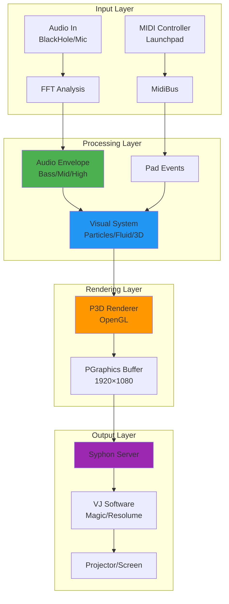

# Processing VJ Visuals Guide - Overview

## Purpose

This guide series teaches you how to create **interactive, living, efficient simulations** in Processing for VJ (Video Jockey) performances. Focus is on P3D rendering, audio reactivity, GPU acceleration, and real-time performance.

## Target Audience

- VJ artists wanting to create custom interactive visuals
- Creative coders building performant real-time graphics
- Live performers needing MIDI-controlled visual systems
- AI agents implementing Processing-based visual systems

## Document Structure

This guide is split into focused modules, each addressing a specific domain:

### Core Foundations
1. **[01-core-concepts.md](01-core-concepts.md)** - Architecture, project setup, lifecycle management
2. **[02-audio-reactivity.md](02-audio-reactivity.md)** - FFT analysis, beat detection, frequency mapping

### Visual Systems
3. **[03-particle-systems.md](03-particle-systems.md)** - From basic particles to GPU-accelerated swarms
4. **[04-fluid-simulations.md](04-fluid-simulations.md)** - Reaction-diffusion, flow fields, PixelFlow integration
5. **[05-3d-rendering.md](05-3d-rendering.md)** - P3D optimization, camera systems, lighting

### Integration & Performance
6. **[06-interactivity.md](06-interactivity.md)** - MIDI/Launchpad, OSC, Syphon output
7. **[07-performance-optimization.md](07-performance-optimization.md)** - Profiling, GPU acceleration, LOD strategies

### Reference
8. **[08-code-patterns.md](08-code-patterns.md)** - Common algorithms, formulas, reusable modules
9. **[09-resources.md](09-resources.md)** - Libraries, tools, external resources, examples

## Reading Order

### For Beginners
Start with: `01 → 02 → 06 → 03 → 05`

This path covers fundamentals, audio basics, hardware integration, and simple visuals before advanced topics.

### For Experienced Developers
Jump directly to domain-specific guides (03-05) or optimization (07).

### For AI Agents
Each guide is structured with:
- **Clear section headings** for easy navigation
- **Code blocks** with complete, runnable examples
- **Mermaid diagrams** for visual architecture understanding
- **Formulas** in both mathematical notation and code
- **Anti-patterns** to avoid common mistakes

## Key Technologies Covered

- **Processing 4.x** (Java mode)
- **P3D renderer** (OpenGL-based 3D)
- **PixelFlow** (GPU-accelerated physics and effects)
- **Minim** / **Sound** (audio analysis)
- **Syphon** (frame sharing for VJ pipeline)
- **The MidiBus** (MIDI controller integration)

## Design Philosophy

### 1. VJ-First Design
All examples are optimized for **live performance**:
- 1920×1080 Full HD output via Syphon
- Black backgrounds for overlay compositing
- No visible UI (pure visuals)
- Real-time responsiveness (60+ FPS target)

### 2. Modular Architecture
Following **"A Philosophy of Software Design"**:
- Deep, narrow modules with clear interfaces
- Information hiding (complexity encapsulated)
- Separation of state and effects
- Explicit lifecycle: `init() → update() → draw() → dispose()`

### 3. GPU Acceleration
Modern VJ visuals demand GPU power:
- Always use `P3D` renderer
- Leverage PixelFlow for physics/particles
- Custom GLSL shaders for advanced effects
- Offload computation to GPU whenever possible

### 4. Audio Reactivity
Music drives the visuals:
- FFT analysis for frequency-based effects
- Beat detection for transient triggers
- Envelope following for smooth modulation
- Multiple frequency bands (bass, mid, high)

## System Architecture



## Performance Targets

| Metric | Target | Acceptable |
|--------|--------|------------|
| Frame rate | 60 FPS | 30+ FPS |
| Particle count (CPU) | 1,000-5,000 | 500+ |
| Particle count (GPU) | 100,000+ | 10,000+ |
| Input latency | <16ms | <33ms |
| Audio to visual lag | <50ms | <100ms |

## Code Style Conventions

### Processing-Specific
- Use `float` for all numeric calculations (not `int` when precision matters)
- Add `f` suffix to float literals in expressions: `0.5f`
- Avoid reserved words as variable names: `color` → `ledColor`
- Use descriptive parameter names (not `from`, `to`, `evt`)

### Java Best Practices
- Classes in PascalCase: `ParticleSystem`
- Methods in camelCase: `updateParticles()`
- Constants in UPPER_SNAKE_CASE: `MAX_PARTICLES`
- Private fields with underscore prefix: `_particles`

### VJ-Specific
- Resolution-independent positioning via `ScreenLayout`
- Guard all MIDI calls with `if (hasLaunchpad && launchpad != null)`
- Always send Syphon at end of `draw()`: `syphon.sendScreen()`
- Use HSB color mode for audio-reactive hue shifts

## Quick Start Template

Every Processing VJ project should start from this template:

```java
import themidibus.*;
import codeanticode.syphon.*;
import processing.sound.*;

// Core services
SyphonServer syphon;
AudioAnalyzer audio;
MidiBus launchpad;
boolean hasLaunchpad = false;

void settings() {
  size(1920, 1080, P3D);  // Full HD, P3D required
}

void setup() {
  // Initialize services
  syphon = new SyphonServer(this, "MyProject");
  audio = new AudioAnalyzer(this);
  initMidi();
  
  // Your initialization
  colorMode(HSB, 360, 100, 100);
}

void draw() {
  // Update audio analysis
  audio.update();
  
  // Your visuals
  background(0);
  // ... draw code ...
  
  // Send to Syphon (always last)
  syphon.sendScreen();
}

void initMidi() {
  String[] inputs = MidiBus.availableInputs();
  for (String dev : inputs) {
    if (dev != null && dev.toLowerCase().contains("launchpad")) {
      try {
        launchpad = new MidiBus(this, dev, dev);
        hasLaunchpad = true;
        println("Launchpad connected: " + dev);
      } catch (Exception e) {
        hasLaunchpad = false;
      }
      break;
    }
  }
}

void noteOn(int channel, int pitch, int velocity) {
  // Handle MIDI input
}

void keyPressed() {
  // Keyboard fallback
}
```

## Navigation

- **Next**: [01-core-concepts.md](01-core-concepts.md) - Core architecture and project setup
- **Jump to**: [03-particle-systems.md](03-particle-systems.md) - Start building visuals immediately
- **Reference**: [08-code-patterns.md](08-code-patterns.md) - Copy-paste ready code modules

---

**Last Updated**: 2024-12 | **Processing Version**: 4.3+ | **Target Resolution**: 1920×1080
