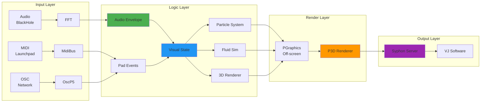
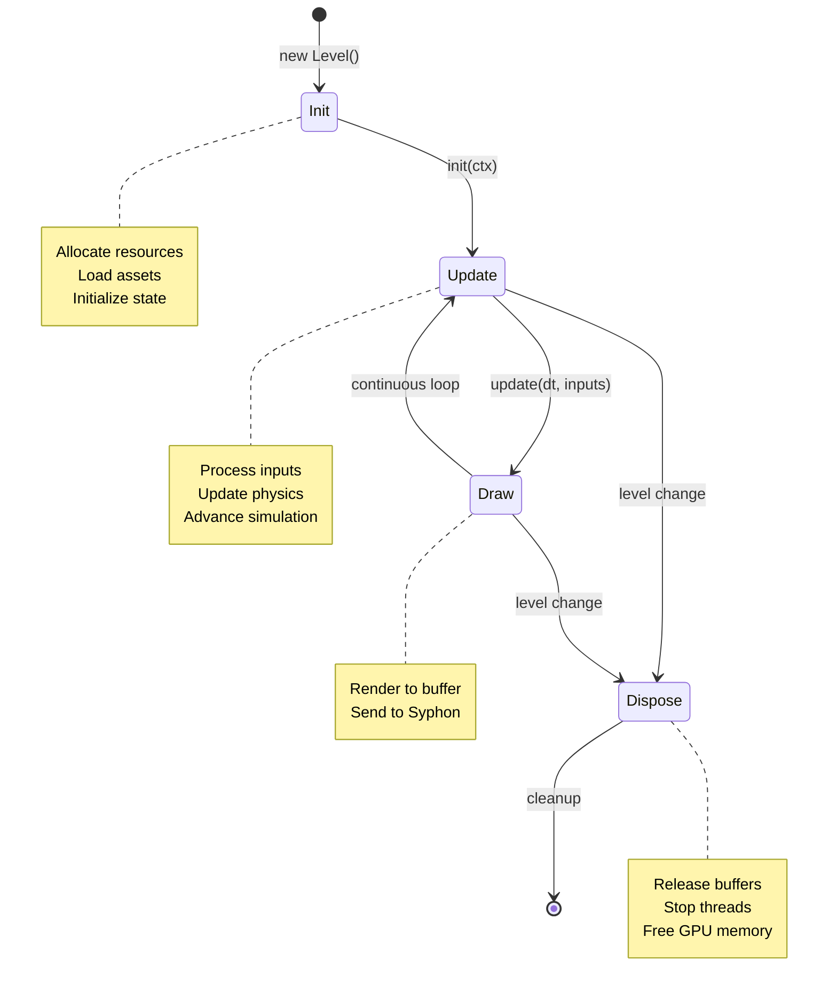
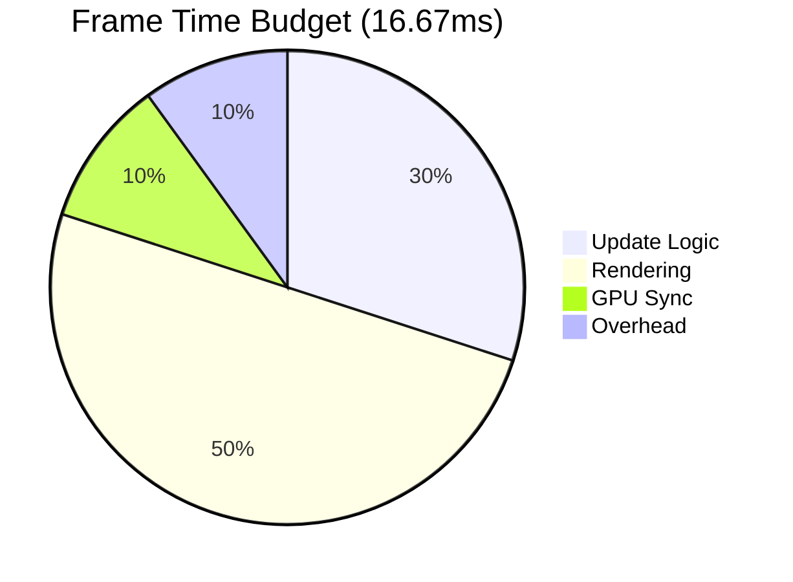

# Core Concepts - Processing VJ Architecture

## Overview

This guide covers the foundational architecture for building performant, modular Processing VJ systems. Focus is on **deep, narrow modules**, **explicit lifecycles**, and **separation of concerns**.

## Table of Contents

1. [System Architecture](#system-architecture)
2. [Module Lifecycle](#module-lifecycle)
3. [Project Setup](#project-setup)
4. [Coordinate Systems](#coordinate-systems)
5. [Frame Budget Management](#frame-budget-management)
6. [Anti-Patterns to Avoid](#anti-patterns-to-avoid)

---

## System Architecture

### Layered Design

Processing VJ applications follow a **layered architecture** separating input, logic, rendering, and output:



### Key Principles

#### 1. Information Hiding
Each module owns its complexity. External code only sees high-level interfaces:

```java
// ❌ BAD: Exposes MIDI internals
void setNote(int channel, int pitch, int velocity) {
  launchpad.sendNoteOn(channel, pitch, velocity);
}

// ✅ GOOD: Hides MIDI complexity
void lightPad(int col, int row, int color) {
  if (!hasLaunchpad) return;
  int note = (row + 1) * 10 + (col + 1);
  launchpad.sendNoteOn(0, note, color);
}
```

#### 2. Deep Interfaces
Expose powerful, simple methods that hide implementation details:

```java
// Shallow interface (requires caller to know internals)
float getBassFFT(int binStart, int binEnd);
float getMidFFT(int binStart, int binEnd);

// Deep interface (hides FFT bin math)
float getBass();  // Returns 0-1, internally handles bin range
float getMid();
float getHigh();
boolean isBeat();  // Encapsulates beat detection algorithm
```

#### 3. State vs Effects
Keep pure calculations separate from I/O operations:

```java
// PURE: Calculation only, no side effects
PVector calculateGravity(PVector pos, PVector attractorPos, float mass) {
  PVector dir = PVector.sub(attractorPos, pos);
  float dist = dir.mag();
  dir.normalize();
  float force = mass / (dist * dist + 1.0f);  // Softening
  return dir.mult(force);
}

// EFFECT: I/O operation
void renderParticle(PGraphics g, Particle p) {
  g.pushMatrix();
  g.translate(p.pos.x, p.pos.y, p.pos.z);
  g.sphere(p.size);
  g.popMatrix();
}

// USAGE: Separate update (pure) from draw (effects)
void update(float dt) {
  for (Particle p : particles) {
    PVector force = calculateGravity(p.pos, well.pos, well.mass);
    p.applyForce(force);  // Pure
    p.update(dt);         // Pure
  }
}

void draw(PGraphics g) {
  for (Particle p : particles) {
    renderParticle(g, p);  // Effect
  }
}
```

---

## Module Lifecycle

All visual modules follow an explicit 4-phase lifecycle:



### Lifecycle Interface

```java
interface Level {
  // Phase 1: Initialization
  void init(SharedContext ctx);
  
  // Phase 2: Update (logic only, no drawing)
  void update(float dt, Inputs inputs);
  
  // Phase 3: Render (drawing only, no logic)
  void draw(PGraphics g);
  
  // Phase 4: Cleanup
  void dispose();
  
  // Metadata
  String getName();
  FSM getFSM();  // Finite state machine for this level
}
```

### Example Implementation

```java
class GravityWellLevel implements Level {
  // Resources allocated in init()
  ArrayList<Particle> particles;
  ArrayList<Well> wells;
  PShader glowShader;
  
  // State
  float hueShift = 0;
  
  public void init(SharedContext ctx) {
    particles = new ArrayList<Particle>();
    wells = new ArrayList<Well>();
    
    // Load GPU resources
    glowShader = loadShader("glow.glsl");
    
    // Spawn initial particles
    for (int i = 0; i < 1000; i++) {
      float x = random(ctx.config.width);
      float y = random(ctx.config.height);
      particles.add(new Particle(x, y));
    }
  }
  
  public void update(float dt, Inputs inputs) {
    // Audio modulation (NO DRAWING HERE)
    hueShift += inputs.midLevel * dt * 60;
    
    // Physics
    for (Particle p : particles) {
      for (Well w : wells) {
        PVector force = w.attract(p.pos);
        p.applyForce(force);
      }
      p.update(dt);
    }
    
    // Handle MIDI events
    for (PadEvent evt : inputs.padEvents) {
      if (evt.velocity > 0) {
        spawnWell(evt.col, evt.row);
      }
    }
  }
  
  public void draw(PGraphics g) {
    g.beginDraw();
    g.background(0, 20);  // Subtle trail
    g.colorMode(HSB, 360, 100, 100);
    g.shader(glowShader);
    
    // Draw particles
    for (Particle p : particles) {
      float hue = (p.hue + hueShift) % 360;
      g.fill(hue, 80, 90, 50);
      g.noStroke();
      g.ellipse(p.pos.x, p.pos.y, 4, 4);
    }
    
    g.endDraw();
  }
  
  public void dispose() {
    particles.clear();
    wells.clear();
    glowShader = null;  // Let GC reclaim
  }
  
  public String getName() { return "Gravity Wells"; }
  public FSM getFSM() { return fsm; }
  
  // Helper (private, not part of lifecycle)
  void spawnWell(int col, int row) {
    ScreenLayout layout = new ScreenLayout(g);
    PVector pos = layout.gridPos(col, row);
    wells.add(new Well(pos.x, pos.y));
  }
}
```

---

## Project Setup

### Directory Structure

```
MyVJProject/
├── MyVJProject.pde          # Main sketch (setup, draw, callbacks)
├── AudioAnalyzer.pde        # Audio analysis module
├── LaunchpadGrid.pde        # MIDI controller module
├── ScreenLayout.pde         # Resolution-independent positioning
├── ParticleSystem.pde       # Visual module
├── data/                    # Assets
│   ├── shaders/
│   │   ├── glow.glsl
│   │   └── blur.glsl
│   ├── images/
│   └── fonts/
└── libraries/               # Auto-managed by Processing
    ├── Syphon/
    ├── themidibus/
    └── pixelflow/
```

### Main Sketch Template

```java
// MyVJProject.pde
import themidibus.*;
import codeanticode.syphon.*;
import processing.sound.*;

// === Core Services (initialized in setup) ===
SyphonServer syphon;
AudioAnalyzer audio;
LaunchpadGrid grid;

// === Visual Modules ===
ParticleSystem particles;

// === Frame timing ===
int lastFrameTime = 0;

void settings() {
  size(1920, 1080, P3D);  // Full HD, P3D required for Syphon
}

void setup() {
  frameRate(60);
  colorMode(HSB, 360, 100, 100);
  
  // Initialize core services
  syphon = new SyphonServer(this, "MyVJProject");
  audio = new AudioAnalyzer(this);
  grid = new LaunchpadGrid(this);
  
  // Initialize visual modules
  particles = new ParticleSystem();
  particles.init();
  
  lastFrameTime = millis();
}

void draw() {
  // Calculate delta time
  int now = millis();
  float dt = (now - lastFrameTime) / 1000.0f;  // Seconds
  lastFrameTime = now;
  
  // Update audio analysis
  audio.update();
  
  // Update visuals (logic only)
  particles.update(dt, audio.getBass(), audio.getMid(), audio.getHigh());
  
  // Render (drawing only)
  background(0);
  particles.draw(g);
  
  // Output to Syphon (always last)
  syphon.sendScreen();
}

// MIDI callbacks
void noteOn(int channel, int pitch, int velocity) {
  grid.handleNoteOn(pitch, velocity);
}

void noteOff(int channel, int pitch, int velocity) {
  grid.handleNoteOff(pitch);
}

// Keyboard fallback
void keyPressed() {
  if (key == 'b' || key == 'B') {
    audio.simulateBass();
  }
  if (key == ' ') {
    particles.explode();
  }
}

// Pad press callback (called by LaunchpadGrid)
void onPadPress(int col, int row, int velocity) {
  particles.spawnAt(col, row, velocity);
}
```

---

## Coordinate Systems

### Processing Default (Screen Space)
- Origin (0,0) at **top-left**
- X increases **rightward**
- Y increases **downward**
- Z increases **away from camera** (into screen)

```java
// Screen space coordinates
rect(100, 50, 200, 150);  // x, y, width, height
```

### Launchpad Grid (Pad Space)
- Pads numbered (col, row) from (0,0) to (7,7)
- Origin (0,0) at **bottom-left** of pad grid
- Note formula: `note = (row + 1) * 10 + (col + 1)`

```java
// Launchpad coordinate system
int note = (row + 1) * 10 + (col + 1);  // (0,0) → note 11
```

### Resolution-Independent (Relative Space)
Use `ScreenLayout` to convert relative (0.0-1.0) to absolute pixels:

```java
ScreenLayout layout = new ScreenLayout(g);

// Center of screen
float cx = layout.centerX();
float cy = layout.centerY();

// 50% across width, 25% down height
float x = layout.relX(0.5f);
float y = layout.relY(0.25f);

// Map Launchpad pad to screen position
PVector pos = layout.gridPos(col, row);
```

### Coordinate Conversion Patterns

```java
// Launchpad pad → Screen position
void spawnAtPad(int col, int row) {
  ScreenLayout layout = new ScreenLayout(g);
  PVector pos = layout.gridPos(col, row);
  particles.add(new Particle(pos.x, pos.y));
}

// Mouse → Launchpad pad (for debugging)
void mousePressed() {
  ScreenLayout layout = new ScreenLayout(g);
  int col = (int)map(mouseX, layout.marginLeft(), layout.marginRight(), 0, 8);
  int row = 7 - (int)map(mouseY, layout.marginTop(), layout.marginBottom(), 0, 8);
  handlePadPress(col, row, 127);
}

// Screen position → Relative (0-1)
float relX = pos.x / width;
float relY = pos.y / height;

// Relative → Screen position
float absX = relX * width;
float absY = relY * height;
```

---

## Frame Budget Management

### 60 FPS Budget
At 60 FPS, you have **16.67ms** per frame. Budget breakdown:



| Phase | Time Budget | Tasks |
|-------|-------------|-------|
| Update | ~5ms | Physics, state changes, input processing |
| Rendering | ~8ms | Drawing, shaders, compositing |
| GPU Sync | ~2ms | Buffer swaps, texture uploads |
| Overhead | ~1.67ms | Framework, GC, OS |

### Profiling Pattern

```java
// Simple profiler
class FrameProfiler {
  long updateStart, updateEnd;
  long drawStart, drawEnd;
  
  void startUpdate() { updateStart = System.nanoTime(); }
  void endUpdate() { updateEnd = System.nanoTime(); }
  void startDraw() { drawStart = System.nanoTime(); }
  void endDraw() { drawEnd = System.nanoTime(); }
  
  void printStats() {
    float updateMs = (updateEnd - updateStart) / 1_000_000.0f;
    float drawMs = (drawEnd - drawStart) / 1_000_000.0f;
    float totalMs = updateMs + drawMs;
    
    println(String.format(
      "Update: %.2fms | Draw: %.2fms | Total: %.2fms | FPS: %.1f",
      updateMs, drawMs, totalMs, frameRate
    ));
  }
}

// Usage in draw()
FrameProfiler profiler = new FrameProfiler();

void draw() {
  profiler.startUpdate();
  // ... update logic ...
  profiler.endUpdate();
  
  profiler.startDraw();
  // ... rendering ...
  profiler.endDraw();
  
  if (frameCount % 60 == 0) {  // Print every second
    profiler.printStats();
  }
}
```

### Budget-Aware LOD

Adjust detail based on frame time:

```java
class AdaptiveLOD {
  float targetFrameTime = 16.67f;  // ms
  int particleCount = 1000;
  int minParticles = 100;
  int maxParticles = 5000;
  
  void update(float actualFrameTime) {
    if (actualFrameTime > targetFrameTime * 1.2f) {
      // Too slow: reduce detail
      particleCount = max(minParticles, particleCount - 100);
    } else if (actualFrameTime < targetFrameTime * 0.8f) {
      // Headroom: increase detail
      particleCount = min(maxParticles, particleCount + 100);
    }
  }
}
```

---

## Anti-Patterns to Avoid

### ❌ 1. Drawing in `update()`
```java
// BAD: Mixing logic and rendering
void update(float dt, Inputs inputs) {
  for (Particle p : particles) {
    p.update(dt);
    ellipse(p.pos.x, p.pos.y, 5, 5);  // ❌ WRONG!
  }
}

// GOOD: Separate concerns
void update(float dt, Inputs inputs) {
  for (Particle p : particles) {
    p.update(dt);  // ✅ Logic only
  }
}

void draw(PGraphics g) {
  g.beginDraw();
  for (Particle p : particles) {
    g.ellipse(p.pos.x, p.pos.y, 5, 5);  // ✅ Rendering only
  }
  g.endDraw();
}
```

### ❌ 2. Hardcoded Pixel Values
```java
// BAD: Breaks at different resolutions
ellipse(960, 540, 100, 100);  // Assumes 1920×1080

// GOOD: Resolution-independent
ScreenLayout layout = new ScreenLayout(g);
float size = layout.scaleMin(0.05f);  // 5% of smallest dimension
ellipse(layout.centerX(), layout.centerY(), size, size);
```

### ❌ 3. Allocating in `draw()`
```java
// BAD: Creates garbage every frame
void draw() {
  ArrayList<Particle> temp = new ArrayList<Particle>();  // ❌ GC pressure
  for (Particle p : particles) {
    if (p.alive) temp.add(p);
  }
}

// GOOD: Reuse containers or use object pooling
ArrayList<Particle> aliveParticles = new ArrayList<Particle>();

void draw() {
  aliveParticles.clear();  // ✅ Reuse existing allocation
  for (Particle p : particles) {
    if (p.alive) aliveParticles.add(p);
  }
}
```

### ❌ 4. Unguarded MIDI Calls
```java
// BAD: Crashes if Launchpad disconnected
void lightPad(int col, int row, int color) {
  launchpad.sendNoteOn(0, gridToNote(col, row), color);  // ❌ NPE risk
}

// GOOD: Always guard external I/O
void lightPad(int col, int row, int color) {
  if (!hasLaunchpad || launchpad == null) return;  // ✅ Safe
  launchpad.sendNoteOn(0, gridToNote(col, row), color);
}
```

### ❌ 5. Missing Syphon Call
```java
// BAD: Visuals not sent to VJ pipeline
void draw() {
  background(0);
  // ... draw amazing visuals ...
  // ❌ Forgot syphon.sendScreen()
}

// GOOD: Always send at end of draw()
void draw() {
  background(0);
  // ... draw amazing visuals ...
  syphon.sendScreen();  // ✅ Send to VJ software
}
```

---

## Summary Checklist

Before starting any Processing VJ project, ensure:

- [ ] Project uses **P3D** renderer (required for Syphon and 3D)
- [ ] Resolution is **1920×1080** Full HD
- [ ] `SyphonServer` initialized and called at end of `draw()`
- [ ] All MIDI calls **guarded** with null checks
- [ ] **Lifecycle methods** clearly separated (init, update, draw, dispose)
- [ ] **ScreenLayout** used for all positioning (no hardcoded pixels)
- [ ] **Frame profiling** added for performance monitoring
- [ ] **Keyboard fallbacks** implemented for testing without hardware

---

**Next**: [02-audio-reactivity.md](02-audio-reactivity.md) - FFT analysis and beat detection

**Reference**: [08-code-patterns.md](08-code-patterns.md) - Copy-paste ready modules
