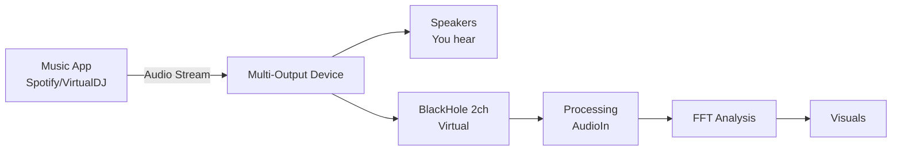
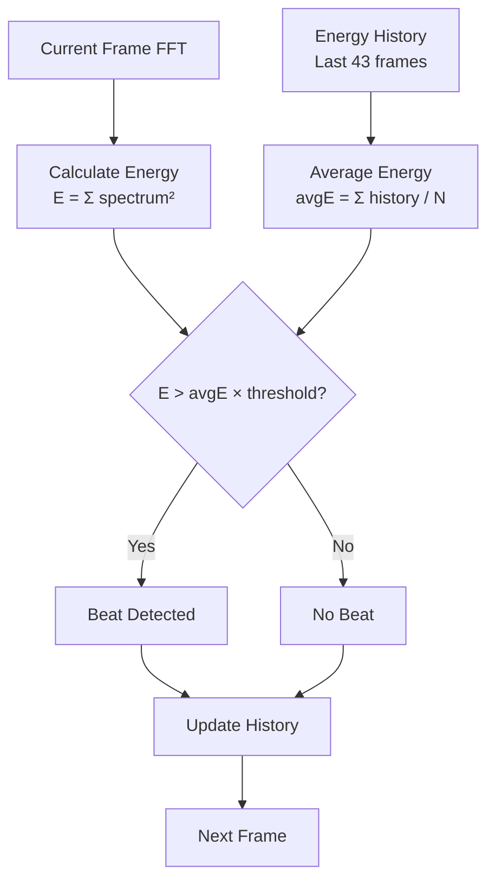

# Audio Reactivity - FFT Analysis & Beat Detection

## Overview

This guide covers audio-reactive techniques for Processing VJ visuals. Learn FFT analysis, beat detection, frequency mapping, and BPM calculation for music-driven graphics.

## Table of Contents

1. [Audio Input Setup](#audio-input-setup)
2. [FFT Frequency Analysis](#fft-frequency-analysis)
3. [Beat Detection Algorithms](#beat-detection-algorithms)
4. [BPM Calculation](#bpm-calculation)
5. [Audio-to-Visual Mapping](#audio-to-visual-mapping)
6. [Complete Audio Analyzer](#complete-audio-analyzer)

---

## Audio Input Setup

### BlackHole Configuration (macOS)

For system audio capture (Spotify, DJ software, etc.):

```bash
# Install BlackHole virtual audio device
brew install blackhole-2ch
```

Then configure Audio MIDI Setup:
1. Open **Audio MIDI Setup** (Applications → Utilities)
2. Create **Multi-Output Device**: Speakers + BlackHole 2ch
3. Set **Aggregate Device** input to BlackHole 2ch
4. In Processing, use device index 0 (system default)



### Processing Sound Library

```java
import processing.sound.*;

class AudioSetup {
  AudioIn input;
  FFT fft;
  Amplitude amp;
  int bands = 512;
  
  AudioSetup(PApplet parent) {
    // Use system default input (BlackHole if configured)
    input = new AudioIn(parent, 0);  // Device 0 = default
    input.start();
    
    // FFT with 512 bands (good balance of resolution vs performance)
    fft = new FFT(parent, bands);
    fft.input(input);
    
    // Overall amplitude detection
    amp = new Amplitude(parent);
    amp.input(input);
  }
  
  void update() {
    fft.analyze();
  }
  
  float getSpectrum(int bin) {
    return fft.spectrum[bin];
  }
  
  float getAmplitude() {
    return amp.analyze();
  }
}
```

---

## FFT Frequency Analysis

### Frequency Bands

FFT divides audio spectrum into bins. Map bins to musical frequency ranges:

```java
class FrequencyBands {
  FFT fft;
  int totalBins = 512;
  
  // Bin ranges for each band (empirically tuned)
  int bassStart = 0, bassEnd = 10;      // ~0-200 Hz (kick, bass)
  int midStart = 10, midEnd = 100;      // ~200-2000 Hz (vocals, snare)
  int highStart = 100, highEnd = 256;   // ~2000+ Hz (hi-hat, cymbals)
  
  FrequencyBands(FFT fft) {
    this.fft = fft;
  }
  
  // Get average energy in frequency band
  float getBass() {
    return getAverageBand(bassStart, bassEnd);
  }
  
  float getMid() {
    return getAverageBand(midStart, midEnd);
  }
  
  float getHigh() {
    return getAverageBand(highStart, highEnd);
  }
  
  // Helper: average FFT bins in range
  float getAverageBand(int start, int end) {
    float sum = 0;
    int count = 0;
    
    for (int i = start; i < min(end, fft.spectrum.length); i++) {
      sum += fft.spectrum[i];
      count++;
    }
    
    return count > 0 ? sum / count : 0;
  }
  
  // Get 8 evenly-spaced bands for Launchpad/visualization
  float[] getEightBands() {
    float[] bands = new float[8];
    int binSize = fft.spectrum.length / 8;
    
    for (int i = 0; i < 8; i++) {
      float sum = 0;
      for (int j = 0; j < binSize; j++) {
        sum += fft.spectrum[i * binSize + j];
      }
      bands[i] = sum / binSize;
    }
    return bands;
  }
}
```

### Frequency-to-Bin Conversion

```java
// Convert Hz to FFT bin number
int freqToBin(float freqHz, int sampleRate, int fftSize) {
  return (int)(freqHz * fftSize / sampleRate);
}

// Example: Find bin for 100 Hz at 44.1kHz sample rate
int bin100Hz = freqToBin(100, 44100, 512);  // ≈ 1
```

### Smoothing FFT Output

Raw FFT is noisy. Apply exponential smoothing:

```java
class SmoothedFFT {
  float[] smoothedSpectrum;
  float smoothing = 0.3f;  // 0 = no smoothing, 1 = infinite smoothing
  
  SmoothedFFT(int bins) {
    smoothedSpectrum = new float[bins];
  }
  
  void update(float[] rawSpectrum) {
    for (int i = 0; i < rawSpectrum.length; i++) {
      smoothedSpectrum[i] = lerp(smoothedSpectrum[i], rawSpectrum[i], smoothing);
    }
  }
  
  float getBand(int bin) {
    return smoothedSpectrum[bin];
  }
}
```

---

## Beat Detection Algorithms

### Energy-Based Beat Detection

Detect beats by comparing instant energy to recent history:



#### Implementation

```java
class BeatDetector {
  FFT fft;
  float[] energyHistory;
  int historySize = 43;  // ~1 second at 60fps (43 / 60 ≈ 0.72s)
  int historyIndex = 0;
  float threshold = 1.4f;  // Energy must be 40% above average
  float beatDecay = 0;     // Cooldown after beat
  boolean isBeat = false;
  
  BeatDetector(FFT fft) {
    this.fft = fft;
    energyHistory = new float[historySize];
  }
  
  void update() {
    // Calculate instant energy (sum of squares)
    float energy = 0;
    for (int i = 0; i < min(100, fft.spectrum.length); i++) {
      energy += fft.spectrum[i] * fft.spectrum[i];
    }
    
    // Calculate average energy from history
    float avgEnergy = 0;
    for (float e : energyHistory) {
      avgEnergy += e;
    }
    avgEnergy /= historySize;
    
    // Detect beat with cooldown
    isBeat = (energy > avgEnergy * threshold) && (beatDecay <= 0);
    
    if (isBeat) {
      beatDecay = 0.15f;  // 150ms cooldown
    }
    beatDecay -= 1.0f / 60.0f;  // Decrease at 60fps
    
    // Store energy in circular history buffer
    energyHistory[historyIndex] = energy;
    historyIndex = (historyIndex + 1) % historySize;
  }
  
  boolean isBeat() {
    return isBeat;
  }
  
  // Get decaying pulse (1.0 at beat, decays to 0)
  float getPulse() {
    return max(0, beatDecay / 0.15f);
  }
}
```

### Frequency-Band Beat Detection

Detect beats in specific bands (kick vs snare vs hi-hat):

```java
class MultiBandBeatDetector {
  float[] bassHistory, midHistory, highHistory;
  int historySize = 43;
  int historyIndex = 0;
  float threshold = 1.3f;
  
  boolean bassHit = false;
  boolean midHit = false;
  boolean highHit = false;
  
  MultiBandBeatDetector() {
    bassHistory = new float[historySize];
    midHistory = new float[historySize];
    highHistory = new float[historySize];
  }
  
  void update(float bassEnergy, float midEnergy, float highEnergy) {
    bassHit = detectBeat(bassEnergy, bassHistory);
    midHit = detectBeat(midEnergy, midHistory);
    highHit = detectBeat(highEnergy, highHistory);
    
    historyIndex = (historyIndex + 1) % historySize;
  }
  
  boolean detectBeat(float energy, float[] history) {
    float avgEnergy = 0;
    for (float e : history) avgEnergy += e;
    avgEnergy /= historySize;
    
    history[historyIndex] = energy;
    
    return energy > avgEnergy * threshold;
  }
}
```

---

## BPM Calculation

### Tap Tempo

Simple BPM estimation from user taps or detected beats:

```java
class TapTempo {
  ArrayList<Long> tapTimes = new ArrayList<Long>();
  float bpm = 120;  // Default
  int maxTaps = 8;
  long resetTime = 2000;  // Reset after 2 seconds
  long lastTap = 0;
  
  void tap() {
    long now = millis();
    
    // Reset if too long since last tap
    if (now - lastTap > resetTime) {
      tapTimes.clear();
    }
    
    tapTimes.add(now);
    lastTap = now;
    
    // Keep only recent taps
    while (tapTimes.size() > maxTaps) {
      tapTimes.remove(0);
    }
    
    // Calculate BPM from intervals
    if (tapTimes.size() >= 2) {
      long totalTime = tapTimes.get(tapTimes.size() - 1) - tapTimes.get(0);
      float avgInterval = (float)totalTime / (tapTimes.size() - 1);
      bpm = 60000.0f / avgInterval;  // Convert ms to BPM
      
      // Clamp to realistic range
      bpm = constrain(bpm, 60, 200);
    }
  }
  
  float getBPM() {
    return bpm;
  }
  
  // Get phase within current beat (0.0-1.0)
  float getPhase() {
    float msPerBeat = 60000.0f / bpm;
    return (millis() % (long)msPerBeat) / msPerBeat;
  }
  
  // Get sawtooth wave synced to BPM
  float getBeatSaw() {
    return getPhase();
  }
  
  // Get sine wave synced to BPM
  float getBeatSine() {
    return sin(getPhase() * TWO_PI);
  }
  
  // Get pulse that decays after beat
  float getBeatPulse() {
    float phase = getPhase();
    return exp(-phase * 5);  // Exponential decay
  }
}
```

### Auto BPM from Beat Detection

```java
class AutoBPM {
  ArrayList<Long> beatTimes = new ArrayList<Long>();
  float bpm = 120;
  
  void recordBeat() {
    beatTimes.add(millis());
    
    // Keep last 8 beats
    while (beatTimes.size() > 8) {
      beatTimes.remove(0);
    }
    
    // Calculate BPM
    if (beatTimes.size() >= 4) {
      ArrayList<Float> intervals = new ArrayList<Float>();
      
      for (int i = 1; i < beatTimes.size(); i++) {
        float interval = beatTimes.get(i) - beatTimes.get(i - 1);
        
        // Filter outliers (30-200 BPM range)
        if (interval > 300 && interval < 2000) {
          intervals.add(interval);
        }
      }
      
      if (intervals.size() > 0) {
        float avgInterval = 0;
        for (float i : intervals) avgInterval += i;
        avgInterval /= intervals.size();
        
        bpm = 60000.0f / avgInterval;
        bpm = constrain(bpm, 60, 200);
      }
    }
  }
}
```

---

## Audio-to-Visual Mapping

### Common Mapping Patterns

```java
// Bass → Size/Scale (impact)
float size = baseSize * (1.0f + bassLevel * 0.5f);

// Mid → Hue (color shift)
hueShift += midLevel * dt * 60;  // Degrees per second
float hue = (baseHue + hueShift) % 360;

// High → Brightness/Sparkle
float brightness = 70 + highLevel * 30;  // 70-100%

// Beat → Impulse
if (beatDetector.isBeat()) {
  particles.explode();
  flashIntensity = 1.0f;
}
flashIntensity *= 0.95f;  // Decay

// BPM → Animation Speed
float animSpeed = bpm / 120.0f;  // Relative to 120 BPM
rotation += animSpeed * dt * TWO_PI;
```

### Threshold-Based Triggering

```java
// Only react above minimum level
if (bassLevel > 0.1f) {
  float force = map(bassLevel, 0.1f, 1.0f, 0, 10);
  particles.applyGlobalForce(force);
}

// Stepped reactions
if (highLevel > 0.8f) {
  spawnIntenseSpark();
} else if (highLevel > 0.5f) {
  spawnNormalSpark();
} else if (highLevel > 0.2f) {
  spawnSubtleSpark();
}
```

### Smoothing for Organic Motion

```java
class SmoothedAudioReactive {
  float bassSmooth = 0;
  float midSmooth = 0;
  float highSmooth = 0;
  float smoothing = 0.3f;  // 0.1-0.5 typical range
  
  void update(float bass, float mid, float high) {
    bassSmooth = lerp(bassSmooth, bass, smoothing);
    midSmooth = lerp(midSmooth, mid, smoothing);
    highSmooth = lerp(highSmooth, high, smoothing);
  }
  
  // Use smoothed values for visuals
  float getSize() {
    return baseSize * (1.0f + bassSmooth * 0.5f);
  }
  
  float getHue() {
    return (baseHue + midSmooth * 180) % 360;
  }
  
  float getBrightness() {
    return 70 + highSmooth * 30;
  }
}
```

---

## Complete Audio Analyzer

Production-ready audio module with all features:

```java
import processing.sound.*;

class AudioAnalyzer {
  AudioIn input;
  FFT fft;
  Amplitude amp;
  
  // FFT analysis
  float bassLevel = 0;
  float midLevel = 0;
  float highLevel = 0;
  float overallLevel = 0;
  
  // Beat detection
  BeatDetector beatDetector;
  TapTempo tapTempo;
  
  // Smoothing
  float smoothing = 0.3f;
  float bassSmooth = 0;
  float midSmooth = 0;
  float highSmooth = 0;
  
  AudioAnalyzer(PApplet parent) {
    try {
      input = new AudioIn(parent, 0);
      input.start();
      
      fft = new FFT(parent, 512);
      fft.input(input);
      
      amp = new Amplitude(parent);
      amp.input(input);
      
      beatDetector = new BeatDetector(fft);
      tapTempo = new TapTempo();
      
      println("Audio analyzer initialized");
    } catch (Exception e) {
      println("Audio init failed: " + e.getMessage());
      println("Configure BlackHole as system input");
    }
  }
  
  void update() {
    if (fft == null) return;
    
    fft.analyze();
    
    // Calculate frequency bands
    float newBass = calculateBandEnergy(0, 10);
    float newMid = calculateBandEnergy(10, 100);
    float newHigh = calculateBandEnergy(100, 256);
    
    // Smooth values
    bassLevel = lerp(bassSmooth, newBass, smoothing);
    midLevel = lerp(midSmooth, newMid, smoothing);
    highLevel = lerp(highSmooth, newHigh, smoothing);
    
    bassSmooth = bassLevel;
    midSmooth = midLevel;
    highSmooth = highLevel;
    
    overallLevel = amp.analyze();
    
    // Update beat detection
    beatDetector.update();
    if (beatDetector.isBeat()) {
      tapTempo.tap();
    }
  }
  
  float calculateBandEnergy(int start, int end) {
    float energy = 0;
    int count = 0;
    
    for (int i = start; i < min(end, fft.spectrum.length); i++) {
      energy += fft.spectrum[i];
      count++;
    }
    
    return count > 0 ? energy / count : 0;
  }
  
  // Public API
  float getBass() { return bassLevel * 10; }  // Scale to 0-10
  float getMid() { return midLevel * 10; }
  float getHigh() { return highLevel * 10; }
  float getLevel() { return overallLevel; }
  boolean isBeat() { return beatDetector.isBeat(); }
  float getBeatPulse() { return beatDetector.getPulse(); }
  float getBPM() { return tapTempo.getBPM(); }
  float getBeatPhase() { return tapTempo.getPhase(); }
  
  // Get spectrum for visualization
  float[] getSpectrum() {
    if (fft == null) return new float[8];
    
    float[] bands = new float[8];
    int binSize = fft.spectrum.length / 8;
    
    for (int i = 0; i < 8; i++) {
      float sum = 0;
      for (int j = 0; j < binSize; j++) {
        sum += fft.spectrum[i * binSize + j];
      }
      bands[i] = sum / binSize;
    }
    return bands;
  }
  
  // Manual control for testing
  void simulateBass() { bassSmooth = 1.0f; }
  void simulateMid() { midSmooth = 1.0f; }
  void simulateHigh() { highSmooth = 1.0f; }
  void simulateBeat() { beatDetector.isBeat = true; }
}
```

---

## Summary

### Key Formulas

```
FFT Bin → Frequency:  freq = bin × sampleRate / fftSize
Energy:               E = Σ(spectrum[i]²)
Beat Detection:       isBeat = E > avgE × threshold
BPM:                  BPM = 60000 / avgInterval_ms
Phase:                phase = (currentTime % beatDuration) / beatDuration
```

### Best Practices

- **Smoothing**: Use `lerp()` with 0.2-0.4 smoothing factor for organic motion
- **Thresholds**: Ignore audio below ~0.1 to filter noise
- **Beat Cooldown**: Prevent double-triggers with 100-200ms cooldown
- **BPM Range**: Clamp to 60-200 BPM to filter errors
- **Testing**: Add keyboard shortcuts to simulate audio (B, M, H, SPACE)

---

**Next**: [03-particle-systems.md](03-particle-systems.md) - Build audio-reactive particles

**Previous**: [01-core-concepts.md](01-core-concepts.md) - Core architecture
