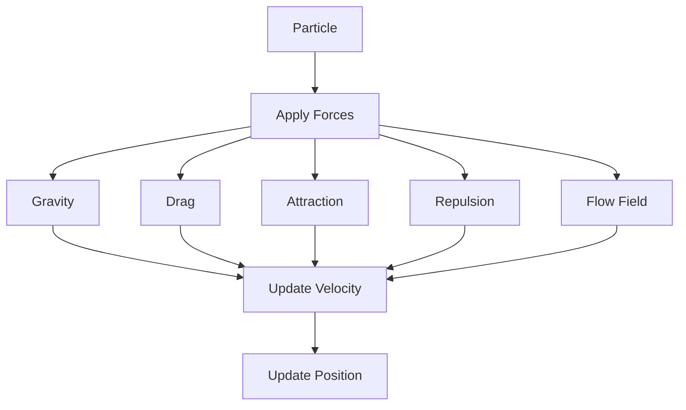

# Particle Systems - From Basic to GPU-Accelerated

## Overview

Particle systems are the foundation of dynamic VJ visuals. This guide covers CPU-based particles, GPU acceleration with PixelFlow, and advanced techniques for creating living, responsive visual effects.

## Table of Contents

1. [Basic Particle System](#basic-particle-system)
2. [Forces and Physics](#forces-and-physics)
3. [Particle Emitters](#particle-emitters)
4. [GPU Acceleration with PixelFlow](#gpu-acceleration-with-pixelflow)
5. [Advanced Techniques](#advanced-techniques)
6. [Audio-Reactive Particles](#audio-reactive-particles)

---

## Basic Particle System

### Simple Particle Class

```java
class Particle {
  PVector pos;      // Position
  PVector vel;      // Velocity
  PVector acc;      // Acceleration
  float life;       // 0-1, decreases over time
  float maxLife;    // Initial lifetime
  float size;       // Particle radius
  float hue;        // HSB hue value
  
  Particle(float x, float y) {
    pos = new PVector(x, y);
    vel = PVector.random2D().mult(random(1, 3));
    acc = new PVector(0, 0);
    life = 1.0f;
    maxLife = random(1, 3);  // 1-3 seconds
    size = random(2, 6);
    hue = random(360);
  }
  
  void update(float dt) {
    // Physics integration (Euler method)
    vel.add(PVector.mult(acc, dt));
    pos.add(PVector.mult(vel, dt * 60));  // Scale for 60fps baseline
    
    // Decay
    life -= dt / maxLife;
    
    // Reset acceleration each frame
    acc.mult(0);
  }
  
  void applyForce(PVector force) {
    acc.add(force);
  }
  
  void display(PGraphics g) {
    float alpha = life * 100;  // Fade out as life decreases
    g.fill(hue, 80, 90, alpha);
    g.noStroke();
    g.ellipse(pos.x, pos.y, size, size);
  }
  
  boolean isDead() {
    return life <= 0;
  }
}
```

### Particle System Manager

```java
class ParticleSystem {
  ArrayList<Particle> particles;
  int maxParticles = 1000;
  
  ParticleSystem() {
    particles = new ArrayList<Particle>();
  }
  
  void update(float dt) {
    // Update all particles
    for (int i = particles.size() - 1; i >= 0; i--) {
      Particle p = particles.get(i);
      p.update(dt);
      
      // Remove dead particles
      if (p.isDead()) {
        particles.remove(i);
      }
    }
  }
  
  void display(PGraphics g) {
    for (Particle p : particles) {
      p.display(g);
    }
  }
  
  void addParticle(float x, float y) {
    if (particles.size() < maxParticles) {
      particles.add(new Particle(x, y));
    }
  }
  
  void burst(float x, float y, int count) {
    for (int i = 0; i < count; i++) {
      addParticle(x, y);
    }
  }
  
  int count() {
    return particles.size();
  }
}
```

### Usage Example

```java
ParticleSystem system;

void setup() {
  size(1920, 1080, P3D);
  colorMode(HSB, 360, 100, 100);
  system = new ParticleSystem();
}

void draw() {
  background(0, 20);  // Trail effect
  
  float dt = 1.0f / frameRate;
  system.update(dt);
  system.display(g);
  
  // Spawn particles at mouse
  if (mousePressed) {
    system.burst(mouseX, mouseY, 5);
  }
  
  // Debug info
  fill(255);
  text("Particles: " + system.count(), 20, 30);
  text("FPS: " + (int)frameRate, 20, 50);
}
```

---

## Forces and Physics

### Common Force Patterns



### Gravity

```java
class Gravity {
  PVector force;
  
  Gravity(float strength) {
    force = new PVector(0, strength);  // Downward
  }
  
  void apply(Particle p) {
    p.applyForce(force);
  }
}

// Usage
Gravity gravity = new Gravity(9.8f);
for (Particle p : particles) {
  gravity.apply(p);
}
```

### Drag (Air Resistance)

```java
void applyDrag(Particle p, float coefficient) {
  // Drag force = -coefficient × velocity²
  float speed = p.vel.mag();
  float dragMagnitude = coefficient * speed * speed;
  
  PVector drag = p.vel.copy();
  drag.normalize();
  drag.mult(-dragMagnitude);
  
  p.applyForce(drag);
}

// Usage
for (Particle p : particles) {
  applyDrag(p, 0.01f);
}
```

### Attraction (Gravity Wells)

```java
class Attractor {
  PVector pos;
  float mass;
  float maxForce = 5.0f;
  
  Attractor(float x, float y, float mass) {
    this.pos = new PVector(x, y);
    this.mass = mass;
  }
  
  PVector attract(Particle p) {
    PVector force = PVector.sub(pos, p.pos);
    float distance = force.mag();
    distance = constrain(distance, 5, 100);  // Prevent extreme forces
    
    force.normalize();
    float strength = (mass * p.size) / (distance * distance);
    strength = constrain(strength, 0, maxForce);
    force.mult(strength);
    
    return force;
  }
}

// Usage
Attractor well = new Attractor(width/2, height/2, 100);
for (Particle p : particles) {
  PVector force = well.attract(p);
  p.applyForce(force);
}
```

### Repulsion (Electric Charge)

```java
void applyRepulsion(Particle p1, Particle p2, float strength) {
  PVector force = PVector.sub(p1.pos, p2.pos);
  float distance = force.mag();
  
  if (distance < 50 && distance > 0) {  // Only repel if close
    force.normalize();
    float repulsion = strength / (distance * distance);
    force.mult(repulsion);
    p1.applyForce(force);
    
    force.mult(-1);  // Equal and opposite
    p2.applyForce(force);
  }
}

// Usage: Check all particle pairs (expensive!)
for (int i = 0; i < particles.size(); i++) {
  for (int j = i + 1; j < particles.size(); j++) {
    applyRepulsion(particles.get(i), particles.get(j), 10);
  }
}
```

### Perlin Flow Field

```java
class FlowField {
  PVector[][] field;
  int cols, rows;
  float resolution = 20;  // Grid spacing
  float noiseScale = 0.1f;
  float timeOffset = 0;
  
  FlowField(int w, int h) {
    cols = (int)(w / resolution) + 1;
    rows = (int)(h / resolution) + 1;
    field = new PVector[cols][rows];
    
    generateField();
  }
  
  void generateField() {
    for (int x = 0; x < cols; x++) {
      for (int y = 0; y < rows; y++) {
        float angle = noise(x * noiseScale, y * noiseScale, timeOffset) * TWO_PI * 2;
        field[x][y] = PVector.fromAngle(angle);
      }
    }
  }
  
  void update(float dt) {
    timeOffset += dt * 0.1f;  // Animate field
    generateField();
  }
  
  PVector lookup(PVector pos) {
    int col = (int)constrain(pos.x / resolution, 0, cols - 1);
    int row = (int)constrain(pos.y / resolution, 0, rows - 1);
    return field[col][row].copy();
  }
  
  void apply(Particle p, float strength) {
    PVector force = lookup(p.pos);
    force.mult(strength);
    p.applyForce(force);
  }
}

// Usage
FlowField field = new FlowField(width, height);

void draw() {
  float dt = 1.0f / frameRate;
  field.update(dt);
  
  for (Particle p : particles) {
    field.apply(p, 0.5f);
  }
}
```

---

## Particle Emitters

### Continuous Emitter

```java
class Emitter {
  PVector pos;
  float rate;  // Particles per second
  float accumulator = 0;
  float angle = 0;
  float spread = PI / 4;  // Cone angle
  
  Emitter(float x, float y, float rate) {
    this.pos = new PVector(x, y);
    this.rate = rate;
  }
  
  void emit(ParticleSystem system, float dt) {
    accumulator += dt * rate;
    
    // Spawn particles
    while (accumulator >= 1.0f) {
      Particle p = new Particle(pos.x, pos.y);
      
      // Velocity in cone direction
      float emitAngle = angle + random(-spread, spread);
      p.vel = PVector.fromAngle(emitAngle).mult(random(50, 100));
      
      system.particles.add(p);
      accumulator -= 1.0f;
    }
  }
  
  void setDirection(float angle) {
    this.angle = angle;
  }
}

// Usage
Emitter emitter = new Emitter(width/2, height, 100);  // 100 particles/sec
emitter.setDirection(-HALF_PI);  // Shoot upward

void draw() {
  float dt = 1.0f / frameRate;
  emitter.emit(system, dt);
}
```

### Explosion Emitter

```java
void explode(float x, float y, int count, float speed) {
  for (int i = 0; i < count; i++) {
    Particle p = new Particle(x, y);
    
    // Random direction
    float angle = random(TWO_PI);
    p.vel = PVector.fromAngle(angle).mult(random(speed * 0.5f, speed));
    
    // Varied properties
    p.hue = random(360);
    p.size = random(3, 8);
    p.maxLife = random(0.5f, 2.0f);
    
    particles.add(p);
  }
}

// Usage: Explode on beat
if (audio.isBeat()) {
  explode(random(width), random(height), 100, 150);
}
```

---

## GPU Acceleration with PixelFlow

For 100,000+ particles, use GPU acceleration:

### Installing PixelFlow

1. Download from [diwi.github.io/PixelFlow](https://diwi.github.io/PixelFlow/)
2. Extract to `Processing/libraries/pixelflow/`
3. Restart Processing

### Basic PixelFlow Particles

```java
import com.thomasdiewald.pixelflow.java.DwPixelFlow;
import com.thomasdiewald.pixelflow.java.flowfieldparticles.DwFlowFieldParticles;

DwPixelFlow context;
DwFlowFieldParticles particles;

void setup() {
  size(1920, 1080, P2D);  // Must use P2D for PixelFlow
  
  context = new DwPixelFlow(this);
  context.print();
  
  particles = new DwFlowFieldParticles(context, 200000);  // 200k particles!
  
  // Configure
  particles.param.size_display   = 5f;
  particles.param.size_collision = 5f;
  particles.param.size_cohesion  = 10f;
  particles.param.mul_coh        = 0.50f;
  particles.param.mul_col        = 1.00f;
  particles.param.mul_obs        = 2.00f;
  
  // Spawn initial particles
  particles.spawn(width/2, height/2, 100000);
}

void draw() {
  background(0);
  
  // Update and render
  particles.update(g);
  particles.display(g);
}

void mousePressed() {
  particles.spawn(mouseX, mouseY, 5000);
}
```

### PixelFlow Fluid + Particles

```java
import com.thomasdiewald.pixelflow.java.DwPixelFlow;
import com.thomasdiewald.pixelflow.java.fluid.DwFluid2D;
import com.thomasdiewald.pixelflow.java.flowfieldparticles.DwFlowFieldParticles;

DwPixelFlow context;
DwFluid2D fluid;
DwFlowFieldParticles particles;

void setup() {
  size(1920, 1080, P2D);
  
  context = new DwPixelFlow(this);
  
  // Fluid simulation
  fluid = new DwFluid2D(context, width, height, 1);
  fluid.param.dissipation_density     = 0.99f;
  fluid.param.dissipation_velocity    = 0.99f;
  fluid.param.dissipation_temperature = 0.80f;
  fluid.param.vorticity               = 0.10f;
  
  // Particles following fluid
  particles = new DwFlowFieldParticles(context, 150000);
}

void draw() {
  // Update fluid
  fluid.update();
  
  // Render fluid as background
  fluid.renderFluidTextures(g, 0);
  
  // Particles follow fluid velocity field
  particles.update(fluid.tex_velocity);
  particles.display(g);
}

void addFluidForce(float x, float y, float vx, float vy) {
  float radius = 50;
  fluid.addDensity (x, y, radius, 1.0f, 0.5f, 0.2f, 1.0f);
  fluid.addVelocity(x, y, radius, vx, vy);
  
  particles.spawn(x, y, 500);
}

void mouseDragged() {
  float vx = (mouseX - pmouseX) * 2;
  float vy = (mouseY - pmouseY) * 2;
  addFluidForce(mouseX, mouseY, vx, vy);
}
```

### Performance Comparison

| Method | Particle Count | FPS @ 1080p |
|--------|----------------|-------------|
| CPU (basic) | 1,000 | 60 |
| CPU (optimized) | 5,000 | 60 |
| PixelFlow GPU | 100,000 | 60 |
| PixelFlow GPU | 500,000 | 30 |

---

## Advanced Techniques

### Object Pooling

Reuse particle objects instead of allocating new ones:

```java
class ParticlePool {
  ArrayList<Particle> active;
  ArrayList<Particle> inactive;
  int poolSize;
  
  ParticlePool(int size) {
    poolSize = size;
    active = new ArrayList<Particle>();
    inactive = new ArrayList<Particle>();
    
    // Pre-allocate particles
    for (int i = 0; i < poolSize; i++) {
      inactive.add(new Particle(0, 0));
    }
  }
  
  Particle spawn(float x, float y) {
    Particle p;
    
    if (inactive.size() > 0) {
      // Reuse inactive particle
      p = inactive.remove(inactive.size() - 1);
      p.reset(x, y);
    } else {
      // Pool exhausted, create new
      p = new Particle(x, y);
    }
    
    active.add(p);
    return p;
  }
  
  void update(float dt) {
    for (int i = active.size() - 1; i >= 0; i--) {
      Particle p = active.get(i);
      p.update(dt);
      
      if (p.isDead()) {
        active.remove(i);
        inactive.add(p);  // Return to pool
      }
    }
  }
}

// Add to Particle class:
void reset(float x, float y) {
  pos.set(x, y);
  vel = PVector.random2D().mult(random(1, 3));
  acc.set(0, 0);
  life = 1.0f;
  maxLife = random(1, 3);
}
```

### Spatial Hashing (Efficient Collision)

```java
class SpatialHash {
  HashMap<Integer, ArrayList<Particle>> grid;
  float cellSize;
  
  SpatialHash(float cellSize) {
    this.cellSize = cellSize;
    grid = new HashMap<Integer, ArrayList<Particle>>();
  }
  
  int hash(float x, float y) {
    int ix = (int)(x / cellSize);
    int iy = (int)(y / cellSize);
    return ix + iy * 10000;  // Assuming grid < 10000 wide
  }
  
  void clear() {
    for (ArrayList<Particle> cell : grid.values()) {
      cell.clear();
    }
  }
  
  void insert(Particle p) {
    int key = hash(p.pos.x, p.pos.y);
    ArrayList<Particle> cell = grid.get(key);
    
    if (cell == null) {
      cell = new ArrayList<Particle>();
      grid.put(key, cell);
    }
    
    cell.add(p);
  }
  
  ArrayList<Particle> getNearby(Particle p) {
    ArrayList<Particle> nearby = new ArrayList<Particle>();
    
    // Check current cell and 8 neighbors
    for (int dx = -1; dx <= 1; dx++) {
      for (int dy = -1; dy <= 1; dy++) {
        float x = p.pos.x + dx * cellSize;
        float y = p.pos.y + dy * cellSize;
        int key = hash(x, y);
        
        ArrayList<Particle> cell = grid.get(key);
        if (cell != null) {
          nearby.addAll(cell);
        }
      }
    }
    
    return nearby;
  }
}

// Usage
SpatialHash spatial = new SpatialHash(50);  // 50px cells

void draw() {
  spatial.clear();
  
  // Insert all particles
  for (Particle p : particles) {
    spatial.insert(p);
  }
  
  // Check collisions only with nearby particles
  for (Particle p : particles) {
    ArrayList<Particle> nearby = spatial.getNearby(p);
    for (Particle other : nearby) {
      if (p != other) {
        applyRepulsion(p, other, 5);
      }
    }
  }
}
```

---

## Audio-Reactive Particles

### Complete Audio-Reactive Example

```java
import processing.sound.*;
import codeanticode.syphon.*;

SyphonServer syphon;
AudioAnalyzer audio;
ParticleSystem system;

// Audio-reactive parameters
float bassBoost = 0;
float hueShift = 0;

void setup() {
  size(1920, 1080, P3D);
  colorMode(HSB, 360, 100, 100);
  
  syphon = new SyphonServer(this, "AudioParticles");
  audio = new AudioAnalyzer(this);
  system = new ParticleSystem();
}

void draw() {
  float dt = 1.0f / frameRate;
  
  // Update audio
  audio.update();
  
  // Audio → Visual mapping
  bassBoost = lerp(bassBoost, audio.getBass() * 0.1f, 0.3f);
  hueShift += audio.getMid() * dt * 60;
  
  // Background with trail
  fill(0, 20);
  rect(0, 0, width, height);
  
  // Bass → particle spawning
  if (audio.getBass() > 0.3f) {
    int count = (int)map(audio.getBass(), 0.3f, 1.0f, 5, 50);
    system.burst(random(width), random(height), count);
  }
  
  // Beat → explosion at center
  if (audio.isBeat()) {
    explode(width/2, height/2, 200, 200);
  }
  
  // Update particles
  system.update(dt);
  
  // Apply global forces (audio-modulated)
  PVector gravity = new PVector(0, 9.8f * (1.0f + bassBoost));
  for (Particle p : system.particles) {
    p.applyForce(gravity);
    
    // High frequencies → sparkle
    if (audio.getHigh() > 0.5f) {
      PVector jitter = PVector.random2D().mult(audio.getHigh() * 10);
      p.applyForce(jitter);
    }
  }
  
  // Draw with audio-reactive hue
  for (Particle p : system.particles) {
    float hue = (p.hue + hueShift) % 360;
    float brightness = 70 + audio.getHigh() * 30;
    
    fill(hue, 80, brightness, p.life * 100);
    noStroke();
    ellipse(p.pos.x, p.pos.y, p.size, p.size);
  }
  
  syphon.sendScreen();
}

void explode(float x, float y, int count, float speed) {
  for (int i = 0; i < count; i++) {
    Particle p = new Particle(x, y);
    float angle = random(TWO_PI);
    p.vel = PVector.fromAngle(angle).mult(random(speed));
    p.hue = (hueShift + random(-30, 30)) % 360;
    system.particles.add(p);
  }
}

void keyPressed() {
  if (key == 'b') audio.simulateBass();
  if (key == ' ') audio.simulateBeat();
}
```

---

## Summary

### Performance Tips

- **CPU Particles**: 1,000-5,000 max at 60 FPS
- **GPU Particles (PixelFlow)**: 100,000+ at 60 FPS
- **Use object pooling** to avoid GC pauses
- **Spatial hashing** for O(n) collision instead of O(n²)
- **Limit forces** with `constrain()` to prevent explosions
- **Trail effect** with semi-transparent background (10-30 alpha)

### Best Practices

- Always use **delta time (dt)** for frame-rate independent motion
- **Smooth audio values** with `lerp()` for organic reactions
- **Separate update and draw** (never mix physics and rendering)
- **Test keyboard fallbacks** (B=bass, M=mid, H=high, SPACE=beat)
- **Monitor particle count** and adjust dynamically for performance

---

**Next**: [04-fluid-simulations.md](04-fluid-simulations.md) - Reaction-diffusion and flow fields

**Previous**: [02-audio-reactivity.md](02-audio-reactivity.md) - Audio analysis
