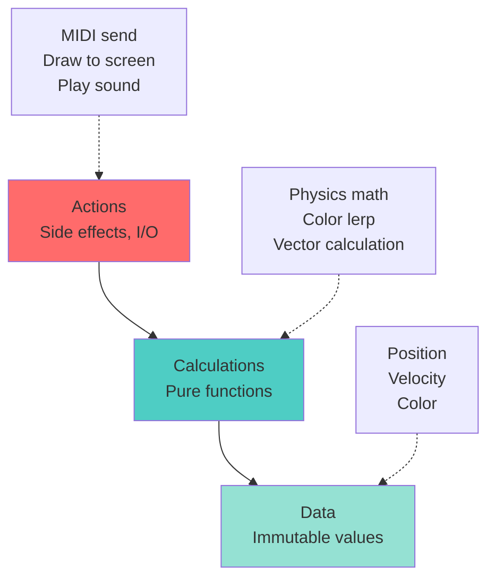
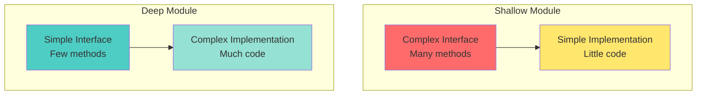

# Design Philosophy - Grokking Simplicity & Deep Modules

## Overview

This guide applies principles from **"Grokking Simplicity"** by Eric Normand and **"A Philosophy of Software Design"** by John Ousterhout to Processing VJ development. Focus on pure functions, deep narrow modules, and separating calculations from effects.

## Table of Contents

1. [Grokking Simplicity Principles](#grokking-simplicity-principles)
2. [Deep and Narrow Modules](#deep-and-narrow-modules)
3. [Information Hiding](#information-hiding)
4. [Worked Examples](#worked-examples)

---

## Grokking Simplicity Principles

### The Three Layers of Code

Eric Normand's **"Grokking Simplicity"** divides code into three layers:



#### 1. Data (Immutable Values)

Data is just information - no behavior:

```java
// ✅ GOOD: Data class (no methods, just values)
class ParticleData {
  PVector pos;
  PVector vel;
  float hue;
  float life;
  
  ParticleData(float x, float y) {
    pos = new PVector(x, y);
    vel = PVector.random2D().mult(2);
    hue = random(360);
    life = 1.0f;
  }
}

// ❌ BAD: Mixing data and behavior
class Particle {
  PVector pos;
  void update() { /* ... */ }  // Behavior mixed with data
  void draw() { /* ... */ }    // Actions mixed with data
}
```

#### 2. Calculations (Pure Functions)

Calculations take data in, return data out. **No side effects**.

```java
// ✅ PURE: Calculation only
PVector calculateGravity(PVector pos, PVector attractorPos, float mass) {
  PVector dir = PVector.sub(attractorPos, pos);
  float dist = dir.mag();
  dir.normalize();
  float softeningConstant = 1.0f;
  float force = mass / (dist * dist + softeningConstant);
  return dir.mult(force);
}

// ✅ PURE: Physics integration
PVector updateVelocity(PVector currentVel, PVector force, float dt) {
  return PVector.add(currentVel, PVector.mult(force, dt));
}

// ✅ PURE: Position update
PVector updatePosition(PVector currentPos, PVector velocity, float dt) {
  return PVector.add(currentPos, PVector.mult(velocity, dt * 60));
}

// ❌ IMPURE: Modifies global state
void applyForce(PVector force) {
  velocity.add(force);  // Side effect: mutates velocity
}
```

#### 3. Actions (Side Effects)

Actions interact with the outside world - I/O, rendering, network, etc.

```java
// ✅ ACTION: Clearly separated
void renderParticle(PGraphics g, PVector pos, float hue, float size, float alpha) {
  g.fill(hue, 80, 90, alpha);
  g.noStroke();
  g.ellipse(pos.x, pos.y, size, size);
}

// ✅ ACTION: MIDI output
void sendPadLight(MidiBus midi, int col, int row, int color) {
  if (midi == null) return;
  int note = (row + 1) * 10 + (col + 1);
  midi.sendNoteOn(0, note, color);
}

// ✅ ACTION: OSC broadcast
void broadcastAudioState(OscP5 osc, NetAddress dest, float bass, float mid, float high) {
  OscMessage msg = new OscMessage("/audio/state");
  msg.add(bass);
  msg.add(mid);
  msg.add(high);
  osc.send(msg, dest);
}
```

### Separating Calculations from Actions

The key insight: **keep calculations pure**, **push actions to the edges**.

```java
// ❌ BAD: Mixed calculations and actions
void update() {
  for (Particle p : particles) {
    // Calculation mixed with action
    PVector force = calculateForce(p.pos);
    p.vel.add(force);  // Mutation
    p.pos.add(p.vel);  // Mutation
    
    // Drawing mixed with logic
    ellipse(p.pos.x, p.pos.y, 5, 5);  // ACTION
  }
}

// ✅ GOOD: Separated calculations and actions
void update(float dt) {
  // PURE calculations only
  for (int i = 0; i < particles.size(); i++) {
    ParticleData p = particles.get(i);
    
    // Calculate new state (pure)
    PVector force = calculateGravity(p.pos, wellPos, wellMass);
    PVector newVel = updateVelocity(p.vel, force, dt);
    PVector newPos = updatePosition(p.pos, newVel, dt);
    float newLife = p.life - dt / p.maxLife;
    
    // Create new data (functional style)
    ParticleData updated = new ParticleData(newPos.x, newPos.y);
    updated.vel = newVel;
    updated.life = newLife;
    updated.hue = p.hue;
    
    particles.set(i, updated);
  }
}

void draw(PGraphics g) {
  // ACTIONS only
  g.beginDraw();
  for (ParticleData p : particles) {
    renderParticle(g, p.pos, p.hue, 5, p.life * 100);
  }
  g.endDraw();
}
```

### Benefits of This Separation

1. **Testability**: Pure functions are trivial to test
2. **Reusability**: Calculations work anywhere
3. **Reasoning**: No hidden state changes
4. **Performance**: Easier to parallelize pure functions
5. **Debugging**: Actions are isolated, calculations are deterministic

---

## Deep and Narrow Modules

John Ousterhout's **"A Philosophy of Software Design"** advocates for **deep interfaces** - powerful, simple APIs that hide complex implementation.

### Shallow vs Deep Modules



### Shallow Module (❌ Bad)

```java
// ❌ SHALLOW: Exposes all internal complexity
class AudioAnalyzer {
  FFT fft;
  
  // Too many public methods, each doing little
  float[] getRawSpectrum() { return fft.spectrum; }
  int getBinCount() { return fft.spectrum.length; }
  float getBin(int i) { return fft.spectrum[i]; }
  float getFrequencyForBin(int bin) { /* ... */ }
  int getBinForFrequency(float freq) { /* ... */ }
  float getBandEnergy(int start, int end) { /* ... */ }
  
  // Caller must know FFT bin math
  void analyze() { fft.analyze(); }
}

// Usage: Caller does all the work
float bass = 0;
for (int i = audio.getBinForFrequency(60); i < audio.getBinForFrequency(250); i++) {
  bass += audio.getBin(i);
}
bass /= (audio.getBinForFrequency(250) - audio.getBinForFrequency(60));
```

### Deep Module (✅ Good)

```java
// ✅ DEEP: Simple interface, complex internals
class AudioAnalyzer {
  private FFT fft;
  private float bassLevel, midLevel, highLevel;
  private BeatDetector beatDetector;
  private float[] smoothedSpectrum;
  
  // Simple, powerful API (hides ALL complexity)
  void update() {
    // Internal: FFT, smoothing, band calculation, beat detection
    fft.analyze();
    smoothSpectrum();
    calculateBands();
    beatDetector.update();
  }
  
  // High-level, musical interface
  float getBass() { return bassLevel; }     // 0-1 range
  float getMid() { return midLevel; }       // 0-1 range
  float getHigh() { return highLevel; }     // 0-1 range
  boolean isBeat() { return beatDetector.isBeat(); }
  float getBPM() { return beatDetector.getBPM(); }
  
  // Internal complexity hidden
  private void smoothSpectrum() { /* ... */ }
  private void calculateBands() {
    // All FFT bin math hidden here
    bassLevel = calculateBandEnergy(0, 10);
    midLevel = calculateBandEnergy(10, 100);
    highLevel = calculateBandEnergy(100, 256);
  }
  private float calculateBandEnergy(int start, int end) { /* ... */ }
}

// Usage: Simple and clear
audio.update();
float bass = audio.getBass();  // That's it!
```

### Information Hiding

The **best** modules hide:
1. **Implementation details** (FFT bin math, smoothing algorithms)
2. **Data structures** (arrays, maps, internal state)
3. **Complex logic** (beat detection, frequency mapping)

And expose:
1. **High-level concepts** (bass, mid, high, beat)
2. **Simple operations** (get, update, isBeat)
3. **Meaningful abstractions** (musical terms, not technical)

---

## Worked Examples

### Example 1: Particle System

**❌ Bad: Shallow, impure, mixed concerns**

```java
class ParticleSystem {
  ArrayList<Particle> particles;
  
  void update() {
    for (Particle p : particles) {
      p.update();  // Hidden mutation
      if (p.isDead()) particles.remove(p);  // Concurrent modification risk
    }
  }
  
  void draw() {
    for (Particle p : particles) {
      p.draw();  // Each particle draws itself
    }
  }
}

class Particle {
  PVector pos, vel, acc;
  float life;
  
  void update() {
    vel.add(acc);     // Mutation
    pos.add(vel);     // Mutation
    life -= 0.01f;    // Mutation
    acc.mult(0);      // Mutation
  }
  
  void draw() {
    ellipse(pos.x, pos.y, 5, 5);  // Action mixed with data
  }
  
  boolean isDead() { return life <= 0; }
}
```

**✅ Good: Deep, pure, separated**

```java
// DATA: Immutable particle state
class ParticleData {
  final PVector pos;
  final PVector vel;
  final float hue;
  final float life;
  final float maxLife;
  
  ParticleData(PVector pos, PVector vel, float hue, float life, float maxLife) {
    this.pos = pos.copy();  // Defensive copy
    this.vel = vel.copy();
    this.hue = hue;
    this.life = life;
    this.maxLife = maxLife;
  }
}

// CALCULATIONS: Pure functions
class ParticlePhysics {
  static ParticleData applyForce(ParticleData p, PVector force, float dt) {
    PVector newVel = PVector.add(p.vel, PVector.mult(force, dt));
    return new ParticleData(p.pos, newVel, p.hue, p.life, p.maxLife);
  }
  
  static ParticleData updatePosition(ParticleData p, float dt) {
    PVector newPos = PVector.add(p.pos, PVector.mult(p.vel, dt * 60));
    return new ParticleData(newPos, p.vel, p.hue, p.life, p.maxLife);
  }
  
  static ParticleData decay(ParticleData p, float dt) {
    float newLife = p.life - dt / p.maxLife;
    return new ParticleData(p.pos, p.vel, p.hue, newLife, p.maxLife);
  }
  
  static boolean isAlive(ParticleData p) {
    return p.life > 0;
  }
}

// DEEP MODULE: Simple API, complex internals
class ParticleSystem {
  private ArrayList<ParticleData> particles;
  private PVector gravity = new PVector(0, 9.8f);
  
  // SIMPLE PUBLIC API
  void update(float dt) {
    ArrayList<ParticleData> updated = new ArrayList<>();
    
    for (ParticleData p : particles) {
      // Chain pure calculations
      ParticleData p1 = ParticlePhysics.applyForce(p, gravity, dt);
      ParticleData p2 = ParticlePhysics.updatePosition(p1, dt);
      ParticleData p3 = ParticlePhysics.decay(p2, dt);
      
      if (ParticlePhysics.isAlive(p3)) {
        updated.add(p3);
      }
    }
    
    particles = updated;
  }
  
  void draw(PGraphics g) {
    for (ParticleData p : particles) {
      ParticleRenderer.render(g, p);  // Delegate to action
    }
  }
  
  void spawn(float x, float y, int count) {
    for (int i = 0; i < count; i++) {
      particles.add(createParticle(x, y));
    }
  }
  
  // PRIVATE: Hide complexity
  private ParticleData createParticle(float x, float y) {
    return new ParticleData(
      new PVector(x, y),
      PVector.random2D().mult(random(1, 3)),
      random(360),
      1.0f,
      random(1, 3)
    );
  }
}

// ACTIONS: Separated rendering
class ParticleRenderer {
  static void render(PGraphics g, ParticleData p) {
    float alpha = p.life * 100;
    g.fill(p.hue, 80, 90, alpha);
    g.noStroke();
    g.ellipse(p.pos.x, p.pos.y, 5, 5);
  }
}
```

### Example 2: Audio-Reactive Level

**✅ Complete example with all principles**

```java
// DEEP MODULE: AudioAnalyzer (see audio-reactivity.md)
AudioAnalyzer audio;

// DEEP MODULE: ParticleSystem (above)
ParticleSystem particles;

// DATA: Visual state
class VisualState {
  final float hueShift;
  final float zoom;
  final boolean flashActive;
  
  VisualState(float hueShift, float zoom, boolean flashActive) {
    this.hueShift = hueShift;
    this.zoom = zoom;
    this.flashActive = flashActive;
  }
}

// CALCULATIONS: Pure visual logic
class VisualLogic {
  static VisualState updateFromAudio(VisualState current, float mid, boolean beat, float dt) {
    // Pure calculation
    float newHueShift = (current.hueShift + mid * dt * 60) % 360;
    float newZoom = current.zoom;  // Could add zoom logic
    boolean newFlash = beat;
    
    return new VisualState(newHueShift, newZoom, newFlash);
  }
}

// ACTIONS: Separated
void draw() {
  // Update deep modules
  audio.update();
  
  // Pure calculation
  VisualState newState = VisualLogic.updateFromAudio(
    currentState,
    audio.getMid(),
    audio.isBeat(),
    1.0f / frameRate
  );
  currentState = newState;
  
  // Update particles (deep module)
  particles.update(1.0f / frameRate);
  
  // Actions only
  background(0);
  
  if (currentState.flashActive) {
    fill(255, 50);
    rect(0, 0, width, height);
  }
  
  colorMode(HSB, 360, 100, 100);
  particles.draw(g);
  
  syphon.sendScreen();
}
```

---

## Summary

### Grokking Simplicity Checklist

- [ ] Separate **data** (values), **calculations** (pure), and **actions** (I/O)
- [ ] Keep calculations pure (no mutation, no side effects)
- [ ] Push actions to the edges (draw, MIDI, OSC, network)
- [ ] Use immutable data structures when possible
- [ ] Chain pure functions for complex logic

### Deep Modules Checklist

- [ ] Simple, high-level API (few public methods)
- [ ] Hide implementation details (private fields/methods)
- [ ] Expose concepts, not mechanisms (musical terms, not FFT bins)
- [ ] Each module does ONE thing well
- [ ] Complex internals, simple interface

### Benefits

✅ **Testable**: Pure functions easy to test
✅ **Maintainable**: Clear boundaries, no hidden coupling
✅ **Reusable**: Calculations work anywhere
✅ **Debuggable**: Actions isolated, logic deterministic
✅ **Performant**: Easier to optimize pure code
✅ **Readable**: Intent clear from API

---

**References:**
- "Grokking Simplicity" by Eric Normand - Functional programming principles
- "A Philosophy of Software Design" by John Ousterhout - Module design

**See Also:**
- [01-core-concepts.md](01-core-concepts.md) - Architecture patterns
- [08-code-patterns.md](08-code-patterns.md) - Production-ready deep modules
