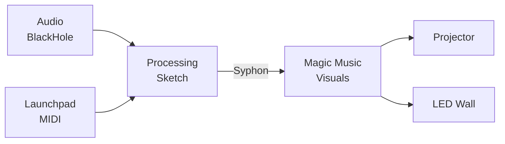

# Processing VJ Visuals Guides

Comprehensive guide series for creating **interactive, living, efficient simulations** in Processing for VJ (Video Jockey) performances.

## Quick Navigation

| Guide | Topic | Focus |
|-------|-------|-------|
| **[00-overview.md](00-overview.md)** | Overview & Setup | Start here - system architecture, quick start template |
| **[01-core-concepts.md](01-core-concepts.md)** | Core Architecture | Module lifecycle, coordinate systems, frame budgets |
| **[02-audio-reactivity.md](02-audio-reactivity.md)** | Audio Analysis | FFT, beat detection, BPM, optimal frequency mapping (20Hz-20kHz) |
| **[05-design-philosophy.md](05-design-philosophy.md)** | Design Principles | Grokking Simplicity, deep modules, pure functions |
| **[03-particle-systems.md](03-particle-systems.md)** | Particle Systems | CPU and GPU particles, forces, PixelFlow integration |
| **[04-fluid-simulations.md](04-fluid-simulations.md)** | Fluid Dynamics | Reaction-diffusion, flow fields, smoke/fire effects |
| **[06-interactivity.md](06-interactivity.md)** | Interactivity | MIDI/Launchpad, OSC network sync, Syphon output |
| **[08-code-patterns.md](08-code-patterns.md)** | Code Reference | Copy-paste ready modules, formulas, design patterns |
| **[09-resources.md](09-resources.md)** | Resources | Libraries, tools, examples, learning materials |

## Key Technologies

- **Processing 4.x** - Creative coding environment (Java mode)
- **P3D Renderer** - OpenGL-based 3D graphics
- **PixelFlow** - GPU-accelerated particles and fluid simulations
- **Syphon** - Zero-latency frame sharing for VJ pipeline
- **The MidiBus** - MIDI controller integration (Launchpad, etc.)

## System Requirements

### Software
- **Processing 4.3+** - [processing.org/download](https://processing.org/download)
- **Apple Silicon Users**: Use Intel/x64 build for Syphon compatibility
- **Java 17+** (bundled with Processing)

### Hardware (Recommended)
- **GPU**: Modern GPU with OpenGL 4.0+ support
- **RAM**: 8GB minimum, 16GB recommended for GPU particles
- **MIDI Controller**: Launchpad Mini Mk3 (optional, keyboard fallback provided)
- **Audio Interface**: BlackHole (macOS) or VB-Cable (Windows) for system audio capture

## Quick Start

### 1. Install Processing
```bash
# macOS (Intel/x64 for Syphon)
brew install --cask processing

# Or download from processing.org/download
```

### 2. Install Required Libraries
In Processing IDE:
1. **Sketch → Import Library → Manage Libraries**
2. Search and install:
   - The MidiBus
   - Syphon (macOS) or Spout (Windows)
   - PixelFlow (download from [diwi.github.io/PixelFlow](https://diwi.github.io/PixelFlow/))

### 3. Run Your First Sketch
Copy the [Quick Start Template](00-overview.md#quick-start-template) from the overview guide.

### 4. Configure Audio (macOS)
```bash
# Install BlackHole for system audio capture
brew install blackhole-2ch

# Configure in Audio MIDI Setup:
# 1. Create Multi-Output Device (Speakers + BlackHole)
# 2. Set as system output
# 3. Processing will capture from BlackHole
```

## Learning Paths

### For Beginners
1. [00-overview.md](00-overview.md) - Understand the system
2. [01-core-concepts.md](01-core-concepts.md) - Learn architecture
3. [05-design-philosophy.md](05-design-philosophy.md) - Understand design principles
4. [02-audio-reactivity.md](02-audio-reactivity.md) - Add audio response with optimal frequency mapping
5. [03-particle-systems.md](03-particle-systems.md) - Build first visuals
6. [06-interactivity.md](06-interactivity.md) - Add MIDI/OSC control
7. [08-code-patterns.md](08-code-patterns.md) - Expand with reusable modules

### For Experienced Developers
Jump directly to:
- [02-audio-reactivity.md](02-audio-reactivity.md) - Detailed frequency analysis (20Hz-20kHz mapping)
- [03-particle-systems.md](03-particle-systems.md) - GPU acceleration with PixelFlow
- [04-fluid-simulations.md](04-fluid-simulations.md) - Reaction-diffusion and fluids
- [05-design-philosophy.md](05-design-philosophy.md) - Advanced architecture patterns
- [06-interactivity.md](06-interactivity.md) - OSC network synchronization
- [08-code-patterns.md](08-code-patterns.md) - Production-ready code modules

### For AI Agents
All guides include:
- **Clear section headings** for navigation
- **Complete, runnable code** examples
- **Mermaid diagrams** for visual concepts
- **Formulas** in mathematical notation and code
- **Anti-patterns** highlighting common mistakes

## Design Philosophy

### 1. VJ-First
All code is optimized for **live performance**:
- 1920×1080 Full HD output via Syphon
- Black backgrounds for overlay compositing
- No visible UI (pure visuals)
- 60+ FPS target

### 2. Modular Architecture
Following **"A Philosophy of Software Design"**:
- Deep, narrow modules
- Information hiding
- Separation of state and effects
- Explicit lifecycle: `init() → update() → draw() → dispose()`

### 3. GPU Acceleration
Modern VJ visuals demand GPU power:
- Always use P3D renderer
- Leverage PixelFlow for 100,000+ particles
- Custom GLSL shaders for advanced effects

### 4. Audio Reactivity
Music drives the visuals:
- FFT analysis for frequency-based effects
- Beat detection for transient triggers
- Multiple frequency bands (bass, mid, high)

## Example Projects

### Audio-Reactive Particles
```java
// Complete example in 03-particle-systems.md
ParticleSystem system;
AudioAnalyzer audio;

void draw() {
  audio.update();
  
  // Bass → spawn rate
  if (audio.getBass() > 0.5f) {
    system.burst(random(width), random(height), 50);
  }
  
  // Beat → explosion
  if (audio.isBeat()) {
    explode(width/2, height/2, 200);
  }
  
  system.update(1.0f / frameRate);
  system.draw(g);
}
```

### GPU Fluid Simulation
```java
// Complete example in 04-fluid-simulations.md
DwFluid2D fluid;

void draw() {
  fluid.update();
  
  // Audio-reactive color injection
  if (audio.getBass() > 0.3f) {
    float hue = (frameCount % 360) / 360.0f;
    fluid.addDensity(width/2, height/2, 100, hue, 0.8f, 1.0f, 1.0f);
  }
  
  fluid.renderFluidTextures(g, 0);
}
```

## Performance Targets

| Metric | Target | Acceptable |
|--------|--------|------------|
| Frame rate | 60 FPS | 30+ FPS |
| Particle count (CPU) | 1,000-5,000 | 500+ |
| Particle count (GPU) | 100,000+ | 10,000+ |
| Input latency | <16ms | <33ms |
| Audio lag | <50ms | <100ms |

## Common Workflows

### Development Workflow
1. **Prototype** in Processing IDE with keyboard/mouse
2. **Test** with Launchpad and audio
3. **Optimize** using profiling tools
4. **Deploy** via Syphon to VJ software

### Live Performance Workflow
1. **Processing** renders visuals
2. **Syphon** shares frames (zero-copy GPU)
3. **Magic/Resolume** mixes and composites
4. **Projector** displays final output



## Troubleshooting

### Processing Won't Start (Apple Silicon)
**Solution**: Use Intel/x64 Processing build for Syphon compatibility

### No Audio Input Detected
**Solution**: Install BlackHole and configure Multi-Output Device in Audio MIDI Setup

### Low Frame Rate
**Solution**: 
- Reduce particle count
- Lower resolution (1280×720 instead of 1920×1080)
- Use GPU acceleration (PixelFlow) instead of CPU particles

### Launchpad Not Detected
**Solution**:
- Put Launchpad in Programmer mode: Hold Session → press orange pad → release
- Check device appears in `MidiBus.list()`
- Use keyboard fallback for testing

## Contributing

Found an issue or have improvements? This repository is open for contributions:
1. Fork [github.com/abossard/synesthesia-visuals](https://github.com/abossard/synesthesia-visuals)
2. Create guides in `/docs/processing-guides/`
3. Follow existing structure and style
4. Submit pull request

## Community

- **Processing Forum**: [discourse.processing.org](https://discourse.processing.org/)
- **Reddit**: [r/processing](https://www.reddit.com/r/processing/)
- **Discord**: Processing Foundation server

## License

These guides are part of the synesthesia-visuals repository. See individual shader files for specific licensing. Code examples in guides are provided as-is for educational and creative use.

---

**Last Updated**: 2024-12 | **Processing Version**: 4.3+ | **Target Resolution**: 1920×1080

**Start Reading**: [00-overview.md](00-overview.md)
