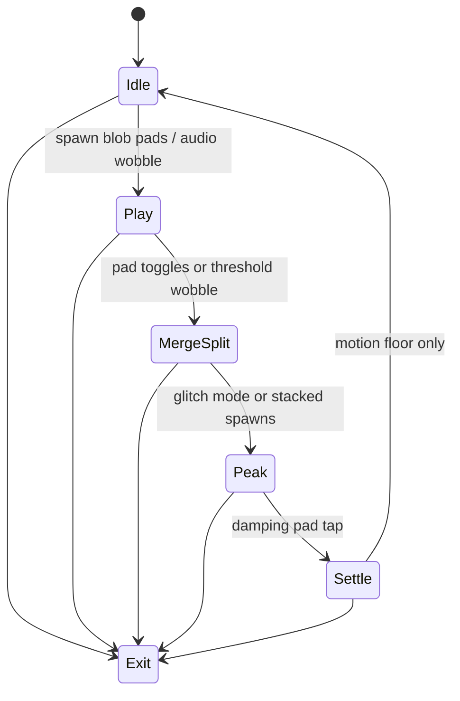

# Level 02: Jelly Blobs and Goo Physics

```text
   (spring mesh)
   o---o---o
   |  / \  |
   o---o---o
```

## Overview

Soft, wobbling blobs that merge/split; can resemble jellyfish bells or sliding logos.

## Launchpad Controls

| Row | Columns | Function |
|-----|---------|----------|
| **Columns 0–1** | All rows | Spawn blobs (two colors) |
| **Column 7** | All rows | Toggle "glitch mode" (LED warning) |
| **Bottom row** | 0–7 | Cycle palette/merge modes |
| **Row 5** | 0–3 | Stiffer (tap-toggle) |
| **Row 5** | 4–7 | Softer (tap-toggle) |
| **Row 4** | 0–3 | Damping (tap-to-cycle) |
| **Row 4** | 4–7 | Blob-vs-blob attraction (tap-to-cycle) |

## Audio Reactivity

- **Envelope:** modulates impulse magnitude and wobble decay

## Implementation Notes

- Mass-spring lattice or Verlet soft body with volume preservation
- Render with smooth contours (Metaball/Marching Squares or `beginShape()` hull)
- Blend modes for neon gel look

## State Machine



- **Idle:** blobs keep slight idle breathing so motion never stops
- **Play → MergeSplit:** pads step through states
- **Glitch pad:** jumps to Peak
- **Scene button:** arms Exit

## References

- [Toxiclibs](http://toxiclibs.org/)
- [Verlet stick constraints](https://natureofcode.com/book/chapter-10-the-evolution-of-code/)
- [Metaballs in Processing](https://processing.org/examples/metaballs.html)

## Related

- [Common Reference](./00-common.md)
- [Implementation Plan — Phase 6.2](../processing-implementation-plan.md#62-level-jelly-blobs-and-goo-physics)
