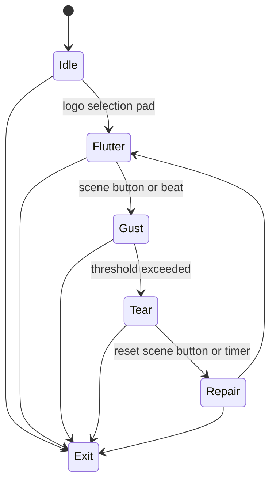

# Level 10: Logo in Wind Tunnel

```text
logo mesh ➜ wind vectors ➜ deformation
```

## Overview

A vector logo or glyph reacts to simulated wind; edges flap, ripple, and occasionally tear.

## Launchpad Controls

| Row | Columns | Function |
|-----|---------|----------|
| **Row 7** | 0–7 | Select logo slot (8 pre-loaded SVG/shapes) |
| **Row 6** | 0–7 | Wind direction presets (N/NE/E/SE/S/SW/W/NW) |
| **Row 5** | 0–1 | Wind speed (tap-to-cycle) |
| **Row 5** | 2–3 | Mesh resolution (tap-to-cycle) |
| **Row 5** | 4–5 | Elasticity (tap-to-cycle) |
| **Row 5** | 6–7 | Tear threshold (tap-to-cycle) |
| **Scene buttons** | — | Gust blast, freeze, reset mesh |

## Audio Reactivity

- **Gust on beat:** wind burst
- **Presence:** idle flutter amplitude

## Implementation Notes

- Triangulate SVG contour into spring-mass mesh
- Apply force per-vertex from noise-based wind field
- Tear links if strain exceeds threshold

## State Machine



- **Idle:** logo static
- **Flutter:** gentle sway
- **Gust:** wind spikes
- **Tear:** links break, shape splits
- **Repair:** mesh reforms (reverse animation)

## References

- [Geomerative library for Processing SVG](https://ricardmarxer.com/geomerative/)
- Cloth simulation spring-mass tutorials

## Related

- [Common Reference](./00-common.md)
- [Implementation Plan — Phase 6.10](../processing-implementation-plan.md#610-level-logo-in-wind-tunnel)
