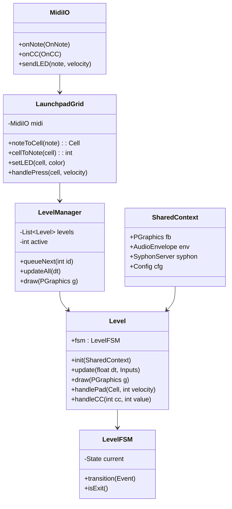

# Processing → Syphon Visual Idea Board

Curated, VJ-ready concepts designed for Processing (P2D/P3D) with Syphon output for Magic/Synesthesia. Each entry includes a quick diagram, control surface suggestions (Launchpad + MIDImix), and references so you can prototype fast.

## Launchpad control guidance (from the main branch setup)
- **Device/mode:** Launchpad Mini Mk3 in **Programmer mode** (enter Settings → press the orange Scene Launch button → exit Settings). This exposes the full 8×8 grid plus the right-column scene buttons without DAW behavior.
- **Pad note layout:**
  - Grid rows from bottom to top use notes `11–18`, `21–28`, …, `81–88`; right-column scene buttons use `19–89` (see [MIDI Controller Setup](midi-controller-setup.md)).
  - Convert notes to grid coords via `(col = (note % 10) - 1, row = (note / 10) - 1)`.
- **LED colors:** Send note-on with velocity to set pad color (e.g., 16 = green, 8–11 = orange, 4–7 = red). Light pads that are active; dim pads for available actions.
- **Baseline mapping template:**
  - **Top row (71–78):** global scene toggles (freeze, clear trails, palette cycle, RD preset A/B, camera layout). Scene buttons on the right column can be “shift” modifiers.
  - **Middle rows:** per-effect controls (spawn wells/blobs/ropes, toggle behaviors, swap meshes). Use consistent columns across sketches (e.g., col 0 = spawn, col 1 = reset, col 7 = randomize) to build muscle memory.
  - **Bottom row (11–18):** transport-style controls (start/stop, tap tempo, BPM sync, arm/disable audio-reactivity).
- **MIDI bus pairing:** Run Launchpad in parallel with Akai MIDImix (faders/knobs) on the same MIDI channel—their note/CC ranges don’t collide, and you can LED-echo Launchpad presses in Processing while MIDImix drives continuous parameters.
- **Starter code snippet:**
  ```java
  // Convert Launchpad note to grid coordinate
  void noteOn(int channel, int pitch, int velocity) {
    int col = (pitch % 10) - 1;
    int row = (pitch / 10) - 1; // 0 = bottom row
    if (col >= 0 && col < 8 && row >= 0 && row < 8) {
      handlePadPress(col, row, velocity);
      lightPad(pitch, velocity > 0 ? 16 : 0); // example LED echo
    }
  }
  ```
  Keep this mapping consistent across all sketches so the Launchpad feels like a shared “HUD” for every visual.

## 1) Gravity Wells in a Particle Galaxy

```
      *       *             *
        *   ↘   ⭕︎  ↙   *
     *      ↖   ●   ↗      *
          *     *      *
```

- **What it looks like:** Starfield that swirls and shears around moving invisible wells; spirals, warped streams, lensing-like bends.
- **How to drive it:**
  - Launchpad (Programmer mode): middle rows place/enable wells; pad velocity = well strength; right-column scene buttons = well presets/clear.
  - MIDImix faders: global gravity, drag, trail length; knobs: noise in velocity, well falloff.
  - Audio: bass boosts inward pull; highs spawn short-lived “spark” particles.
- **Implementation notes:** N-body-lite with softened force (e.g., `force = m / (d^2 + ε)`). Use additive blending + fading trails via framebuffer. Mouse or pad positions map to normalized viewport.
- **Example references:** Processing particles with interactive forces ([Daniel Shiffman’s attraction example](https://processing.org/examples/forces.html)); use [Syphon for Processing](https://github.com/Syphon/Syphon-Processing) for output.
- **Level state machine:** Always-on drift keeps particles subtly moving even when idle.
  ```mermaid
  stateDiagram-v2
    [*] --> Idle
    Idle --> Sculpt : pad spawn/drag wells
    Sculpt --> Peak : audio bass surge or pad queue
    Peak --> Cooldown : auto after bars or knob fade
    Cooldown --> Idle : natural decay
    Idle --> Exit : level exit arm
    Sculpt --> Exit : level exit arm
    Peak --> Exit : level exit arm
    Cooldown --> Exit : level exit arm
  ```
  Launchpad pads advance between Idle ↔ Sculpt ↔ Peak; scene buttons arm Exit for the global state manager.

## 2) Jelly Blobs and Goo Physics

```
   (spring mesh)
   o---o---o
   |  / \  |
   o---o---o
```

- **What it looks like:** Soft, wobbling blobs that merge/split; can resemble jellyfish bells or sliding logos.
- **How to drive it:**
  - Launchpad: columns 0–1 spawn blobs of two colors; column 7 toggles “glitch mode” with LED warning; bottom row pads cycle palette/merge modes.
  - MIDImix fader: global stiffness/softness; knobs: damping and blob-vs-blob attraction.
  - Audio envelope modulates impulse magnitude and wobble decay.
- **Implementation notes:** Mass-spring lattice or Verlet soft body with volume preservation. Render with smooth contours (Metaball/Marching Squares or `beginShape()` hull). Blend modes for neon gel look.
- **Example references:** Toxiclibs or [verlet stick constraints](https://natureofcode.com/book/chapter-10-the-evolution-of-code/) patterns; [metaballs in Processing](https://processing.org/examples/metaballs.html).
- **Level state machine:** Blobs keep slight idle breathing so motion never fully stops.
  ```mermaid
  stateDiagram-v2
    [*] --> Idle
    Idle --> Play : spawn blob pads / audio wobble
    Play --> MergeSplit : pad toggles or threshold wobble
    MergeSplit --> Peak : glitch mode or stacked spawns
    Peak --> Settle : damping fader drop
    Settle --> Idle : motion floor only
    Idle --> Exit
    Play --> Exit
    MergeSplit --> Exit
    Peak --> Exit
    Settle --> Exit
  ```
  Pads step through Play → MergeSplit; glitch pad jumps to Peak; holding scene button arms Exit.

## 3) Crowd of Agents Drawing Light Trails

```
agents ➜ trails ➜ buffer fade
```

- **What it looks like:** Hundreds of walkers paint long-exposure ribbons; forms calligraphic tunnels and swirls.
- **How to drive it:**
  - Launchpad: row 7 selects behavior set (seek/orbit/flee/flock); row 6 toggles trail style per column; scene buttons randomize goal points.
  - Knobs: speed, steering jitter, trail length; faders: cohesion/alignment weights.
  - Audio: bass raises cohesion (agents clump), highs add jitter/chaos.
- **Implementation notes:** Simple boids/steering with offscreen buffer that fades each frame. Use `PGraphics` with additive blending; occasional perlin flow fields for variation.
- **Example references:** [Reza Ali’s boids writeup](https://www.syedrezaali.com/boids), Shiffman’s boids sketches, Magic/Synesthesia color grading on top.
- **Level state machine:** Agents always wander lightly even at rest.
  ```mermaid
  stateDiagram-v2
    [*] --> Idle
    Idle --> Flock : behavior row selection
    Flock --> Orbit : pad set orbit target
    Orbit --> Peak : audio drop or pad boost cohesion
    Peak --> Scatter : jitter knob up or pad chaos
    Scatter --> Idle : fade jitter/length
    Idle --> Exit
    Flock --> Exit
    Orbit --> Exit
    Peak --> Exit
    Scatter --> Exit
  ```
  Row 7 pads hop behaviors (Idle→Flock/Orbit), pad chaos or bass sends Peak; scene button arms Exit.

## 4) Reaction–Diffusion Skin on 3D Shapes

```
2D RD buffer → texture → sphere/torus
```

- **What it looks like:** Zebra/coral patterns crawling over spheres, torii, or extruded text; hypnotic morphing surface.
- **How to drive it:**
  - Launchpad: row 5 chooses mesh (sphere/torus/text/logo variants); row 6 toggles lighting, palette inversion, and wireframe; LED color shows current mesh.
  - MIDImix faders: feed/kill rates; knob: diffusion ratio or timestep.
  - Audio: modulate pattern speed or contrast; kicks can trigger color palette shifts.
- **Implementation notes:** Run Gray–Scott RD on `PGraphics`; upload as texture to a `PShape`. Keep RD size modest (256–512) for speed. Use `shader()` for lit look.
- **Example references:** [Karl Sims RD](http://www.karlsims.com/rd.html); [Processing texture mapping docs](https://processing.org/tutorials/textures/).
- **Level state machine:** RD buffer keeps slow crawl even at Idle.
  ```mermaid
  stateDiagram-v2
    [*] --> Idle
    Idle --> Grow : feed/kill fader push
    Grow --> Morph : mesh swap pad or palette invert
    Morph --> Peak : audio spike or twist knob
    Peak --> Fade : reduce feed/kill or timer
    Fade --> Idle
    Idle --> Exit
    Grow --> Exit
    Morph --> Exit
    Peak --> Exit
    Fade --> Exit
  ```
  Pads drive mesh swap (Morph) and can arm Exit; faders advance growth/morph stages.

## 5) Recursive City / Escher-Style Camera Ride

```
 city block ➜ instanced grid ➜ camera spiral
```

- **What it looks like:** Infinite-feel highways or towers repeating and folding; demo-scene tunnel vibes.
- **How to drive it:**
  - Launchpad: row 7 chooses layout presets (grid/spiral/stair), row 6 toggles mirror and fog; scene buttons punch-in “zoom burst” or “rotate 90°”.
  - Knobs: camera speed, FOV, recursion depth/scale.
  - Audio sidechain: kick = subtle camera shake; fills = zoom pulses.
- **Implementation notes:** Build one modular block; instance via nested transforms. Frustum culling keeps FPS. Screen-space reflections or simple emissive windows for night-city look.
- **Example references:** [Processing instancing via `pushMatrix`/`popMatrix`](https://processing.org/reference/pushMatrix_.html); look at demoscene “city flythrough” clips for palette ideas.
- **Level state machine:** City drones slowly (camera drift) even in Idle.
  ```mermaid
  stateDiagram-v2
    [*] --> Idle
    Idle --> Cruise : layout preset pad
    Cruise --> Spiral : spiral/stair preset
    Spiral --> Peak : zoom burst scene button or audio swell
    Peak --> Glide : FOV/fader ease back
    Glide --> Idle
    Idle --> Exit
    Cruise --> Exit
    Spiral --> Exit
    Peak --> Exit
    Glide --> Exit
  ```
  Top-row layout pads step presets (Idle→Cruise→Spiral); scene buttons trigger Peak and can arm Exit.

## 6) Non-Newtonian Liquid Floor

```
heightfield grid
wave + stiffness(bass)
```

- **What it looks like:** Gooey floor reacting to footsteps; stiffens briefly on hard hits, then relaxes into liquid ripples.
- **How to drive it:**
  - Launchpad: bottom row triggers “slams” at eight x-coordinates; row 6 toggles wireframe/shaded and boundary conditions; hold a pad to latch stiff mode.
  - Faders: viscosity, elasticity, damping; knob: stiffness response time.
  - Audio: bass increases stiffness and impulse magnitude; highs tweak ripple freq.
- **Implementation notes:** 2D heightfield or spring-mass grid; update with verlet or semi-implicit Euler. Map height to color/normal for lighting. Blur normals for glossy wet look.
- **Example references:** [Jos Stam’s stable fluids concepts](https://www.dgp.toronto.edu/people/stam/reality/Research/pdf/GDC03.pdf) applied to heightfields; Processing shaders for normal mapping.
- **Level state machine:** Floor always ripples subtly from ambient noise.
  ```mermaid
  stateDiagram-v2
    [*] --> Idle
    Idle --> Ripples : pad slam or audio kick
    Ripples --> Stiff : hold pad or bass threshold
    Stiff --> Flow : damping fader or time decay
    Flow --> Idle
    Idle --> Exit
    Ripples --> Exit
    Stiff --> Exit
    Flow --> Exit
  ```
  Bottom row pads trigger Ripples; hold to Stiff; scene button arms Exit.

## 7) Cellular Automata Zoo (Beyond Game of Life)

```
rule presets ↔ palette ↔ zoom
```

- **What it looks like:** Pixel grids that pulse, grow, decay; zoom and palette shifts turn them into abstract textures.
- **How to drive it:**
  - Launchpad: row 7 selects rule sets (Life/Brian’s Brain/Day & Night/1D); row 6 seeds patterns on press; row 5 toggles zoom/palette shift.
  - Knobs: zoom, palette shift, birth/survival thresholds.
  - Audio: impulse seeds random live cells; highs modulate rule noise.
- **Implementation notes:** GPU-friendly with shader ping-pong, or CPU 2D arrays if small. Palette LUT for quick color grading before Syphon.
- **Example references:** [Brian’s Brain ruleset](https://en.wikipedia.org/wiki/Brian%27s_Brain); [Processing shader ping-pong tutorial](https://processing.org/tutorials/pshader/).
- **Level state machine:** Automata keep ticking slowly even when “idle” by injecting low-probability seeds.
  ```mermaid
  stateDiagram-v2
    [*] --> Idle
    Idle --> Seed : pad seed or audio impulse
    Seed --> Evolve : rule row select
    Evolve --> ZoomDrift : palette/zoom pads
    ZoomDrift --> Peak : chaos knob or rapid seeds
    Peak --> Settle : reduce birth/survival
    Settle --> Idle
    Idle --> Exit
    Seed --> Exit
    Evolve --> Exit
    ZoomDrift --> Exit
    Peak --> Exit
    Settle --> Exit
  ```
  Row 7 rule pads move Evolve; palette/zoom pads drive ZoomDrift; scene button arms Exit.

## 8) Portal / Wormhole Raymarcher (Cheap Version)

```
  camera ➜ raymarch tunnel SDF ➜ color ramps
```

- **What it looks like:** Bending tunnels and volumetric-looking clouds; strong forward motion depth cue.
- **How to drive it:**
  - Launchpad: row 7 swaps palettes/textures; row 6 triggers camera jump/bend toggles; hold scene buttons to arm “hyperspeed” for next kick.
  - Fader: twist/warp amount; knob: noise frequency.
  - Audio: speed multiplier; kick = forward burst, snare = lateral wobble.
- **Implementation notes:** Fake with polar UV distort + signed-distance step loop in a shader; single-iteration fog for speed. Render to `PGraphics` with `PShader` and Syphon out.
- **Example references:** [Inigo Quilez SDF basics](https://iquilezles.org/articles/distfunctions/); [Processing PShader setup](https://processing.org/tutorials/pshader/).
- **Level state machine:** Tunnel always scrolls forward at minimal speed.
  ```mermaid
  stateDiagram-v2
    [*] --> Idle
    Idle --> Drift : palette swap pad or speed knob
    Drift --> Bend : twist fader or bend pad
    Bend --> Peak : hyperspeed scene button or kick
    Peak --> Cool : auto decel
    Cool --> Idle
    Idle --> Exit
    Drift --> Exit
    Bend --> Exit
    Peak --> Exit
    Cool --> Exit
  ```
  Row 7 palette pads move Idle→Drift; bend pad toggles Bend; scene button arms hyperspeed Peak or Exit.

## 9) String Theory: Massive Rope/Chain Simulation

```
anchors ─ spring constraints ─ many ropes
```

- **What it looks like:** Hundreds of ropes or cables swinging, tangling; can read as hair, roots, or laser curtains depending on shading.
- **How to drive it:**
  - Launchpad: columns 0–2 spawn ropes anchored to mouse/center/random; column 7 toggles trail render; top row cycles gravity presets.
  - Fader: gravity bias (droop vs float); knob: wind noise scale.
  - Audio: kicks add violent impulses; highs add tremor jitter.
- **Implementation notes:** Verlet integration with distance constraints; batch constraints for performance. Render as polylines with glow (additive blur) or ribbon quads.
- **Example references:** [Verlet rope tutorial](https://gamedevelopment.tutsplus.com/tutorials/simulate-fabric-and-rope-using-verlet-integration--gamedev-519); Shiffman’s cloth/rope sketches.
- **Level state machine:** Ropes sway with wind noise continuously.
  ```mermaid
  stateDiagram-v2
    [*] --> Idle
    Idle --> Spawn : rope spawn pad
    Spawn --> Sway : wind knob or gravity fader
    Sway --> Peak : impulse (kick/pad)
    Peak --> Tangle : trail toggle or noise surge
    Tangle --> Relax : damping fader
    Relax --> Idle
    Idle --> Exit
    Spawn --> Exit
    Sway --> Exit
    Peak --> Exit
    Tangle --> Exit
    Relax --> Exit
  ```
  Spawn pads move into Spawn; wind/gravity pushes to Sway; scene buttons arm Exit.

## 10) Logo as Physical Object in a Wind Tunnel

```
flow field ➜ collide with logo mask ➜ streaks
```

- **What it looks like:** Particle streams bend around a solid logo, forming vortices and streaks; porous mode leaks flow through.
- **How to drive it:**
  - Launchpad: row 7 switches logo masks; row 6 toggles porous/noise modes; scene buttons trigger “gust” bursts and clear the flow buffer.
  - Knobs: wind speed, turbulence, particle count; fader: viscosity.
  - Audio: bass boosts wind + turbulence; mids control color hue.
- **Implementation notes:** Generate vector field (Perlin + vortex) and mask collisions against logo alpha. Use FBO trails and motion blur. Load logo as `PGraphics` mask.
- **Example references:** [Processing flow field tutorial](https://natureofcode.com/book/chapter-06-autonomous-agents/#chapter06_section6); [image masks](https://processing.org/reference/PGraphics_mask_.html).
- **Level state machine:** Flow keeps gentle breeze even idle.
  ```mermaid
  stateDiagram-v2
    [*] --> Idle
    Idle --> Stream : logo pad select
    Stream --> Vortex : gust scene button or turbulence knob
    Vortex --> Peak : porous toggle + audio surge
    Peak --> Wake : viscosity fader rise
    Wake --> Idle
    Idle --> Exit
    Stream --> Exit
    Vortex --> Exit
    Peak --> Exit
    Wake --> Exit
  ```
  Row 7 logos move to Stream; gust scene buttons jump to Vortex/Peak; scene buttons also arm Exit.

## 11) Swarm of “Intelligent” Cameras

```
scene ➜ many mini-cameras ➜ tiled output
```

- **What it looks like:** Screen tiled into cells, each a different moving camera view; collage of micro-perspectives.
- **How to drive it:**
  - Launchpad: bottom row sets camera count (1–8); row 6 cycles path modes per column; scene buttons randomize tile layout with LED countdown.
  - Knobs: per-tile zoom, tile jitter/offset; fader: camera speed.
  - Audio: shake amplitude and time offset between cameras.
- **Implementation notes:** Render scene to small buffers per camera (or reuse one buffer with camera matrices and viewport offsets). Compose into grid/hex layouts using `PGraphics` blits.
- **Example references:** [Multiple cameras in Processing P3D](https://forum.processing.org/one/topic/multiple-camera-views.html); [tiling with `image()` and `copy()`](https://processing.org/reference/copy_.html).
- **Level state machine:** Cameras always drift slowly between tiles.
  ```mermaid
  stateDiagram-v2
    [*] --> Idle
    Idle --> TileSet : bottom row camera count
    TileSet --> Pathing : path mode pads
    Pathing --> Peak : randomize scene button or audio swell
    Peak --> Collage : zoom jitter knob down
    Collage --> Idle
    Idle --> Exit
    TileSet --> Exit
    Pathing --> Exit
    Peak --> Exit
    Collage --> Exit
  ```
  Bottom row count pads move to TileSet; path pads to Pathing; scene button randomize hits Peak/Exit.

## 12) Time Smear / History Trails

```
ring buffer of frames ➜ sample offsets ➜ mix
```

- **What it looks like:** Moving elements leave echo trails that warp and glitch; selective smearing by color/brightness.
- **How to drive it:**
  - Launchpad: row 7 toggles freeze/melt and hue-only vs RGB; row 6 scrubs sampling offsets; bottom row sets trail length presets.
  - Knobs: trail length, sampling pattern (linear, sinus, random jitter).
  - Audio: larger hits increase temporal offsets; highs modulate chroma shift.
- **Implementation notes:** Maintain circular buffer of `PGraphics`; sample with varying time indices in a shader. Optional luma mask to smear only highlights.
- **Example references:** [Feedback trails with FBOs](https://processing.org/reference/filter_.html) plus custom GLSL; Magic/Synesthesia feedback pairs well here.
- **Level state machine:** Buffer always samples near-now frames for gentle smear.
  ```mermaid
  stateDiagram-v2
    [*] --> Idle
    Idle --> Record : trail length pad
    Record --> Smear : sampling scrub pads
    Smear --> Peak : freeze/melt toggle or kick
    Peak --> Melt : release freeze or timer
    Melt --> Idle
    Idle --> Exit
    Record --> Exit
    Smear --> Exit
    Peak --> Exit
    Melt --> Exit
  ```
  Trail pads move through Record→Smear; freeze pad triggers Peak; scene button arms Exit.

## 13) Split-Reality Mirror Rooms

```
scene A | scene B | scene C
mirrored slices/portals
```

- **What it looks like:** Screen sliced into mirrored portals, each running a variant of the sim; feels like parallel realities.
- **How to drive it:**
  - Launchpad: row 7 assigns slices to scene A/B/C; row 6 toggles mirror/warp; hold scene buttons to momentarily solo a reality.
  - Knobs: divergence strength (gravity, color, noise) and slice distortion.
  - Audio: morph rate between realities; kicks trigger slice swaps.
- **Implementation notes:** Run multiple parameter sets of the same sim; render to layered FBOs and composite with mirror transforms (`scale(-1,1)`). Simple UV warps add portal feel.
- **Example references:** [Offscreen buffers & transforms](https://processing.org/reference/PGraphics.html); mirror trick with `scale(-1,1)` about center.
- **Level state machine:** Slices keep subtle phase drift between realities always.
  ```mermaid
  stateDiagram-v2
    [*] --> Idle
    Idle --> Assign : slice assignment pads
    Assign --> Diverge : divergence knob up
    Diverge --> Peak : portal warp pad or audio hit
    Peak --> Blend : reduce divergence
    Blend --> Idle
    Idle --> Exit
    Assign --> Exit
    Diverge --> Exit
    Peak --> Exit
    Blend --> Exit
  ```
  Slice pads advance Idle→Assign; warp pad or audio push to Peak; scene button arms Exit.

## 14) Recursive Text / Glyph Engines

```
letters as agents ⇄ words ⇄ dissolve/reform
```

- **What it looks like:** Words dissolve into swarms of characters, drift, then reform into new phrases or symbols.
- **How to drive it:**
  - Launchpad: row 7 selects text presets; row 6 triggers dissolve/reform; column 7 enables letter-to-word cohesion boost (LED = active).
  - Knobs: cohesion (magnet toward word layout) vs chaos; trail intensity.
  - Audio: bass causes explosive scattering; quiet sections let words reform.
- **Implementation notes:** Represent each glyph as points; target positions for each word layout. Use boid-like cohesion toward target + noise for drift. SDF text textures helpful for glow fills.
- **Example references:** [Geomerative library for glyph outlines](http://www.ricardmarxer.com/geomerative/); [Processing text to points](https://processing.org/reference/textToPoints_.html).
- **Level state machine:** Letters drift gently even when not forming words.
  ```mermaid
  stateDiagram-v2
    [*] --> Idle
    Idle --> Phrase : text preset pad
    Phrase --> Dissolve : dissolve/reform pad
    Dissolve --> Scatter : chaos knob
    Scatter --> Reform : cohesion knob up
    Reform --> Idle
    Idle --> Exit
    Phrase --> Exit
    Dissolve --> Exit
    Scatter --> Exit
    Reform --> Exit
  ```
  Text pads move to Phrase; dissolve pads advance Dissolve→Scatter; scene button arms Exit.

---

### Quick build pipeline
1. Prototype in Processing (P2D/P3D) with minimal dependencies.
2. Add Syphon output (`SyphonServer server = new SyphonServer(this, "Processing");`).
3. Map Launchpad (pads/toggles) and MIDImix (faders/knobs) via MIDI bus libraries like [The MidiBus](http://www.smallbutdigital.com/themidibus.php).
4. Feed Syphon into Magic/Synesthesia; layer ISF shaders for color grading, warps, feedback, kaleidoscope.

Pick one or two favorites and we can draft concrete class diagrams, buffers, and MIDI mappings tailored to your rig.

---

## One big Processing app with “levels” that loop

You can ship all of the above ideas inside a single Processing sketch by treating each visual as a **level** in a finite-state machine, then cycling them with Launchpad + MIDImix control. The flow keeps things lightweight and Syphon-friendly.

```
state: intro ➜ levelSelect ➜ level(n) ➜ transition ➜ level(n+1 mod N)
```

- **Core architecture**
  - **State manager:** tiny enum (`INTRO, SELECT, LEVEL, TRANSITION`) with a `Level` interface (`init()`, `update()`, `draw()`, `onPad()`, `onMidi()`, `dispose()`). Each of the 14 visuals becomes a `Level` implementation.
  - **Per-level finite state machines:** every `Level` owns its own small FSM with an explicit `Exit` state (see diagrams above). Idle states still animate lightly so motion never fully stops; pads/scene buttons advance the local FSM while the global manager handles level swaps.
  - **Shared services:** one MIDI router (Launchpad pads + MIDImix CC), one Syphon server, shared audio envelope follower, and a `PGraphics` history buffer you pass into levels that need feedback.
  - **Transitions:** 1–2 universal wipes (crossfade via fullscreen shader, radial mask) so levels swap cleanly without reloading the window. Keep each level’s heavy buffers allocated once and reused when re-entered.

- **Looping / repetition**
  - **Auto-rotate timer:** after `X` bars (from tap tempo/BPM fader), auto-advance to the next level; wrap with modulo for endless loop.
  - **Favorites rail:** maintain an ordered `ArrayList<Integer>` of level IDs; the loop iterates that subset so you can curate a tour that repeats.
  - **Persistent motifs:** share color palettes and camera easing curves so the set feels cohesive as it repeats.

- **Launchpad as the level HUD**
  - **Top row (71–78):** level slots 1–8. Pad lights = level availability; press to jump. Hold a pad to arm “next on drop”.
  - **Row 6 (61–68):** per-level macro toggles (e.g., freeze, randomize, palette shift) passed through to the active `Level` via `onPad()`.
  - **Row 5 (51–58):** transport: start/stop auto-rotate, tap tempo, set bars-per-level, toggle loop/favorites mode.
  - **Scene buttons (19–89):** “shift” for soft takeover: shift+top-row moves level up/down in favorites order; shift+row6 triggers global blackout/clear.
  - **LED feedback:** green = active level, amber = queued next, red pulse = transition in progress. Echo MIDImix fader moves as dim white LEDs along row 6 for live HUD feel.

- **MIDImix roles (consistent across levels)**
  - Faders 1–4: camera/easing/speed/macros. Faders 5–8: audio-reactivity depth, crossfade amount, global brightness, post-FX wet/dry.
  - Knobs 1–8: per-level parameters handed to the active `Level` (e.g., RD feed/kill, boid cohesion/jitter, rope gravity/wind). Keep ordering consistent so muscle memory transfers.
  - Master fader: auto-rotate intensity (0 = manual only, 1 = every bar).

- **Lightweight resource plan**
  - Each level keeps its own `PGraphics`/`PShader` objects sized to the window; store them in an array so you can re-enter without reallocation.
  - Shared audio and MIDI callbacks dispatch to the active level; idle levels should skip heavy updates when not visible.
  - Use `frameRate(60)` with a global budget: if a level is heavy (RD + 3D), lower its internal buffer resolution (e.g., 720p) and scale up during composite.

- **Repeatable show flow**
  1. **Intro:** simple logo and tempo tap; LEDs show empty loop slots.
  2. **Select:** pick 4–8 levels into favorites with top-row pads; confirm with a scene button.
  3. **Run:** auto-rotate through favorites every `barsPerLevel`; use scene buttons to jump/skip or hold to blackout.
  4. **Repeat:** when the list ends, wrap to slot 1 with a fast crossfade; keep audio-reactive envelopes continuous for continuity.

This pattern gives you one Processing window, one Syphon feed, and a playable “campaign” feel while keeping each visual modular and reusable.

---

## Processing 4 coding guidance (Grokking Simplicity × A Philosophy of Software Design)

- **Make state explicit and small:** keep each level’s data in a plain `LevelState` object (positions, velocities, parameters). Pass it into pure update functions (`LevelLogic.step(state, inputs)`) to avoid hidden mutations. Keep rendering separate (`LevelView.draw(state)`).
- **Isolate effects:** MIDI, audio, Syphon, and file IO live in thin adapters. Inject them into your logic so you can run the same code in headless tests. Avoid global singletons; pass services via constructors.
- **Protect invariants with deep modules:** every module should own its invariants (e.g., `LaunchpadGrid` owns note↔cell math; `LevelFSM` owns allowed transitions). Expose the minimum surface—simple commands like `armExit()`, `queueScene(int slot)`, `togglePad(int col, int row)`.
- **Eliminate temporal coupling:** initialize modules fully before use (`init()` returns ready objects) and keep lifecycle small: `init → update/draw → dispose`. For buffers, prefer `LazyBuffer` wrappers that allocate once and reuse.
- **Design for locality and composability:** keep hot paths (simulation, drawing) free from logging/allocations; push configuration to data tables (JSON or simple arrays). Keep per-level pad maps in `LevelBindings` structs that you can swap without changing code.
- **Name for intent, not mechanism:** “`EnergySlam`”, “`CohesionBoost`” > “`PadX17`”. Use small, forceful comments to state why a rule exists, not what the code does.
- **Refactor toward clarity:** if a function needs more than one screen to read, split it; if a module exposes many getters, consider collapsing them into a single `Config` record.

### Library/module layout for reuse



- **Modules to extract now:**
  - `midi/LaunchpadGrid`: note↔cell math, LED palette helpers, debounced pad handling.
  - `fsm/LevelFSM`: small table-driven FSM with explicit `EXIT` state; serializable so you can hot-reload presets.
  - `levels/*`: one class per visual implementing `Level` and owning its `LevelState`.
  - `core/LevelManager`: global loop that advances levels, calls `LevelFSM.transition`, and performs crossfades.
  - `graphics/Buffers`: reusable `LazyBuffer` and `HistoryBuffer` for trails/time-smear.

### Headless + modular testing

- **Headless harness:** Processing 4 supports `PSurfaceNone`; you can spin a headless sketch for logic tests:
  ```java
  PApplet app = new HeadlessHarness();
  PApplet.runSketch(new String[] { "--hide-stop" }, app);
  // In HeadlessHarness.setup(): allocate PGraphics via createGraphics(width, height, P2D)
  ```
  Use this to step `LevelLogic` and `LevelFSM` without an onscreen window.
- **processing-java CLI:** run `processing-java --sketch=processing-vj/headless-tests --run` in CI to execute assertions. Keep tests in a small sketch that imports the shared modules and runs deterministic seeds.
- **Contract tests for pads:** feed synthetic note-on/off events into `LaunchpadGrid.handlePress` and assert FSM transitions; mirror with snapshot text logs to avoid fragile visuals.

### Module-based build tips

- Treat the Processing codebase as plain Java 17: split into packages under `processing-vj/src/main/java` and use Gradle or Maven if you prefer dependency management; the sketch class stays tiny and wires modules together.
- Keep Syphon and The MidiBus as thin adapters at the edge; avoid mixing their callbacks with simulation logic. Prefer `Inputs` DTOs collected once per frame.
- Expose a single `SketchConfig` object (JSON or YAML) that defines level order, pad bindings, and buffer sizes so you can ship presets without recompiling.
- Reuse buffers aggressively: share one `PGraphics` history stack across levels; let each level own small per-feature buffers sized by intent (e.g., `rdTextureSize`, `trailSize`).
- Document pad/CC maps in code (`PadBinding[]`) and in this doc so Launchpad muscle memory stays consistent between levels and future modules.
