# Audio-Reactive Shader Development Guide

A comprehensive guide to creating visually compelling audio-reactive shaders for Synesthesia, based on analysis of production-quality scenes.

## Table of Contents

1. [Architecture Overview](#architecture-overview)
2. [Audio Uniform Categories](#audio-uniform-categories)
3. [Control Types and Patterns](#control-types-and-patterns)
4. [Audio Reactivity Patterns](#audio-reactivity-patterns)
5. [Script Integration](#script-integration)
6. [Visual Effect Techniques](#visual-effect-techniques)
7. [Best Practices](#best-practices)
8. [Complete Examples](#complete-examples)

---

## Architecture Overview

A Synesthesia scene (`.synScene`) consists of three interconnected components that work together to create audio-reactive visuals.

```mermaid
flowchart TB
    subgraph Input["Input Sources"]
        Audio["🎵 Audio Input"]
        User["👤 User Controls"]
        Media["🖼️ Media Input"]
    end
    
    subgraph Processing["Processing Pipeline"]
        Script["📜 script.js<br/>State Management"]
        JSON["⚙️ scene.json<br/>Configuration"]
        GLSL["🎨 main.glsl<br/>Rendering"]
    end
    
    subgraph Output["Output"]
        Visual["🖥️ Visual Output"]
    end
    
    Audio --> |"syn_* uniforms"| GLSL
    Audio --> |"inputs.syn_*"| Script
    User --> JSON
    JSON --> |"uniform injection"| GLSL
    Script --> |"uniforms.*"| GLSL
    Media --> GLSL
    GLSL --> Visual
    
    style Audio fill:#e1f5fe
    style Script fill:#fff3e0
    style JSON fill:#f3e5f5
    style GLSL fill:#e8f5e9
```



### File Responsibilities

| File | Purpose | Key Role |
|------|---------|----------|
| `main.glsl` | Fragment shader | Visual rendering, audio-reactive effects |
| `scene.json` | Configuration | Controls, passes, metadata |
| `script.js` | Per-frame logic | Smoothing, state machines, custom timers |

---

## Audio Uniform Categories

Synesthesia provides a rich set of audio-reactive uniforms organized into functional categories.


### Level Uniforms (0.0 - 1.0)
Continuous amplitude measurements, smoothed for stability.

```glsl
// Use for continuous modulation
float brightness = 0.5 + syn_Level * 0.5;
float bassInfluence = syn_BassLevel * intensity_slider;
```

**Best for:** Brightness, scale, opacity, continuous motion speed

### Hit/Transient Uniforms (0.0 - 1.0, spike envelope)
Single-frame spikes that decay - perfect for reactive flashes.

```glsl
// Flash on bass hits
vec3 flashColor = baseColor + vec3(1.0) * syn_BassHits * 0.3;

// Increase iteration count on high-frequency hits
float iters = 3.0 + syn_HighHits * 5.0;
```

**Best for:** Flashes, particle spawning, sudden changes, glitch triggers

### Time Accumulators
Time variables that speed up based on frequency band activity.

```glsl
// Movement that speeds up with bass
float t = syn_BassTime * 0.2 + TIME * 0.1;

// Pattern that pulses with mid-high frequencies
float pattern = sin(syn_MidHighTime * 2.0 + uv.x * 10.0);
```

**Best for:** Procedural animation, scrolling textures, organic motion

### Beat Sync Uniforms

```glsl
// Scratch effect synced to BPM
float scratch = fract(syn_BPMTwitcher) * 0.1 * scratch_toggle;

// Smooth sine wave synced to beat
float sqSize = 0.5 + 0.5 * sin(syn_BPMSin2 + p.z * 0.4);
```

**Best for:** Rhythmic pulsing, beat-synced animations, DJ-style effects

### Presence Uniforms
Slow-moving structural energy indicators.

```glsl
// Adjust circle softness based on overall presence
float circle = smoothstep(0.1 + syn_Presence * 0.3, 0.0, abs(length(p) - r));
```

**Best for:** Gradual color shifts, ambient changes, long-term mood

---

## Control Types and Patterns

### Control Type Reference


### Control Pattern Examples

#### Smooth Transitions
Add `smooth` suffix for interpolated changes - essential for VJ-friendly transitions.

```json
{
    "NAME": "fade_to_color",
    "TYPE": "slider smooth",
    "PARAMS": 0.05,
    "MIN": 0, "MAX": 1, "DEFAULT": 1,
    "UI_GROUP": "lighting"
}
```

#### Bang (Trigger) Controls
One-shot triggers with smooth decay for beat-reactive effects.

```json
{
    "NAME": "FOV_bump",
    "TYPE": "bang smooth",
    "PARAMS": 0.075,
    "MIN": 0, "MAX": 0.4, "DEFAULT": 0,
    "DESCRIPTION": "Quick 'zoom in' field of view hit",
    "UI_GROUP": "camera"
}
```

#### XY Pad Controls
Two-dimensional control for position/movement.

```json
{
    "NAME": "move_xy",
    "TYPE": "xy smooth",
    "PARAMS": 0.04,
    "DEFAULT": [0, 0],
    "MIN": [-300, -300],
    "MAX": [300, 300],
    "UI_GROUP": "motion"
}
```

#### Traveler Controls
Continuously accumulating values (good for rotation/scrolling).

```json
{
    "NAME": "spin",
    "TYPE": "slider traveler",
    "PARAMS": 0.02,
    "MIN": 0, "MAX": 2, "DEFAULT": 0.2,
    "UI_GROUP": "motion"
}
```

### UI Group Organization

Organize controls into logical groups for better UX:

| Group | Purpose | Example Controls |
|-------|---------|------------------|
| `camera` | View manipulation | FOV, position, look direction |
| `motion` | Animation | speed, spin, zoom |
| `lighting` | Color/brightness | shading, fog, glow |
| `geometry` | Shape modification | distortion, scale, layers |
| `effects` | Special effects | glitch, scratch, electrify |
| `beat` | Beat-reactive | bang triggers |

---

## Audio Reactivity Patterns

### Pattern 1: Layered Time

Combine base time with audio-reactive time for "always moving + audio boost" effect.

```glsl
// From glob_dup: Curved + regular time mix
float t = mod((syn_CurvedTime * 0.7 + syn_Time * 0.3), 500.0);
```


### Pattern 2: Threshold-Gated Effects

Use smoothstep to create threshold-based audio triggers.

```glsl
// Scale based on bass with floor value
float lowcolor = _scale(syn_BassHits, 1.2, 0.7);

// Presence-based circle softness
float softness = 0.1 + syn_Presence * 0.3;
```

### Pattern 3: Beat-Synced Iteration Count

Dynamically adjust quality/complexity based on audio.

```glsl
// More raymarching iterations on high hits
float iters = 3.0 + syn_HighHits * 5.0;

// Or with user control
if (autofuzz <= 0.5) {
    iters = 7 + fuzz;
}
```

### Pattern 4: Multi-Band Color Modulation

Use different frequency bands to affect different color channels.

```glsl
vec3 col = vec3(
    geometry,                          // R: geometry pattern
    fractal,                           // G: fractal pattern  
    0.5 + 0.5 * cos(value * 10.0)     // B: oscillating
);

// Add bass to specific channel
vec3 value4 = vec3(1.0, 0.0, syn_BassLevel);
```

### Pattern 5: Depth of Field + Audio

Link focus effects to audio presence.

```glsl
// From traced_tunnel: Focus shifts with presence
float DOF = mix((1.0 - syn_Presence) * 0.1, 0.001, focused);
float DOFDist = 3.0 - syn_Presence * 1.0;
```

---

## Script Integration

The `script.js` file enables state management and custom smoothing unavailable in pure GLSL.


### Pattern: Beat-Triggered Random Value

```javascript
// From stained_glass: Random position on each beat
function ApproachRandomSpot() {
    this.goal = 0.0;
    this.currentSpot = 0.0;
}

ApproachRandomSpot.prototype.update = function(amt) {
    this.currentSpot = this.currentSpot + (this.goal - this.currentSpot) * amt;
}

var mover = new ApproachRandomSpot();

function update(dt) {
    // New random target on beat
    if (inputs.syn_OnBeat > 0.9) {
        mover.goal = Math.random();
    }
    mover.update(0.02);  // Smooth interpolation
    uniforms.random_spot = mover.currentSpot;
}
```

### Pattern: Accumulated Bass Time

```javascript
// From stained_glass: Zoom speed driven by bass
var time = 0;

function update(dt) {
    // Accumulate time based on bass level, direction, and speed
    time = time + Math.pow(inputs.syn_BassLevel, 2.0) * 0.1 
                * inputs.reverse * inputs.zoom_speed;
    uniforms.script_bass_time = time;
}
```

### Pattern: Presence-Reactive Time

```javascript
// From vortex_flythrough: Reactive time accumulation
var scriptTime = 0;

function update(dt) {
    scriptTime = scriptTime 
        + dt * 0.25  // Base movement
        + Math.pow(syn_Presence * 0.75, 2.0) * 0.1 * reactivetime;
    
    setUniform("script_reactive_time", scriptTime);
}
```

---

## Visual Effect Techniques

### Technique 1: Raymarching with Audio Distance

```glsl
float map(vec3 p) {
    p.xz *= m(t * 0.4);  // Time-based rotation
    p.xy *= m(t * 0.3);
    
    vec3 q = p * 2.0 + t * 1.0;
    
    // Base shape
    float map1 = length(p + vec3(sin(t * 0.7))) 
               * log(length(p * pow(size, 3.0)) + 1.0) 
               + sin(q.x + sin(q.z + sin(q.y))) * 0.5 - 1.0;
    
    // Add BPM-synced scratch effect
    float map2 = map1 + length(q) * 0.0005 
               + sin(q.z * q.y) * fract(syn_BPMTwitcher) * 0.1 * scratch;
    
    return map2;
}
```

### Technique 2: Multi-Pass with Audio Feedback

```glsl
vec4 renderMain(void) {
    if (PASSINDEX == 0.0) {
        // First pass: Generate pattern data
        return renderPass();  // Uses syn_BassPresence, syn_HighTime
    } else if (PASSINDEX == 1.0) {
        // Second pass: Colorize with vignette
        vec4 data = texture(firstBuff, _uv);
        
        // Vignette with audio influence
        float v = data.r * exp(-0.6 * length(_uvc)) * 1.2;
        
        // Audio-reactive pulse circles overlay
        vec3 finalCol = mix(baseCol, pulseCircles(_uvc * 1.5 + v).rgb, 0.5);
        
        return vec4(finalCol, 1.0);
    }
}
```

### Technique 3: Audio-Driven Texture Scrolling

```glsl
// Scroll speed based on frequency band
vec3 tx = texture(image48, 
    fract(tnuv - vec2(syn_MidHighTime * 0.5 / sc / 2., 0) * media_scrolling)
).xyz;

// Flash intensity synced to beats
float flasher = mix(1.0, syn_HighHits, auto_flasher 
    * (0.5 + 0.5 * sin(length(p.xz) * 0.25 + syn_BassTime * 0.4)));

sampleCol *= tx * flasher;
```

### Technique 4: Scan Line Effects

```glsl
// X-axis scan flash
sampleCol += sampleCol * 500.0 * scan_x * _pulse(p.x * 0.1, scan_x, 0.1);

// Z-axis scan with color shift
sampleCol = mix(sampleCol, 
    20.0 * sampleCol.brg,  // Color channel swap
    scan_z * _pulse(1.0 - p.z * 0.1 + ro.z * 0.1, scan_z, 0.1)
);
```

---

## Best Practices

### 1. Always-Moving Base + Audio Enhancement


```glsl
// Good: Always moving, enhanced by audio
float t = TIME * 0.1 + syn_BassTime * 0.3;

// Bad: Only moves with audio (static during silence)
float t = syn_BassTime * 0.3;
```

### 2. Smooth Control Transitions

Always use smooth variants for VJ-friendly controls:

```json
// Good: Smooth transition
{ "TYPE": "slider smooth", "PARAMS": 0.05 }

// Bad: Instant jumps (jarring for audience)
{ "TYPE": "slider" }
```

### 3. Clamp Audio Influence

Prevent visual extremes by clamping audio-driven values:

```glsl
// Good: Bounded influence
float glow = clamp(syn_BassHits * glow_amount, 0.0, 1.0);

// Bad: Unbounded (can blow out visuals)
float glow = syn_BassHits * glow_amount * 10.0;
```

### 4. Layer Multiple Frequency Bands

Create depth by having different bands affect different visual layers:

```glsl
// Bass: Large-scale motion
p.xy *= m(syn_BassTime * 0.1);

// Mid: Color/pattern changes  
float pattern = sin(syn_MidHighTime * 2.0);

// High: Fine detail/sparkle
float sparkle = syn_HighHits * 0.5;
```

### 5. Provide Manual Override

Always allow users to disable audio reactivity or control sensitivity:

```json
{
    "NAME": "reactivetime",
    "TYPE": "slider smooth",
    "DEFAULT": 0.4,
    "MIN": 0, "MAX": 1,
    "DESCRIPTION": "Adjust the sensitivity of the sound-reactive movement."
}
```

### 6. Use Helper Functions

Leverage Synesthesia's built-in functions:

```glsl
// Scaling with min/max
float lowcolor = _scale(syn_BassHits, 1.2, 0.7);

// Pulse function for scan lines
float scan = _pulse(position, width, falloff);

// Rotation helper
vec2 rotated = _rotate(uv, angle);
```

---

## Complete Examples

### Example 1: Audio-Reactive Fog (from glob_dup)

```glsl
// Combine multiple audio sources for fog distance
float fade = _scale(syn_FadeInOut, 10, 2.5);

// High hits affect iteration quality
float iters = 3.0 + syn_HighHits * 5.0;

// Bass affects color intensity
float lowcolor = _scale(syn_BassHits, 1.2, 0.7);
float highcolor = syn_HighHits * 0.1;

// Apply in shading
vec3 l = (color1() * lowcolor) + color2() * (f + highcolor);
```

### Example 2: Camera Focus + Audio (from traced_tunnel)

```glsl
// DOF responds to presence (structural energy)
float DOF = mix((1.0 - syn_Presence) * 0.1, 0.001, focused);

// Fog brightness boosted by bass
sampleCol *= vec3(1.35 + syn_BassLevel * 2.5, 1.35, 1.35) 
           / (1. + fogD * fogD * 0.05);

// Square size pulses with BPM
float sqSize = 0.5 + 0.5 * sin(syn_BPMSin2 + p.z * 0.4);
```

### Example 3: Script-Driven Zoom (from stained_glass)

```javascript
// script.js
var time = 0;

function update(dt) {
    // Exponential bass response for punchy zoom
    time = time + Math.pow(inputs.syn_BassLevel, 2.0) * 0.1 
                * inputs.reverse * inputs.zoom_speed;
    uniforms.script_bass_time = time;
}
```

```glsl
// main.glsl
float zoom = mod(script_bass_time * 0.2 + j, iters);
float divisor = 1.0 + pow(zoom, 3.0);
w /= divisor;  // Apply zoom to geometry
```

---

## Quick Reference: Uniform Selection Guide

| Visual Goal | Recommended Uniform | Notes |
|-------------|---------------------|-------|
| Flash on beat | `syn_BassHits`, `syn_OnBeat` | Use for additive brightness |
| Continuous pulse | `syn_BPMSin`, `syn_BPMSin2` | Smooth sine waves |
| Speed variation | `syn_BassTime`, `syn_HighTime` | Accumulating time |
| Gradual mood shift | `syn_Presence`, `syn_BassPresence` | Very slow changes |
| Rhythmic stutter | `fract(syn_BPMTwitcher)` | Creates periodic patterns |
| Detailed spectrum | `syn_Spectrum` (sampler1D) | Full FFT access |
| Level history | `syn_LevelTrail` (sampler1D) | Time-based analysis |
| Smooth brightness | `syn_Level`, `syn_BassLevel` | Continuous 0-1 values |
| Sharp transitions | `syn_HighHits` | High-frequency transients |

---

## Advanced Techniques (from compound_iris)

### Multi-Pass Post-Processing Pipeline

The `compound_iris_dup` shader demonstrates a sophisticated 6-pass rendering pipeline:


Each pass serves a specific purpose:

| Pass | Buffer | Purpose |
|------|--------|---------|
| 0 | `firstBuffer` | Generate SDF-based animated rings |
| 1 | `secondBuffer` | Create triangle refraction pattern |
| 2 | `forHorBlur` | Apply chromatic aberration |
| 3 | `forVertBlur` | Horizontal Gaussian blur |
| 4 | `forLastPass` | Vertical Gaussian blur |
| 5 | Screen | Final composite with effects |

### Technique: Beat-Synced Jitter

Create organic, beat-reactive motion by combining high-frequency oscillation with beat decay:

```glsl
// Jitter that pulses on beats and decays
float jitter = sin(TIME * 80.0)      // High-frequency base oscillation
    * 0.1                             // Scale factor
    * pow((1.0 - fract(syn_BPMTwitcher)), 1.0)  // Decay after beat
    * syn_BassPresence;               // Intensity from bass presence
```

This creates a "shaky" effect that intensifies on each beat and smoothly decays.

### Technique: Dual Motion Modes

Provide dramatically different visual styles via a single toggle:

```glsl
float ringTime = mod(floor(syn_BPMTwitcher), 8);

if (motion_style < 0.5) {
    // Mode A: Slow oscillating mandala
    ringTime = 8.0;  // Fixed ring count
    jitter = syn_BassPresence * 0.5;  // Gentle bass-reactive motion
    time = syn_CurvedTime * 0.1;  // Slow, curved time
} else {
    // Mode B: Poppy beat-synced motion
    // ringTime cycles 0-7 based on BPM
    // jitter uses beat decay formula
    time = syn_BPMTwitcher;  // Snappy beat time
}
```

### Technique: SDF Smooth Min for Organic Shapes

Use smooth minimum (smin) to blend SDF shapes organically, with audio-reactive blending factor:

```glsl
float sdf_smin(float a, float b, float k) {
    float res = exp(-k * a) + exp(-k * b);
    return -log(max(0.0001, res)) / k;
}

// In the main loop - k factor affected by BPM
for (int i = 0; i < 1 + ringTime; i++) {
    float next = sdf_ring(pos + offset, size);
    d = sdf_smin(d, next, 32.0 - syn_BPMSin2 * 20.0);  // Blend sharpness pulses with beat
}
```

### Technique: Presence-Reactive Shape Sizing

Use presence (slow-moving energy) to affect shape scale:

```glsl
// Center ring grows with mid-frequency presence
float d = sdf_ring(pos, 0.05 + pow(syn_MidPresence, 4.0) * 0.4);
```

The `pow(..., 4.0)` creates a non-linear response - subtle at low presence, dramatic at high.

### Technique: Audio-Reactive Film Grain

Apply film grain that intensifies with high-frequency hits:

```glsl
vec3 filmGrain(vec2 uv, float strength) {       
    float x = (uv.x + 4.0) * (uv.y + 4.0) * (TIME * 10.0);
    return vec3(mod((mod(x, 13.0) + 1.0) * (mod(x, 123.0) + 1.0), 0.01) - 0.005) * strength;
}

// Apply grain on high hits
color = mix(color, 
    color - color * filmGrain(_uv * 0.5, 3.0) * 100.0, 
    syn_HighHits * syn_HighPresence);  // Multiply hits × presence for gated effect
```

### Technique: Hard Transitions (Scene Presets)

Use `HARD_TRANSITIONS` in `scene.json` for instant value changes on scene transitions:

```json
"HARD_TRANSITIONS": [
    {
        "UNIFORM": "colorMode",
        "VALUES": [0, 1, 2]  // Cycles through color palettes
    },
    {
        "UNIFORM": "refract_angle",
        "VALUES": [0, 0.5, 1]  // Different triangle angles
    },
    {
        "UNIFORM": "zoomAmt",
        "VALUES": [0, 1, 0.5]  // Zoom presets
    }
]
```

This creates variety when the VJ transitions between scenes without manual adjustment.

### Technique: Chromatic Aberration with Refraction

Layer chromatic aberration with a triangle refraction pattern for complex optical effects:

```glsl
vec2 distort(vec2 uv, float t, vec2 min_distort, vec2 max_distort) {
    // Sample triangle pattern from previous pass
    float triPattern = texture(secondBuffer, _uv).r * refraction;
    
    // Combine radial distortion with triangle pattern and audio
    return uv + normalize(_uvc) * t * 0.002 
           * (1.0 + syn_MidPresence)      // Audio boost
           * (1.0 + triPattern * 3.0)      // Refraction pattern
           * (1.0 + aberration);           // User control
}
```

### Technique: Light Lines from Derivatives

Create dynamic light lines using screen-space derivatives:

```glsl
// Calculate "light lines" from blur pattern edges
vec2 derivs = vec2(dFdy(-blurredImg.a), dFdy(blurredImg.a));
float lightLines = length(derivs);

// Animate light source position
vec2 lightPos = vec2(sin(syn_Time * 0.05), cos(syn_Time * 0.05)) * 0.8;

// Distance falloff from light position
lightLines *= 2.0 * (0.2 + syn_HighPresence);
lightLines /= (0.5 + distance(_uvc, lightPos) * 2.5);

// Pulse intensifies light lines
lightLines *= (1.0 + surface_pulse * 5.0);
```

### Technique: FBM-Based Beat Sparkles

Add beat-synced sparkles using FBM noise:

```glsl
float fbm = _fbm(_uvc * 10.0);

// Sparkle condition: threshold + beat time offset
float sparkle = step(
    1.0 - syn_HighPresence * 0.1,  // Lower threshold with presence
    fract(texture(secondBuffer, _uv) + syn_BeatTime * 0.01)
);

// Radial falloff with animated center
float falloff = 1.0 - pow(
    distance(_uvc, vec2(sin(TIME), cos(syn_BassTime))),
    fbm * fbm  // FBM-shaped falloff
);

finalCol += sparkle * falloff;
```

---

## Media Integration Techniques (from logo_grid_pulses)

The `logo_grid_pulses_dup` shader demonstrates advanced media integration patterns - essential for VJ work with logos, videos, and live feeds.

### Media Architecture Overview


### Technique: Four-Layer Media Compositing

Create a flexible mixing system with independent color tints:

```glsl
// Each layer has its own mixer slider and color control
color = vec4(0.0, 0.0, 0.0, 1.0);
color += pattern * rawPat * vec4(pattern_col, 1.0);      // Pattern with tint
color += raw_logo * logoCol * vec4(logo_col, 1.0);       // Raw media with tint
color += displace_logo * logoDis * vec4(displace_col, 1.0);  // Displaced with tint
color += mask_logo * maskOfLogo * (1.0 - bw) * vec4(mask_col, 1.0);  // Masked with tint
```

With corresponding controls:
```json
{
    "NAME": "pattern",
    "TYPE": "slider",
    "MIN": -1.5, "MAX": 1.5, "DEFAULT": 1,
    "UI_GROUP": "logo_mixer"
},
{
    "NAME": "pattern_col",
    "TYPE": "color",
    "DEFAULT": [1, 0.8, 0.2],
    "UI_GROUP": "colors"
}
```

### Technique: Media-Driven Displacement

Displace media by a pattern, with mirrored option for clean morphing:

```glsl
// Displacement amount scaled by pattern blur
vec4 logoDis = _loadMedia(
    vec2(displace_x, displace_y) * blurA * 0.05
);

// Mirror displacement for symmetric morphing (no "wiggle")
vec4 logoDisNeg = _loadMedia(
    vec2(-displace_x, -displace_y) * blurA * 0.05
);

// Combine for mirrored effect
logoDis = mix(logoDis, max(logoDis, logoDisNeg), displace_mirror);
```

### Technique: Media as Pulse Driver

Use media brightness to drive animation patterns:

```glsl
// Sample blurred media for smooth pulse response
float media_brightness = _luminance(
    _textureMedia(cell * aspect + 0.5, media_blur).rgb
);

// Offset animation based on media brightness
cell += vec2(0.0, media_brightness * media_pulse_offset * 2.0);

// Create media-driven pulse pattern
if (mode == PULSE_MEDIA) {
    float media_pulse = _nsin(TT + a * 30.0 * media_brightness) * (1.0 - b);
    o = SS(1.0 - b, a, media_pulse);
}
```

### Technique: Media Blur for Smooth Interaction

Use `_textureMedia()` with blur parameter for smooth pulse interactions:

```glsl
// Multi-level blur for gradient effect
vec3 media_blurred = _textureMedia(uvM, 4.5).rgb;
media_blurred += _textureMedia(uvM, 2.5).rgb;
media_blurred += _textureMedia(uvM, 0.5).rgb;
media_blurred /= 3.0;
```

### Media Configuration in scene.json

```json
"MEDIA": [
    {
        "FILTER": "mipmap",  // Enables blur levels via mipmap
        "WRAP": "clamp"      // Prevents tiling artifacts
    }
]
```

Filter options:
- `"linear"` - Smooth interpolation
- `"mipmap"` - Enables blur via mip levels (best for `_textureMedia(uv, blur)`)
- `"nearest"` - Pixel-perfect (for retro looks)

Wrap options:
- `"clamp"` - Single instance (logos, artwork)
- `"repeat"` - Tiling (patterns, textures)
- `"mirror"` - Mirrored tiling

---

## Script-Driven Mode Switching (from logo_grid_pulses)

### Technique: Auto-Transition Based on Audio Energy

Automatically switch between modes based on accumulated audio energy:

```javascript
var pulse_transition_meter = 0.0;
var grid_transition_meter = 0.0;

function update(dt) {
    // Accumulate energy from multiple audio sources
    pulse_transition_meter += pulse_auto_transition * 0.5 
        * (syn_Level + syn_BassHits + syn_Hits) / 60.0;
    
    grid_transition_meter += grid_auto_transition * 0.5 
        * (syn_Level + syn_MidHighHits + syn_Hits) / 60.0;
    
    // Trigger random mode change at threshold
    if (pulse_transition_meter > 5.0) {
        setControlNormalized('pulse_mode', Math.random());
        pulse_transition_meter = 0.0;
    }
    
    if (grid_transition_meter > 5.0) {
        setControlNormalized('grid_mode', Math.random());
        grid_transition_meter = 0.0;
    }
}
```

### Technique: Reset Parameters on Mode Change

Auto-reset related parameters when switching modes:

```javascript
var last_grid_type = 0.0;

function update(dt) {
    if (last_grid_type !== inputs.grid_mode) {
        last_grid_type = inputs.grid_mode;
        
        // Reset to sensible defaults for new mode
        setControl("grid_param_a", 0.0);
        setControl("grid_param_b", 0.5);
        setControl("no_grid", 0.0);
    }
}
```

### Technique: Script-Computed Time

Combine multiple time sources for rich motion:

```javascript
function update(dt) {
    setUniform("scriptTime", 
        syn_CurvedTime * speed * 0.1 +    // Curved time base
        syn_BassTime * speed * 0.125 +     // Bass-reactive
        syn_Time * speed * 0.1             // Audio time
    );
}
```

Use in GLSL as a macro for readability:
```glsl
#define TT (scriptTime + TIME * 0.05 + syn_BeatTime * beat_jump * 0.25)
```

---

## Dropdown Controls for Mode Selection

### Technique: Labeled Dropdown with Custom Values

Create user-friendly mode selectors:

```json
{
    "NAME": "grid_mode",
    "TYPE": "dropdown",
    "DEFAULT": 4,
    "UI_GROUP": "grid",
    "LABELS": [
        "user_media",
        "fading_stripes", 
        "rotating_x",
        "expanding_circle"
    ],
    "VALUES": [19, 4, 7, 2],  // Maps labels to internal mode IDs
    "DESCRIPTION": "Choose the grid mode pattern."
}
```

Use in GLSL with type-safe conversion:
```glsl
#define GRID_MODE_PICKED int(grid_mode + 0.01)  // +0.01 prevents float rounding issues

if (mode == GRID_EXPANDING_CIRCLE) { ... }
```

---

## Multi-Resolution Pass Pipeline

### Technique: High-Resolution Generation, Lower-Resolution Effects

Generate patterns at 4K, apply effects at 1080p:

```json
"PASSES": [
    {
        "TARGET": "gen",
        "WIDTH": 3840, "HEIGHT": 2160,  // 4K generation
        "FLOAT": true
    },
    {
        "TARGET": "composite", 
        "WIDTH": 1920, "HEIGHT": 1080,  // 1080p composite
        "FILTER": "mipmap"              // Enable mipmap for blur
    },
    {
        "TARGET": "bloomed",
        "WIDTH": 1920, "HEIGHT": 1080
    }
]
```

### Technique: Mipmap-Based Blur Sampling

Use mipmap levels for efficient multi-scale blur:

```glsl
float blurA = 0.0;
int maxMip = 5;

for (int i = 0; i < maxMip; i++) {
    blurA += texture(gen, uv, float(i)).r;  // Sample at different mip levels
}
blurA /= float(maxMip);
```

### Technique: Proper Bloom Implementation

Multi-LOD bloom for efficient glow:

```glsl
vec3 makeBloom(sampler2D samp, float lod, vec2 offset, vec2 bCoord) {
    vec2 pixelSize = 1.0 / RENDERSIZE;
    float lodFactor = exp2(lod);
    
    vec3 bloom = vec3(0.0);
    vec2 scale = lodFactor * pixelSize;
    vec2 coord = (bCoord - offset) * lodFactor;
    float totalWeight = 0.0;
    
    // Early exit if outside range
    if (any(greaterThanEqual(abs(coord - 0.5), scale + 0.5)))
        return vec3(0.0);
    
    // Weighted kernel sampling
    for (int i = -5; i < 5; i++) {
        for (int j = -5; j < 5; j++) {
            float wg = pow(1.0 - length(vec2(i, j)) * 0.125, 6.0);
            bloom += pow(texture(samp, vec2(i, j) * scale + coord, lod).rgb, vec3(2.2)) * wg;
            totalWeight += wg;
        }
    }
    
    return bloom / totalWeight;
}

// Combine multiple LOD levels
vec3 blur = makeBloom(samp, 2.0, vec2(0.0, 0.0), _uv);
blur += makeBloom(samp, 3.0, vec2(0.3, 0.0), _uv);
blur += makeBloom(samp, 4.0, vec2(0.0, 0.3), _uv);
blur += makeBloom(samp, 5.0, vec2(0.1, 0.3), _uv);
blur += makeBloom(samp, 6.0, vec2(0.2, 0.3), _uv);
```

---

## Feedback Effects

### Technique: Feedback with Transform

Create trails with directional movement and zoom:

```glsl
col = mix(col, 
    texture(fbFix, 
        _uv 
        + vec2(0.0, feedback_rise_fall) * 0.0075  // Vertical drift
        + _uvc * feedback_zoom * 0.0075            // Zoom toward center
    ).rgb, 
    pow(feedback * 0.999, 1.75)  // Non-linear feedback falloff
);

// Prevent blowout with gain control
col = _nclamp(col * mix(1.0, 1.3, feedback_gain));
```

---

## Edge Detection Integration

### Technique: Sobel Edge Detection

Apply edge detection for outline effects:

```glsl
mat3 sobelX = mat3(-1.0, -2.0, -1.0,
                    0.0,  0.0,  0.0,
                    1.0,  2.0,  1.0);
mat3 sobelY = mat3(-1.0,  0.0,  1.0,
                   -2.0,  0.0,  2.0,
                   -1.0,  0.0,  1.0);

float sumX = 0.0;
float sumY = 0.0;

for (int i = -1; i <= 1; i++) {
    for (int j = -1; j <= 1; j++) {
        float sample = texture(gen, uv + vec2(i, j) / R).r;
        sumX += sample * sobelX[1 + i][1 + j];
        sumY += sample * sobelY[1 + i][1 + j];
    }
}

float edges = abs(sumX) + abs(sumY);
```

---

## Grid/Pulse Pattern Architecture

### Design Pattern: Separation of Pulse and Grid

This shader demonstrates a powerful compositional pattern:


**Pulse Functions** - Generate a 0-1 value per grid cell based on cell position:
- Spatial patterns (spiral, radial waves, zigzag)
- Beat-synced patterns (BPM oscillator, heart)
- Media-driven patterns

**Grid Functions** - Fill each cell using the pulse value:
- Shape fills (circle, heart, star, cross)
- Pattern fills (stripes, checker, ripples)
- Media-based fills

This separation creates **combinatorial explosion** of unique looks:
- 21 pulse modes × 19 grid modes = **399 combinations**
- Plus parameter variations = essentially infinite

```glsl
// Main composition
float amt = drawPulses(cell, PULSE_MODE_PICKED, pulse_param_a, pulse_param_b);
float bw = drawGrid(amt, gxy, GRID_MODE_PICKED, grid_param_a, grid_param_b);
```

---

## Summary

Creating compelling audio-reactive shaders requires:

1. **Layered audio response** - Combine base motion with audio enhancement
2. **Multi-band separation** - Different frequencies affect different visual elements
3. **Script state management** - Use `script.js` for smoothing and accumulation
4. **User control** - Provide sensitivity adjustments and manual overrides
5. **Smooth transitions** - Always use `smooth` control variants
6. **Visual balance** - Clamp values to prevent extreme blow-outs

The best audio-reactive shaders feel alive even during quiet moments, but explode with energy when the music demands it.
