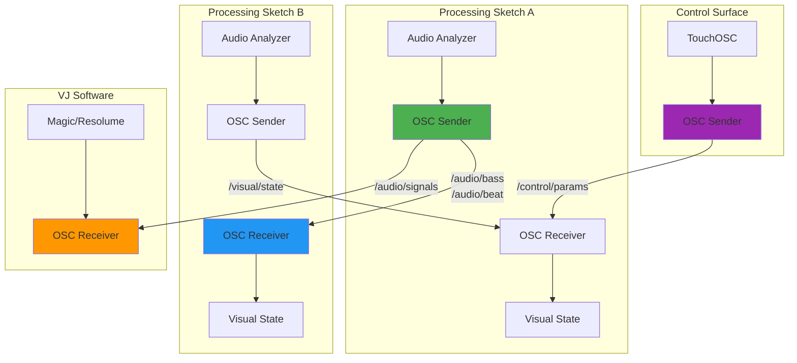
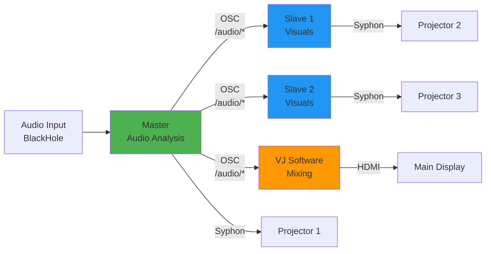

# Interactivity & OSC Integration - MIDI, Network Sync, Syphon

## Overview

This guide covers interactive control systems for Processing VJ visuals: MIDI controllers (Launchpad), OSC network synchronization, and Syphon video output integration.

## Table of Contents

1. [MIDI Controller Integration](#midi-controller-integration)
2. [OSC Network Synchronization](#osc-network-synchronization)
3. [Syphon Output Pipeline](#syphon-output-pipeline)
4. [Multi-Device Coordination](#multi-device-coordination)

---

## MIDI Controller Integration

See [08-code-patterns.md](08-code-patterns.md#launchpadgrid-midi-controller) for complete LaunchpadGrid implementation.

### Quick MIDI Setup

```java
import themidibus.*;

MidiBus launchpad;
boolean hasLaunchpad = false;

void setup() {
  initMidi();
}

void initMidi() {
  String[] inputs = MidiBus.availableInputs();
  for (String dev : inputs) {
    if (dev != null && dev.toLowerCase().contains("launchpad")) {
      try {
        launchpad = new MidiBus(this, dev, dev);
        hasLaunchpad = true;
        println("Launchpad connected: " + dev);
      } catch (Exception e) {
        hasLaunchpad = false;
      }
      break;
    }
  }
}

void noteOn(int channel, int pitch, int velocity) {
  if (!hasLaunchpad) return;
  // Handle MIDI input
}
```

---

## OSC Network Synchronization

OSC (Open Sound Control) enables **zero-latency synchronization** between Processing sketches, VJ software, and external controllers over the network.

### Why OSC for VJ Applications?

- **Higher Resolution**: Float precision vs MIDI's 0-127
- **Network-Based**: Synchronize multiple machines
- **Flexible Addressing**: Hierarchical message paths (`/vj/visual/state`)
- **Bundles with Timing**: Synchronize multiple parameters simultaneously
- **Bidirectional**: Send and receive in same sketch

### Architecture



### Installation

```java
import oscP5.*;
import netP5.*;
```

**Install via Processing IDE:**
1. Sketch → Import Library → Manage Libraries
2. Search "oscP5"
3. Install latest version

### Basic OSC Setup

```java
import oscP5.*;
import netP5.*;

OscP5 oscP5;
NetAddress remoteLocation;

void setup() {
  size(1920, 1080, P3D);
  
  // Listen on port 9000
  oscP5 = new OscP5(this, 9000);
  
  // Send to remote machine (IP, port)
  remoteLocation = new NetAddress("192.168.1.100", 8000);
  
  println("OSC initialized - listening on port 9000");
  println("Sending to " + remoteLocation.address() + ":" + remoteLocation.port());
}

// Receive OSC messages
void oscEvent(OscMessage msg) {
  println("Received: " + msg.addrPattern());
  
  // Handle different message types
  if (msg.checkAddrPattern("/audio/bass")) {
    float bassLevel = msg.get(0).floatValue();
    handleBass(bassLevel);
  }
}
```

### Sending Audio Analysis via OSC

**Complete Audio Broadcast Module:**

```java
class AudioOSCBroadcaster {
  OscP5 oscP5;
  ArrayList<NetAddress> destinations;
  AudioAnalyzer audio;
  
  // OSC address patterns (hierarchical naming)
  static final String ADDR_BASS = "/audio/bass";
  static final String ADDR_MID = "/audio/mid";
  static final String ADDR_HIGH = "/audio/high";
  static final String ADDR_BEAT = "/audio/beat";
  static final String ADDR_BPM = "/audio/bpm";
  static final String ADDR_PHASE = "/audio/phase";
  static final String ADDR_SPECTRUM = "/audio/spectrum";
  static final String ADDR_STATE = "/audio/state";
  
  AudioOSCBroadcaster(PApplet parent, AudioAnalyzer audio, int listenPort) {
    this.audio = audio;
    oscP5 = new OscP5(parent, listenPort);
    destinations = new ArrayList<NetAddress>();
  }
  
  // Add destination for broadcasting
  void addDestination(String ip, int port) {
    destinations.add(new NetAddress(ip, port));
    println("OSC destination added: " + ip + ":" + port);
  }
  
  // Broadcast all audio analysis data
  void broadcast() {
    // Individual frequency bands
    sendFloat(ADDR_BASS, audio.getBass());
    sendFloat(ADDR_MID, audio.getMid());
    sendFloat(ADDR_HIGH, audio.getHigh());
    
    // Beat detection
    if (audio.isBeat()) {
      sendBang(ADDR_BEAT);  // Trigger event
    }
    
    // BPM and phase
    sendFloat(ADDR_BPM, audio.getBPM());
    sendFloat(ADDR_PHASE, audio.getBeatPhase());
    
    // Full spectrum (8 bands)
    sendFloatArray(ADDR_SPECTRUM, audio.getSpectrum());
    
    // Bundled state (all at once with timestamp)
    sendAudioStateBundle();
  }
  
  // Send complete audio state as OSC bundle (synchronized)
  void sendAudioStateBundle() {
    OscBundle bundle = new OscBundle();
    
    // Add all messages to bundle
    bundle.add(new OscMessage(ADDR_BASS).add(audio.getBass()));
    bundle.add(new OscMessage(ADDR_MID).add(audio.getMid()));
    bundle.add(new OscMessage(ADDR_HIGH).add(audio.getHigh()));
    bundle.add(new OscMessage(ADDR_BPM).add(audio.getBPM()));
    bundle.add(new OscMessage(ADDR_PHASE).add(audio.getBeatPhase()));
    
    // Set timetag for synchronized execution
    bundle.setTimetag(OscBundle.now() + 10);  // 10ms in future
    
    // Broadcast to all destinations
    for (NetAddress dest : destinations) {
      oscP5.send(bundle, dest);
    }
  }
  
  // Helper: Send single float
  void sendFloat(String address, float value) {
    OscMessage msg = new OscMessage(address);
    msg.add(value);
    
    for (NetAddress dest : destinations) {
      oscP5.send(msg, dest);
    }
  }
  
  // Helper: Send bang (event trigger)
  void sendBang(String address) {
    OscMessage msg = new OscMessage(address);
    
    for (NetAddress dest : destinations) {
      oscP5.send(msg, dest);
    }
  }
  
  // Helper: Send float array
  void sendFloatArray(String address, float[] values) {
    OscMessage msg = new OscMessage(address);
    
    for (float v : values) {
      msg.add(v);
    }
    
    for (NetAddress dest : destinations) {
      oscP5.send(msg, dest);
    }
  }
}

// Usage
AudioOSCBroadcaster oscBroadcast;

void setup() {
  AudioAnalyzer audio = new AudioAnalyzer(this);
  oscBroadcast = new AudioOSCBroadcaster(this, audio, 9000);
  
  // Add destinations
  oscBroadcast.addDestination("192.168.1.100", 8000);  // Another Processing sketch
  oscBroadcast.addDestination("192.168.1.101", 8001);  // VJ software
  oscBroadcast.addDestination("127.0.0.1", 8002);      // Localhost
}

void draw() {
  audio.update();
  oscBroadcast.broadcast();  // Send audio analysis every frame
  
  // Your visuals...
}
```

### Receiving Audio Signals from OSC

```java
class AudioOSCReceiver {
  OscP5 oscP5;
  
  // Received audio state
  float bassLevel = 0;
  float midLevel = 0;
  float highLevel = 0;
  boolean beatFlag = false;
  float bpm = 120;
  float phase = 0;
  float[] spectrum = new float[8];
  
  AudioOSCReceiver(PApplet parent, int listenPort) {
    oscP5 = new OscP5(parent, listenPort);
    println("OSC listening on port " + listenPort);
  }
  
  // Process incoming messages
  void oscEvent(OscMessage msg) {
    String addr = msg.addrPattern();
    
    if (addr.equals("/audio/bass")) {
      bassLevel = msg.get(0).floatValue();
    }
    else if (addr.equals("/audio/mid")) {
      midLevel = msg.get(0).floatValue();
    }
    else if (addr.equals("/audio/high")) {
      highLevel = msg.get(0).floatValue();
    }
    else if (addr.equals("/audio/beat")) {
      beatFlag = true;  // Will be reset after use
    }
    else if (addr.equals("/audio/bpm")) {
      bpm = msg.get(0).floatValue();
    }
    else if (addr.equals("/audio/phase")) {
      phase = msg.get(0).floatValue();
    }
    else if (addr.equals("/audio/spectrum")) {
      for (int i = 0; i < min(8, msg.size()); i++) {
        spectrum[i] = msg.get(i).floatValue();
      }
    }
  }
  
  // Public API (matches AudioAnalyzer)
  float getBass() { return bassLevel; }
  float getMid() { return midLevel; }
  float getHigh() { return highLevel; }
  boolean isBeat() {
    boolean result = beatFlag;
    beatFlag = false;  // Reset after reading
    return result;
  }
  float getBPM() { return bpm; }
  float getBeatPhase() { return phase; }
  float[] getSpectrum() { return spectrum; }
}

// Usage: Receive audio from another machine
AudioOSCReceiver oscAudio;

void setup() {
  oscAudio = new AudioOSCReceiver(this, 8000);  // Listen on port 8000
}

void draw() {
  // Use OSC-received audio instead of local analysis
  float bass = oscAudio.getBass();
  
  if (oscAudio.isBeat()) {
    explode();
  }
  
  // Visuals react to remote audio analysis...
}
```

### Visual State Synchronization

Broadcast your visual state to sync multiple displays:

```java
class VisualOSCBroadcaster {
  OscP5 oscP5;
  NetAddress destination;
  
  VisualOSCBroadcaster(PApplet parent, String ip, int port) {
    oscP5 = new OscP5(parent, 9001);  // Different port for visual state
    destination = new NetAddress(ip, port);
  }
  
  // Send visual state
  void sendState(int currentLevel, float hueShift, float zoom, boolean effect) {
    OscMessage msg = new OscMessage("/visual/state");
    msg.add(currentLevel);  // Level/scene index
    msg.add(hueShift);      // Color shift amount
    msg.add(zoom);          // Camera zoom
    msg.add(effect ? 1 : 0); // Effect enabled
    
    oscP5.send(msg, destination);
  }
  
  // Send particle spawn event
  void sendParticleSpawn(float x, float y, int count, float hue) {
    OscMessage msg = new OscMessage("/visual/particles/spawn");
    msg.add(x);
    msg.add(y);
    msg.add(count);
    msg.add(hue);
    
    oscP5.send(msg, destination);
  }
  
  // Send camera position
  void sendCameraPos(float camX, float camY, float camZ) {
    OscMessage msg = new OscMessage("/visual/camera");
    msg.add(camX);
    msg.add(camY);
    msg.add(camZ);
    
    oscP5.send(msg, destination);
  }
}
```

### OSC Best Practices

#### Address Pattern Convention

Use hierarchical naming for clarity:

```
/audio/bass          # Audio analysis
/audio/mid
/audio/beat
/audio/bpm

/visual/state        # Visual state
/visual/camera
/visual/particles/spawn
/visual/effect/enable

/control/level       # Control inputs
/control/param/hue
/control/param/zoom
```

#### Performance Optimization

```java
// ❌ BAD: Send every frame (60 FPS = high network load)
void draw() {
  sendOSC(every_parameter);
}

// ✅ GOOD: Send only on change or at lower rate
int lastOSCTime = 0;
int oscInterval = 50;  // 20 Hz instead of 60 Hz

void draw() {
  if (millis() - lastOSCTime > oscInterval) {
    sendOSC(changed_parameters);
    lastOSCTime = millis();
  }
}
```

#### Error Handling

```java
try {
  oscP5.send(msg, destination);
} catch (Exception e) {
  println("OSC send failed: " + e.getMessage());
}
```

---

## Syphon Output Pipeline

See [00-overview.md](00-overview.md#system-architecture) for complete Syphon integration.

### Zero-Latency Frame Sharing

```java
import codeanticode.syphon.*;

SyphonServer syphon;

void setup() {
  size(1920, 1080, P3D);
  syphon = new SyphonServer(this, "ProcessingVJ");
}

void draw() {
  // Your visuals...
  background(0);
  // ... render ...
  
  // Send to VJ software (always last)
  syphon.sendScreen();
}
```

---

## Multi-Device Coordination

### Scenario: Master + Slave Configuration

**Master Sketch (Audio Analysis + Broadcast):**

```java
AudioAnalyzer audio;
AudioOSCBroadcaster oscBroadcast;
SyphonServer syphon;

void setup() {
  size(1920, 1080, P3D);
  
  // Analyze local audio
  audio = new AudioAnalyzer(this);
  
  // Broadcast to slaves
  oscBroadcast = new AudioOSCBroadcaster(this, audio, 9000);
  oscBroadcast.addDestination("192.168.1.101", 8000);  // Slave 1
  oscBroadcast.addDestination("192.168.1.102", 8000);  // Slave 2
  
  // Output to projector 1
  syphon = new SyphonServer(this, "Master");
}

void draw() {
  audio.update();
  oscBroadcast.broadcast();
  
  // Master visuals
  background(0);
  drawMasterVisuals(audio);
  
  syphon.sendScreen();
}
```

**Slave Sketch (OSC Receive + Different Visuals):**

```java
AudioOSCReceiver oscAudio;
SyphonServer syphon;

void setup() {
  size(1920, 1080, P3D);
  
  // Receive audio from master
  oscAudio = new AudioOSCReceiver(this, 8000);
  
  // Output to projector 2
  syphon = new SyphonServer(this, "Slave1");
}

void draw() {
  // Use remote audio analysis
  float bass = oscAudio.getBass();
  
  // Different visuals but synchronized
  background(0);
  drawSlaveVisuals(bass, oscAudio.getMid(), oscAudio.getHigh());
  
  syphon.sendScreen();
}

void oscEvent(OscMessage msg) {
  oscAudio.oscEvent(msg);  // Forward to receiver
}
```

### Network Configuration

```
Master: 192.168.1.100:9000 (send) + 192.168.1.100:9001 (listen)
Slave1: 192.168.1.101:8000 (listen)
Slave2: 192.168.1.102:8000 (listen)
VJ Soft: 192.168.1.105:8001 (listen)
```

**Connection Diagram:**



---

## Summary

### OSC vs MIDI

| Feature | OSC | MIDI |
|---------|-----|------|
| Resolution | Float (32-bit) | 0-127 (7-bit) |
| Transport | Network (UDP/TCP) | Serial/USB |
| Latency | <1ms (LAN) | <5ms |
| Addressing | Hierarchical paths | Channel/Note |
| Bidirectional | Yes | Limited |
| Best for | Sync, parameters | Hardware controllers |

### When to Use OSC

- ✅ Synchronize multiple Processing sketches
- ✅ Broadcast audio analysis to VJ software
- ✅ Network control (TouchOSC, tablets)
- ✅ High-precision parameter control
- ✅ Timestamped event synchronization

### When to Use MIDI

- ✅ Hardware controllers (Launchpad, MIDImix)
- ✅ Simple pad/button input
- ✅ Single-machine setup
- ✅ Standard VJ controller workflows

---

**Next**: [07-performance-optimization.md](07-performance-optimization.md) - Profiling and optimization

**Previous**: [04-fluid-simulations.md](04-fluid-simulations.md) - Fluid dynamics

**Code Patterns**: [08-code-patterns.md](08-code-patterns.md) - OSC broadcast/receive modules
