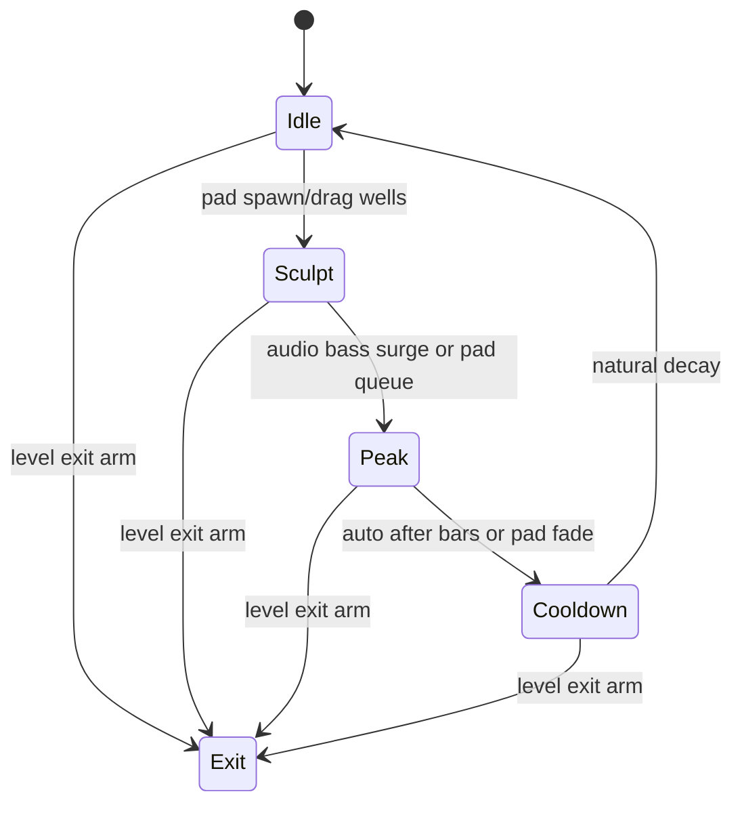

# Level 01: Gravity Wells in a Particle Galaxy

```text
      *       *             *
        *   ↘   ⭕︎  ↙   *
     *      ↖   ●   ↗      *
          *     *      *
```

## Overview

Starfield that swirls and shears around moving invisible wells; spirals, warped streams, lensing-like bends.

## Launchpad Controls

| Row | Columns | Function |
|-----|---------|----------|
| **Middle rows** | 0–7 | Place/enable wells (velocity = strength) |
| **Row 5** | 0–3 | Gravity strength (tap-to-cycle) |
| **Row 5** | 4–5 | Drag (tap-to-cycle) |
| **Row 5** | 6–7 | Trail length (tap-to-cycle) |
| **Row 4** | 0–3 | Noise in velocity (tap-to-cycle) |
| **Row 4** | 4–7 | Well falloff (tap-to-cycle) |
| **Scene buttons** | — | Well presets / clear |

## Audio Reactivity

- **Bass:** boosts inward pull
- **Highs:** spawn short-lived "spark" particles

## Implementation Notes

- N-body-lite with softened force: `force = m / (d² + ε)`
- Use additive blending + fading trails via framebuffer
- Mouse or pad positions map to normalized viewport

## State Machine



- **Idle:** always-on drift keeps particles subtly moving
- **Sculpt → Peak:** pads advance between states
- **Scene buttons:** arm Exit for global state manager

## References

- [Daniel Shiffman's attraction example](https://processing.org/examples/forces.html)
- [Syphon for Processing](https://github.com/Syphon/Syphon-Processing)

## Related

- [Common Reference](./00-common.md)
- [Implementation Plan — Phase 6.1](../../development/processing-implementation-plan.md#61-level-gravity-wells-in-a-particle-galaxy)
