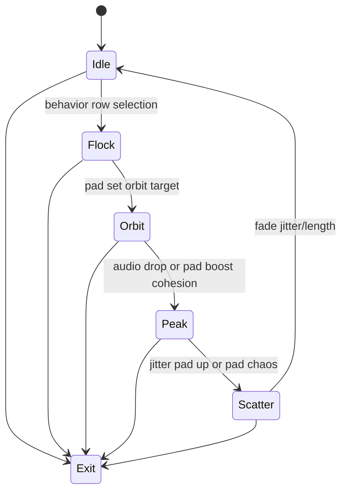

# Level 03: Crowd of Agents Drawing Light Trails

```text
agents ➜ trails ➜ buffer fade
```

## Overview

Hundreds of walkers paint long-exposure ribbons; forms calligraphic tunnels and swirls.

## Launchpad Controls

| Row | Columns | Function |
|-----|---------|----------|
| **Row 7** | 0–7 | Select behavior set (seek/orbit/flee/flock) |
| **Row 6** | 0–7 | Toggle trail style per column |
| **Row 5** | 0–1 | Speed (tap-to-cycle) |
| **Row 5** | 2–3 | Steering jitter (tap-to-cycle) |
| **Row 5** | 4–5 | Trail length (tap-to-cycle) |
| **Row 5** | 6–7 | Cohesion (tap-to-cycle) |
| **Row 4** | 0–3 | Alignment weight (tap-to-cycle) |
| **Row 4** | 4–7 | Separation (tap-to-cycle) |
| **Scene buttons** | — | Randomize goal points |

## Audio Reactivity

- **Bass:** raises cohesion (agents clump)
- **Highs:** add jitter/chaos

## Implementation Notes

- Simple boids/steering with offscreen buffer that fades each frame
- Use `PGraphics` with additive blending
- Occasional Perlin flow fields for variation

## State Machine



- **Idle:** agents always wander lightly even at rest
- **Row 7 pads:** hop behaviors (Idle→Flock/Orbit)
- **Pad chaos or bass:** sends to Peak
- **Scene button:** arms Exit

## References

- [Reza Ali's boids writeup](https://www.syedrezaali.com/boids)
- [Daniel Shiffman's boids sketches](https://processing.org/examples/flocking.html)
- Magic/Synesthesia color grading on top

## Related

- [Common Reference](./00-common.md)
- [Implementation Plan — Phase 6.3](../../development/processing-implementation-plan.md#63-level-crowd-of-agents-drawing-light-trails)
