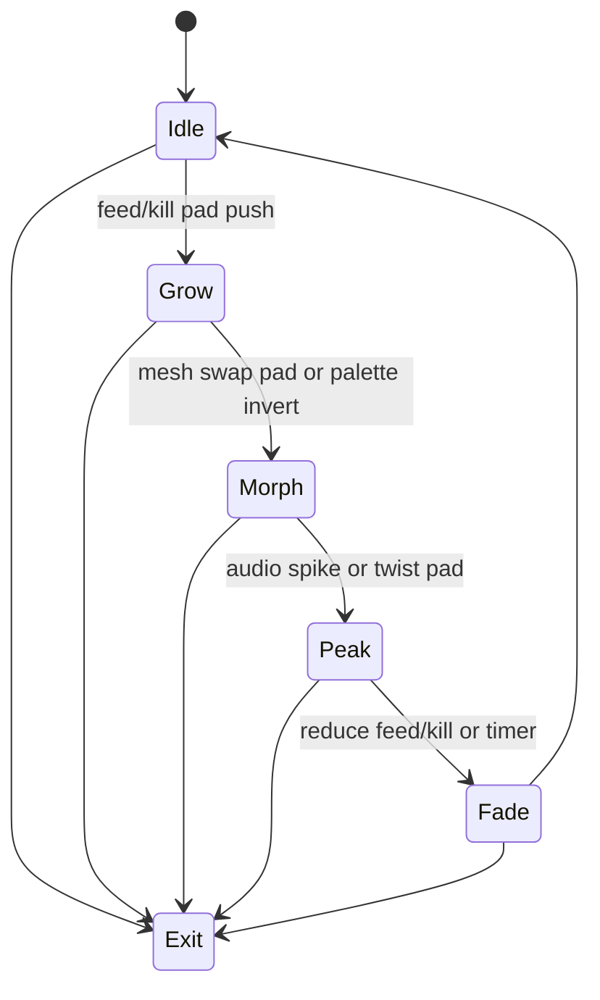

# Level 04: Reaction–Diffusion Skin on 3D Shapes

```text
2D RD buffer → texture → sphere/torus
```

## Overview

Zebra/coral patterns crawling over spheres, torii, or extruded text; hypnotic morphing surface.

## Launchpad Controls

| Row | Columns | Function |
|-----|---------|----------|
| **Row 6** | 0–7 | Toggle lighting, palette inversion, wireframe |
| **Row 5** | 0–7 | Choose mesh (sphere/torus/text/logo variants) |
| **Row 4** | 0–3 | Feed rate (tap-to-cycle) |
| **Row 4** | 4–7 | Kill rate (tap-to-cycle) |
| **Row 3** | 0–3 | Diffusion ratio (tap-to-cycle) |
| **Row 3** | 4–7 | Timestep (tap-to-cycle) |
| **Scene buttons** | — | Hold + tap for fine-tune |

LED color shows current mesh selection.

## Audio Reactivity

- **General:** modulate pattern speed or contrast
- **Kicks:** trigger color palette shifts

## Implementation Notes

- Run Gray–Scott RD on `PGraphics` (ping-pong buffers)
- Upload as texture to a `PShape`
- Keep RD size modest (256–512) for speed
- Use `shader()` for lit look

## State Machine



- **Idle:** RD buffer keeps slow crawl
- **Pads:** drive mesh swap (Morph) and advance growth stages
- **Scene button:** arms Exit

## References

- [Karl Sims RD](http://www.karlsims.com/rd.html)
- [Processing texture mapping docs](https://processing.org/tutorials/textures/)

## Related

- [Common Reference](./00-common.md)
- [Implementation Plan — Phase 6.4](../../development/processing-implementation-plan.md#64-level-reactiondiffusion-skin-on-3d-shapes)
