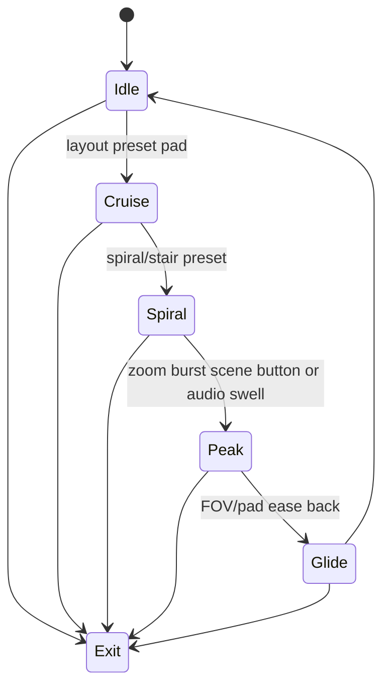

# Level 05: Recursive City / Escher-Style Camera Ride

```text
city block ➜ instanced grid ➜ camera spiral
```

## Overview

Infinite-feel highways or towers repeating and folding; demo-scene tunnel vibes.

## Launchpad Controls

| Row | Columns | Function |
|-----|---------|----------|
| **Row 7** | 0–7 | Choose layout presets (grid/spiral/stair) |
| **Row 6** | 0–7 | Toggle mirror and fog |
| **Row 5** | 0–1 | Camera speed (tap-to-cycle) |
| **Row 5** | 2–3 | FOV (tap-to-cycle) |
| **Row 5** | 4–5 | Recursion depth (tap-to-cycle) |
| **Row 5** | 6–7 | Scale (tap-to-cycle) |
| **Scene buttons** | — | Punch-in "zoom burst" or "rotate 90°" |

## Audio Reactivity

- **Kick:** subtle camera shake
- **Fills:** zoom pulses

## Implementation Notes

- Build one modular block; instance via nested transforms
- Frustum culling keeps FPS
- Screen-space reflections or simple emissive windows for night-city look

## State Machine



- **Idle:** city drones slowly (camera drift)
- **Top-row pads:** step presets (Idle→Cruise→Spiral)
- **Scene buttons:** trigger Peak and can arm Exit

## References

- [Processing instancing via `pushMatrix`/`popMatrix`](https://processing.org/reference/pushMatrix_.html)
- Demoscene "city flythrough" clips for palette ideas

## Related

- [Common Reference](./00-common.md)
- [Implementation Plan — Phase 6.5](../../development/processing-implementation-plan.md#65-level-recursive-city--escher-camera-ride)
