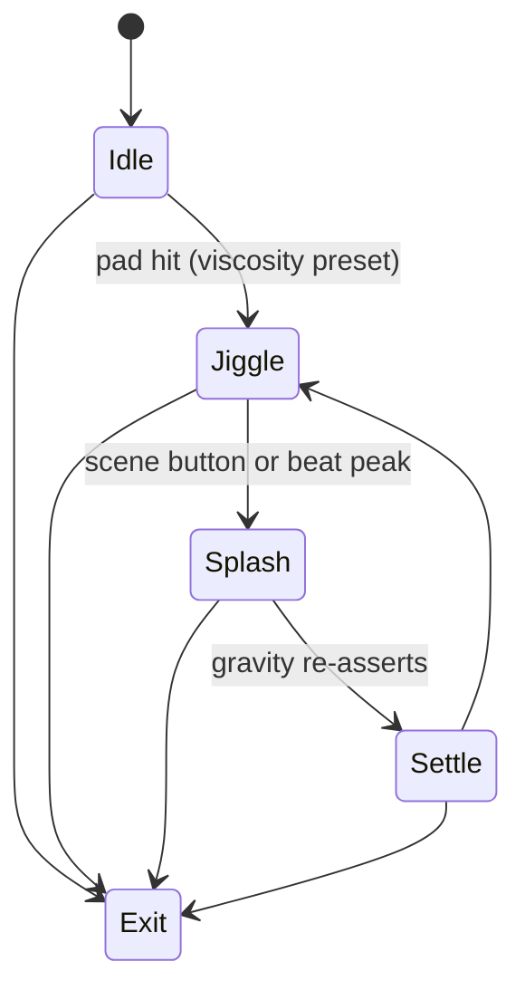

# Level 06: Non-Newtonian Liquid Floor

```text
physics soup ➜ viscosity control ➜ splash response
```

## Overview

Squishy, chunky blobs that respond like cornstarch goo—balls settle slowly on calm, spike on hit.

## Launchpad Controls

| Row | Columns | Function |
|-----|---------|----------|
| **Row 7** | 0–7 | Preset viscosity (water → honey → cornstarch) |
| **Row 6** | 0–7 | Preset color palette |
| **Row 5** | 0–1 | Gravity (tap-to-cycle) |
| **Row 5** | 2–3 | Damping (tap-to-cycle) |
| **Row 5** | 4–5 | Blob count (tap-to-cycle) |
| **Row 5** | 6–7 | Surface tension (tap-to-cycle) |
| **Scene buttons** | — | Punch-in huge splash or quake |

## Audio Reactivity

- **Bass:** floor punch
- **Presence:** idle ripple intensity

## Implementation Notes

- Metaball shading via shader (`distance` field) or geometry fallback
- Verlet soft-body for cheap physics
- Alpha-trail for trailing goo surface

## State Machine



- **Idle:** gentle wobble (viscosity-based drift)
- **Scene buttons:** big splash → Settle → loop back

## References

- [PixelFlow fluid example](https://github.com/diwi/PixelFlow)
- Verlet integration tutorials

## Related

- [Common Reference](./00-common.md)
- [Implementation Plan — Phase 6.6](../../development/processing-implementation-plan.md#66-level-non-newtonian-liquid-floor)
