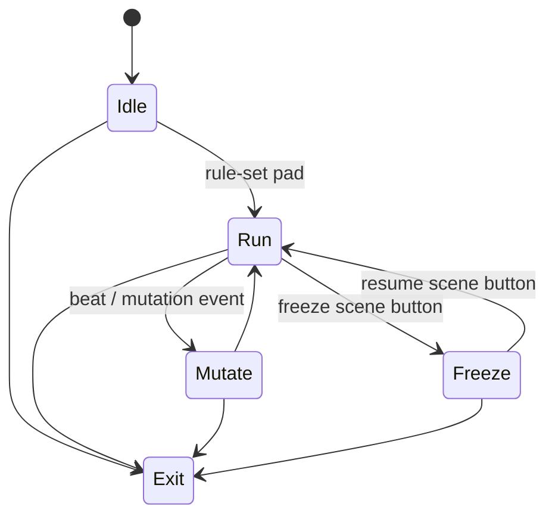

# Level 07: Cellular Automata Zoo

```text
cells ➜ rules ➜ live mutations
```

## Overview

GoL, Wolfram 1-D, Brian's Brain, and custom rules — switch between them live, mutating colony colors per beat.

## Launchpad Controls

| Row | Columns | Function |
|-----|---------|----------|
| **Rows 7–6** | 0–7 | Select CA rule set (16 presets) |
| **Row 5** | 0–1 | Speed (tap-to-cycle) |
| **Row 5** | 2–3 | Grid scale (tap-to-cycle) |
| **Row 5** | 4–5 | Randomness seed (tap-to-cycle) |
| **Row 5** | 6–7 | Mutation rate (tap-to-cycle) |
| **Scene buttons** | — | Re-seed entire grid, inject glider/spaceship, freeze/resume |

## Audio Reactivity

- **Any hit:** color pulse
- **BPM:** ticks stepping if in sync mode

## Implementation Notes

- Shader-based double-buffer CA for GPU speed
- CPU fallback okay at 256×256 or smaller
- Store 4–8 "famous" patterns as injectable gliders

## State Machine



- **Idle:** blank grid
- **Run:** CA evolving
- **Mutate:** on-beat color/rule tweak
- **Freeze/Resume:** hold state for dramatic pause

## References

- [Elementary Cellular Automata (Wolfram)](https://mathworld.wolfram.com/ElementaryCellularAutomaton.html)
- [LifeWiki Patterns](https://conwaylife.com/wiki/)

## Related

- [Common Reference](./00-common.md)
- [Implementation Plan — Phase 6.7](../../development/processing-implementation-plan.md#67-level-cellular-automata-zoo)
