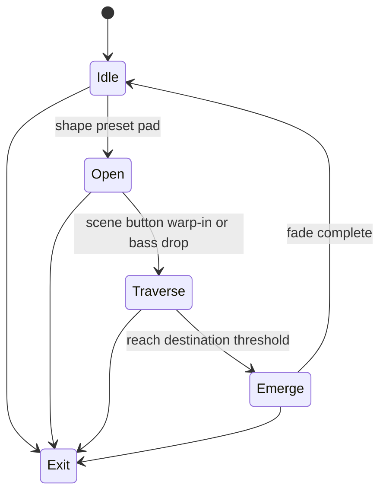

# Level 08: Wormhole / Portal Raymarcher

```text
portal mouth ➜ tunnel ➜ destination world
```

## Overview

Raymarched tunnel or portal ring; pass through to alternate color-space or mirrored world.

## Launchpad Controls

| Row | Columns | Function |
|-----|---------|----------|
| **Row 7** | 0–7 | Portal shape presets (ring/hexagon/black-hole) |
| **Row 6** | 0–7 | Destination palette |
| **Row 5** | 0–1 | Tunnel speed (tap-to-cycle) |
| **Row 5** | 2–3 | Distortion strength (tap-to-cycle) |
| **Row 5** | 4–5 | Glow intensity (tap-to-cycle) |
| **Row 5** | 6–7 | Aperture size (tap-to-cycle) |
| **Scene buttons** | — | Trigger warp-in, warp-out, color invert |

## Audio Reactivity

- **Drops:** warp speed spike
- **Sustained bass:** tunnel stretches

## Implementation Notes

- Raymarching shader in GLSL or PixelFlow
- Start simple (torus SDF) then add noise warp
- Can crossfade from previous level into portal frame

## State Machine



- **Idle:** portal dormant (subtle ring glow)
- **Open:** ring expands, glow intensifies
- **Traverse:** camera flies through
- **Emerge:** fade/blend to new palette, returns to Idle

## References

- [Shadertoy wormhole shaders](https://www.shadertoy.com/results?query=wormhole)
- [Inigo Quilez SDF functions](https://iquilezles.org/articles/distfunctions/)

## Related

- [Common Reference](./00-common.md)
- [Implementation Plan — Phase 6.8](../../development/processing-implementation-plan.md#68-level-wormhole--portal-raymarcher)
