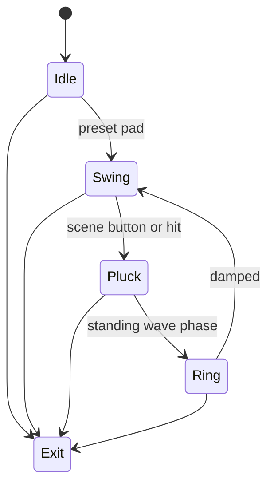

# Level 09: String Theory / Rope Simulation

```text
ropes ➜ verlet ➜ tangle physics
```

## Overview

Elastic ropes swing, pluck, braid in real-time; strum them to create standing waves.

## Launchpad Controls

| Row | Columns | Function |
|-----|---------|----------|
| **Row 7** | 0–7 | Rope preset (single, double, braid, web) |
| **Row 6** | 0–7 | Stiffness presets (floppy → taut) |
| **Row 5** | 0–1 | Segment count (tap-to-cycle) |
| **Row 5** | 2–3 | Gravity (tap-to-cycle) |
| **Row 5** | 4–5 | Damping (tap-to-cycle) |
| **Row 5** | 6–7 | Anchor mode (fixed/free endpoints) |
| **Scene buttons** | — | Pluck all ropes, freeze, release |

## Audio Reactivity

- **Snare/clap:** pluck nearest rope node
- **Swell:** gravity modulation

## Implementation Notes

- Verlet integrator (easy to code, stable)
- Constraints: distance between nodes
- OpenGL line strip or bezier curves for smooth look

## State Machine



- **Idle:** ropes hang still
- **Swing:** gentle sway
- **Pluck:** impulse applied
- **Ring:** oscillation before damping returns to Swing

## References

- [Verlet integration tutorial](https://gamedevelopment.tutsplus.com/tutorials/simulate-tearable-cloth-and-ragdolls-with-simple-verlet-integration--gamedev-519)
- Processing chain/rope demos

## Related

- [Common Reference](./00-common.md)
- [Implementation Plan — Phase 6.9](../../development/processing-implementation-plan.md#69-level-string-theory--rope-simulation)
