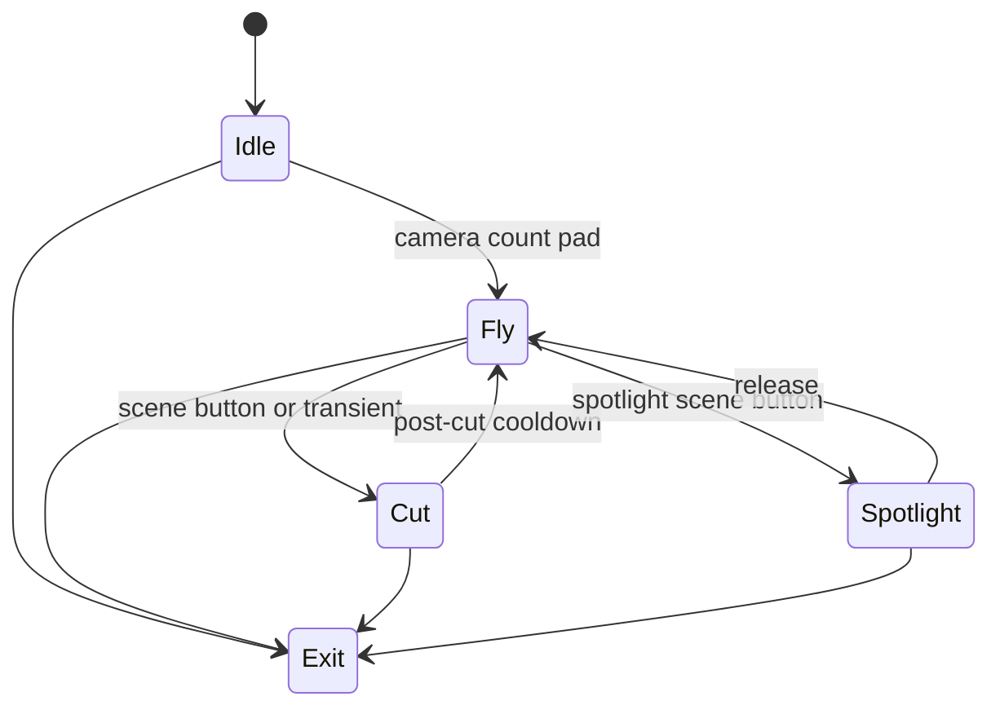

# Level 11: Intelligent Swarm Cameras

```text
many eyes ➜ swarm logic ➜ point-of-view cuts
```

## Overview

Multiple virtual cameras behave as a flock; cut between them or blend for surveillance-room aesthetic.

## Launchpad Controls

| Row | Columns | Function |
|-----|---------|----------|
| **Row 7** | 0–7 | Camera count preset (1/4/9/16/25/36/etc.) |
| **Row 6** | 0–7 | Grid layout / composition preset |
| **Row 5** | 0–1 | Swarm cohesion (tap-to-cycle) |
| **Row 5** | 2–3 | Cut frequency (tap-to-cycle) |
| **Row 5** | 4–5 | Blend mode (hard cut / crossfade / wipe) |
| **Row 5** | 6–7 | Zoom variation (tap-to-cycle) |
| **Scene buttons** | — | Force cut, spotlight single cam, reset swarm |

## Audio Reactivity

- **Transients:** trigger cuts
- **Dynamics:** blend speed

## Implementation Notes

- PGraphics per camera, composite into grid
- Boid rules for camera position/look-at target
- Keep frame budget: max 9 cams @ 1080p typically

## State Machine



- **Idle:** static single-cam
- **Fly:** swarm cameras moving
- **Cut:** transition between views
- **Spotlight:** single cam zooms full screen

## References

- [Reynolds boids](https://www.red3d.com/cwr/boids/)
- Multi-PGraphics rendering pattern in Processing

## Related

- [Common Reference](./00-common.md)
- [Implementation Plan — Phase 6.11](../../development/processing-implementation-plan.md#611-level-intelligent-swarm-cameras)
