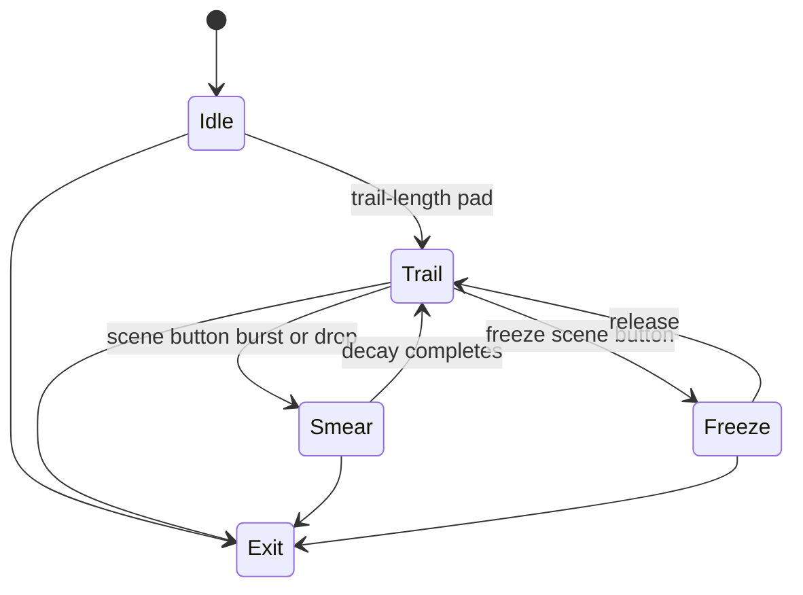

# Level 12: Time-Smear / History Trails

```text
frames ➜ delay line ➜ ghosting composite
```

## Overview

Past frames blend behind current geometry; motion trails, echo effects, temporal recursion.

## Launchpad Controls

| Row | Columns | Function |
|-----|---------|----------|
| **Row 7** | 0–7 | Trail length presets (2–60 frames) |
| **Row 6** | 0–7 | Blend mode (additive / multiply / screen / difference) |
| **Row 5** | 0–1 | Decay rate (tap-to-cycle) |
| **Row 5** | 2–3 | Frame skip (tap-to-cycle) |
| **Row 5** | 4–5 | Color shift per frame (tap-to-cycle) |
| **Row 5** | 6–7 | Opacity (tap-to-cycle) |
| **Scene buttons** | — | Clear history, freeze stack, reverse playback |

## Audio Reactivity

- **Drops:** burst-smear (long trail sudden)
- **Calm:** shorter, subtle trails

## Implementation Notes

- Ring buffer of PGraphics frames
- Composite N frames with decreasing opacity
- VRAM budget: limit history depth at high res

## State Machine



- **Idle:** no trail effect
- **Trail:** active ghosting
- **Smear:** extended burst
- **Freeze:** stack paused, creating strobe/echo

## References

- Processing frame-buffer history demos
- PixelFlow feedback examples

## Related

- [Common Reference](./00-common.md)
- [Implementation Plan — Phase 6.12](../processing-implementation-plan.md#612-level-time-smear--history-trails)
