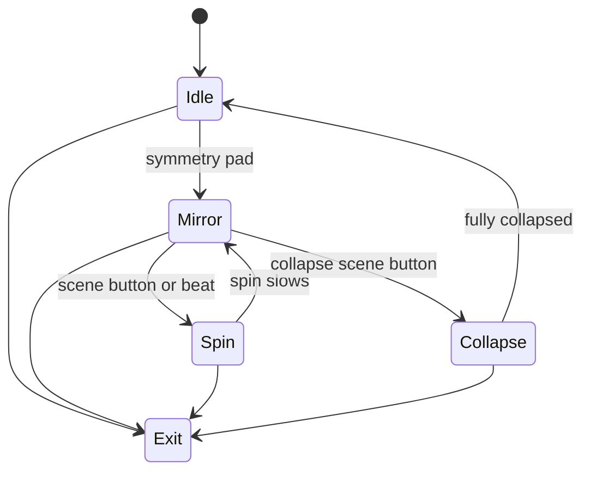

# Level 13: Split Reality / Mirror Rooms

```text
world ➜ kaleidoscope splits ➜ infinite reflections
```

## Overview

Scene is sliced and mirrored in real-time; 2/4/8-fold symmetry, portal mirrors, infinity rooms.

## Launchpad Controls

| Row | Columns | Function |
|-----|---------|----------|
| **Row 7** | 0–7 | Symmetry fold presets (2/4/6/8-way, radial, etc.) |
| **Row 6** | 0–7 | Mirror axis presets (horizontal/vertical/diagonal combos) |
| **Row 5** | 0–1 | Rotation offset (tap-to-cycle) |
| **Row 5** | 2–3 | Zoom (tap-to-cycle) |
| **Row 5** | 4–5 | Edge blur (tap-to-cycle) |
| **Row 5** | 6–7 | Color tint per segment (tap-to-cycle) |
| **Scene buttons** | — | Kaleidoscope spin, invert, collapse to center |

## Audio Reactivity

- **Beat:** spin impulse
- **Swell:** fold count morphs

## Implementation Notes

- UV remapping in shader or geometry-based slice
- For geometry: render scene to texture, draw quads with mirrored UVs
- Shader approach: polar coords + modulo for radial symmetry

## State Machine



- **Idle:** no mirror effect (or subtle 2-fold)
- **Mirror:** active symmetry
- **Spin:** continuous rotation
- **Collapse:** segments converge to single point

## References

- [Shadertoy kaleidoscope examples](https://www.shadertoy.com/results?query=kaleidoscope)
- Processing PShader mirroring tutorials

## Related

- [Common Reference](./00-common.md)
- [Implementation Plan — Phase 6.13](../../development/processing-implementation-plan.md#613-level-split-reality--mirror-rooms)
