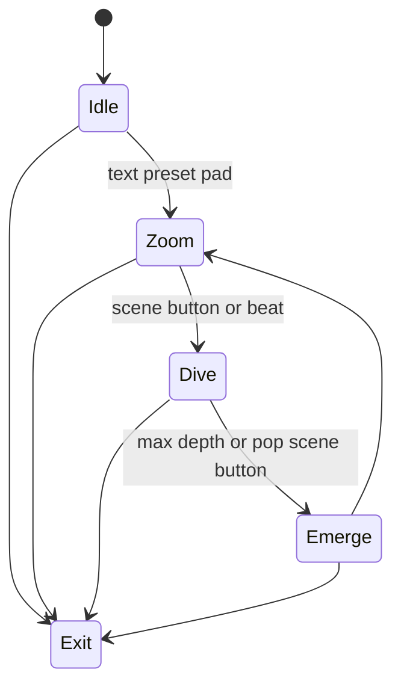

# Level 14: Recursive Text Engine

```text
text ➜ glyphs ➜ nested zoom
```

## Overview

Words/phrases render, zoom into letter strokes revealing more text; fractal typography.

## Launchpad Controls

| Row | Columns | Function |
|-----|---------|----------|
| **Row 7** | 0–7 | Text preset bank (slogans, lyrics, abstract glyphs) |
| **Row 6** | 0–7 | Font style presets |
| **Row 5** | 0–1 | Zoom depth (tap-to-cycle) |
| **Row 5** | 2–3 | Speed (tap-to-cycle) |
| **Row 5** | 4–5 | Color scheme (tap-to-cycle) |
| **Row 5** | 6–7 | Glow / outline (tap-to-cycle) |
| **Scene buttons** | — | Dive in, pop out, change phrase |

## Audio Reactivity

- **Beat:** zoom pulse
- **Lyrics cue (if MIDI timed):** phrase swap

## Implementation Notes

- Render text to offscreen buffer
- Sample buffer as texture for nested render
- Limit recursion depth to ~5 for perf

## State Machine



- **Idle:** static phrase
- **Zoom:** gentle drift into text
- **Dive:** accelerating zoom, reveals nested layers
- **Emerge:** reverse zoom out

## References

- Processing `textToPoints()` for glyph geometry
- Fractal zoom videos for motion reference

## Related

- [Common Reference](./00-common.md)
- [Implementation Plan — Phase 6.14](../../development/processing-implementation-plan.md#614-level-recursive-text-engine)
