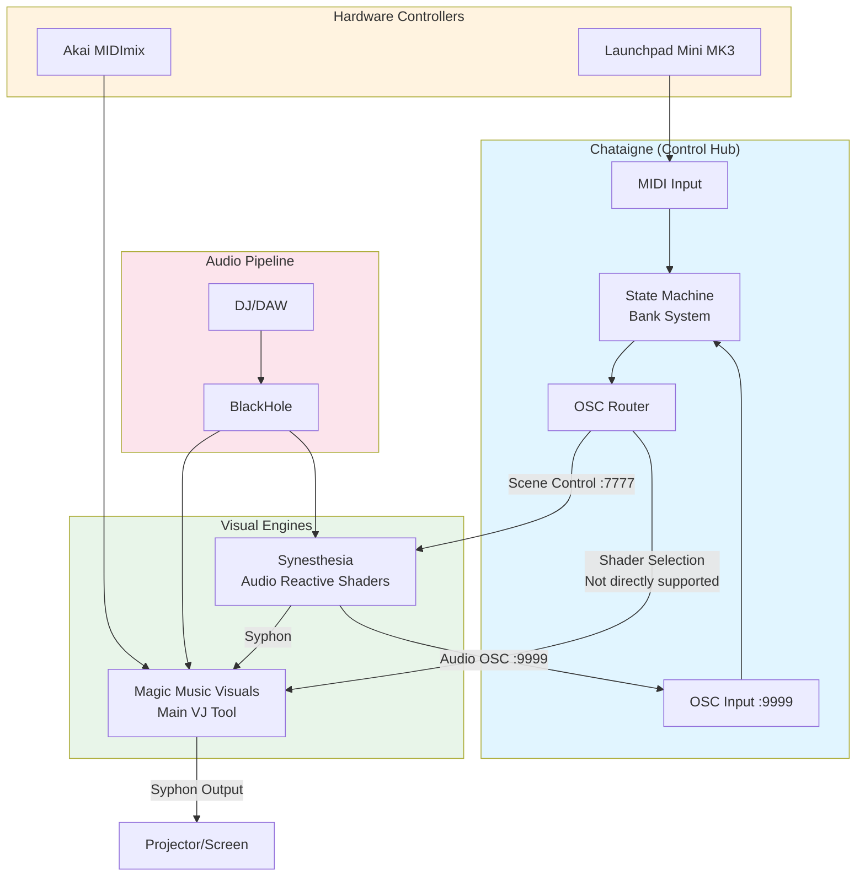
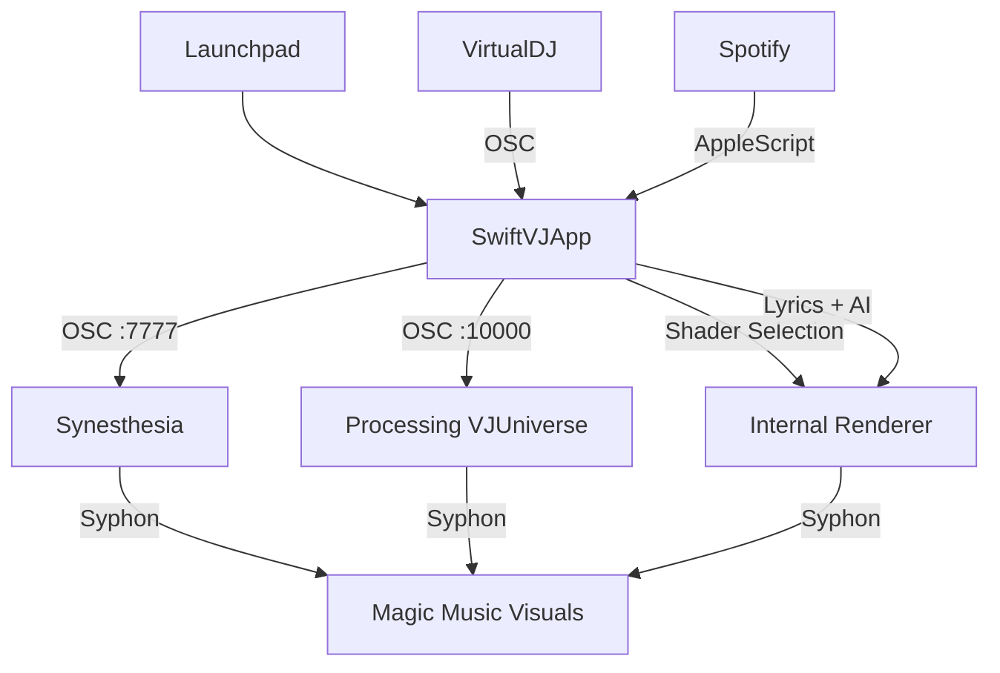

# Chataigne + Magic Music Visuals: SwiftVJApp Replacement Guide

**Status**: Production-Ready Architecture  
**Last Updated**: 2026-01-08

This guide explains how to use Chataigne as the central control hub instead of SwiftVJApp, focusing on a 400-shader library with Magic Music Visuals and Synesthesia as the primary VJ tools.

---

## Table of Contents

1. [Architecture Overview](#architecture-overview)
2. [What SwiftVJApp Does](#what-swiftvjapp-does)
3. [What to Keep vs Replace](#what-to-keep-vs-replace)
4. [Chataigne Setup](#chataigne-setup)
5. [400 Shader Library Organization](#400-shader-library-organization)
6. [Magic Music Visuals as Main VJ Tool](#magic-music-visuals-as-main-vj-tool)
7. [Shader Masks in Magic & Synesthesia](#shader-masks-in-magic--synesthesia)
8. [Complete Workflow](#complete-workflow)
9. [Migration from SwiftVJApp](#migration-from-swiftvjapp)

---

## Architecture Overview

### New Architecture (Chataigne-Based)



### Old Architecture (SwiftVJApp-Based)



---

## What SwiftVJApp Does

SwiftVJApp is a comprehensive macOS application that provides:

### Core Features

| Feature | Description | Status in SwiftVJApp |
|---------|-------------|----------------------|
| **Playback Monitoring** | Track detection from VirtualDJ (OSC) and Spotify (AppleScript) | ✅ Fully implemented |
| **Lyrics System** | LRCLIB API + AI-powered refrain detection, synced to playback | ✅ Fully implemented |
| **AI Analysis** | Song categorization, mood/energy scoring, visual adjectives | ✅ Fully implemented |
| **Shader Engine** | Metal-based GLSL shader rendering with 100+ shaders | ✅ Fully implemented |
| **Shader Matching** | AI-powered shader selection based on song mood/energy | ✅ Fully implemented |
| **MIDI Control** | Launchpad Mini MK3 support with learn mode, 8 banks | ✅ Fully implemented |
| **OSC Hub** | Multi-target OSC forwarding with pattern matching | ✅ Fully implemented |
| **Pipeline** | Orchestrates lyrics → AI analysis → shader selection → OSC broadcast | ✅ Fully implemented |
| **Image Scraping** | Web search for song-related images | ✅ Fully implemented |
| **Syphon Output** | Video output for VJ mixing | ✅ Fully implemented |

### SwiftVJApp OSC Messages

**Pipeline Messages (on track load)**:
- `/textler/track [active, source, artist, title, album, duration, has_lyrics]`
- `/textler/lyrics/reset []` + `/textler/lyrics/line [index, time, text]`
- `/textler/refrain/reset []` + `/textler/refrain/line [index, time, text]`
- `/textler/keywords/reset []` + `/textler/keywords/line [index, time, keywords]`
- `/textler/metadata/keywords`, `/textler/metadata/themes`, `/textler/metadata/visuals`, `/textler/metadata/mood`
- `/ai/analysis [mood, energy, valence]`
- `/shader/load [name, energy, valence]`
- `/image/fit [mode]` + `/image/folder [path]`

**Position Update Messages (during playback)**:
- `/textler/line/active [index]`
- `/textler/refrain/active [index, text]`
- `/textler/keywords/active [index, keywords]`

---

## What to Keep vs Replace

### ✅ Keep from SwiftVJApp

| Feature | Reason | Alternative Solution |
|---------|--------|----------------------|
| Lyrics System | Unique LRCLIB + AI integration | **Keep running SwiftVJApp** in headless mode for this |
| AI Analysis | LLM-powered song analysis | **Keep running SwiftVJApp** for analysis pipeline |
| Playback Monitoring | VDJ + Spotify integration | **Keep running SwiftVJApp** for track detection |
| OSC Hub | Already handles forwarding | **Keep running SwiftVJApp** as OSC middleware |

### 🔄 Replace with Chataigne

| SwiftVJApp Feature | Chataigne Replacement | Notes |
|--------------------|----------------------|-------|
| Launchpad Control → Synesthesia | **Chataigne State Machine** | More flexible, visual programming |
| Launchpad Learn Mode | **Chataigne MIDI Learn** | Built-in, no custom code needed |
| Bank System (8 banks) | **Chataigne States** | Each state = bank, transitions = bank switching |
| OSC Routing Rules | **Chataigne Router Module** | Visual routing, easier to debug |
| Shader Selection UI | **Magic Music Visuals** | Better performance, more effects |

### ❌ Remove from Workflow

| SwiftVJApp Feature | Reason to Remove |
|--------------------|------------------|
| Internal Shader Renderer | Magic Music Visuals has better performance |
| SwiftUI Interface | Chataigne provides better live control UI |
| Shader Browser | Magic's internal browser is sufficient |
| Manual Shader Switching | Launchpad + Chataigne is faster |

---

## Chataigne Setup

### Installation

1. Download Chataigne from [chataigne.io](https://benjamin.kuperberg.fr/chataigne/)
2. Install the application
3. Launch Chataigne

### Basic Configuration

#### 1. Create Modules

**Add OSC Module** (for Synesthesia communication):
1. Right-click Modules panel → Add Module → OSC
2. Configure OSC Input:
   - Local Port: `9999` (receives from Synesthesia)
3. Configure OSC Output:
   - Remote Host: `127.0.0.1`
   - Remote Port: `7777` (sends to Synesthesia)

**Add Launchpad Module**:
1. Right-click Modules panel → Add Module → Controllers → Launchpad Mini MK3
2. Auto-detect device or select manually
3. Enable:
   - "Log Incoming" for debugging
   - "Auto Add" to automatically create values for pads

**Add Sound Card Module** (optional, for audio reactivity):
1. Right-click Modules panel → Add Module → Sound Card
2. Select audio input device (BlackHole for loopback)
3. Configure analysis parameters

#### 2. Import OSC Values from Synesthesia

Synesthesia sends these OSC messages to `:9999` when audio is playing:

```
/audio/level/bass
/audio/level/mid
/audio/level/high
/audio/level/all
/audio/beat/onbeat
/audio/beat/beattime
/audio/beat/randomonbeat
/audio/bpm/bpm
/audio/bpm/bpmconfidence
/audio/bpm/bpmtwitcher
/audio/presence/*
/audio/time/*
/audio/hits/*
/audio/energy/intensity
/scenes/[scene_name] (triggers when scene changes)
/controls/meta/* (Synesthesia control parameters)
/controls/[scene_name]/* (per-scene parameters)
```

Chataigne will automatically create values under the OSC module when these messages arrive.

#### 3. Create State Machine for Bank System

**Create States** (8 banks matching SwiftVJApp):

1. Click "States" panel → Add State
2. Create 8 states:
   - `BANK0` - Synesthesia Scene Bank 0
   - `BANK1` - Synesthesia Scene Bank 1
   - `BANK2` - Synesthesia Scene Bank 2
   - `BANK3` - Synesthesia Scene Bank 3
   - `BANK4` - Synesthesia Scene Bank 4 (could be Magic presets)
   - `BANK5` - Synesthesia Scene Bank 5
   - `BANK6` - Synesthesia Scene Bank 6
   - `BANK7` - Custom Actions

**Create Transitions** (bank switching):

1. Click "Transitions" panel
2. Add Action for each top button:
   - Source State: `BANK0`
   - Destination State: `BANK1`
   - Condition: Launchpad Top Button 1 pressed (`/modules/launchpadMiniMk3/values/topButtons/topButton1 == true`)
3. Repeat for all 8 top buttons

**Per-Bank Actions** (Launchpad pad → Synesthesia scene):

For each state (e.g., `BANK0`), add Actions:

1. Select the state
2. Add Action in Processors panel
3. Condition: Launchpad pad pressed
   - Example: `/modules/launchpadMiniMk3/values/mainButtons/button11 == true`
4. Consequence: Send OSC message
   - Module: `OSC`
   - Command Type: `Custom Message`
   - Address: `/scenes/[scene_name]` (e.g., `/scenes/canvas`)
5. Repeat for all 64 pads (8×8 grid)

**LED Feedback** (optional):

Add "Consequence Off" actions to send MIDI note-off to update LED colors when switching banks or scenes.

### Example State Configuration

**BANK0 State** (Canvas Scene on Pad 1,1):

```
Processors:
  ├─ Action: "Canvas Scene"
  │  ├─ Conditions:
  │  │  └─ From Input Value: /modules/launchpadMiniMk3/values/mainButtons/button11
  │  │     └─ Comparator: == true
  │  ├─ Consequences:
  │  │  └─ Consequence:
  │  │     └─ OSC Custom Message: /scenes/canvas
  │  └─ Consequences Off:
  │     └─ (Optional LED update)
```

### Sample Chataigne File

The repository includes a sample Chataigne configuration:

**File**: `lpsyn.noisette`

**Features**:
- OSC module configured for port 9999 → 7777
- Launchpad Mini MK3 module with auto-detection
- OSC Router forwarding all Synesthesia audio values
- State machine with BANK0 and BANK1 examples
- Example scene triggers (AlienCavern, BiopsyV2, Canvas, CloudTen, Datagrama.Biopsy)

**To use**:
1. Open Chataigne
2. File → Open → Select `lpsyn.noisette`
3. Verify Launchpad is detected
4. Verify OSC port 9999 is active
5. Play music in Synesthesia to see OSC values updating

---

## 400 Shader Library Organization

### Recommended Structure

Organize shaders by category and energy level for easy Launchpad access:

```
synesthesia-shaders/
├── 01_INTRO_AMBIENT/          # Low energy, atmospheric (Pads 1-20)
│   ├── Nebula.synScene
│   ├── SlowDrift.synScene
│   └── AmbientWaves.synScene
├── 02_BUILDUP_GEOMETRIC/      # Medium energy, structured (Pads 21-40)
│   ├── TunnelZoom.synScene
│   ├── GridPulse.synScene
│   └── MandalaMorph.synScene
├── 03_DROP_CHAOTIC/           # High energy, intense (Pads 41-60)
│   ├── StrobeRings.synScene
│   ├── FractalExplosion.synScene
│   └── RGBGlitch.synScene
├── 04_MASKS/                  # Grayscale masks for Magic
│   ├── RadialVignette.synScene
│   ├── Stripes.synScene
│   └── NoiseDisplacement.synScene
└── 05_SPECIALTY/              # Special effects (Pads 61-64)
    ├── Kaleidoscope.synScene
    ├── MirrorSymmetry.synScene
    └── ChromaticAberration.synScene
```

### Synesthesia Scene Naming Convention

Use descriptive names that indicate energy level and visual style:

**Format**: `[ENERGY]_[STYLE]_[NAME].synScene`

Examples:
- `LOW_AMBIENT_Nebula.synScene`
- `MED_GEO_TunnelZoom.synScene`
- `HIGH_CHAOTIC_StrobeRings.synScene`
- `MASK_Vignette.synScene`

### Launchpad Bank Mapping (400 Shaders)

With 8 banks × 64 pads = **512 slots available**, organize as:

| Bank | Category | Pads Used | Notes |
|------|----------|-----------|-------|
| 0 | Intro/Ambient (Low Energy) | 64 | Slow, atmospheric |
| 1 | Buildup/Geometric (Med Energy) | 64 | Structured, rhythmic |
| 2 | Drop/Chaotic (High Energy) | 64 | Intense, strobing |
| 3 | Specialty/Effects | 64 | Kaleidoscopes, mirrors, glitches |
| 4 | Masks for Magic (Grayscale) | 64 | For shader masking |
| 5 | Favorites | 64 | Quick access to best shaders |
| 6 | User Presets | 64 | Custom combinations |
| 7 | Emergency/Blackout | 8 | Blackout, solid colors, safe fallbacks |

### Metadata Tagging

Add JSON metadata to each `.synScene` for categorization:

```json
{
  "metadata": {
    "energy": 0.8,
    "valence": 0.6,
    "tags": ["geometric", "tunnel", "bass-reactive"],
    "bpm_range": [120, 140],
    "color_palette": "neon",
    "best_for": ["buildup", "drop"]
  }
}
```

Use SwiftVJApp's `analyze_isf_shaders.py` to generate metadata automatically:

```bash
cd /path/to/synesthesia-visuals
python analyze_isf_shaders.py --dir synesthesia-shaders/ --output shader_metadata.json
```

---

## Magic Music Visuals as Main VJ Tool

### Why Magic Over SwiftVJApp Renderer

| Feature | Magic Music Visuals | SwiftVJApp Renderer |
|---------|---------------------|---------------------|
| **Performance** | Hardware-accelerated, multi-GPU | Metal, single-GPU |
| **Shader Count** | Unlimited (can load 400+) | ~100 shaders |
| **Shader Masking** | Built-in masking modules | Not supported |
| **Layer Compositing** | Advanced blend modes, multiple layers | Basic alpha blending |
| **Effects Library** | 50+ built-in effects | Limited post-processing |
| **MIDI Mapping** | Full MIDI learn for all parameters | Launchpad only |
| **Syphon Input** | Unlimited sources | Limited to internal renderer |
| **Presets** | Save/recall entire pipeline states | No preset system |
| **Audio Reactivity** | Direct audio input + OSC | OSC only |

### Magic Pipeline Configuration

Use the **MMV Master Pipeline** (see [mmv-master-pipeline-guide.md](../operation/mmv-master-pipeline-guide.md)) with modifications:

**1. Generator Bank System**

Replace manual shader slots with **Synesthesia scenes via Syphon**:

```
GEN_BUS_A Scene:
  ├─ SyphonClient_Syn_A0 (receives Synesthesia scene output)
  ├─ SyphonClient_Syn_A1
  ├─ SyphonClient_Syn_A2
  ├─ Mix_A0 (opacity: GenA_Slot0_Weight * GenIntensity)
  ├─ Mix_A1 (opacity: GenA_Slot1_Weight * GenIntensity)
  ├─ Mix_A2 (opacity: GenA_Slot2_Weight * GenIntensity)
  └─ GEN_A_OUT

GEN_BUS_B Scene: (same structure)
```

**2. Shader Selection**

Use **Chataigne + Launchpad** to trigger Synesthesia scene changes:

- Launchpad Pad Press → Chataigne State Machine → OSC `/scenes/[name]` → Synesthesia
- Synesthesia scene change → Syphon output updates → Magic SyphonClient receives new visuals

**3. Karaoke/Text Overlay**

Continue using SwiftVJApp for lyrics generation, but send to Magic via Syphon:

```
SwiftVJApp Syphon Output:
  └─ "SwiftVJApp/Lyrics" → Magic SyphonClient → MASK_BUS Scene
```

**4. Audio Reactivity**

Combine **BlackHole loopback** + **Synesthesia OSC** for maximum reactivity:

- Direct audio: BlackHole → Magic Audio Input (Source 0)
- OSC audio: Synesthesia → Chataigne → Forward to Magic (port 11111)

### Magic Global Controls (Akai MIDImix)

Keep the MIDImix MIDI mapping from the MMV Master Pipeline:

| Strip | Control | Global | Purpose |
|-------|---------|--------|---------|
| 8 | Knob 1 | Multi | Audio sensitivity |
| 8 | Knob 2 | Buildup | Buildup control |
| 8 | Knob 3 | RandGlobalAmt | Global randomization |
| 8 | Fader | MasterIntensity | Master intensity |
| 8 | Button A | Drop / DropPulse | Drop trigger |
| 8 | Button B | Blackout | Emergency blackout |
| 7 | Knob 1 | SongStyle | Track personality |
| 1 | Knob 1 | GenBankManual | A/B crossfade |
| 1 | Knob 2 | GenSlotIndexBase | Slot selection |
| 1 | Knob 3 | GenRandAmt | Gen randomization |
| 1 | Fader | GenIntensityManual | Gen intensity |

---

## Shader Masks in Magic & Synesthesia

### What are Shader Masks?

Shader masks are **grayscale shaders** that control the opacity/visibility of other layers in Magic Music Visuals. They enable:

- **Vignettes**: Spotlight effects, focusing attention
- **Wipes/Transitions**: Scene transitions with custom shapes
- **Displacement Maps**: Distortion/warping based on mask luminance
- **Layer Isolation**: Show/hide parts of a layer dynamically

### Creating Mask Shaders in Synesthesia

**1. Design Principles**

- Output **grayscale** (0.0 = black = invisible, 1.0 = white = visible)
- Keep it **simple** (masks should enhance, not distract)
- Make it **audio-reactive** (pulsing, expanding, contracting)
- Test with **different content** (abstract shaders, videos, text)

**2. Example Mask Shader (Radial Vignette)**

```glsl
// main.glsl
uniform float syn_Time;
uniform float syn_BassLevel;

void main() {
    vec2 uv = gl_FragCoord.xy / iResolution.xy;
    vec2 center = vec2(0.5, 0.5);
    
    float dist = distance(uv, center);
    float vignette = 1.0 - smoothstep(0.3, 0.8, dist);
    
    // Audio reactivity: expand/contract with bass
    vignette *= (0.8 + 0.2 * syn_BassLevel);
    
    gl_FragColor = vec4(vec3(vignette), 1.0);
}
```

**3. Organizing Mask Shaders**

Store in dedicated folder:

```
synesthesia-shaders/04_MASKS/
├── RadialVignette.synScene
├── StripesHorizontal.synScene
├── StripesVertical.synScene
├── NoiseMask.synScene
├── CirclePulse.synScene
└── KaleidoscopeMask.synScene
```

### Using Masks in Magic Music Visuals

**Method 1: Multiply Blend**

```
GEN_OUT (color shader from Synesthesia)
  ↓
Multiply Module
  ├─ Input A: GEN_OUT
  ├─ Input B: SyphonClient_Mask (Synesthesia mask shader)
  └─ Opacity: MaskAmount
```

**Method 2: Luma Key**

```
GEN_OUT (color shader)
  ↓
LumaKey Module
  ├─ Input: GEN_OUT
  ├─ Key Source: SyphonClient_Mask
  ├─ Threshold: 0.5
  └─ Feather: 0.2
```

**Method 3: Displacement Map**

```
GEN_OUT (color shader)
  ↓
Displacement Module
  ├─ Input: GEN_OUT
  ├─ Displacement Map: SyphonClient_Mask
  └─ Amount: 0.1 * MaskAmount
```

### Chataigne Control for Masks

Add mask selection to Launchpad Bank 4:

```
BANK4 State (Mask Selection):
  ├─ Pad 1,1: Radial Vignette (/scenes/RadialVignette)
  ├─ Pad 1,2: Stripes Horizontal (/scenes/StripesHorizontal)
  ├─ Pad 1,3: Noise Mask (/scenes/NoiseMask)
  └─ ...
```

Then in Magic, set `MaskAmount` global to control mask strength via MIDImix.

---

## Complete Workflow

### Live Performance Setup

**1. Hardware**
- Connect Launchpad Mini MK3 via USB
- Connect Akai MIDImix via USB
- Configure audio routing (BlackHole Multi-Output)

**2. Software Launch Order**
1. **Synesthesia** (load scenes, enable Syphon + OSC output)
2. **Chataigne** (load `lpsyn.noisette`, verify MIDI + OSC active)
3. **SwiftVJApp** (for lyrics + AI analysis, runs in background)
4. **Magic Music Visuals** (load master pipeline, verify Syphon sources)

**3. Pre-Show Checklist**
- [ ] Synesthesia receiving audio (check VU meter)
- [ ] Chataigne OSC module showing incoming `/audio/*` messages
- [ ] Launchpad LEDs active (top buttons colored)
- [ ] Magic receiving Syphon from Synesthesia (visible in SyphonClient modules)
- [ ] MIDImix faders controlling Magic globals (test one fader)
- [ ] SwiftVJApp OSC forwarding active (check `/textler/*` messages in Magic)

### During Performance

**Launchpad Control**:
- **Top Row**: Switch banks (8 scene categories)
- **Main Grid**: Select scene within active bank (64 scenes per bank)
- **Side Buttons**: (Available for custom actions via Chataigne)

**MIDImix Control**:
- **Strip 8**: Master controls (intensity, buildup, drop, blackout)
- **Strip 7**: Track adaptation (SongStyle)
- **Strip 1**: Generator intensity and slot selection
- **Strip 2**: Mask controls (if using MASK_BUS)
- **Strip 3**: FX controls (warp, color shift)

**Workflow Example** (Track transition):

1. **Track starts** → SwiftVJApp detects new track (VDJ/Spotify)
2. **Lyrics fetch** → SwiftVJApp fetches lyrics from LRCLIB + AI analysis
3. **AI analysis** → SwiftVJApp determines mood/energy (e.g., energy=0.8, valence=0.6)
4. **Scene selection** → Manually select scene on Launchpad (or use AI recommendation)
5. **Launchpad press** → Chataigne sends OSC `/scenes/[name]` to Synesthesia
6. **Synesthesia transition** → Scene changes with `transition` parameter
7. **Magic updates** → SyphonClient receives new scene visuals
8. **Adjust with MIDImix** → Tweak intensity, buildup, mask amount

### Emergency Actions

**Blackout**:
- Press MIDImix Strip 8 Button B → `Blackout = 1`
- Magic `MasterOpacity` → 0 (screen goes black)

**Safe Scene**:
- Launchpad Bank 7 Pad 1,1 → Solid black scene
- Launchpad Bank 7 Pad 1,2 → Solid white scene
- Launchpad Bank 7 Pad 1,3 → Low-intensity ambient scene

---

## Migration from SwiftVJApp

### Step 1: Audit Current Usage

**What are you using SwiftVJApp for?**

Check `~/Library/Application Support/SwiftVJ/config.json`:

```json
{
  "modules": {
    "playback": { "enabled": true, "sources": ["vdj", "spotify"] },
    "lyrics": { "enabled": true },
    "ai": { "enabled": true },
    "shaders": { "enabled": true, "count": 127 },
    "launchpad": { "enabled": true, "banks": 8 },
    "osc": { "enabled": true, "forward_targets": [10000, 11111] }
  }
}
```

### Step 2: Migrate Launchpad Config

**Export Launchpad mappings from SwiftVJApp**:

```bash
cd swift-vj
swift run swift-vj export-launchpad-config --output launchpad_export.yaml
```

**Import into Chataigne**:

1. Open Chataigne
2. Create State Machine (8 banks)
3. For each bank in `launchpad_export.yaml`:
   - Create State in Chataigne
   - Add Actions for each pad mapping
   - Set OSC address from YAML `osc_address` field
4. Save as `my_setup.noisette`

### Step 3: Run SwiftVJApp in Headless Mode

SwiftVJApp can run without UI for background services:

```bash
# Option 1: CLI mode (no UI, just OSC hub + lyrics + AI)
swift run swift-vj headless --enable-lyrics --enable-ai --enable-osc-hub

# Option 2: Full app but minimized (keep in Dock)
open "Swift VJ.app"
# Then minimize to Dock
```

**Configure SwiftVJApp for background mode**:

Edit `~/Library/Application Support/SwiftVJ/config.json`:

```json
{
  "ui": {
    "show_window": false,
    "minimize_to_dock": true
  },
  "modules": {
    "playback": { "enabled": true },
    "lyrics": { "enabled": true },
    "ai": { "enabled": true },
    "shaders": { "enabled": false },  // Disable internal renderer
    "launchpad": { "enabled": false },  // Use Chataigne instead
    "osc": { "enabled": true, "forward_targets": [11111] }  // Forward to Magic only
  }
}
```

### Step 4: Verify Functionality

**Test OSC forwarding**:

1. Play a track in VirtualDJ or Spotify
2. Check SwiftVJApp logs: `tail -f ~/Library/Logs/SwiftVJ/swiftvj.log`
3. Expected output:
   ```
   [INFO] Playback detected: Artist - Title
   [INFO] Lyrics fetched from LRCLIB
   [INFO] AI analysis complete: energy=0.8, valence=0.6
   [INFO] Forwarding OSC to 127.0.0.1:11111
   ```
4. Verify Magic receives messages (check OSC input in Magic)

**Test Chataigne scene control**:

1. Press Launchpad top button to switch bank
2. Check Chataigne State Machine shows active state
3. Press Launchpad main grid pad
4. Check Chataigne sends OSC message (enable "Log Outgoing" in OSC module)
5. Verify Synesthesia scene changes

**Test Magic integration**:

1. Play music
2. Check Magic SyphonClient shows Synesthesia output
3. Check Magic globals react to MIDImix (move a fader)
4. Check Magic receives SwiftVJApp OSC (lyrics display if configured)

### Step 5: Fine-Tune

**Optimize SwiftVJApp performance**:
- Disable unused modules (shaders, launchpad)
- Reduce logging verbosity
- Set process priority to low (use `nice` on macOS)

**Optimize Chataigne performance**:
- Minimize state machine complexity
- Use "Pass Through" mode for audio OSC values (no processing)
- Disable unused modules (e.g., Sound Card if using Synesthesia OSC only)

**Optimize Magic performance**:
- Reduce SyphonClient count (use only needed sources)
- Simplify shader pipelines (fewer layers, simpler blending)
- Monitor GPU usage (Activity Monitor → GPU History)

---

## Troubleshooting

### Chataigne Not Receiving OSC from Synesthesia

**Symptoms**: Chataigne OSC module shows "No incoming messages"

**Solutions**:
1. Check Synesthesia OSC output settings:
   - Settings → OSC → Output Address: `127.0.0.1`
   - Settings → OSC → Output Port: `9999`
   - Settings → OSC → Enable "Output Audio Variables"
2. Check Chataigne OSC module:
   - Local Port: `9999` (matches Synesthesia output port)
   - Enable "Log Incoming" to see messages
3. Test with another OSC app (e.g., osculator, TouchOSC Bridge)
4. Check firewall settings (allow Chataigne + Synesthesia)

### Launchpad Pads Not Triggering Synesthesia Scenes

**Symptoms**: Pressing Launchpad pad, but no scene change in Synesthesia

**Solutions**:
1. Check Chataigne State Machine:
   - Verify active state (highlighted in States panel)
   - Check Action conditions (green = active, red = inactive)
   - Enable "Log Outgoing" in OSC module
2. Check OSC address format:
   - Synesthesia expects: `/scenes/[scene_name]`
   - Example: `/scenes/canvas` (lowercase, no spaces)
3. Verify Synesthesia scene exists:
   - Open Synesthesia Library → Custom
   - Scene name must match OSC address exactly
4. Check Synesthesia OSC input:
   - Settings → OSC → Input Port: `7777` (matches Chataigne output)
   - Settings → OSC → Enable "OSC Input"

### Magic Not Receiving Synesthesia Syphon

**Symptoms**: Magic SyphonClient shows "No server found"

**Solutions**:
1. Check Synesthesia Syphon output:
   - Settings → Video → Enable "Syphon Output"
   - Verify server name (e.g., "Synesthesia Main Output")
2. Check Magic SyphonClient:
   - Server Name: Match Synesthesia output name exactly
   - Refresh server list (click refresh icon)
3. Test with Syphon Recorder (free tool) to verify Syphon server exists
4. Restart both apps (Synesthesia first, then Magic)

### SwiftVJApp Lyrics Not Appearing in Magic

**Symptoms**: SwiftVJApp fetches lyrics, but Magic doesn't show them

**Solutions**:
1. Check SwiftVJApp Syphon output:
   - Should output "SwiftVJApp/Lyrics" Syphon server
   - Verify in SwiftVJApp settings → Syphon → Enable
2. Check Magic SyphonClient:
   - Add SyphonClient module
   - Select "SwiftVJApp/Lyrics" server
3. Check OSC forwarding (if using OSC instead of Syphon):
   - SwiftVJApp config: `forward_targets: [11111]`
   - Magic OSC input: Port `11111`
   - Magic OSC address: `/textler/lyrics/line` (example)
4. Verify lyrics are fetched:
   - Check SwiftVJApp logs for "Lyrics fetched"
   - If "No lyrics found", check LRCLIB API status

---

## Related Documentation

- [MMV Master Pipeline Guide](../operation/mmv-master-pipeline-guide.md) - Magic Music Visuals setup
- [Live VJ Setup Guide](live-vj-setup-guide.md) - Complete hardware + software rig
- [OSC Architecture](../../OSC.md) - Current OSC communication system
- [OSC Future Plan](../../OSC_FUTURE_PLAN.md) - Planned OSC evolution
- [SwiftVJ README](../../swift-vj/README.md) - SwiftVJApp documentation

---

## Summary

**Recommended Architecture**:
- ✅ **Chataigne** for Launchpad + Synesthesia control (replaces SwiftVJApp UI + MIDI)
- ✅ **SwiftVJApp** in headless mode for lyrics + AI analysis (keep running in background)
- ✅ **Magic Music Visuals** as main VJ tool (replaces SwiftVJApp shader renderer)
- ✅ **Synesthesia** for audio-reactive shaders (primary visual engine)

**Key Benefits**:
- **Faster scene switching**: Launchpad → Chataigne → Synesthesia (no UI lag)
- **Better performance**: Magic handles all mixing/compositing
- **400 shader library**: Organized in 8 Launchpad banks × 64 pads
- **Visual programming**: Chataigne State Machine is easier to debug than code
- **Hardware MIDI learn**: No custom code for MIDI mappings

**What you lose**:
- SwiftVJApp's built-in shader browser (use Synesthesia library instead)
- SwiftVJApp's Metal renderer (Magic is better anyway)
- Integrated UI (now split across Chataigne + Magic)

**What you gain**:
- More flexible control system (Chataigne visual programming)
- Better shader performance (Magic + Synesthesia)
- Easier MIDI configuration (Chataigne MIDI learn vs custom code)
- Industry-standard tools (Chataigne is widely used in VJ/lighting)
