# Python VJ Tools

Master control center and karaoke engine for VJ performance control.

## Quick Start

```bash
cd python-vj
pip install -r requirements.txt
python vj_console.py          # Launch the terminal UI
```

## Features

- **🎛️ Master Control**: Start/stop Synesthesia, ProjectMilkSyphon, and Processing apps
- **🎤 Karaoke Engine**: Monitors Spotify/VirtualDJ, fetches synced lyrics, sends via OSC
- **🎧 Audio Analysis**: Real-time audio analysis with beat detection, BPM, spectral features
- **🏷️ Song Categorization**: AI-powered mood/theme analysis (dark, happy, love, death, etc.)
- **📡 6+ OSC Channels**: Lyrics, refrain, keywords, categories, images, audio features, and app status
- **🤖 AI Analysis**: OpenAI or local Ollama for refrain detection and image prompts
- **🎨 ComfyUI Integration**: Generates song-matched visuals with black backgrounds
- **⚡ Daemon Mode**: Auto-restarts crashed Processing apps
- **🔍 OSC Debug Panel**: Live view of all emitted OSC messages
- **📊 Pipeline View**: Colorful terminal UI showing processing steps and logs

## Multi-Screen Terminal UI

The VJ Console features a tabbed interface with 5 screens. Press number keys to switch:

| Key | Screen | Description |
|-----|--------|-------------|
| `1` | **Master Control** | Main dashboard with all controls, apps list, and services status |
| `2` | **OSC View** | Full-screen OSC message debug view with all emitted messages |
| `3` | **Song AI Debug** | Song categorization details and processing pipeline |
| `4` | **All Logs** | Complete application logs for debugging |
| `5` | **Audio Analysis** | Real-time audio analysis with live frequency bands, beat detection, BPM |

### Screenshots

#### Screen 1: Master Control
Main dashboard with app status, Processing apps list, and processing pipeline.


#### Screen 2: OSC View
Real-time view of all emitted OSC messages for debugging.


#### Screen 3: Song AI Debug
Song categorization scores and AI analysis pipeline status.


#### Screen 4: All Logs
Complete application logs for debugging and monitoring.


### Keyboard Shortcuts

| Key | Action |
|-----|--------|
| `S` | Toggle Synesthesia |
| `M` | Toggle ProjectMilkSyphon |
| `K` | Toggle Karaoke Engine |
| `A` | Toggle Audio Analyzer |
| `B` | Run 10-second latency benchmark |
| `↑/k` | Navigate up in app list |
| `↓/j` | Navigate down in app list |
| `Enter` | Start/stop selected Processing app |
| `+/-` | Adjust lyrics timing (±200ms) |
| `Q` | Quit |

## Architecture

For a resilient, multi-process target architecture with OSC/ZeroMQ IPC and reconnection strategies, see [docs/target_architecture.md](docs/target_architecture.md).

The shared `vj_bus` package in this repo provides the concrete message schemas and IPC helpers described in that document, including ZeroMQ command/event flows and OSC telemetry helpers with integration tests under `tests/test_vj_bus.py`.

```mermaid
flowchart TB
    subgraph Input["🎵 Audio Sources"]
        Spotify[Spotify API]
        VDJ[VirtualDJ]
    end

    subgraph Console["🎛️ VJ Console (Master Control)"]
        KaraokeEngine[Karaoke Engine]
        SongCategorizer[Song Categorizer]
        LLMAnalyzer[LLM Analyzer]
        ProcessManager[Process Manager]
        OSCSender[OSC Sender]
    end

    subgraph AI["🤖 AI Services"]
        Ollama[Ollama LLM]
        OpenAI[OpenAI API]
        ComfyUI[ComfyUI]
    end

    subgraph VJApps["🎨 VJ Applications"]
        Synesthesia[Synesthesia]
        MilkSyphon[ProjectMilkSyphon]
        Processing[Processing Apps]
    end

    subgraph Mixer["🎬 VJ Mixer"]
        Magic[Magic Music Visuals]
    end

    Spotify --> KaraokeEngine
    VDJ --> KaraokeEngine
    
    KaraokeEngine --> SongCategorizer
    SongCategorizer --> LLMAnalyzer
    LLMAnalyzer --> Ollama
    LLMAnalyzer --> OpenAI
    KaraokeEngine --> ComfyUI
    
    ProcessManager --> Synesthesia
    ProcessManager --> MilkSyphon
    ProcessManager --> Processing
    
    OSCSender -->|/karaoke/lyrics/*| Processing
    OSCSender -->|/karaoke/categories/*| Magic
    OSCSender -->|/vj/apps/*| Magic
    
    Synesthesia -->|Syphon| Magic
    MilkSyphon -->|Syphon| Magic
    Processing -->|Syphon| Magic
```



## Components

### VJ Console (`vj_console.py`)

Modern Textual-based terminal UI for managing VJ sessions:

- **Master Control Panel**: Start/stop Synesthesia and ProjectMilkSyphon
- **Song Categories Panel**: Live display of current song's mood/theme analysis
- **OSC Debug Panel**: Real-time view of all emitted OSC messages
- **Processing App Launcher**: Lists and launches Processing sketches from the project
- **Daemon Mode**: Auto-restarts crashed apps for reliable live performance  
- **Karaoke Engine Integration**: Monitors Spotify/VirtualDJ and sends lyrics via OSC
- **Pipeline Display**: Shows real-time processing steps for each song
- **Timing Adjustment**: Fine-tune lyrics sync with +/- keys (±200ms per press)

### Song Categorizer

AI-powered song categorization that analyzes:
- **Lyrics content** (when available)
- **Song title and artist name**
- **Album metadata**

Outputs confidence scores (0.0-1.0) for categories like:
- `happy`, `sad`, `melancholic`, `uplifting`, `nostalgic`
- `energetic`, `calm`, `aggressive`, `peaceful`, `intense`
- `love`, `heartbreak`, `death`, `hope`, `freedom`, `rebellion`
- `dark`, `bright`, `mysterious`, `romantic`, `spiritual`
- `danceable`, `introspective`, `anthemic`, `intimate`

### Karaoke Engine (`karaoke_engine.py`)

Monitors music playback and sends synced lyrics via OSC:

- **Spotify Integration**: Uses Spotify Web API for "Now Playing" tracking
- **VirtualDJ Support**: Monitors `now_playing.txt` file (auto-detected on macOS)
- **LRCLIB Lyrics**: Fetches synced lyrics (LRC format) from LRCLIB API  
- **AI Analysis**: Detects refrain/chorus, extracts keywords, generates image prompts
- **OSC Output**: Sends track metadata, lyrics, categories, and position to Processing

## Installation

```bash
cd python-vj
pip install -r requirements.txt
```

### Optional Services Detection

On startup, the console checks for available services and shows their status:

```
╔════════════════════════════════════════════════════════════╗
║  🔍 Service Detection                                       ║
╠════════════════════════════════════════════════════════════╣
║  ✓ Spotify API      Credentials configured                 ║
║  ✓ VirtualDJ        ~/Documents/VirtualDJ/now_playing.txt  ║
║  ✓ Ollama LLM       llama3.2 (from 5 models)               ║
║  ✓ ComfyUI          http://127.0.0.1:8188                  ║
║  ○ OpenAI           OPENAI_API_KEY not set                 ║
╚════════════════════════════════════════════════════════════╝
```

### Spotify Setup (Optional)

1. Create an app at https://developer.spotify.com/dashboard
2. Set callback URL to `http://localhost:8888/callback`
3. Create a `.env` file in `python-vj/`:

```env
SPOTIPY_CLIENT_ID=your_client_id
SPOTIPY_CLIENT_SECRET=your_client_secret
SPOTIPY_REDIRECT_URI=http://127.0.0.1:8888/callback
```

### Ollama LLM Setup (Recommended)

For AI-powered lyrics analysis (refrain detection, keyword extraction, image prompts):

```bash
# Install Ollama from https://ollama.com/download
# macOS:
brew install ollama

# Pull a recommended model:
ollama pull llama3.2          # Best overall
# or
ollama pull mistral           # Lighter weight
# or  
ollama pull deepseek-r1       # Good for poetic language

# Start Ollama service:
ollama serve
```

**Detection Process:**
1. Checks `http://localhost:11434/api/tags` for running Ollama
2. Lists installed models and selects best match from priority list
3. Falls back to basic heuristic analysis if unavailable

**Priority order:** `llama3.2` → `llama3.1` → `mistral` → `deepseek-r1` → `llama2` → `phi3` → `gemma2`

### ComfyUI Image Generation (Optional, Disabled by Default)

ComfyUI integration is **disabled by default** as it's experimental. To enable:

```bash
# In your .env file or environment:
COMFYUI_ENABLED=1
```

For generating song-matched visuals with black backgrounds (perfect for VJ overlays):

```bash
# Install ComfyUI from https://github.com/comfyanonymous/ComfyUI
git clone https://github.com/comfyanonymous/ComfyUI
cd ComfyUI
pip install -r requirements.txt

# Download SDXL model (required):
# Place sd_xl_base_1.0.safetensors in ComfyUI/models/checkpoints/

# Start ComfyUI:
python main.py --listen 127.0.0.1 --port 8188
```

**Detection Process:**
1. Checks `http://127.0.0.1:8188/system_stats` for running ComfyUI
2. Queries `/object_info/CheckpointLoaderSimple` to list available models
3. Loads custom workflows from `python-vj/workflows/` directory
4. Queues image generation via `/prompt` API endpoint

**Custom Workflows:**

You can use your own ComfyUI workflows:

1. In ComfyUI, enable "Dev Mode Options" in Settings
2. Click "Save (API Format)" to export workflow as JSON
3. Place the `.json` file in `python-vj/workflows/`

The engine will:
- Auto-detect workflows on startup
- Inject your prompt into CLIPTextEncode nodes
- Retrieve generated images from SaveImage node output

Example workflow setup:
```
python-vj/
└── workflows/
    ├── README.md              # Instructions
    ├── default_sdxl.json      # Default SDXL workflow
    ├── flux_artistic.json     # Flux model for artistic styles
    └── fast_lcm.json          # Fast LCM-based generation
```

**Image Generation Features:**
- Prompts automatically enhanced with "pure black background, isolated subject"
- Negative prompt excludes busy backgrounds, ensures clean overlays
- Images cached in `.cache/generated_images/` by song
- 1024x1024 PNG output, suitable for Syphon input
- **Sends image path via OSC** to Processing `ImageOverlay` app
- Image displayed as separate Syphon output `KaraokeImage`

### OpenAI Setup (Optional)

As an alternative to local Ollama:

```env
OPENAI_API_KEY=sk-your-api-key
```

Uses GPT-3.5-turbo for lyrics analysis. OpenAI is preferred over Ollama if both are available.

## Usage

### VJ Console

```bash
python vj_console.py
```

**Controls:**
- `↑/↓` or `j/k`: Navigate menu
- `Enter`: Select/toggle option
- `+/-`: Adjust lyrics timing offset (±200ms per press)
- `d`: Toggle daemon mode
- `r`: Restart selected app
- `K`: Toggle karaoke engine
- `q`: Quit

### Pipeline View

When a song starts playing, the console shows a colorful pipeline:

```
═══ Processing Pipeline ═══
  ✓ 🎵 Detect Playback - spotify: Daft Punk
  ✓ 📜 Fetch Lyrics - Found synced lyrics
  ✓ ⏱ Parse LRC Timecodes - 47 lines
  ✓ 🔁 Detect Refrain - 12 refrain lines
  ✓ 🔑 Extract Keywords - Done
  ◐ 🤖 AI Analysis - Using Ollama (llama3.2)...
  ○ 🎨 Generate Image Prompt
  ○ 📡 Send OSC

═══ Logs ═══
  14:32:05 New track: Daft Punk - One More Time
  14:32:05 [fetch_lyrics] ✓ Found synced lyrics
  14:32:06 [llm_analysis] Themes: dance, celebration, unity
```

**Data Storage:**

Settings, lyrics cache, and state files are stored in `python-vj/.cache/`:
- `settings.json` - Timing offset and user preferences
- `lyrics/` - Cached lyrics (avoids re-downloading)
- `llm_cache/` - AI analysis results (refrain detection, keywords, image prompts)
- `song_categories/` - Song categorization cache (mood/theme scores)
- `generated_images/` - ComfyUI generated images by song
- `state.json` - Current karaoke state for debugging

## OSC Protocol

The VJ Console sends **flat OSC messages** (primitive arrays only, no nested structures) on **multiple channels** for flexible VJ mixing and layer control.

All messages use simple arrays of primitives: `[int, float, string]` - easily parsed in Processing/Max/Pure Data.

### Channel 1: Full Lyrics (`/karaoke/...`)
Complete lyrics with all lines for karaoke-style display.

```
/karaoke/track          [active, source, artist, title, album, duration, has_lyrics]
                        active: 1=playing, 0=stopped
                        source: "spotify" or "virtualdj"
                        has_lyrics: 1=synced lyrics, 0=no lyrics
                        
/karaoke/pos            [position_sec, is_playing]
                        position_sec: float (seconds)
                        is_playing: 1=playing, 0=paused
                        
/karaoke/lyrics/reset   []
/karaoke/lyrics/line    [index, time_sec, text]
                        index: int line number
                        time_sec: float timestamp
                        text: string lyric line
                        
/karaoke/line/active    [index]
                        index: int currently playing line
```

### Channel 2: Refrain (`/karaoke/refrain/...`)
Only chorus/refrain lines - detected by repetition in lyrics.

```
/karaoke/refrain/reset  []
/karaoke/refrain/line   [index, time_sec, text]
/karaoke/refrain/active [index, text]
                        index: int line number in refrain array
                        text: string current refrain text
```

### Channel 3: Keywords (`/karaoke/keywords/...`)
Key words extracted from each line (stop words removed).

```
/karaoke/keywords/reset  [song_id]
/karaoke/keywords/line   [index, time_sec, keywords]
/karaoke/keywords/active [index, current_keywords]
```

### Channel 4: Song Categories (`/karaoke/categories/...`)
AI-powered mood and theme analysis for each song.

```
/karaoke/categories/mood     [primary_mood]           - Primary mood (e.g., "happy", "melancholic")
/karaoke/categories/{name}   [score]                  - Individual category score (0.0-1.0)
/karaoke/categories/all      [name1, score1, ...]     - All top categories as flat list
```

**Available Categories:**
- Emotional: `happy`, `sad`, `melancholic`, `uplifting`, `nostalgic`
- Energy: `energetic`, `calm`, `aggressive`, `peaceful`, `intense`
- Themes: `love`, `heartbreak`, `death`, `hope`, `freedom`, `rebellion`
- Mood: `dark`, `bright`, `mysterious`, `romantic`, `spiritual`
- Musical: `danceable`, `introspective`, `anthemic`, `intimate`
- Vocal: `voice`, `instrumental_feel`

### Channel 5: VJ App Status (`/vj/...`)
Status of running VJ apps for layer control in Magic Music Visuals etc.

```
/vj/apps/status         [app_name, running]          - Single app status
/vj/apps/all            [name1, running1, ...]       - All apps status
/vj/synesthesia/status  [running]                    - Synesthesia running (1/0)
/vj/milksyphon/status   [running]                    - ProjectMilkSyphon running (1/0)
/vj/master/status       [karaoke, synesthesia, milksyphon, processing_count]
```

### Channel 6: Image (`/karaoke/image/...`)
AI-generated song images.

```
/karaoke/image          [path]                       - Load image at path
/karaoke/image/clear    []                           - Clear displayed image
/karaoke/image/opacity  [opacity]                    - Set opacity (0.0-1.0)
```

## Processing Syphon Outputs

The Processing KaraokeOverlay app creates **3 separate Syphon servers**:

| Syphon Server | Content | Usage |
|---------------|---------|-------|
| `KaraokeFullLyrics` | Full lyrics with prev/current/next | Main karaoke display |
| `KaraokeRefrain` | Chorus lines only | Highlight choruses |
| `KaraokeKeywords` | Key words only | Bold word highlights |
| `KaraokeImage` | AI-generated song image | Visual backdrop |

Select any of these in Magic Music Visuals as separate video sources!

### ImageOverlay App

The `ImageOverlay` Processing app (`processing-vj/examples/ImageOverlay/`) receives image paths via OSC and displays them:

**OSC Messages:**
```
/karaoke/image [path]        - Load and display image at absolute path
/karaoke/image/clear         - Clear current image (show black)
/karaoke/image/opacity [f]   - Set image opacity (0.0-1.0)
/karaoke/image/fade [ms]     - Set fade duration in milliseconds
```

**Features:**
- Async image loading (no frame drops)
- Automatic aspect ratio preservation
- Fade-in transitions
- On-screen logging with error messages
- Keyboard controls: `c` clear, `r` reload, `+/-` opacity, `L` toggle logs

## Debug Output

The engine writes `karaoke_state.json` with the current state:

```json
{
  "active": true,
  "source": "spotify",
  "artist": "Artist Name",
  "title": "Song Title",
  "album": "Album Name",
  "duration_sec": 233.5,
  "position_sec": 42.3,
  "has_synced_lyrics": true,
  "lines": [
    {"time_sec": 0.5, "text": "First line"},
    {"time_sec": 5.4, "text": "Second line"}
  ]
}
```

## Processing Integration

See [`processing-vj/examples/KaraokeOverlay/`](../processing-vj/examples/KaraokeOverlay/) for the Processing client that receives OSC messages and renders lyrics.

See [`processing-vj/examples/ImageOverlay/`](../processing-vj/examples/ImageOverlay/) for the Processing client that displays AI-generated images.

## Architecture

```
┌─────────────────────────────────────────────────────────────┐
│                         VJ Console                          │
│   (Terminal UI with arrow key navigation and app control)   │
└────────────────────────────┬────────────────────────────────┘
                             │
        ┌────────────────────┼────────────────────┐
        ▼                    ▼                    ▼
┌───────────────┐   ┌────────────────┐   ┌───────────────┐
│ Processing    │   │ Karaoke Engine │   │ ComfyUI       │
│ Apps          │   │                │   │ Image Gen     │
│ (Daemon Mode) │   │ Spotify API    │   │               │
└───────────────┘   │ VirtualDJ      │   └───────┬───────┘
                    │ LRCLIB API     │           │
                    │ Ollama LLM     │           │
                    └───────┬────────┘           │
                            │ OSC                │
        ┌───────────────────┴───────────────────┐│
        ▼                                       ▼▼
                            ▼
                    ┌───────────────┐
                    │ Processing    │
                    │ Karaoke       │
                    │ Overlay       │
                    └───────────────┘
                            │ Syphon
                            ▼
                    ┌───────────────┐
                    │ VJ Mixer      │
                    │ (Magic, etc)  │
                    └───────────────┘
```

## VirtualDJ Setup

VirtualDJ can output the current track to a text file:

1. Open VirtualDJ Settings → Interface → Broadcast
2. Enable "Now Playing" output
3. Set the file path (default: `~/Documents/VirtualDJ/now_playing.txt`)

Or use a VirtualDJ script/plugin to write "Artist - Title" to a file.

## Dependencies

- **spotipy**: Spotify Web API client
- **python-osc**: OSC protocol implementation
- **requests**: HTTP client for LRCLIB API
- **textual**: Modern terminal UI library
- **psutil**: Process management
- **openai**: OpenAI API client (optional)
- **sounddevice**: Real-time audio I/O (for audio analyzer)
- **numpy**: FFT and spectral analysis (for audio analyzer)
- **essentia**: Beat detection, tempo, pitch estimation (for audio analyzer)

## Audio Analysis Engine

The VJ Console includes a real-time audio analyzer that processes audio input and emits features via OSC at ~60 fps.

### Features

- **Frequency Bands**: 7 bands (sub-bass, bass, low-mid, mid, high-mid, presence, air)
- **Beat Detection**: Real-time onset detection with confidence
- **BPM Estimation**: Smoothed tempo tracking with confidence scoring
- **Spectral Features**: Brightness (centroid), novelty (flux)
- **Pitch Detection**: Fundamental frequency estimation (optional)
- **Build-up/Drop Detection**: Automatic detection of energy ramps and drops for EDM/Techno/House
- **Device Selection**: Auto-detect BlackHole or select any input device
- **Self-Healing**: Watchdog pattern automatically restarts on audio failures

### Setup

1. **Install BlackHole** (recommended for system audio capture):
   ```bash
   brew install blackhole-2ch
   ```

2. **Create Multi-Output Device** (macOS):
   - Open Audio MIDI Setup
   - Click `+` → Create Multi-Output Device
   - Check both your speakers and BlackHole
   - Set as system default output

3. **Start Audio Analyzer** in VJ Console:
   - Press `A` to toggle audio analyzer on/off
   - Press `5` to view live analysis screen

### OSC Output Schema

The analyzer emits 6 OSC addresses optimized for low latency:

```
/audio/levels [sub_bass, bass, low_mid, mid, high_mid, presence, air, overall_rms]
  - 8 floats (0-1 range, compressed with tanh)
  - Sent at ~60 fps

/audio/spectrum [bin0, bin1, ..., bin31]
  - 32 floats (normalized magnitude spectrum)
  - Downsampled from full FFT for efficiency

/audio/beat [is_onset, spectral_flux]
  - int (1 if beat detected, 0 otherwise)
  - float (novelty strength 0-1)

/audio/bpm [bpm, confidence]
  - float (estimated BPM 60-180)
  - float (confidence 0-1 based on interval variance)

/audio/pitch [frequency_hz, confidence]
  - float (fundamental frequency in Hz, 0 if no pitch)
  - float (pitch confidence 0-1)

/audio/structure [is_buildup, is_drop, energy_trend, brightness_trend]
  - int (1 if build-up detected)
  - int (1 if drop detected)
  - float (energy slope -1 to +1)
  - float (normalized spectral centroid 0-1)
```

### Performance

- **Latency**: ~10-30ms end-to-end (512 sample block at 44.1kHz)
- **Throughput**: 60+ messages/second with no UI slowdown
- **OSC Logging**: Automatically disabled when OSC view is hidden (performance optimization)
- **Thread-Safe**: Audio analysis runs in dedicated thread, never blocks UI or OSC emission

### Configuration

Audio device selection is persisted to `~/.vj_audio_config.json`:

```json
{
  "device_index": 1,
  "device_name": "BlackHole 2ch",
  "auto_select_blackhole": true
}
```

Edit this file or use the Audio Analysis screen to change devices.
