# Launchpad Standalone - Architecture Documentation

## Table of Contents
1. [Overview](#overview)
2. [Current Architecture](#current-architecture)
3. [Component Diagram](#component-diagram)
4. [State Machine](#state-machine)
5. [Data Flow](#data-flow)
6. [File Structure](#file-structure)
7. [Future Requirements](#future-requirements)

## Overview

Launchpad Standalone is a device-driven learn mode application that allows configuring Launchpad Mini MK3 pads to control OSC-enabled applications (like Synesthesia) without requiring any computer screen interaction.

**Key Design Principles:**
- **Functional Core, Imperative Shell**: Pure functions handle state transitions, imperative shell handles I/O
- **Immutable State**: All state is immutable; transitions create new state objects
- **Effect-Based I/O**: State transitions return effects that are executed by the app shell
- **No TUI Dependency**: Everything is controlled through Launchpad LEDs and pads

## Current Architecture

### Component Diagram

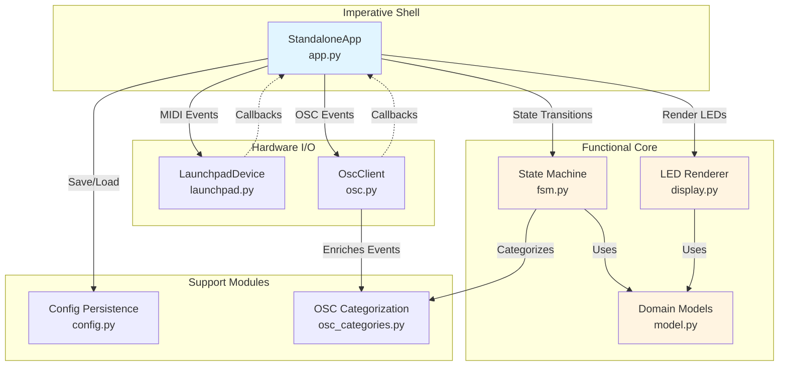

### Effect System

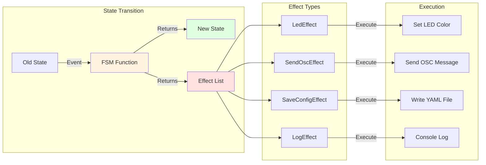

## State Machine

### Learn Mode State Machine

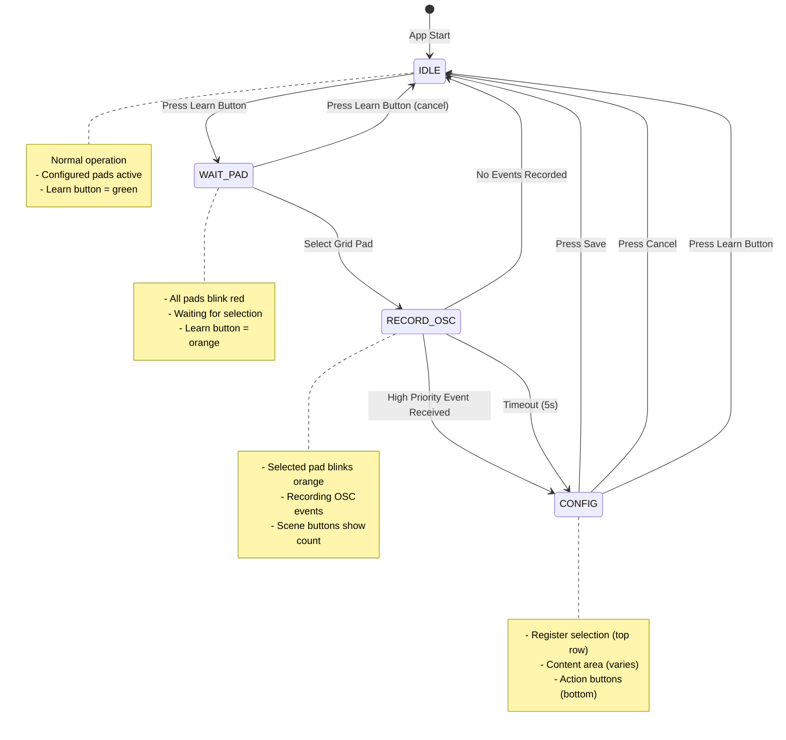

### Config Phase Sub-States

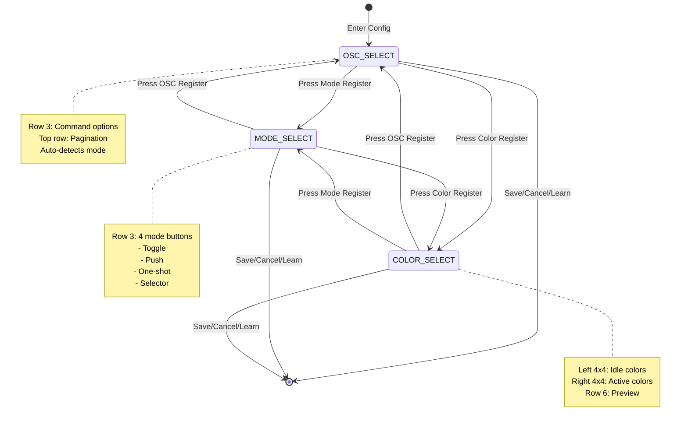

## Data Flow

### Pad Press Flow

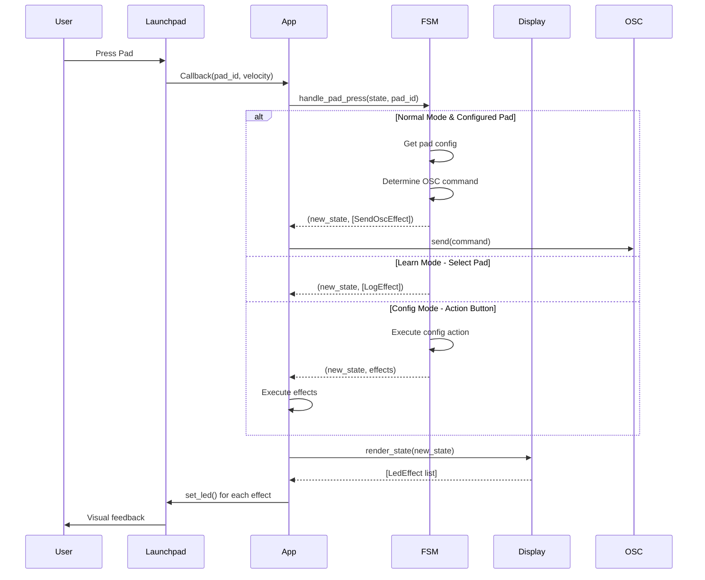

### OSC Recording Flow

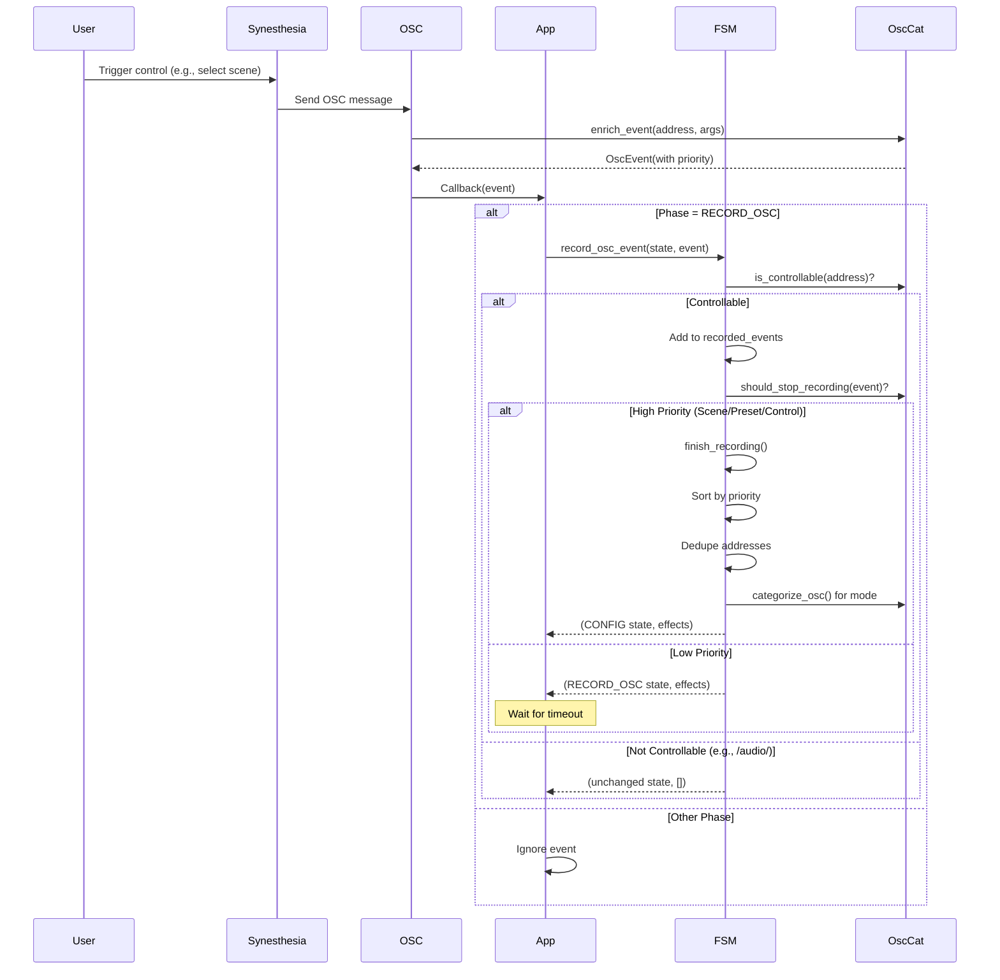

### Config Save Flow

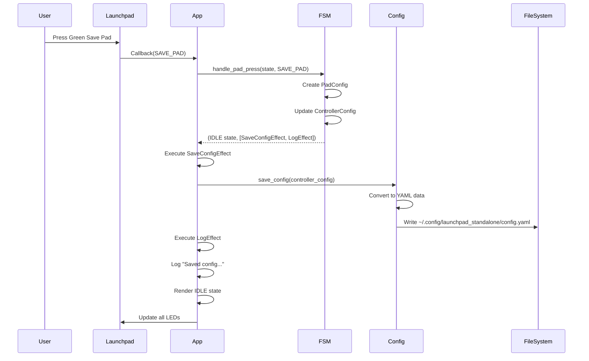

## File Structure

```
launchpad_standalone/
├── __init__.py           # Package metadata
├── __main__.py           # Entry point (calls app.main)
├── README.md             # User documentation
├── ARCHITECTURE.md       # This file
│
├── model.py              # Domain models (immutable)
│   ├── PadId             # Pad coordinate (x, y)
│   ├── PadMode           # SELECTOR, TOGGLE, ONE_SHOT, PUSH
│   ├── LearnPhase        # IDLE, WAIT_PAD, RECORD_OSC, CONFIG
│   ├── LearnRegister     # OSC_SELECT, MODE_SELECT, COLOR_SELECT
│   ├── OscCommand        # (address, args)
│   ├── OscEvent          # (timestamp, address, args, priority)
│   ├── LearnState        # Learn mode state
│   ├── PadConfig         # Saved pad configuration
│   ├── ControllerConfig  # Complete saved config
│   ├── PadRuntimeState   # Runtime state per pad
│   ├── AppState          # Complete application state
│   └── Effects           # LedEffect, SendOscEffect, SaveConfigEffect, LogEffect
│
├── app.py                # Main application (imperative shell)
│   └── StandaloneApp     # Orchestrates I/O and effects
│       ├── start()       # Connect devices, load config
│       ├── stop()        # Cleanup
│       ├── _on_pad_press()
│       ├── _on_pad_release()
│       ├── _on_osc_event()
│       ├── _render_leds()
│       └── _execute_effects()
│
├── fsm.py                # State machine (pure functions)
│   ├── enter_learn_mode()
│   ├── exit_learn_mode()
│   ├── select_pad()
│   ├── record_osc_event()
│   ├── finish_recording()
│   ├── handle_config_pad_press()
│   ├── save_config()
│   ├── test_config()
│   ├── handle_pad_press()      # Main dispatcher
│   ├── handle_pad_release()
│   └── toggle_blink()
│
├── display.py            # LED rendering (pure functions)
│   ├── render_idle()           # Normal operation
│   ├── render_learn_wait_pad() # Blinking red pads
│   ├── render_learn_record_osc() # Selected pad blinks
│   ├── render_learn_config()   # Config UI
│   └── render_state()          # Main dispatcher
│
├── launchpad.py          # Launchpad MIDI driver
│   └── LaunchpadDevice
│       ├── connect()          # Auto-detect & connect
│       ├── set_callbacks()
│       ├── start_listening()  # Async MIDI input
│       ├── set_led()
│       └── stop()
│
├── osc.py                # OSC client (bidirectional)
│   └── OscClient
│       ├── connect()          # Start server & client
│       ├── add_callback()
│       ├── send()
│       └── stop()
│
├── osc_categories.py     # OSC address categorization
│   ├── categorize_osc()       # (priority, mode, group)
│   ├── is_controllable()
│   ├── should_stop_recording()
│   └── enrich_event()         # Add priority to event
│
└── config.py             # YAML persistence
    ├── save_config()
    └── load_config()
```

## Future Requirements

### 1. Bank Switching with Top Row Pads

**Requirement:** Use the top row (y=7) pads for switching between different banks of pad configurations, allowing more than 64 pad mappings.

#### Design

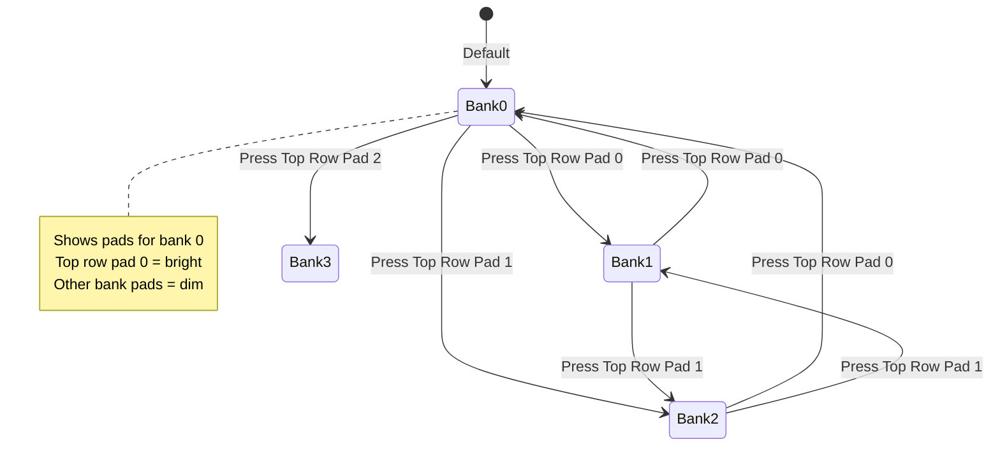

**Implementation Plan:**

1. **Model Changes:**
   - Add `current_bank: int` to `AppState`
   - Change `ControllerConfig.pads` to `Dict[int, Dict[str, PadConfig]]` (bank → pad map)
   - Add bank indicator to top row in IDLE phase

2. **Display Changes:**
   - `render_idle()`: Show active bank indicator (top row pads 0-7)
   - Active bank = bright color, inactive banks = dim color
   - Only show pads from current bank

3. **FSM Changes:**
   - In `handle_normal_press()`: Check if pad is in top row (y=7)
   - If top row: Switch bank instead of sending OSC
   - Update state with new bank number
   - Re-render to show new bank's pads

4. **Config Changes:**
   - Save/load bank structure in YAML
   - Each pad config includes bank number

**Constraints:**
- Top row (y=7) in IDLE mode is reserved for bank switching
- Config mode still uses top row for register selection (no conflict)
- Maximum 8 banks (0-7)

---

### 2. Enhanced Pad Edit Mode

**Requirement:** When pressing record/learn on an already assigned pad, enter a special edit mode that:
- Shows the current OSC message as a blue pad (first yellow register position)
- Keeps it selected by default
- Allows editing the mode (second yellow register)
- Allows editing colors (third yellow register)
- Has a blue preview button in the bottom row that blinks between blue and chosen color
- Accept/reject with green/red buttons

#### Current vs. Enhanced Flow

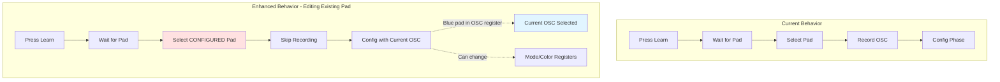

#### Edit Mode State Machine

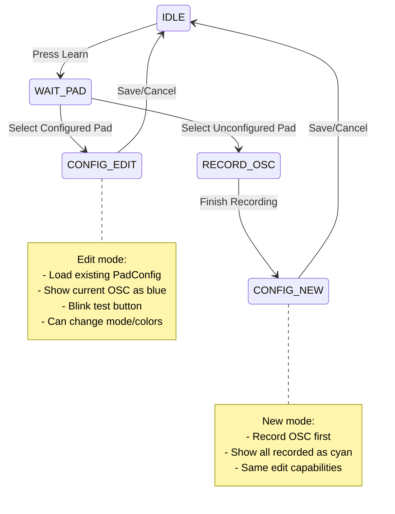

**Implementation Plan:**

1. **Model Changes:**
   - Add `is_edit_mode: bool` to `LearnState`
   - Add `original_config: Optional[PadConfig]` to `LearnState`

2. **FSM Changes (`fsm.py`):**
   ```python
   def select_pad(state: AppState, pad_id: PadId):
       # Check if pad already configured
       existing_config = state.config.get_pad(pad_id) if state.config else None
       
       if existing_config:
           # Edit mode - skip recording
           new_learn = replace(
               state.learn,
               phase=LearnPhase.CONFIG,
               selected_pad=pad_id,
               is_edit_mode=True,
               original_config=existing_config,
               candidate_commands=[existing_config.osc_command],
               selected_osc_index=0,
               selected_mode=existing_config.mode,
               selected_idle_color=existing_config.idle_color,
               selected_active_color=existing_config.active_color,
               active_register=LearnRegister.MODE_SELECT  # Start at mode
           )
           return replace(state, learn=new_learn), [LogEffect("Edit mode")]
       else:
           # Normal flow - record OSC
           return record_mode_flow(state, pad_id)
   ```

3. **Display Changes (`display.py`):**
   ```python
   def _render_osc_select(learn: LearnState) -> List[LedEffect]:
       effects = []
       
       if learn.is_edit_mode:
           # Show single blue pad at position 0 with current OSC
           effects.append(LedEffect(pad_id=PadId(0, 3), color=LP_BLUE))
           # Indicate edit mode with different register color
           # (implementation detail)
       else:
           # Normal mode - show all recorded as cyan
           # ... existing logic ...
       
       return effects
   ```

4. **Test Button Blinking:**
   - Add test button to blink state tracking
   - Blink between `LP_BLUE` and `selected_active_color`
   - Update in `_blink_loop()` when in CONFIG phase

---

### 3. Test Button Blinking Enhancement

**Requirement:** Make the blue preview button (TEST_PAD) blink between blue and the chosen active color.

**Implementation Plan:**

1. **Model Changes:**
   - No changes needed; use existing `blink_on` in `AppState`

2. **Display Changes:**
   ```python
   def render_learn_config(state: AppState) -> List[LedEffect]:
       # ... existing code ...
       
       # Test button blinks between blue and selected active color
       if state.blink_on:
           test_color = state.learn.selected_active_color
       else:
           test_color = LP_BLUE
       
       effects.append(LedEffect(pad_id=TEST_PAD, color=test_color))
       
       # ... rest of code ...
   ```

3. **App Changes (`app.py`):**
   ```python
   async def _blink_loop(self):
       while self._running:
           await asyncio.sleep(0.2)
           
           phase = self.state.learn.phase
           # Add CONFIG to blinking phases
           if phase in (LearnPhase.WAIT_PAD, LearnPhase.RECORD_OSC, LearnPhase.CONFIG):
               self.state = toggle_blink(self.state)
               self._render_leds()
   ```

---

### 4. Learn Mode Cancellation

**Requirement:** Pressing the learn button when already in learn mode will cancel the learn mode.

**Current Behavior:** Learn button exits learn mode only from IDLE.

**Enhanced Behavior:**
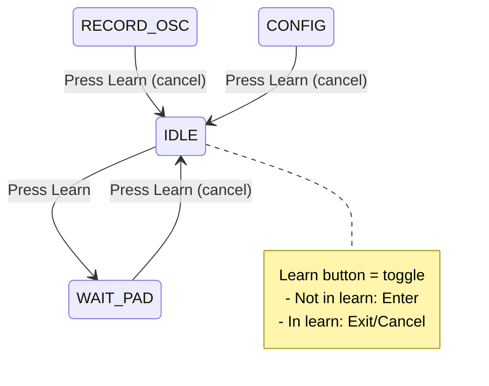

**Implementation:**

Already implemented in `fsm.py`:
```python
def handle_pad_press(state: AppState, pad_id: PadId):
    if pad_id == LEARN_BUTTON:
        if phase == LearnPhase.IDLE:
            return enter_learn_mode(state)
        else:
            return exit_learn_mode(state)  # ✓ Already handles all phases
```

**Status:** ✅ Already implemented!

---

### 5. Bank Switching During Learn Mode

**Requirement:** After pressing learn, the user can still switch the bank to another one.

**Use Case:** User wants to configure a pad in Bank 2, so they:
1. Press learn (enter WAIT_PAD)
2. Press top row pad 2 (switch to Bank 2)
3. Select a pad in Bank 2
4. Configure it

**Implementation Plan:**

1. **FSM Changes:**
   ```python
   def handle_pad_press(state: AppState, pad_id: PadId):
       phase = state.learn.phase
       
       # Learn button handling (unchanged)
       if pad_id == LEARN_BUTTON:
           # ...
       
       # Bank switching (NEW - works in all phases)
       if pad_id.y == 7 and 0 <= pad_id.x <= 7 and phase == LearnPhase.WAIT_PAD:
           # In WAIT_PAD, top row switches banks
           new_state = replace(state, current_bank=pad_id.x)
           return new_state, [LogEffect(f"Switched to bank {pad_id.x}")]
       
       # Phase-specific handling
       if phase == LearnPhase.IDLE:
           return handle_normal_press(state, pad_id)
       # ...
   ```

2. **Display Changes:**
   ```python
   def render_learn_wait_pad(state: AppState) -> List[LedEffect]:
       effects = []
       blink_color = LP_RED if state.blink_on else LP_RED_DIM
       
       # Grid pads blink
       for y in range(8):
           for x in range(8):
               effects.append(LedEffect(pad_id=PadId(x, y), color=blink_color))
       
       # Top row shows bank selection (NEW)
       for x in range(8):
           color = LP_GREEN if x == state.current_bank else LP_GREEN_DIM
           effects.append(LedEffect(pad_id=PadId(x, 7), color=color))
       
       # Learn button & cancel (unchanged)
       effects.append(LedEffect(pad_id=LEARN_BUTTON, color=LP_ORANGE))
       effects.append(LedEffect(pad_id=PadId(8, 7), color=LP_RED))
       
       return effects
   ```

---

## Implementation Summary

### Phase 1: Core Enhancements (High Priority)
1. ✅ **Learn mode cancellation** - Already works
2. **Test button blinking** - Simple display change
3. **Enhanced pad edit mode** - Moderate complexity

### Phase 2: Bank System (Medium Priority)
4. **Bank switching** - Model + FSM + Display changes
5. **Bank switching in learn mode** - Extends #4

### Estimated Complexity
| Feature | Model | FSM | Display | App | Config | Total |
|---------|-------|-----|---------|-----|--------|-------|
| Test blink | - | - | ⭐ | ⭐ | - | ⭐ |
| Edit mode | ⭐ | ⭐⭐ | ⭐⭐ | - | - | ⭐⭐⭐ |
| Bank switching | ⭐⭐ | ⭐⭐ | ⭐⭐ | - | ⭐⭐ | ⭐⭐⭐⭐ |
| Bank in learn | - | ⭐ | ⭐ | - | - | ⭐ |

Legend: ⭐ = Low effort, ⭐⭐ = Medium, ⭐⭐⭐ = High

---

## Testing Strategy

### Manual Testing Checklist

**Current Features:**
- [ ] Enter learn mode (bottom-right scene button)
- [ ] Select pad (grid pad blinks orange)
- [ ] Record OSC (trigger Synesthesia control)
  - [ ] Scene selection (stops immediately)
  - [ ] Preset selection (stops immediately)
  - [ ] Control toggle (stops immediately)
  - [ ] Timeout after 5 seconds
- [ ] Config phase navigation
  - [ ] OSC register (select command)
  - [ ] Mode register (4 modes)
  - [ ] Color register (idle + active)
- [ ] Test button (sends OSC)
- [ ] Save button (green, persists config)
- [ ] Cancel button (red, exits without saving)
- [ ] Normal operation (configured pads work)

**Future Features:**
- [ ] Bank switching (top row in IDLE)
- [ ] Bank switching in learn mode (top row in WAIT_PAD)
- [ ] Edit mode (select configured pad)
- [ ] Test button blinking (blue ↔ active color)
- [ ] Learn button cancellation (all phases)

### Unit Testing Approach

The functional core (FSM, Display) is highly testable:

```python
def test_enter_learn_mode():
    state = AppState()
    new_state, effects = enter_learn_mode(state)
    
    assert new_state.learn.phase == LearnPhase.WAIT_PAD
    assert len(effects) == 1
    assert isinstance(effects[0], LogEffect)

def test_bank_switching():
    state = AppState(current_bank=0)
    new_state, effects = handle_pad_press(state, PadId(2, 7))
    
    assert new_state.current_bank == 2
    assert "bank 2" in effects[0].message.lower()
```

---

## Glossary

**App State:** Complete application state including learn mode state, config, runtime state

**Bank:** A set of 64 pad configurations (one bank = full 8x8 grid)

**Blink:** LED animation that alternates between two colors every 200ms

**Effect:** Side effect returned by FSM (LED, OSC, Save, Log)

**FSM:** Finite State Machine - pure functions handling state transitions

**Imperative Shell:** The outer layer (app.py) that handles I/O and effects

**Learn Mode:** Configuration mode where user can map pads to OSC commands

**LearnPhase:** Current step in learn mode (IDLE, WAIT_PAD, RECORD_OSC, CONFIG)

**LearnRegister:** Section of config phase (OSC_SELECT, MODE_SELECT, COLOR_SELECT)

**OSC:** Open Sound Control - network protocol for multimedia communication

**Pad Config:** Saved configuration for a single pad (mode, OSC, colors)

**PadMode:** How a pad behaves (TOGGLE, PUSH, ONE_SHOT, SELECTOR)

**Priority:** OSC event priority (1=scene, 2=preset, 3=control, 99=noise)

**Programmer Mode:** Launchpad MIDI mode enabling full pad control

**Pure Function:** Function with no side effects, same input = same output

**Register:** Configuration section in learn mode config phase

**Scene Button:** Right column buttons (x=8, y=0-7)

**Selector Mode:** Radio button behavior - only one active in group

