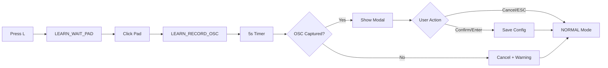

# Learn Mode Implementation Delta

## Overview

The learn mode wizard is now **fully functional** with modal-based command selection, OSC auto-detection, and edge-case handling. The implementation follows the grokking simplicity principle with clean integration between the FSM and UI.

## Completed Implementation ✅

- [x] **Wizard screens** – `CommandSelectionScreen` modal provides full keyboard-navigable interface for:
  - Command selection (↑/↓ or 1-9)
  - Pad mode (Selector/Toggle/One-Shot via S/T/O keys)
  - Group selection (Scenes/Presets/Colors/Custom)
  - Color picker (idle/active colors via Tab/1-8)
  - Label entry
  - Final confirmation (Enter) or cancel (Escape)

- [x] **Auto-detection feedback** – OSC messages captured during 5-second recording window, filtered to controllable addresses, deduplicated, and presented in modal

- [x] **Edge-case handling** – implemented in `_show_command_selection_modal()`:
  - **No OSC received**: Graceful cancellation with warning log
  - **Pad already configured**: Warning logged, allows overwrite
  - **User cancellation**: Returns to NORMAL mode cleanly

- [x] **Modal integration** – Timer loop detects LEARN_SELECT_MSG transition and shows modal automatically

## Remaining Work

- [ ] **Documentation sync** – update README/plan references to reflect hard-coded OSC ports and completed learn mode

- [ ] **Quick-setup templates** – deferred: optional row-based bulk setup workflow (not critical for MVP)

## Implementation Flow

## Architecture

The implementation maintains clean separation of concerns:

- **FSM ([fsm.py](app/domain/fsm.py))** - Pure state transitions
- **Modal ([command_selection_screen.py](app/ui/command_selection_screen.py))** - Self-contained wizard UI
- **Integration ([tui.py](app/ui/tui.py:424-426))** - Timer loop detects mode transition and triggers modal
- **Edge cases ([tui.py](app/ui/tui.py:550-597))** - Handled in single method with clear logic
