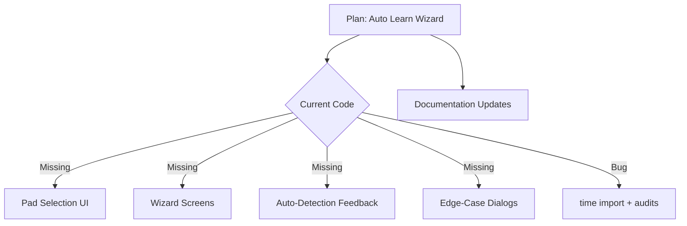

# Learn Mode Implementation Delta

## Overview

The current Textual TUI only exposes the status panel and logging while the learn mode plan (v3) expects a full wizard with automatic OSC inference, user confirmation steps, and rich error handling. The checklist below captures the missing functionality and polish items required to align the implementation with the documented workflow.

## TODO Backlog

- [ ] **Pad selection wiring** – implement `LaunchpadGrid.on_click` and ensure hardware pad presses route through the learn FSM so users can actually start configuration from the UI.

- [ ] **Wizard screens** – add modal/wizard components for command selection, mode/group choice, toggle OFF configuration, color picker, label entry, and final confirmation.

- [ ] **Auto-detection feedback** – surface captured OSC messages, inferred mode/group/colors, and allow confirmation or edits before saving.

- [ ] **Edge-case dialogs** – handle “no OSC received”, “ambiguous command”, and “pad already configured” scenarios with retry/cancel flows.

- [ ] **Runtime fixes** – import `time` (used in `_learn_timer_loop`) and audit for other runtime errors introduced after removing the OSC config UI.

- [ ] **Documentation sync** – update README/plan references to reflect hard-coded OSC ports and the staged learn-mode availability.

- [ ] **Quick-setup templates** – implement (or explicitly defer) the optional row-based bulk setup workflow described in the plan.

## Visualization

