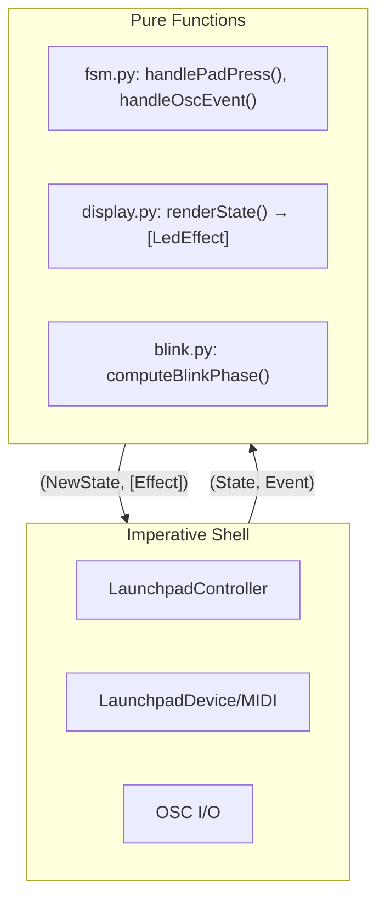
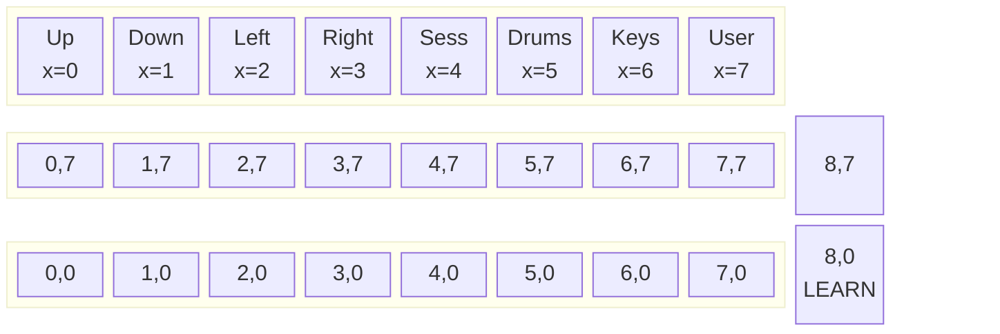
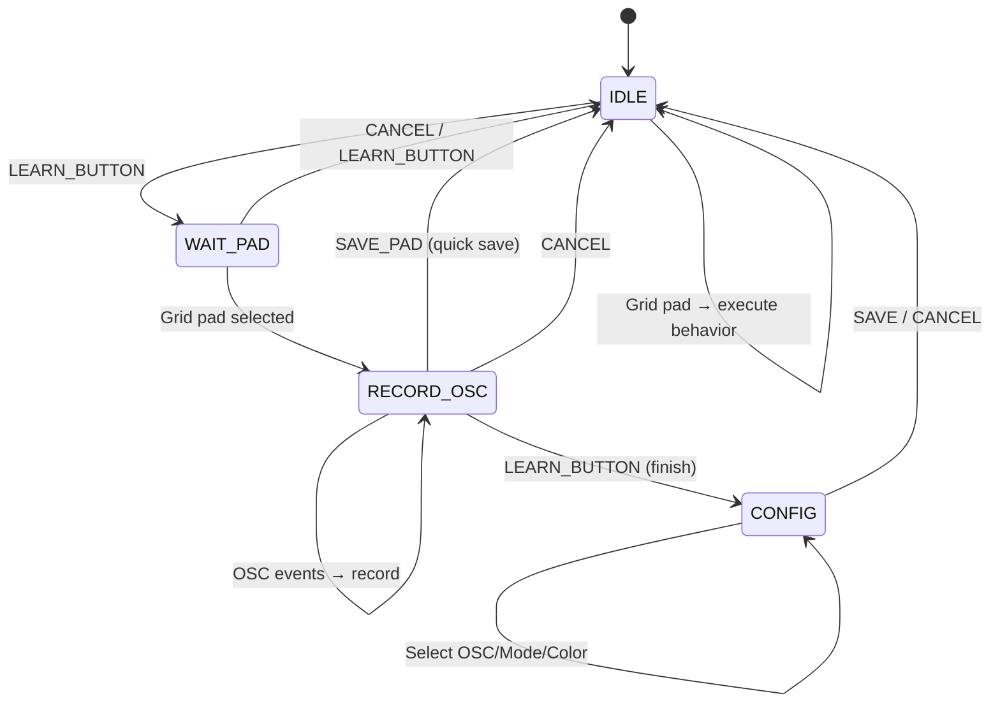
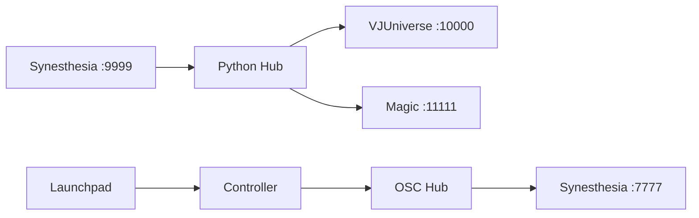
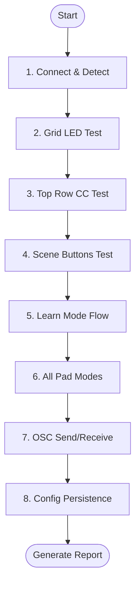

# Launchpad OSC Library Specification

**Reference:** `python-vj/launchpad_osc_lib/` → **Target:** `swift-vj/Sources/SwiftVJCore/Launchpad/`

---

## Architecture



**Principles:** Immutable state, pure FSM functions return `(NewState, [Effect])`, effects executed by shell.

---

## Coordinate System



| Type | Coords | MIDI | Use |
|------|--------|------|-----|
| Grid | x=0-7, y=0-7 | Note | Pad mappings |
| Top Row | x=0-7, y=-1 | CC | Bank switching |
| Scene | x=8, y=0-7 | Note | Learn mode |

**lpminimk3 Quirk:** Button events report `y+1` vs LED coords. Convert: `y = event.y - 1`

---

## Data Types

### Core Types

```swift
struct ButtonId: Hashable {
    let x: Int, y: Int
    var isGrid: Bool { (0...7).contains(x) && (0...7).contains(y) }
    var isTopRow: Bool { (0...7).contains(x) && y == -1 }
    var isSceneButton: Bool { x == 8 && (0...7).contains(y) }
}

enum PadMode { case selector, toggle, oneShot, push }
enum ButtonGroupType: String { case scenes, presets, colors, custom }
enum LearnPhase { case idle, waitPad, recordOsc, config }
enum LearnRegister { case oscSelect, modeSelect, colorSelect }
enum LedMode { case `static`, pulse, flash }
enum BrightnessLevel: Int { case dim = 0, normal = 1, bright = 2 }
```

### OSC & Behavior

```swift
struct OscCommand: Hashable { let address: String; let args: [Any] }

struct PadBehavior {
    let padId: ButtonId, mode: PadMode, group: ButtonGroupType?
    let idleColor: Int, activeColor: Int, label: String
    let oscOn: OscCommand?, oscOff: OscCommand?  // TOGGLE
    let oscAction: OscCommand?                    // SELECTOR/ONE_SHOT/PUSH
}

struct PadRuntimeState {
    var isActive = false, isOn = false, currentColor = 0
    var blinkEnabled = false, ledMode: LedMode = .static
}
```

### State

```swift
struct LearnState {
    var phase: LearnPhase = .idle, selectedPad: ButtonId? = nil
    var recordedEvents: [OscEvent] = [], candidateCommands: [OscCommand] = []
    var activeRegister: LearnRegister = .oscSelect, selectedOscIndex = 0
    var selectedMode: PadMode? = nil, selectedGroup: ButtonGroupType? = nil
    var selectedIdleColor = 19, selectedActiveColor = 21  // LP_GREEN
    var idleBrightness: BrightnessLevel = .normal, activeBrightness: BrightnessLevel = .bright
    var oscPage = 0
}

struct ControllerState {
    var pads: [ButtonId: PadBehavior] = [:]
    var padRuntime: [ButtonId: PadRuntimeState] = [:]
    var activeSelectorByGroup: [ButtonGroupType: ButtonId?] = [:]
    var activeScene: String?, activePreset: String?, activeColorHue: Float?
    var beatPhase: Float = 0, beatPulse = false, learnState = LearnState(), blinkOn = false
}
```

### Effects

```swift
protocol Effect {}
struct SendOscEffect: Effect { let command: OscCommand }
struct LedEffect: Effect { let padId: ButtonId; let color: Int; var blink = false }
struct SaveConfigEffect: Effect {}
struct LogEffect: Effect { let message: String; var level = "INFO" }
```

---

## FSM State Machine



### FSM Functions

```swift
// Main entry points
func handlePadPress(state: ControllerState, padId: ButtonId) -> (ControllerState, [Effect])
func handlePadRelease(state: ControllerState, padId: ButtonId) -> (ControllerState, [Effect])
func handleOscEvent(state: ControllerState, event: OscEvent) -> (ControllerState, [Effect])

// Learn mode
func enterLearnMode(state:) -> (ControllerState, [Effect])
func exitLearnMode(state:) -> (ControllerState, [Effect])
func selectPad(state:, padId:) -> (ControllerState, [Effect])
func recordOscEvent(state:, event:) -> (ControllerState, [Effect])
func finishRecording(state:) -> (ControllerState, [Effect])
func saveConfig(state:) -> (ControllerState, [Effect])

// Normal operation handlers
func handleSelectorPress(state:, padId:, behavior:) -> (ControllerState, [Effect])
func handleTogglePress(state:, padId:, behavior:) -> (ControllerState, [Effect])
func handleOneShotPress(state:, padId:, behavior:) -> (ControllerState, [Effect])
func handlePushPress(state:, padId:, behavior:) -> (ControllerState, [Effect])
```

### Pad Mode Behaviors

| Mode | Press | Release | LED |
|------|-------|---------|-----|
| **SELECTOR** | Deactivate others in group, send `oscAction` | - | Active blinks |
| **TOGGLE** | Toggle `isOn`, send `oscOn`/`oscOff` | - | ON=activeColor |
| **ONE_SHOT** | Flash, send `oscAction` | - | Returns to idle |
| **PUSH** | Send `oscAction` with `[1.0]` | Send with `[0.0]` | Momentary |

---

## Module Breakdown

| Python | Swift | Purpose |
|--------|-------|---------|
| `button_id.py` | `ButtonId.swift` | Coordinate struct |
| `model.py` | `Model.swift` | All data types, enums, effects |
| `fsm.py` | `FSM.swift` | Pure state transitions |
| `display.py` | `Display.swift` | `renderState() → [LedEffect]` |
| `blink.py` | `Blink.swift` | Beat-sync LED animation |
| `synesthesia_config.py` | `SynesthesiaConfig.swift` | OSC categorization |
| `banks.py` | `Banks.swift` | Multi-bank management |
| `controller.py` | `Controller.swift` | Orchestrator with DI |
| `launchpad_device.py` | `MIDIManager.swift` | CoreMIDI wrapper |

### Key Interfaces

```swift
protocol LaunchpadInterface {
    func setLed(x: Int, y: Int, color: Int, blink: Bool)
    func setPanelLed(index: Int, color: Int, blink: Bool)
    func clearAll()
}

protocol OscInterface {
    func send(address: String, args: Any...)
}
```

---

## OSC Integration



### Controllable Addresses

| Prefix | Mode | Group | Priority |
|--------|------|-------|----------|
| `/scenes/` | SELECTOR | scenes | 1 (highest) |
| `/presets/` | SELECTOR | presets | 2 |
| `/favslots/` | SELECTOR | presets | 2 |
| `/playlist/` | ONE_SHOT | - | 3 |
| `/controls/meta/` | TOGGLE | - | 3 |
| `/controls/global/` | TOGGLE | - | 3 |
| `/audio/*` | - | - | 99 (ignored) |

```swift
let PRIORITY_SCENE = 1, PRIORITY_PRESET = 2, PRIORITY_CONTROL = 3, PRIORITY_NOISE = 99

func isControllable(address: String) -> Bool
func categorizeOsc(address: String) -> (priority: Int, mode: PadMode, group: String?)
```

---

## LED Colors (Full Palette)

Launchpad Mini MK3 velocity values (0-127):

### Primary Colors (3 brightness levels: dim/normal/bright)

| Color | Dim | Normal | Bright | Constant |
|-------|-----|--------|--------|----------|
| Off | 0 | - | - | `LP_OFF` |
| Red | 1 | 5 | 6 | `LP_RED` |
| Orange | 7 | 9 | 10 | `LP_ORANGE` |
| Yellow | 11 | 13 | 14 | `LP_YELLOW` |
| Lime | 15 | 17 | 18 | `LP_LIME` |
| Green | 19 | 21 | 22 | `LP_GREEN` |
| Spring | 23 | 25 | 26 | `LP_SPRING` |
| Turquoise | 27 | 29 | 30 | `LP_TURQUOISE` |
| Cyan | 33 | 37 | 38 | `LP_CYAN` |
| Sky | 39 | 41 | 42 | `LP_SKY` |
| Blue | 43 | 45 | 46 | `LP_BLUE` |
| Orchid | 47 | 49 | 50 | `LP_ORCHID` |
| Purple | 51 | 53 | 54 | `LP_PURPLE` |
| Pink | 55 | 57 | 58 | `LP_PINK` |
| Magenta | 59 | 61 | 62 | `LP_MAGENTA` |
| White | 1 | 3 | 119 | `LP_WHITE` |

### Extended Colors (additional velocities)

| Range | Description |
|-------|-------------|
| 0-3 | Grays (off → white) |
| 4-7 | Reds |
| 8-11 | Oranges |
| 12-15 | Yellows |
| 16-19 | Limes |
| 20-23 | Greens |
| 24-31 | Teals |
| 32-39 | Cyans |
| 40-47 | Blues |
| 48-55 | Purples |
| 56-63 | Pinks |
| 64-71 | Red-oranges |
| 72-79 | Gold-yellows |
| 80-87 | Lime-greens |
| 88-95 | Mint-cyans |
| 96-103 | Light blues |
| 104-111 | Violet-magentas |
| 112-119 | Rose-whites |
| 120-127 | Warm whites |

```swift
struct LaunchpadColor {
    static let baseColors: [String: (dim: Int, normal: Int, bright: Int)] = [
        "red": (1, 5, 6), "orange": (7, 9, 10), "yellow": (11, 13, 14),
        "lime": (15, 17, 18), "green": (19, 21, 22), "spring": (23, 25, 26),
        "turquoise": (27, 29, 30), "cyan": (33, 37, 38), "sky": (39, 41, 42),
        "blue": (43, 45, 46), "orchid": (47, 49, 50), "purple": (51, 53, 54),
        "pink": (55, 57, 58), "magenta": (59, 61, 62), "white": (1, 3, 119)
    ]
    
    static func color(_ name: String, _ level: BrightnessLevel) -> Int {
        guard let c = baseColors[name] else { return 0 }
        switch level {
        case .dim: return c.dim
        case .normal: return c.normal
        case .bright: return c.bright
        }
    }
}
```

### Special Button Positions

```swift
let LEARN_BUTTON = ButtonId(x: 8, y: 0)     // Bottom scene button

// CONFIG phase action buttons (row 0)
let SAVE_PAD = ButtonId(x: 0, y: 0)         // Green
let TEST_PAD = ButtonId(x: 1, y: 0)         // Blue  
let CANCEL_PAD = ButtonId(x: 7, y: 0)       // Red

// Register selection (row 7)
let REGISTER_OSC = ButtonId(x: 0, y: 7)
let REGISTER_MODE = ButtonId(x: 1, y: 7)
let REGISTER_COLOR = ButtonId(x: 2, y: 7)

// Pagination (row 7)
let OSC_PAGE_PREV = ButtonId(x: 6, y: 7)
let OSC_PAGE_NEXT = ButtonId(x: 7, y: 7)
```

---

## Swift Implementation Status

Comparing spec to existing Swift files in `swift-vj/Sources/SwiftVJCore/Launchpad/`:

### ✅ Fully Implemented

| Component | Swift File | Notes |
|-----------|------------|-------|
| `ButtonId` | [LaunchpadTypes.swift](../Sources/SwiftVJCore/Launchpad/LaunchpadTypes.swift) | ✓ All coord checks, MIDI conversion |
| `PadMode` | LaunchpadTypes.swift | ✓ `selector`, `toggle`, `oneShot`, `push` |
| `ButtonGroupType` | LaunchpadTypes.swift | ✓ With parent/subgroup logic |
| `PadBehavior` | LaunchpadTypes.swift | ✓ All fields match spec |
| `PadRuntimeState` | LaunchpadTypes.swift | ✓ Including `blinkEnabled`, `ledMode` |
| `LearnState` | LaunchpadTypes.swift | ✓ All fields: phase, registers, colors |
| `ControllerState` | LaunchpadTypes.swift | ✓ Full state including beat/blink |
| `LaunchpadEffect` | LaunchpadTypes.swift | ✓ `sendOsc`, `setLed`, `saveConfig`, `log` |
| `OscCommand` / `OscArg` | LaunchpadTypes.swift | ✓ Type-safe args |
| `OscEvent` | LaunchpadTypes.swift | ✓ With priority |
| `LaunchpadColor` enum | LaunchpadTypes.swift | ✓ 10 colors × 3 brightness |
| `LP` constants | LaunchpadTypes.swift | ✓ Shortcuts |
| `handlePadPress` | [LaunchpadFSM.swift](../Sources/SwiftVJCore/Launchpad/LaunchpadFSM.swift) | ✓ Routes to mode handlers |
| `handlePadRelease` | LaunchpadFSM.swift | ✓ Push mode support |
| `handleOscEvent` | LaunchpadFSM.swift | ✓ Record + beat sync |
| Selector/Toggle/OneShot/Push | LaunchpadFSM.swift | ✓ All mode handlers |
| Learn mode FSM | LaunchpadFSM.swift | ✓ Full workflow |
| Config phase handlers | LaunchpadFSM.swift | ✓ OSC/Mode/Color registers |
| `categorizeOsc` | LaunchpadFSM.swift | ✓ Maps to mode/group |
| `LaunchpadButton` constants | LaunchpadFSM.swift | ✓ Learn, save, cancel, etc. |
| `LaunchpadModule` | [LaunchpadModule.swift](../Sources/SwiftVJCore/Launchpad/LaunchpadModule.swift) | ✓ Orchestrator with DI |
| `EffectExecutor` | [EffectExecutor.swift](../Sources/SwiftVJCore/Launchpad/EffectExecutor.swift) | ✓ OSC + LED + config |
| `MIDIManager` | [MIDIManager.swift](../Sources/SwiftVJCore/Launchpad/MIDIManager.swift) | ✓ CoreMIDI, auto-reconnect |
| JSON config save/load | EffectExecutor.swift | ✓ `launchpad-config.json` |
| Interactive tests | [LaunchpadInteractiveTests.swift](../Sources/SwiftVJCore/Launchpad/LaunchpadInteractiveTests.swift) | ✓ 8 tests |

### ⚠️ Partially Implemented

| Component | Status | Gap |
|-----------|--------|-----|
| Extended colors (0-127) | Partial | Only 10 base colors, spec has 16+ |
| Display rendering | Partial | LED updates in FSM, no separate `renderState()` |
| Top row (CC messages) | Partial | `ButtonId` supports y=-1, MIDIManager only handles notes |
| Beat-sync blink | Partial | Timer in Module, no `computeBlinkPhase()` |
| SysEx blink mode | ❌ | Log says "not implemented" |

### ❌ Not Implemented

| Component | Python Source | Notes |
|-----------|---------------|-------|
| `display.py` | `renderState()`, `renderIdle()` | Swift merges into FSM effects |
| `blink.py` | `computeBlinkPhase()`, `shouldLedBeLit()` | Simple timer instead |
| `banks.py` | Multi-bank management | Not needed yet |
| `synesthesia_config.py` | Full OSC priority table | Partial in `categorizeOsc` |
| Controllable prefixes | `/scenes/`, `/presets/`, `/controls/` | Different set in Swift |

### Test Coverage Comparison

| Python Test | Swift Test | Status |
|-------------|------------|--------|
| Color palette | `test1_colors()` | ✅ |
| Button feedback | `test2_buttonFeedback()` | ✅ |
| Blink/flash | `test3_flashMode()` | ✅ (simulated) |
| Top row | `test4_topRow()` | ⚠️ CC not handled |
| Scene buttons | `test5_sceneButtons()` | ✅ |
| Learn mode | `test6_learnModeSimulation()` | ✅ |
| Pad modes | `test7_padModes()` | ✅ |
| Full FSM | `test8_fullFSM()` | ✅ |

---

## Remaining Work

### Priority 1: Fixes
- [ ] Handle CC messages in MIDIManager for top row (y=-1)
- [ ] Expand `LaunchpadColor` to 16 colors (add spring, turquoise, sky, orchid, magenta)
- [ ] Implement SysEx pulse/flash LED modes

### Priority 2: Parity
- [ ] Add full OSC priority table from `synesthesia_config.py`
- [ ] Extract `renderState()` to separate Display module
- [ ] Add `computeBlinkPhase()` for smoother beat-sync

### Priority 3: Features
- [ ] Multi-bank support (`BankManager`)
- [ ] OSC receive integration (currently send-only)

---

## End-to-End Testing

### Terminal Test Runner

Run the guided E2E test:
```bash
swift run SwiftVJ launchpad-e2e
```

### E2E Test Flow



### Test Steps (Interactive CLI)

| Step | Test | User Action | Pass Criteria |
|------|------|-------------|---------------|
| 1 | **Connection** | Plug in Launchpad | Device detected, name shown |
| 2 | **Grid LEDs** | Observe 8x8 grid | All 64 pads cycle through colors |
| 3 | **Top Row** | Press each top button | CC messages detected, y=-1 shown |
| 4 | **Scene Column** | Press scene buttons | x=8 detected for all 8 |
| 5 | **Learn: Enter** | Press Scene[0] (learn btn) | All pads pulse dim |
| 6 | **Learn: Select** | Press any grid pad | Pad turns yellow |
| 7 | **Learn: Record** | (simulated OSC event) | "Recorded: /scene/1" shown |
| 8 | **Learn: Save** | Press Save pad (0,0) | Config saved, exit learn |
| 9 | **Selector** | Press configured pad | Sends OSC, LED active |
| 10 | **Toggle** | Press toggle pad twice | ON → OFF → ON |
| 11 | **Push** | Hold then release | 1.0 on press, 0.0 on release |
| 12 | **Persistence** | Restart module | Config reloaded, LEDs restored |

### Proposed CLI Implementation

```swift
// LaunchpadE2ETest.swift
public func runE2ETest() {
    print("🧪 LAUNCHPAD END-TO-END TEST")
    print("============================")
    print()
    
    var passed = 0
    var failed = 0
    
    // Step 1: Connection
    print("Step 1/12: Connection...")
    let connected = testConnection()
    report(step: 1, name: "Connection", passed: connected)
    
    // Step 2: Grid LEDs
    print("Step 2/12: Grid LED test...")
    print("  → Watch the grid light up")
    let gridOk = testGridLeds()
    report(step: 2, name: "Grid LEDs", passed: gridOk)
    
    // ... continue for all steps
    
    // Summary
    print()
    print("═══════════════════════════")
    print("RESULTS: \(passed)/12 passed")
    if failed == 0 {
        print("✅ ALL TESTS PASSED")
    } else {
        print("❌ \(failed) tests failed")
    }
}

private func report(step: Int, name: String, passed: Bool) {
    let icon = passed ? "✅" : "❌"
    print("  \(icon) Step \(step): \(name)")
}
```

### Test Automation Levels

| Level | Description | Command |
|-------|-------------|---------|
| **Interactive** | User presses buttons, confirms visually | `launchpad-e2e` |
| **Semi-auto** | Auto-verify LEDs via MIDI feedback | `launchpad-e2e --verify` |
| **Headless** | Mock MIDI, test FSM only | `swift test --filter Launchpad` |

### Quick Smoke Test

For CI or quick validation (no hardware):
```bash
swift test --filter LaunchpadFSMTests
```

Tests FSM logic without device:
- `testSelectorDeactivatesPrevious()`
- `testToggleOnOff()`
- `testLearnModeFlow()`
- `testOscEventRecording()`

---

## Python → Swift Translation

| Python | Swift |
|--------|-------|
| `@dataclass(frozen=True)` | `struct` with `let` |
| `NamedTuple` | `struct: Hashable` |
| `replace(obj, field=val)` | `obj.with(field: val)` helper |
| `Dict[K, V]` | `[K: V]` |
| `List[T]` | `[T]` |
| `Optional[T]` | `T?` |

```swift
// Immutable update helper pattern
extension ControllerState {
    func with(activeScene: String? = nil, beatPulse: Bool? = nil, ...) -> ControllerState {
        ControllerState(
            pads: self.pads,
            activeScene: activeScene ?? self.activeScene,
            beatPulse: beatPulse ?? self.beatPulse,
            ...
        )
    }
}
```
