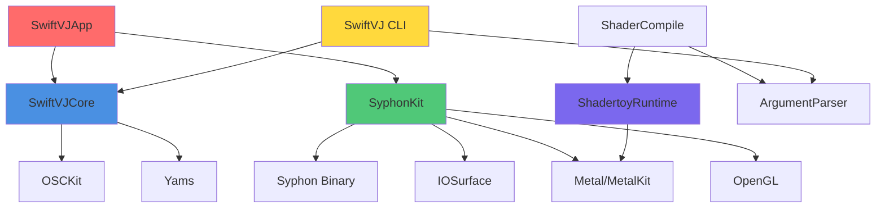

# SwiftVJ Module Dependencies

## Overview

This document describes the dependency relationships between SwiftVJ's SPM targets and internal modules within SwiftVJCore.

## SPM Target Dependencies

### High-Level Dependency Graph



### External Dependencies

**From Package.swift:**

| Package | Version | Used By | Purpose |
|---------|---------|---------|---------|
| OSCKit | 0.6.0+ | SwiftVJCore | OSC communication (send/receive) |
| ArgumentParser | 1.2.0+ | SwiftVJ, ShaderCompile | CLI argument parsing |
| Yams | 5.0.0+ | SwiftVJCore, BehaviorTests | YAML config file parsing |

**System Frameworks:**

| Framework | Used By | Purpose |
|-----------|---------|---------|
| Metal | ShadertoyRuntime, SyphonKit, SwiftVJApp | GPU rendering |
| MetalKit | ShadertoyRuntime | Metal utilities |
| CoreGraphics | ShadertoyRuntime | Image handling |
| IOSurface | SyphonKit | Shared memory surfaces |
| OpenGL | SyphonKit | Syphon compatibility |
| CoreMIDI | SwiftVJCore (MIDIManager) | MIDI device communication |
| Foundation | All targets | Swift standard library |
| SwiftUI | SwiftVJApp | GUI framework |
| AppKit | SwiftVJApp | macOS app framework |

## SwiftVJCore Internal Module Dependencies

### Module Hierarchy

```mermaid
graph TB
    subgraph "Infrastructure Layer"
        Config[Config.swift]
        PrefixTrie[PrefixTrie.swift]
    end
    
    subgraph "Domain Layer"
        Types[Types.swift]
        Functions[Functions.swift]
        Phase[Phase.swift]
        ActiveLine[ActiveLineTracker.swift]
        Textler[TextlerOrchestrator.swift]
    end
    
    subgraph "Adapter Layer"
        OSCHub[OSCClient.swift]
        Lyrics[LyricsFetcher.swift]
        LLM[LLMClient.swift]
        Spotify[SpotifyMonitor.swift]
        VDJ[VDJMonitor.swift]
        ShaderRepo[ShaderRepository.swift]
        ShaderMatch[ShaderMatcher.swift]
        Images[ImageScraper.swift]
        AudioProc[SynesthesiaAudioProcessor.swift]
    end
    
    subgraph "Module Layer"
        ModuleProto[Module.swift]
        Registry[ModuleRegistry.swift]
        PlaybackMod[PlaybackModule.swift]
        LyricsMod[LyricsModule.swift]
        AIMod[AIModule.swift]
        ShadersMod[ShadersModule.swift]
        ImagesMod[ImagesModule.swift]
        PipelineMod[PipelineModule.swift]
    end
    
    subgraph "Launchpad Subsystem"
        LaunchpadMod[LaunchpadModule.swift]
        MIDI[MIDIManager.swift]
        FSM[LaunchpadFSM.swift]
        Executor[EffectExecutor.swift]
        LPTypes[LaunchpadTypes.swift]
        LPConfig[LaunchpadYAMLConfig.swift]
        LPDisplay[LaunchpadDisplay.swift]
    end
    
    subgraph "Rendering State"
        DisplayStates[DisplayStates.swift]
        AudioState[AudioState.swift]
    end
    
    %% Adapter dependencies
    OSCHub --> OSCKit[OSCKit external]
    OSCHub --> PrefixTrie
    Lyrics --> Config
    LLM --> Config
    Spotify --> Config
    Spotify --> Types
    VDJ --> Config
    VDJ --> Types
    VDJ --> OSCHub
    ShaderRepo --> Types
    ShaderMatch --> Types
    Images --> Config
    Images --> Types
    AudioProc --> OSCHub
    
    %% Module dependencies
    Registry --> ModuleProto
    PlaybackMod --> ModuleProto
    PlaybackMod --> Spotify
    PlaybackMod --> VDJ
    PlaybackMod --> OSCHub
    PlaybackMod --> Types
    
    LyricsMod --> ModuleProto
    LyricsMod --> Lyrics
    LyricsMod --> Functions
    LyricsMod --> Types
    
    AIMod --> ModuleProto
    AIMod --> LLM
    AIMod --> Types
    
    ShadersMod --> ModuleProto
    ShadersMod --> ShaderRepo
    ShadersMod --> ShaderMatch
    ShadersMod --> Types
    
    ImagesMod --> ModuleProto
    ImagesMod --> Images
    ImagesMod --> Types
    
    PipelineMod --> ModuleProto
    PipelineMod --> LyricsMod
    PipelineMod --> AIMod
    PipelineMod --> ShadersMod
    PipelineMod --> ImagesMod
    PipelineMod --> OSCHub
    PipelineMod --> Types
    PipelineMod --> Config
    
    %% Launchpad dependencies
    LaunchpadMod --> MIDI
    LaunchpadMod --> Executor
    LaunchpadMod --> FSM
    LaunchpadMod --> LPTypes
    LaunchpadMod --> LPDisplay
    
    Executor --> MIDI
    Executor --> LPTypes
    Executor --> LPConfig
    Executor --> OSCHub
    
    LPConfig --> LPTypes
    LPConfig --> Yams[Yams external]
    
    FSM --> LPTypes
    LPDisplay --> LPTypes
    LPDisplay --> MIDI
    
    %% Domain dependencies
    Functions --> Types
    ActiveLine --> Types
    ActiveLine --> OSCHub
    Textler --> Types
    
    %% Rendering state
    DisplayStates --> Types
    AudioState --> Types
    
    style Types fill:#ffd93d
    style Config fill:#ffd93d
    style OSCHub fill:#4a90e2
    style PipelineMod fill:#ff6b6b
```



### Layer Definitions

1. **Infrastructure Layer** - Configuration, utilities, low-level helpers
   - `Config.swift` - Global settings, cache directories, service health
   - `PrefixTrie.swift` - Efficient pattern matching for OSC routing

2. **Domain Layer** - Pure data and functions (no side effects)
   - `Types.swift` - Immutable value types (Track, LyricLine, PipelineResult, etc.)
   - `Functions.swift` - Pure functions (parseLRC, detectRefrains, analyzeLyrics)
   - `Phase.swift` - DJ set phase enumeration
   - `ActiveLineTracker.swift` - Karaoke timing logic
   - `TextlerOrchestrator.swift` - Textler animation sequencing

3. **Adapter Layer** - External service wrappers (actions with side effects)
   - `OSCClient.swift` (OSCHub) - OSC network communication
   - `LyricsFetcher.swift` - LRCLIB HTTP API client
   - `LLMClient.swift` - LM Studio HTTP API client
   - `SpotifyMonitor.swift` - Spotify local API polling
   - `VDJMonitor.swift` - VirtualDJ OSC message processing
   - `ShaderRepository.swift` - Filesystem shader loading
   - `ShaderMatcher.swift` - AI-based shader selection
   - `ImageScraper.swift` - DuckDuckGo image search with disk caching
   - `SynesthesiaAudioProcessor.swift` - Audio reactive data accumulator

4. **Module Layer** - High-level orchestrators (actor-based lifecycle)
   - `Module.swift` - Base protocol (start/stop/getStatus)
   - `ModuleRegistry.swift` - Dependency injection container
   - `PlaybackModule.swift` - Track detection coordinator
   - `LyricsModule.swift` - Lyrics pipeline
   - `AIModule.swift` - Song analysis pipeline
   - `ShadersModule.swift` - Shader loading/matching
   - `ImagesModule.swift` - Image search/caching
   - `PipelineModule.swift` - Full track processing orchestrator

5. **Launchpad Subsystem** - MIDI controller integration
   - `LaunchpadModule.swift` - Top-level coordinator
   - `MIDIManager.swift` - CoreMIDI device I/O
   - `LaunchpadFSM.swift` - Button state machine
   - `EffectExecutor.swift` - OSC effect dispatch
   - `LaunchpadTypes.swift` - Button IDs, colors, commands
   - `LaunchpadYAMLConfig.swift` - Configuration parser
   - `LaunchpadDisplay.swift` - LED visualization

6. **Rendering State** - Display state models (used by SwiftVJApp)
   - `DisplayStates.swift` - Lyrics, refrain, song info, images, shaders
   - `AudioState.swift` - Audio levels and frequency bands

## Dependency Analysis

### Critical Paths

**Track Processing Pipeline:**
```
PlaybackModule → PipelineModule → [LyricsModule, AIModule, ShadersModule, ImagesModule] → OSCHub
```

**Launchpad Control:**
```
LaunchpadModule → MIDIManager (hardware) + EffectExecutor → OSCHub → External (Synesthesia/Magic)
```

**Rendering Flow (SwiftVJApp only):**
```
AppState → RenderEngine → [ShaderManager, ImageManager, LyricsManager] → Metal → Syphon
```

### Circular Dependencies

**None detected.** The architecture maintains a clear unidirectional dependency flow:
- Domain types have no dependencies
- Adapters depend on domain types + infrastructure
- Modules depend on adapters + domain types
- Apps depend on modules + libraries

### Shared Dependencies (Potential Coupling Points)

1. **OSCHub** - Used by:
   - VDJMonitor (receive VDJ messages)
   - PlaybackModule (send VDJ subscriptions)
   - PipelineModule (send results to Synesthesia/Magic)
   - LaunchpadModule (send OSC effects)
   - ActiveLineTracker (send karaoke timing)
   - SwiftVJApp (setup subscriptions, debug monitoring)

2. **Types.swift** - Used by almost all components (good - single source of truth)

3. **Config.swift** - Used by:
   - All adapters (cache directories, retry policies)
   - PipelineModule (cache storage)
   - SwiftVJApp (settings persistence)

## Module Communication Patterns

### 1. Direct Actor Calls
- SwiftVJApp → Modules (async calls to public actor methods)
- PipelineModule → Submodules (orchestration)
- ModuleRegistry → Modules (lifecycle management)

### 2. Callbacks (Type-Safe Closures)
- PlaybackModule: `onTrackChange`, `onPositionUpdate`
- PipelineModule: `onStepStart`, `onStepComplete`, `onComplete`
- LaunchpadModule: `onConnectionChange`, `onStateChange`

### 3. OSC Messages (Pub/Sub)
- OSCHub subscription with pattern matching
- Forwarding to external apps (Synesthesia, Magic, VDJ)
- Used for loose coupling between subsystems

### 4. SwiftUI Bindings (@Published)
- AppState publishes state changes
- Views observe and render
- User actions call async actor methods

## Conclusion and Improvement Opportunities

### Strengths

1. **Clean Layering** - Clear separation from domain → adapters → modules → app
2. **No Circular Dependencies** - Unidirectional dependency flow maintained
3. **Actor Isolation** - Thread-safe by design with Swift concurrency
4. **Dependency Injection** - ModuleRegistry enables testability and flexibility
5. **Minimal External Dependencies** - Only 3 third-party packages

### Areas for Improvement

1. **OSCHub Over-Coupling:**
   - OSCHub is used by many components - consider splitting:
     - `OSCReceiver` (subscription/routing) in infrastructure
     - `OSCSender` (simple send interface) injected where needed
   - This would reduce the number of components that need direct OSCHub access

2. **State Synchronization:**
   - Callback-based communication can lead to missed updates
   - Consider Combine publishers for reactive state propagation
   - Example: `PlaybackModule` could publish `CurrentValueSubject<PlaybackState>`

3. **Module Registry Limitations:**
   - Registry uses string-based lookup (`get("playback")`)
   - Type-safe registration with phantom types would prevent runtime errors
   - Consider: `registry.register(.playback, PlaybackModule())`

4. **Rendering Dependencies:**
   - RenderEngine in SwiftVJApp depends on SwiftVJCore types but not vice versa
   - Good separation, but RenderEngine could be extracted to `RenderingKit` target
   - This would allow CLI to also do headless rendering

5. **Launchpad Subsystem:**
   - 8 files in Launchpad/ - large enough to be its own SPM target
   - Benefits: separate versioning, optional dependency, clearer boundaries
   - Trade-off: slightly more complex build configuration

6. **Test Dependencies:**
   - BehaviorTests depend on Yams directly (for config parsing tests)
   - Consider: move YAML config tests to E2ETests or use in-memory config
   - This would make BehaviorTests truly dependency-free

### Recommended Refactorings

**Priority 1 (High Impact, Low Risk):**
- Extract `RenderingKit` library from SwiftVJApp/Rendering/
- Split OSCHub into `OSCReceiver` + `OSCSender` protocols

**Priority 2 (Medium Impact, Medium Risk):**
- Extract Launchpad subsystem to separate `LaunchpadKit` target
- Replace callbacks with Combine publishers for reactive state

**Priority 3 (Low Impact, High Risk):**
- Introduce type-safe ModuleRegistry with phantom types
- Migrate to unidirectional data flow (TCA-like architecture)
