# SwiftVJ External Dependencies

## Overview

SwiftVJ minimizes external dependencies following the principle of "fewer dependencies = fewer security risks + easier maintenance". All dependencies are managed via Swift Package Manager (SPM).

## Third-Party Swift Packages

### 1. OSCKit

**Version:** 0.6.0+  
**Repository:** https://github.com/orchetect/OSCKit  
**License:** MIT  
**Used By:** SwiftVJCore

**Purpose:**
- OSC (Open Sound Control) protocol implementation
- UDP network communication for real-time music/visual control
- Server and client functionality

**Key Features Used:**
- `OSCServer` - Listen for incoming OSC messages on port 9999
- `OSCClient` - Send OSC messages to VDJ (9009), Synesthesia (7777), Magic (11111)
- `OSCMessage` - Type-safe OSC message construction
- `OSCValue` protocol - Polymorphic argument types (Int32, Float32, String, Bool)
- Port reuse - Bind client and server to same port for VDJ response routing

**SwiftVJ Usage:**
- `OSCHub` wraps OSCKit for centralized OSC management
- VDJMonitor uses for playback state OSC messages
- LaunchpadModule sends OSC effects to Synesthesia
- PipelineModule sends results to external apps

**API Version Notes:**
- OSCKit 0.6.x changed callback signature (removed host/port parameters)
- Port reuse must be explicitly enabled for VDJ integration

---

### 2. ArgumentParser

**Version:** 1.2.0+  
**Repository:** https://github.com/apple/swift-argument-parser  
**License:** Apache 2.0  
**Used By:** SwiftVJ (CLI), ShaderCompile

**Purpose:**
- Command-line argument parsing
- Subcommand support
- Automatic help text generation

**Key Features Used:**
- `@main struct SwiftVJCLI: AsyncParsableCommand` - CLI entry point
- `@Option`, `@Argument`, `@Flag` - Declarative argument definition
- `CommandConfiguration` - Subcommand registration
- Async support - `AsyncParsableCommand` for async CLI functions

**SwiftVJ Usage:**
```swift
struct LyricsCommand: AsyncParsableCommand {
    @Option(name: [.short, .long]) var artist: String
    @Option(name: [.short, .long]) var title: String
    @Flag(name: .long) var verbose: Bool = false
    
    func run() async throws { ... }
}
```

**Subcommands:**
- `lyrics` - Fetch and parse lyrics
- `launchpad-test` - Interactive hardware tests
- `launchpad-e2e` - End-to-end testing

---

### 3. Yams

**Version:** 5.0.0+  
**Repository:** https://github.com/jpsim/Yams  
**License:** MIT  
**Used By:** SwiftVJCore, BehaviorTests

**Purpose:**
- YAML parsing and serialization
- Configuration file support

**Key Features Used:**
- `YAMLDecoder` - Decode YAML to Swift Codable types
- `YAMLEncoder` - Encode Swift types to YAML
- Error handling for malformed YAML

**SwiftVJ Usage:**
- `LaunchpadYAMLConfig` - Parse `launchpad-config.yaml` for pad mappings
- Shader metadata files (optional YAML format)
- Test fixtures in BehaviorTests

**Config File Example:**
```yaml
global:
  bpm: 120.0
  mode: scenes
banks:
  - role: scenes
    name: "Main Scenes"
    pads:
      - col: 0
        row: 0
        name: "Scene 1"
        osc: /scenes/1/load
```

---

## System Frameworks (Apple Platforms)

### 4. Metal

**Platform:** macOS 10.11+, iOS 8+  
**Used By:** ShadertoyRuntime, SwiftVJApp/Rendering, SyphonKit

**Purpose:**
- GPU-accelerated graphics rendering
- Shader compilation and execution
- Texture management

**Key APIs Used:**
- `MTLDevice` - GPU device access
- `MTLCommandQueue` - Command submission
- `MTLLibrary` - Shader library loading
- `MTLRenderPipelineState` - Rendering pipeline
- `MTLComputePipelineState` - Compute shaders
- `MTLTexture` - Texture storage and sampling
- `MTLBuffer` - Uniform buffer management

**SwiftVJ Usage:**
- `ShadertoyRuntime` - Runtime GLSL → MSL compilation
- `HeadlessRenderer` - Offscreen rendering for Syphon output
- `SyphonSender` - Share Metal textures via Syphon

---

### 5. MetalKit

**Platform:** macOS 10.11+, iOS 9+  
**Used By:** ShadertoyRuntime

**Purpose:**
- Metal utilities and helpers
- Texture loading from images
- View integration

**Key APIs Used:**
- `MTKTextureLoader` - Load images to Metal textures
- `MTKView` - Metal-backed rendering view (not used - we use custom views)

---

### 6. CoreMIDI

**Platform:** macOS 10.0+, iOS 4.2+  
**Used By:** SwiftVJCore/Launchpad/MIDIManager

**Purpose:**
- MIDI device communication
- Launchpad Mini MK3 hardware control

**Key APIs Used:**
- `MIDIGetNumberOfDevices()` - Device enumeration
- `MIDIGetDevice()` - Device access
- `MIDIDeviceGetEntity()` - Entity retrieval
- `MIDIEntityGetSource()/MIDIEntityGetDestination()` - Endpoint access
- `MIDIOutputPortCreate()` / `MIDIInputPortCreate()` - Port creation
- `MIDIPortConnectSource()` - Connect input port
- `MIDISend()` - Send MIDI messages
- `MIDIPortDisconnectSource()` - Disconnect

**MIDI Messages Used:**
- Note On/Off (0x90/0x80) - Button presses and LED control
- SysEx (0xF0) - Programmer mode setup

---

### 7. CoreGraphics

**Platform:** macOS 10.0+, iOS 2.0+  
**Used By:** ShadertoyRuntime, SwiftVJApp

**Purpose:**
- 2D graphics primitives
- Image manipulation
- Color space conversion

**Key APIs Used:**
- `CGImage` - Image representation
- `CGContext` - Drawing context
- `CGColorSpace` - Color space management

---

### 8. IOSurface

**Platform:** macOS 10.6+, iOS 11.0+  
**Used By:** SyphonKit

**Purpose:**
- Shared memory surfaces for inter-process texture sharing
- Zero-copy texture sharing for Syphon

**Key APIs Used:**
- `IOSurface` - Shared surface creation
- `IOSurfaceGetWidth()/IOSurfaceGetHeight()` - Dimension queries
- Bridging to Metal via `MTLTexture(ioSurface:)`

---

### 9. OpenGL (Legacy)

**Platform:** macOS (deprecated but still available)  
**Used By:** SyphonKit (for Syphon compatibility)

**Purpose:**
- Syphon framework requires OpenGL for legacy support
- Not used for rendering in SwiftVJ (Metal-only)

**Status:** Deprecated by Apple, but Syphon still requires it

---

### 10. SwiftUI

**Platform:** macOS 10.15+, iOS 13+  
**Used By:** SwiftVJApp

**Purpose:**
- Declarative UI framework
- Reactive state management
- View composition

**Key Features Used:**
- `@State`, `@Published`, `@ObservedObject` - State management
- `@EnvironmentObject` - Dependency injection
- `NavigationView`, `TabView` - Navigation
- `List`, `Form`, `Button`, `Slider` - UI components
- `Metal` / `NSViewRepresentable` - Custom Metal views

---

### 11. AppKit (macOS)

**Platform:** macOS  
**Used By:** SwiftVJApp

**Purpose:**
- macOS-specific UI components
- Window management
- Menu bar integration

**Key APIs Used:**
- `NSApplication` - App lifecycle
- `NSWindow` - Window management
- `NSView` - Custom view integration
- `NSApplicationDelegate` - App delegate

---

### 12. Foundation

**Platform:** All Apple platforms  
**Used By:** All targets

**Purpose:**
- Core Swift utilities
- Networking (URLSession)
- File I/O (FileManager)
- JSON/Data serialization
- Date/Time handling
- Concurrency primitives

**Key APIs Used:**
- `URLSession` - HTTP requests (LRCLIB, LM Studio, DuckDuckGo)
- `FileManager` - File operations (caching, shader loading)
- `JSONDecoder/JSONEncoder` - JSON parsing
- `UserDefaults` - Settings persistence
- `Date` - Timestamps
- `NSLock` - Thread synchronization (OSCHub)
- `Task` - Swift concurrency

---

## Binary Frameworks

### 13. Syphon

**Version:** Custom built from Syphon-Framework  
**Format:** XCFramework (arm64 + x86_64)  
**License:** BSD  
**Path:** `Frameworks/Syphon.xcframework`

**Purpose:**
- Inter-application video frame sharing on macOS
- Real-time texture streaming between apps
- Used to send SwiftVJ rendered output to Magic Music Visuals, Resolume, etc.

**Build Process:**
1. Clone https://github.com/Syphon/Syphon-Framework
2. Build for macOS (arm64 + x86_64)
3. Create XCFramework: `xcodebuild -create-xcframework ...`
4. Copy to `swift-vj/Frameworks/`

**SwiftVJ Integration:**
- `SyphonKit` wraps Syphon with Swift-friendly API
- `SyphonSender` publishes Metal textures as "SwiftVJ" server
- Zero-copy texture sharing (IOSurface-backed)

---

## External Services (Runtime Dependencies)

### 14. LRCLIB.net

**Type:** HTTP API (REST)  
**Used By:** LyricsFetcher  
**Endpoint:** https://lrclib.net/api/get  
**Authentication:** None (public API)

**Purpose:**
- Fetch synced lyrics in LRC format
- Community-contributed lyrics database

**Request:**
```
GET /api/get?artist={artist}&track_name={title}
```

**Response:**
```json
{
  "syncedLyrics": "[00:12.34]Lyric line...",
  "plainLyrics": "Lyric line...",
  "duration": 240.5
}
```

**Rate Limiting:** Not documented, uses exponential backoff on failures

---

### 15. LM Studio

**Type:** HTTP API (OpenAI-compatible)  
**Used By:** LLMClient  
**Endpoint:** http://localhost:1234  
**Authentication:** None (local server)

**Purpose:**
- Local LLM inference for song analysis
- AI-powered mood/category classification
- Keyword and theme extraction

**Models Tested:**
- llama-3.2-3b-instruct (fast, good quality)
- mistral-7b-instruct (slower, higher quality)

**API Calls:**
- `GET /v1/models` - List available models
- `POST /v1/chat/completions` - Chat completion request

**SwiftVJ Prompts:**
- Song analysis (mood, energy, keywords, themes)
- Plain lyrics extraction from LRC format

---

### 16. DuckDuckGo Image Search

**Type:** Web scraping (unofficial API)  
**Used By:** ImageScraper  
**Endpoint:** https://duckduckgo.com  
**Authentication:** None

**Purpose:**
- Search for song-related images
- Download and cache images for visualizations

**Flow:**
1. GET `/?q={query}&iax=images&ia=images` - Get VQD token
2. Parse VQD from HTML
3. GET `/i.js?q={query}&vqd={vqd}` - Get image URLs
4. Parse JSON results
5. Download first N images

**Fragility:** Web scraping is brittle (HTML structure changes)  
**Recommendation:** Replace with official API (Unsplash, Pexels)

---

### 17. Spotify (Planned)

**Type:** Spotify Web API / AppleScript  
**Used By:** SpotifyMonitor (stub)  
**Status:** Not implemented

**Options:**
- **Spotify Web API** (requires OAuth, cloud)
- **AppleScript** (local, macOS-only, limited)
- **Spotilocal API** (deprecated but functional)

**Current Status:** SpotifyMonitor returns stub data

---

### 18. VirtualDJ

**Type:** OSC protocol  
**Used By:** VDJMonitor  
**Port:** 9009 (bidirectional)  
**Protocol:** OSC over UDP

**Purpose:**
- Monitor current track playback
- Query deck state (position, BPM, track metadata)
- Receive automatic track change notifications

**OSC Messages:** See [06-osc-messages.md](./06-osc-messages.md)

---

### 19. Synesthesia

**Type:** OSC protocol  
**Used By:** SynesthesiaAudioProcessor, Launchpad  
**Receive Port:** 9999  
**Send Port:** 7777  
**Protocol:** OSC over UDP

**Purpose:**
- **Receive:** Audio reactive data (levels, spectrum, BPM, beats)
- **Send:** Visual control commands (shader load, scene select, parameters)

**OSC Messages:** See [06-osc-messages.md](./06-osc-messages.md)

---

### 20. Magic Music Visuals

**Type:** OSC protocol  
**Used By:** OSCHub, PipelineModule  
**Port:** 11111  
**Protocol:** OSC over UDP

**Purpose:**
- Receive visual effects via OSC
- Alternative to Synesthesia for VJ output

**OSC Messages:** See [06-osc-messages.md](./06-osc-messages.md)

---

## Dependency Graph

```mermaid
graph TB
    SwiftVJCore --> OSCKit
    SwiftVJCore --> Yams
    SwiftVJCore --> CoreMIDI
    SwiftVJCore --> Foundation
    
    SwiftVJApp --> SwiftVJCore
    SwiftVJApp --> SyphonKit
    SwiftVJApp --> SwiftUI
    SwiftVJApp --> AppKit
    
    SyphonKit --> Syphon[Syphon.xcframework]
    SyphonKit --> Metal
    SyphonKit --> IOSurface
    SyphonKit --> OpenGL
    
    ShadertoyRuntime --> Metal
    ShadertoyRuntime --> MetalKit
    ShadertoyRuntime --> CoreGraphics
    
    SwiftVJ_CLI[SwiftVJ CLI] --> SwiftVJCore
    SwiftVJ_CLI --> ArgumentParser
    
    ShaderCompile --> ShadertoyRuntime
    ShaderCompile --> ArgumentParser
    
    %% External services
    LyricsFetcher -. HTTP .-> LRCLIB[LRCLIB.net]
    LLMClient -. HTTP .-> LMStudio[LM Studio localhost:1234]
    ImageScraper -. HTTP .-> DuckDuckGo[DuckDuckGo Images]
    VDJMonitor -. OSC .-> VirtualDJ[VirtualDJ port 9009]
    SynesthesiaAudio -. OSC .-> Synesthesia[Synesthesia port 9999/7777]
    OSCHub -. OSC .-> Magic[Magic port 11111]
    
    style SwiftVJCore fill:#4a90e2
    style SwiftVJApp fill:#ff6b6b
    style SyphonKit fill:#50c878
    style ShadertoyRuntime fill:#7b68ee
```



---

## Dependency Security

### Vulnerability Scanning

**Recommendations:**
1. Use `swift package audit` (Swift 5.9+) for dependency audits
2. Monitor GitHub Security Advisories for OSCKit, Yams, ArgumentParser
3. Pin dependency versions in Package.resolved
4. Regular updates (quarterly review cycle)

### Current Status (as of documentation)

- OSCKit 0.6.0 - No known vulnerabilities
- ArgumentParser 1.2.0 - No known vulnerabilities
- Yams 5.0.0 - No known vulnerabilities
- Syphon - Binary framework, no automated scanning

---

## Platform Compatibility

| Dependency | macOS | iOS | watchOS | tvOS |
|------------|-------|-----|---------|------|
| OSCKit | ✅ 14.0+ | ✅ 17.0+ | ❌ | ❌ |
| ArgumentParser | ✅ 10.15+ | ✅ 13.0+ | ✅ 6.0+ | ✅ 13.0+ |
| Yams | ✅ 10.13+ | ✅ 11.0+ | ✅ 4.0+ | ✅ 11.0+ |
| Metal | ✅ 10.11+ | ✅ 8.0+ | ❌ | ✅ 9.0+ |
| CoreMIDI | ✅ 10.0+ | ✅ 4.2+ | ❌ | ❌ |
| Syphon | ✅ macOS only | ❌ | ❌ | ❌ |
| SwiftUI | ✅ 10.15+ | ✅ 13.0+ | ✅ 6.0+ | ✅ 13.0+ |

**SwiftVJ Target Platform:** macOS 14.0+ only (Sonoma+)

---

## Conclusion and Improvement Opportunities

### Strengths

1. **Minimal Dependencies** - Only 3 third-party packages (OSCKit, ArgumentParser, Yams)
2. **Standard Frameworks** - Relies on Apple platform frameworks (Metal, CoreMIDI, etc.)
3. **SPM Native** - All dependencies managed via Swift Package Manager
4. **No Proprietary SDKs** - Open source dependencies with permissive licenses

### Areas for Improvement

1. **Image Search Dependency:**
   - DuckDuckGo scraping is fragile (HTML parsing)
   - **Recommendation:** Use official API (Unsplash, Pexels, Pixabay)
   - **Benefit:** Stable API, higher quality images, attribution support

2. **Syphon Binary Framework:**
   - Binary XCFramework must be manually rebuilt for updates
   - **Recommendation:** Submit SPM package to Syphon project
   - **Alternative:** Investigate Metal texture sharing via XPC

3. **OSCKit Version Pinning:**
   - Currently using `from: "0.6.0"` (flexible range)
   - **Recommendation:** Pin to specific version in Package.resolved
   - **Benefit:** Reproducible builds, avoid breaking changes

4. **Spotify Integration:**
   - SpotifyMonitor is stub implementation
   - **Recommendation:** Implement Spotify Web API with OAuth
   - **Alternative:** AppleScript bridge (simpler, macOS-only)

5. **OpenGL Deprecation:**
   - SyphonKit requires OpenGL for Syphon compatibility
   - **Concern:** OpenGL deprecated on macOS (removed in future?)
   - **Recommendation:** Monitor Syphon Metal support

6. **Service Health Monitoring:**
   - No formal dependency health dashboard
   - **Recommendation:** Add Prometheus metrics for external services
   - **Example:** Track LRCLIB response times, LM Studio availability

7. **Offline Mode:**
   - Many features require internet/external services
   - **Recommendation:** Graceful degradation with cached data
   - **Example:** Offline lyrics from local library, pre-downloaded images

### Recommended Actions

**Priority 1 (Critical):**
- Implement real Spotify integration (SpotifyMonitor)
- Replace DuckDuckGo scraping with official image API
- Pin dependency versions in Package.resolved

**Priority 2 (Important):**
- Add service health monitoring dashboard
- Implement offline mode for core features
- Document Syphon rebuild process

**Priority 3 (Nice-to-Have):**
- Investigate Metal-based texture sharing (replace Syphon)
- Add dependency vulnerability scanning to CI/CD
- Create fallback chains for all external services
