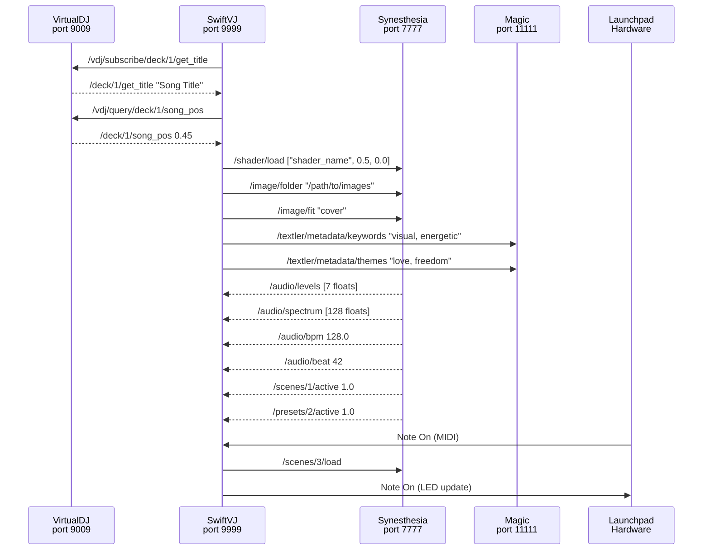
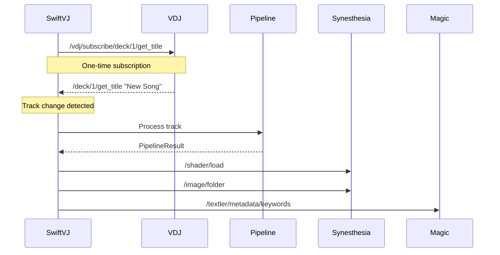
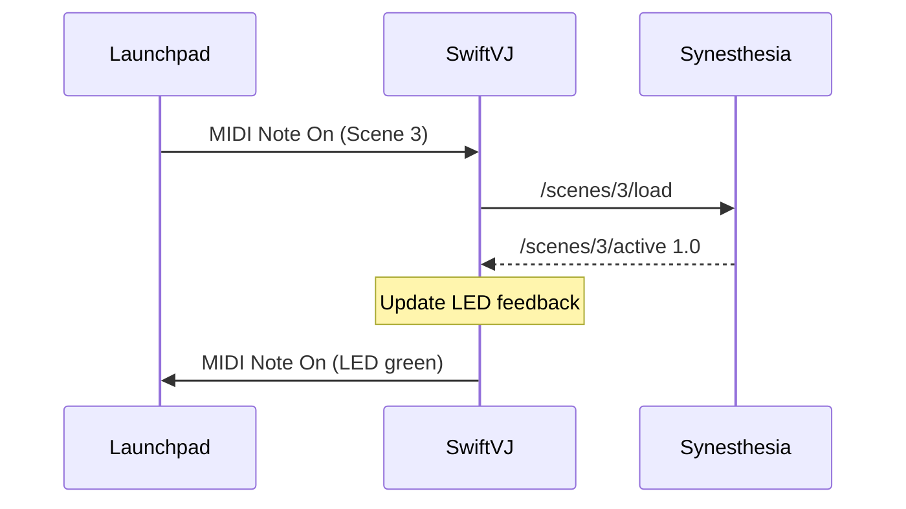
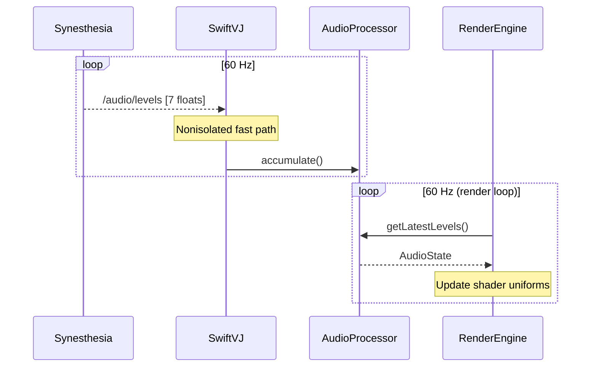

# SwiftVJ OSC Message Catalog

## Overview

SwiftVJ uses OSC (Open Sound Control) for real-time communication with external VJ applications (Synesthesia, Magic Music Visuals, VirtualDJ). This document catalogs all OSC messages sent and received by the system.

**OSC Hub:** All OSC communication flows through `OSCHub` (OSCClient.swift)

**Ports:**
- **9999** - SwiftVJ receive port (all incoming OSC)
- **7777** - Synesthesia send port
- **9009** - VirtualDJ bidirectional port
- **11111** - Magic Music Visuals send port

---

## Message Flow Diagram



---

## Outgoing Messages (SwiftVJ → External Apps)

### To VirtualDJ (Port 9009)

#### Track Metadata Subscriptions

SwiftVJ subscribes to VDJ for automatic track change notifications:

| Address | Args | Purpose | Frequency |
|---------|------|---------|-----------|
| `/vdj/subscribe/deck/1/get_title` | none | Subscribe to deck 1 title changes | Once at startup |
| `/vdj/subscribe/deck/1/get_artist` | none | Subscribe to deck 1 artist changes | Once at startup |
| `/vdj/subscribe/deck/1/get_album` | none | Subscribe to deck 1 album changes | Once at startup |
| `/vdj/subscribe/deck/1/get_bpm` | none | Subscribe to deck 1 BPM changes | Once at startup |
| `/vdj/subscribe/deck/1/get_songlength` | none | Subscribe to deck 1 duration changes | Once at startup |
| `/vdj/subscribe/deck/1/loaded` | none | Subscribe to deck 1 load events | Once at startup |
| `/vdj/subscribe/deck/2/*` | ... | Same for deck 2 | Once at startup |
| `/vdj/subscribe/crossfader` | none | Subscribe to crossfader position | Once at startup |

**Note:** VDJ responds to the source port (9999) with updates when values change.

#### Playback State Queries

SwiftVJ polls VDJ for position updates (1Hz):

| Address | Args | Purpose | Frequency |
|---------|------|---------|-----------|
| `/vdj/query/deck/1/get_title` | none | Get current track title | 1 Hz |
| `/vdj/query/deck/1/get_artist` | none | Get current track artist | 1 Hz |
| `/vdj/query/deck/1/get_album` | none | Get current track album | 1 Hz |
| `/vdj/query/deck/1/get_bpm` | none | Get current track BPM | 1 Hz |
| `/vdj/query/deck/1/get_songlength` | none | Get track duration (seconds) | 1 Hz |
| `/vdj/query/deck/1/song_pos` | none | Get playback position (0.0-1.0) | 1 Hz |
| `/vdj/query/deck/1/play` | none | Get play state (0 or 1) | 1 Hz |
| `/vdj/query/deck/1/volume` | none | Get deck volume (0.0-1.0) | 1 Hz |
| `/vdj/query/deck/1/is_audible` | none | Get audible flag (0 or 1) | 1 Hz |
| `/vdj/query/deck/2/*` | ... | Same for deck 2 | 1 Hz |

**Sent By:** PlaybackModule via OSCHub

---

### To Synesthesia (Port 7777)

#### Shader Selection

| Address | Args | Purpose | Trigger |
|---------|------|---------|---------|
| `/shader/load` | `[name: String, crossfade: Float, blend: Float]` | Load shader with crossfade | Pipeline complete |

**Example:**
```
/shader/load ["particle_storm", 0.5, 0.0]
```

**Sent By:** PipelineModule, SwiftVJApp (manual selection)

---

#### Image Control

| Address | Args | Purpose | Trigger |
|---------|------|---------|---------|
| `/image/folder` | `[path: String]` | Set image folder path | Pipeline complete |
| `/image/fit` | `[mode: String]` | Set fit mode ("cover" or "contain") | Pipeline complete |

**Example:**
```
/image/folder ["/Users/vj/song_images/artist_-_title"]
/image/fit ["cover"]
```

**Sent By:** PipelineModule

---

#### Launchpad-Triggered Actions

These are sent when Launchpad buttons are pressed:

| Address | Args | Purpose | Trigger |
|---------|------|---------|---------|
| `/scenes/{n}/load` | none | Load scene N | Launchpad scene button |
| `/scenes/{n}/toggle` | none | Toggle scene N | Launchpad scene toggle |
| `/scenes/select` | `[name: String]` | Select scene by name | Dynamic bank |
| `/presets/{n}/load` | none | Load preset N | Launchpad preset button |
| `/presets/select` | `[name: String]` | Select preset by name | Dynamic bank |
| `/controls/meta/{control}` | `[value: Float]` | Meta control (BPM, phase, etc.) | Launchpad control |
| `/controls/global/{control}` | `[value: Float]` | Global parameter control | Launchpad control |
| `/controls/{control}` | `[value: Float]` | Generic parameter control | Launchpad control |

**Sent By:** LaunchpadModule via EffectExecutor

**Scene Example:**
```
/scenes/1/load
/scenes/select ["Buildup"]
```

**Control Example:**
```
/controls/meta/bpm [128.0]
/controls/global/brightness [0.8]
```

---

### To Magic Music Visuals (Port 11111)

#### Text/Lyrics Metadata (Textler)

| Address | Args | Purpose | Trigger |
|---------|------|---------|---------|
| `/textler/lyrics/reset` | none | Clear lyrics display | Track change |
| `/textler/refrain/reset` | none | Clear refrain display | Track change |
| `/textler/keywords/reset` | none | Clear keywords display | Track change |
| `/textler/metadata/keywords` | `[keywords: String]` | Set keywords (comma-separated) | AI analysis complete |
| `/textler/metadata/themes` | `[themes: String]` | Set themes (comma-separated) | AI analysis complete |
| `/textler/metadata/visuals` | `[adjectives: String]` | Set visual descriptors | AI analysis complete |
| `/textler/metadata/mood` | `[mood: String]` | Set primary mood | AI analysis complete |

**Example:**
```
/textler/lyrics/reset
/textler/metadata/keywords ["energetic, particles, blue, fast"]
/textler/metadata/themes ["freedom, rebellion, power"]
/textler/metadata/visuals ["glowing, swirling, intense"]
/textler/metadata/mood ["uplifting"]
```

**Sent By:** PipelineModule

---

#### Shader Selection (Magic)

| Address | Args | Purpose | Trigger |
|---------|------|---------|---------|
| `/shader/load` | `[name: String, crossfade: Float, blend: Float]` | Load shader | Pipeline complete or manual |

**Sent By:** SwiftVJApp (user selection)

---

#### Message Forwarding

All incoming OSC messages on port 9999 are automatically forwarded to Magic (port 11111):

**Purpose:** Allow Magic to react to VDJ playback, Synesthesia audio, etc.

**Sent By:** OSCHub (automatic forwarding)

---

## Incoming Messages (External Apps → SwiftVJ)

### From VirtualDJ (Port 9009 → 9999)

#### Deck Metadata Responses

| Address | Args | Purpose | Notes |
|---------|------|---------|-------|
| `/deck/1/get_title` | `[title: String]` | Current track title | Response to query or subscription |
| `/deck/1/get_artist` | `[artist: String]` | Current track artist | Response to query or subscription |
| `/deck/1/get_album` | `[album: String]` | Current track album | Response to query or subscription |
| `/deck/1/get_bpm` | `[bpm: Float]` | Current track BPM | Response to query or subscription |
| `/deck/1/get_songlength` | `[seconds: Float]` | Track duration in seconds | Response to query or subscription |
| `/deck/1/loaded` | `[0 or 1]` | Deck loaded flag | Sent on track load |
| `/deck/2/*` | ... | Same for deck 2 | |

#### Deck Playback State

| Address | Args | Purpose | Notes |
|---------|------|---------|-------|
| `/deck/1/song_pos` | `[position: Float]` | Playback position (0.0-1.0) | Polled at 1 Hz |
| `/deck/1/play` | `[0 or 1]` | Play state (0=paused, 1=playing) | Polled at 1 Hz |
| `/deck/1/volume` | `[volume: Float]` | Deck volume (0.0-1.0) | Polled at 1 Hz |
| `/deck/1/is_audible` | `[0 or 1]` | Audible flag (considers crossfader) | Polled at 1 Hz |
| `/deck/2/*` | ... | Same for deck 2 | |

#### Crossfader

| Address | Args | Purpose | Notes |
|---------|------|---------|-------|
| `/crossfader` | `[position: Float]` | Crossfader position (0.0=deck1, 1.0=deck2) | Used for deck selection |

**Received By:** VDJMonitor (via PlaybackModule)

---

### From Synesthesia (Port 7777 → 9999)

#### Audio Reactive Data

| Address | Args | Purpose | Frequency |
|---------|------|---------|-----------|
| `/audio/levels` | `[7 floats]` | Frequency band levels (sub-bass, bass, low-mid, mid, high-mid, presence, air) | ~60 Hz |
| `/audio/spectrum` | `[128 floats]` | Full FFT spectrum (128 bins) | ~60 Hz |
| `/audio/bpm` | `[bpm: Float]` | Detected BPM | On change |
| `/audio/beat` | `[count: Int]` | Beat counter | Every beat |
| `/audio/measure` | `[count: Int]` | Measure counter | Every measure |

**Frequency Bands (7-band):**
1. Sub-bass (20-60 Hz)
2. Bass (60-250 Hz)
3. Low-mid (250-500 Hz)
4. Mid (500-2000 Hz)
5. High-mid (2000-4000 Hz)
6. Presence (4000-6000 Hz)
7. Air (6000-20000 Hz)

**Received By:** SynesthesiaAudioProcessor

**Performance Note:** Audio messages arrive at ~1000+ msg/sec. OSCHub uses nonisolated fast path to avoid MainActor overhead.

---

#### Scene/Preset Feedback

Synesthesia sends feedback when scenes/presets are activated:

| Address | Args | Purpose | Trigger |
|---------|------|---------|---------|
| `/scenes/{n}/active` | `[0.0 or 1.0]` | Scene N activation state | Scene load |
| `/scenes/{n}/opacity` | `[opacity: Float]` | Scene N opacity | Real-time |
| `/presets/{n}/active` | `[0.0 or 1.0]` | Preset N activation state | Preset load |
| `/favslots/{n}/active` | `[0.0 or 1.0]` | Favorite slot N state | Favorite load |

**Received By:** LaunchpadModule (for LED feedback)

---

#### Control Feedback

Synesthesia sends parameter values for Launchpad LED updates:

| Address | Args | Purpose | Trigger |
|---------|------|---------|---------|
| `/controls/meta/{control}` | `[value: Float]` | Meta control value | Value change |
| `/controls/global/{control}` | `[value: Float]` | Global parameter value | Value change |
| `/playlist/{n}/active` | `[0.0 or 1.0]` | Playlist item active | Playlist navigation |

**Received By:** LaunchpadModule

---

### From Magic Music Visuals (Port 11111 → 9999)

**Status:** Currently not used for incoming messages (Magic is send-only from SwiftVJ perspective)

---

## OSC Pattern Matching

SwiftVJ uses a **PrefixTrie** for efficient OSC pattern matching:

### Pattern Types

1. **Exact Match:**
   ```
   /deck/1/get_title  → Matches only "/deck/1/get_title"
   ```

2. **Prefix Match:**
   ```
   /deck/*  → Matches "/deck/1/play", "/deck/2/volume", etc.
   ```

3. **Wildcard Match:**
   ```
   *  → Matches all messages
   /  → Matches all messages
   ""  → Matches all messages
   ```

### Subscription Examples

```swift
oscHub.subscribe(pattern: "/deck/*") { address, values in
    // Handle all VDJ deck messages
}

oscHub.subscribe(pattern: "/audio/levels") { address, values in
    // Handle exact audio levels message
}

oscHub.subscribe(pattern: "*") { address, values in
    // Handle all OSC messages (debug logging)
}
```

---

## OSC Data Types

SwiftVJ uses OSCKit's `OSCValue` protocol for polymorphic arguments:

| OSC Type | Swift Type | Usage |
|----------|------------|-------|
| Int | `Int32` | Counts, flags (0/1) |
| Float | `Float32` | Normalized values (0.0-1.0), BPM, position |
| String | `String` | Track metadata, shader names, paths |
| Blob | `Data` | Binary data (not used in SwiftVJ) |

**Type Conversion:**
```swift
// Sending
try oscHub.sendToSynesthesia("/shader/load", values: [
    "shader_name",  // String
    Float(0.5),     // Float32
    Float(0.0)      // Float32
])

// Receiving
oscHub.subscribe(pattern: "/deck/1/get_title") { address, values in
    if let title = values.first as? String {
        print("Title: \(title)")
    }
}
```

---

## Message Latency Monitoring

OSCHub includes optional latency tracking:

```swift
oscHub.enableLatencyMonitoring()
let stats = oscHub.getLatencyStats()
// stats.averageMs - Average processing time
// stats.maxMs - Max processing time
// stats.sampleCount - Number of samples
```

**Use Case:** Debug performance bottlenecks in OSC handlers

---

## OSC Message Statistics

OSCHub tracks message counts:

```swift
let stats = oscHub.getStatistics()
// stats.messagesSent - Total sent
// stats.messagesReceived - Total received
// stats.messagesForwarded - Forwarded to Magic
```

---

## Common OSC Workflows

### 1. Track Change Detection (VDJ)



### 2. Launchpad Scene Selection



### 3. Audio Reactive Rendering



---

## Conclusion and Improvement Opportunities

### Strengths

1. **Centralized Hub** - Single point for all OSC communication (OSCHub)
2. **Efficient Routing** - PrefixTrie for O(n) pattern matching
3. **Type-Safe** - OSCValue protocol for polymorphic arguments
4. **Performance** - Nonisolated fast path for high-frequency messages
5. **Monitoring** - Built-in latency tracking and statistics

### Areas for Improvement

1. **Message Validation:**
   - No schema validation for OSC messages
   - **Recommendation:** Define message schemas with argument count/type validation
   - **Benefit:** Early detection of malformed messages

2. **OSC Discovery:**
   - Hardcoded ports (9009, 7777, 11111)
   - **Recommendation:** OSC service discovery (Bonjour/mDNS)
   - **Benefit:** Auto-detect Synesthesia/Magic/VDJ on network

3. **Message Queuing:**
   - No guaranteed delivery or retry logic
   - **Recommendation:** Add optional message queue with retries
   - **Use Case:** Critical messages (shader load) should not be lost

4. **Bidirectional Sync:**
   - SwiftVJ sends to Synesthesia but doesn't track applied state
   - **Recommendation:** Request/response pattern for state sync
   - **Example:** `/shader/load` → wait for `/shader/loaded` confirmation

5. **OSC Bundles:**
   - Not using OSC bundles for atomic updates
   - **Recommendation:** Group related messages in bundles
   - **Example:** Bundle shader + image + metadata in single transaction

6. **Rate Limiting:**
   - No rate limiting on outgoing messages
   - **Recommendation:** Throttle high-frequency sends
   - **Benefit:** Prevent network congestion

7. **Message Logging:**
   - OSC debug view is UI-only (not persisted)
   - **Recommendation:** Optional OSC message logging to file
   - **Use Case:** Debug VDJ integration issues offline

8. **Typed Messages:**
   - Raw OSC messages with string addresses
   - **Recommendation:** Type-safe message builder
   - **Example:** `OSCHub.Synesthesia.loadShader(name:crossfade:blend:)`

### Recommended Refactorings

**Priority 1 (High Value, Low Risk):**
- Add message schema validation
- Type-safe message builders (extension on OSCHub)
- OSC message logging to file

**Priority 2 (Medium Value, Medium Risk):**
- OSC service discovery (Bonjour)
- Request/response pattern for critical messages
- Rate limiting for high-frequency sends

**Priority 3 (High Value, High Risk):**
- Replace raw OSC with typed protocol (code generation?)
- OSC bundle support for atomic updates
- Distributed OSC routing (multi-machine VJ setups)
