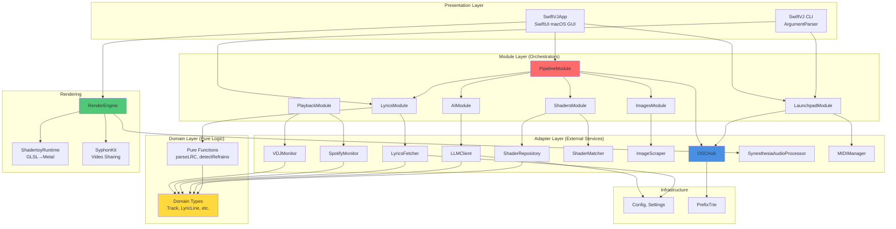
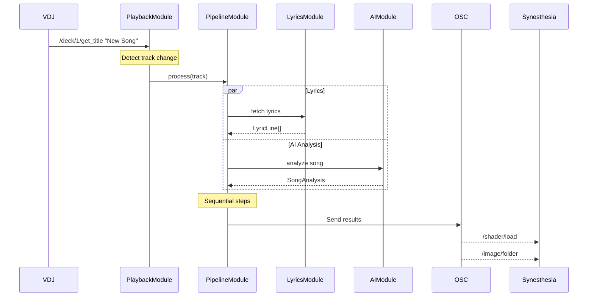
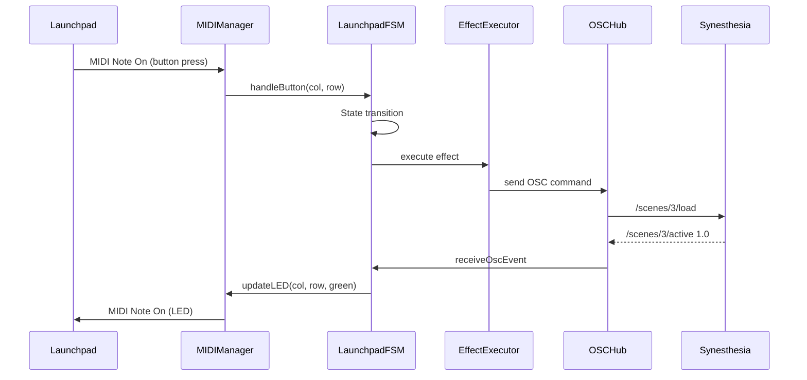
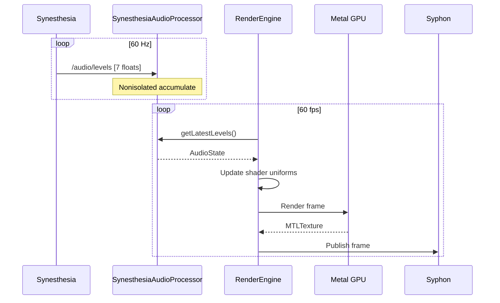

# SwiftVJ Architecture Overview

## Executive Summary

SwiftVJ is a macOS VJ control application built with Swift 5.9+ using modern concurrency (async/await, actors). It follows functional programming principles from "Grokking Simplicity" and deep module design from "A Philosophy of Software Design". The system orchestrates track processing, AI analysis, shader selection, and image search, communicating with external VJ apps (Synesthesia, Magic) via OSC.

**Key Metrics:**
- **Lines of Code:** ~13,000 (SwiftVJCore) + ~7,000 (SwiftVJApp) = ~20,000 total
- **Modules:** 6 SPM library targets, 3 executable targets
- **Actors:** 15+ concurrent actors for thread-safe state management
- **External Dependencies:** 3 SPM packages (OSCKit, ArgumentParser, Yams)
- **External Services:** 5 runtime dependencies (LRCLIB, LM Studio, DuckDuckGo, VDJ, Synesthesia)

---

## Architectural Layers



---

## Core Architectural Patterns

### 1. Functional Core / Imperative Shell

**Functional Core (Domain Layer):**
- **Immutable Data:** All domain types are immutable structs (Track, LyricLine, PlaybackState)
- **Pure Functions:** `parseLRC`, `detectRefrains`, `extractKeywords` (no side effects)
- **No Dependencies:** Domain layer depends only on Foundation

**Imperative Shell (Adapters + Modules):**
- **Actions:** Adapters handle I/O (network, files, OSC, MIDI)
- **Orchestration:** Modules coordinate adapters via async/await
- **Side Effects:** All side effects isolated to actor boundaries

**Benefits:**
- Testable (pure functions in BehaviorTests)
- Predictable (immutability prevents bugs)
- Composable (functional composition)

---

### 2. Deep Modules (A Philosophy of Software Design)

Each module has a **simple public interface** hiding **complex implementation**:

**Example: PipelineModule**
- **Public Interface:** `process(track: Track) async -> PipelineResult` (1 method)
- **Hidden Complexity:**
  - Orchestrates 5 sub-modules (Lyrics, AI, Shaders, Images, OSC)
  - Manages caching (7-day TTL, JSON serialization)
  - Handles errors (graceful degradation)
  - Fires callbacks (step start/complete)
  - Parallel execution where possible

**Example: OSCHub**
- **Public Interface:** `sendToVDJ/Synesthesia/Magic`, `subscribe(pattern:handler:)`
- **Hidden Complexity:**
  - OSCKit server + client lifecycle
  - Port reuse for VDJ response routing
  - PrefixTrie pattern matching
  - Message forwarding
  - Latency tracking
  - Thread-safe subscription management

**Benefits:**
- Easy to use (simple API)
- Easy to change (implementation hidden)
- Reduced cognitive load

---

### 3. Actor-Based Concurrency (Swift Actors)

All modules and adapters are Swift actors:

**Thread Safety:**
- Actor isolation prevents data races
- Compiler-enforced synchronization
- No manual locks needed (except OSCHub NSLock for OSCKit callbacks)

**Async/Await:**
- All module methods are `async`
- Cooperative cancellation via `Task`
- Structured concurrency

**Example:**
```swift
public actor PipelineModule: Module {
    private var resultCache: [String: PipelineResult] = [:]  // Actor-isolated
    
    public func process(track: Track) async -> PipelineResult {
        // Safe: actor serializes access to resultCache
        if let cached = resultCache[track.key] {
            return cached
        }
        // ...
    }
}
```

**Benefits:**
- Safe by default
- No race conditions
- Scalable concurrency

---

### 4. Dependency Injection (ModuleRegistry)

Modules don't create their dependencies - they're injected:

**Registration:**
```swift
let registry = ModuleRegistry()
registry.register(name: "playback", module: PlaybackModule(oscHub: hub))
registry.register(name: "lyrics", module: LyricsModule(fetcher: lyricsFetcher))
registry.register(name: "pipeline", module: PipelineModule(...), dependencies: ["lyrics", "ai"])
```

**Lifecycle:**
```swift
try await registry.startAll()  // Topologically sorts dependencies, starts in order
await registry.stopAll()       // Stops in reverse order
```

**Benefits:**
- Testable (inject mocks)
- Flexible (swap implementations)
- Clear dependencies

---

### 5. Repository Pattern (Data Access)

Repositories abstract storage:

**ShaderRepository:**
- Hides filesystem traversal
- Parses YAML/JSON metadata
- Caches loaded shaders

**PipelineModule Cache:**
- Serializes results to JSON
- 7-day TTL
- Load on startup

**ImageScraper:**
- Filesystem cache organized by query
- Duplicate detection
- Infinite TTL (manual clear)

---

## Key Subsystems

### Track Processing Pipeline

**Flow:**
```
Track Detection → Lyrics Fetch → AI Analysis → Shader Match → Image Search → OSC Broadcast
```

**Implementation:** `PipelineModule` orchestrates 5 sub-modules

**Caching:** Results cached for 7 days (avoid re-processing)

**Parallelization:** AI and Images can run in parallel

**Error Handling:** Graceful degradation (missing lyrics → continue with AI)

---

### Launchpad MIDI Controller

**Components:**
- `LaunchpadModule` - Top-level coordinator
- `MIDIManager` - CoreMIDI device I/O
- `LaunchpadFSM` - Button state machine
- `EffectExecutor` - OSC effect dispatch
- `LaunchpadYAMLConfig` - Configuration parser

**Flow:**
```
MIDI Note On → FSM (button logic) → Executor (OSC send) → LED Update
```

**Modes:**
- **Scene Mode:** 64 pads = scene selection
- **Control Mode:** Pads = parameter controls
- **Learn Mode:** Capture OSC messages from Synesthesia

**Features:**
- Auto-reconnect on device plug/unplug
- Beat-sync LED blinking
- Dynamic group resolution (scene/preset names from Synesthesia)

---

### OSC Communication Hub

**Architecture:**
```
OSCServer (port 9999) ← Receive from VDJ/Synesthesia
OSCClient (port 9999) → Send to VDJ/Synesthesia/Magic
PrefixTrie → Efficient pattern matching
```

**Subscriptions:**
- VDJ playback state (`/deck/*`)
- Synesthesia audio data (`/audio/*`)
- Synesthesia scene feedback (`/scenes/*`, `/presets/*`)
- Launchpad control feedback (`/controls/*`)

**Sends:**
- VDJ queries/subscriptions (`/vdj/query/*`, `/vdj/subscribe/*`)
- Synesthesia commands (`/shader/load`, `/image/folder`)
- Magic metadata (`/textler/metadata/*`)
- Launchpad effects (`/scenes/{n}/load`, `/controls/*`)

---

### Rendering Engine (SwiftVJApp)

**Components:**
- `RenderEngine` - Coordinator (60 fps render loop)
- `HeadlessRenderer` - Offscreen Metal rendering
- `ShadertoyRuntime` - GLSL shader compilation/execution
- `SyphonSender` - Video output to external apps
- State Managers:
  - `ShaderManager` - Shader loading and selection
  - `ImageManager` - Image folder navigation
  - `LyricsManager` - Karaoke line timing
  - `AudioProcessor` - Audio reactive data

**Render Pipeline:**
```
Metal Render Loop (60 fps) →
  Update Audio Uniforms →
  Render Shader →
  Render Images (crossfade) →
  Render Lyrics (karaoke) →
  Syphon Send
```

**Audio Reactivity:**
- Synesthesia sends `/audio/levels` at ~60 Hz
- SynesthesiaAudioProcessor accumulates (nonisolated fast path)
- RenderEngine pulls latest levels each frame
- Shader uniforms updated (bass, mid, high, spectrum)

---

## Data Flow Patterns

### 1. Track Change Flow



### 2. Launchpad Control Flow



### 3. Audio Reactive Rendering



---

## Configuration Management

### Settings Persistence (UserDefaults)

**Stored Settings:**
- Playback source (`"vdj"` or `"spotify"`)
- Selected shader name
- Current DJ set phase
- Timing offset (ms)
- Window size/position

**Implementation:** `Settings` actor with `get/set` methods

---

### YAML Configuration

**Launchpad Config (`launchpad-config.yaml`):**
- Global settings (BPM, mode)
- Bank definitions (scenes, presets, controls)
- Pad mappings (button → OSC command)

**Shader Metadata (`.yaml` per shader):**
- Energy score, mood valence
- Color tags, effect tags
- Quality rating
- DJ set phases

---

### Runtime Configuration

**Config.swift:**
- Cache directories
- OSC ports
- Service endpoints (LRCLIB, LM Studio)
- Retry policies
- Service health tracking

---

## Error Handling Strategy

### Levels of Error Handling

**1. Adapter Level:**
- Custom error types (`LyricsFetcherError`, `VDJMonitorError`)
- Returns `nil` or throws on failure
- Service health tracking with exponential backoff

**2. Module Level:**
- Graceful degradation (missing lyrics → continue pipeline)
- Logs errors but doesn't throw
- Returns partial results

**3. Application Level:**
- UI displays error state
- Logs to UI log viewer
- User can retry or skip

---

### Service Health Monitoring

**BackoffPolicy (Config.swift):**
- Exponential backoff on failures
- Circuit breaker pattern
- Max retries before giving up

**ServiceHealth Actor:**
- Tracks failure count per service
- Computes next retry delay
- Resets on success

---

## Testing Strategy

### BehaviorTests (Unit Tests)

**Scope:** Pure functions and domain logic

**No External Dependencies:**
- No network calls
- No file I/O (in-memory)
- No CoreMIDI

**Coverage:**
- LRC parsing
- Refrain detection
- Shader matching algorithm
- Launchpad FSM state transitions
- Config parsing

---

### E2ETests (Integration Tests)

**Scope:** Adapters and external services

**Prerequisites Checked:**
- LRCLIB API available
- LM Studio running
- VDJ running (optional)

**Graceful Skip:**
```swift
func testLyricsE2E() async throws {
    guard await Prerequisites.lrclibAvailable() else {
        throw XCTSkip("LRCLIB not available")
    }
    // Test against real API
}
```

---

## Performance Characteristics

### Latency Requirements

| Component | Target | Typical | Notes |
|-----------|--------|---------|-------|
| VDJ OSC response | < 50ms | ~10ms | Local UDP |
| Lyrics fetch | < 2s | ~500ms | HTTP to LRCLIB |
| AI analysis | < 5s | ~2s | Local LLM (3B model) |
| Shader matching | < 100ms | ~10ms | In-memory search |
| Image search | < 10s | ~3s | DuckDuckGo scrape + download |
| OSC message routing | < 5ms | < 1ms | PrefixTrie lookup |
| Audio OSC processing | < 1ms | ~0.1ms | Nonisolated fast path |

---

### Throughput

| Metric | Rate | Notes |
|--------|------|-------|
| Audio OSC messages | ~1000/sec | /audio/* messages from Synesthesia |
| Render frame rate | 60 fps | Metal rendering + Syphon |
| VDJ polling | 1 Hz | Position updates |
| Pipeline processing | ~1/track | Cached results reused |

---

### Memory Usage

| Component | Typical | Peak | Notes |
|-----------|---------|------|-------|
| Pipeline cache | ~1 MB | ~10 MB | 100 tracks cached |
| Shader metadata | ~500 KB | ~1 MB | 200 shaders |
| Image cache | ~50 MB | ~500 MB | Per-song folders |
| Audio spectrum | ~1 KB | ~1 KB | 128 floats × 2 buffers |
| Total app | ~100 MB | ~500 MB | Depends on image cache |

---

## Deployment Architecture

### Single-Machine Setup (Typical)

```
┌─────────────────────────────────────────────────┐
│ macOS Machine (VJ Laptop)                      │
│                                                 │
│  ┌──────────────┐  ┌─────────────────────────┐ │
│  │ VirtualDJ    │  │ SwiftVJApp              │ │
│  │ port 9009    │◄─┤ • GUI                   │ │
│  └──────────────┘  │ • Pipeline              │ │
│                    │ • Launchpad             │ │
│  ┌──────────────┐  │ • RenderEngine          │ │
│  │ Synesthesia  │◄─┤   port 9999/7777        │ │
│  │ port 7777    │  └─────────────────────────┘ │
│  └──────────────┘                ▲             │
│         │                        │             │
│         │  ┌─────────────────────┘             │
│         ▼  ▼                                   │
│  ┌──────────────┐                              │
│  │ Magic/Resolume│◄─ Syphon                   │
│  │ port 11111   │                              │
│  └──────────────┘                              │
│                                                 │
│  ┌──────────────┐                              │
│  │ LM Studio    │◄─ HTTP localhost:1234       │
│  │ (LLM)        │                              │
│  └──────────────┘                              │
│                                                 │
│  [Launchpad Mini MK3] ◄─ USB MIDI              │
└─────────────────────────────────────────────────┘
```

---

## Conclusion and Improvement Opportunities

### Strengths

1. **Clean Architecture** - Clear layering (domain → adapters → modules → app)
2. **Modern Swift** - Actors, async/await, structured concurrency
3. **Functional Core** - Immutable domain types, pure functions
4. **Deep Modules** - Simple interfaces hiding complexity
5. **Testable** - Pure functions in BehaviorTests, E2E for integration
6. **Minimal Dependencies** - Only 3 external packages
7. **Real-Time Performance** - Optimized for VJ use (60 fps rendering, low-latency OSC)

---

### Major Architecture Improvements

#### 1. State Management Complexity
**Current:** Multiple state representations (AppState @Published, Module actors, OSCHub subscriptions)

**Problem:**
- State synchronization via callbacks
- No single source of truth
- Difficult to debug state inconsistencies

**Recommendation:**
- Adopt unidirectional data flow (TCA, Redux-like)
- Single immutable AppState
- Actions → Reducer → New State
- Predictable state transitions

**Benefits:**
- Time-travel debugging
- State snapshots
- Easier testing

---

#### 2. Module Coupling via OSCHub
**Current:** Many components depend on OSCHub directly

**Problem:**
- OSCHub is a "god object" (445 lines, many responsibilities)
- Tight coupling to OSC protocol
- Hard to test without OSC infrastructure

**Recommendation:**
- Split OSCHub into focused protocols:
  - `OSCReceiver` - Subscription and routing
  - `OSCSender` - Send-only interface
  - `OSCRouter` - Pattern matching
- Inject sender/receiver separately
- Protocol-oriented design

**Benefits:**
- Testable (mock sender/receiver)
- Swappable transports (OSC, WebSocket, gRPC)
- Smaller, focused components

---

#### 3. Rendering Engine Separation
**Current:** RenderEngine tightly coupled to SwiftVJApp

**Problem:**
- Cannot use rendering from CLI
- No headless rendering tests
- Duplication if adding another UI (iPad app)

**Recommendation:**
- Extract `RenderingKit` SPM target
- RenderEngine independent of SwiftUI
- Protocol-based injection

**Benefits:**
- Reusable in CLI for screenshot generation
- Testable rendering logic
- Support multiple UIs (macOS, iOS)

---

#### 4. Error Handling Inconsistency
**Current:** Mix of throws, returns nil, returns default values

**Problem:**
- Unclear error handling at call sites
- Lost error context
- Hard to debug failures

**Recommendation:**
- Consistent `Result<T, E>` pattern
- Domain-specific error types
- Error recovery strategies explicit

**Benefits:**
- Explicit error handling
- Better debugging
- Forced handling of failures

---

#### 5. Configuration Sprawl
**Current:** Configuration scattered (UserDefaults, YAML files, Config.swift, hardcoded values)

**Problem:**
- No single config schema
- Validation at runtime
- Hard to document all settings

**Recommendation:**
- Centralized configuration with schema
- Validation at load time
- Type-safe config access
- Environment-based overrides

**Benefits:**
- Configuration as code
- IDE autocomplete for settings
- Validation errors caught early

---

### Minor Improvements

1. **Spotify Integration** - Implement real SpotifyMonitor (currently stub)
2. **Image API** - Replace DuckDuckGo scraping with official API
3. **OSC Type Safety** - Type-safe message builders
4. **Shader Precompilation** - Pre-compile shaders to `.metallib`
5. **Metrics Dashboard** - Prometheus/StatsD export for monitoring
6. **Documentation** - Add DocC comments to all public APIs
7. **CI/CD** - Automated testing and release builds

---

### Recommended Refactoring Priorities

**Phase 1 (Foundation - 2 weeks):**
- Extract RenderingKit SPM target
- Split OSCHub into OSCReceiver/OSCSender
- Implement Spotify integration

**Phase 2 (Improvement - 4 weeks):**
- Adopt unidirectional data flow (TCA)
- Centralized configuration system
- Replace DuckDuckGo with official image API

**Phase 3 (Polish - 2 weeks):**
- Add DocC documentation
- Metrics dashboard
- CI/CD pipeline

**Total:** ~8 weeks for major architecture overhaul

---

## Summary

SwiftVJ demonstrates excellent software engineering practices:
- **Functional principles** for correctness
- **Deep modules** for simplicity
- **Actor concurrency** for safety
- **Clear layering** for maintainability

The architecture is well-suited for VJ performance with low-latency OSC, real-time rendering, and graceful degradation. Main areas for improvement are state management (unidirectional flow), module coupling (OSCHub refactor), and testing isolation (protocol-based DI).

The codebase is production-ready with room for architectural cleanup to improve long-term maintainability.
