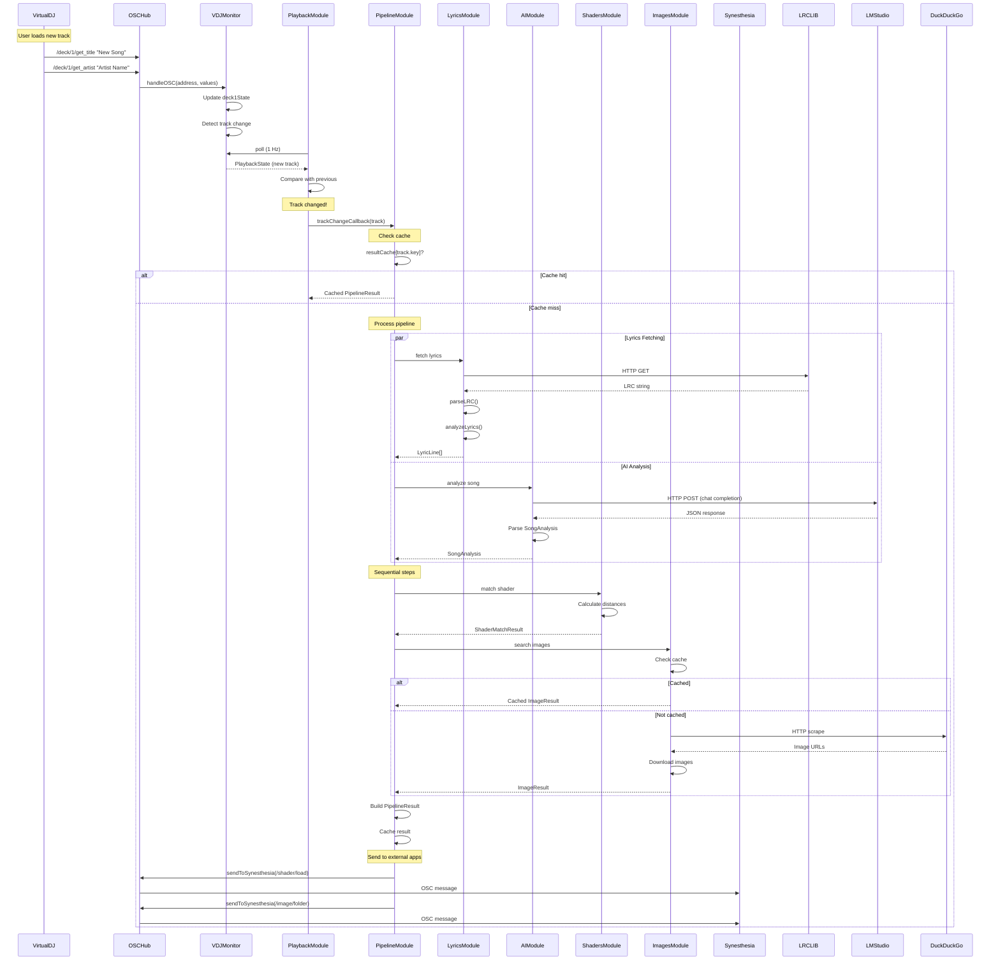
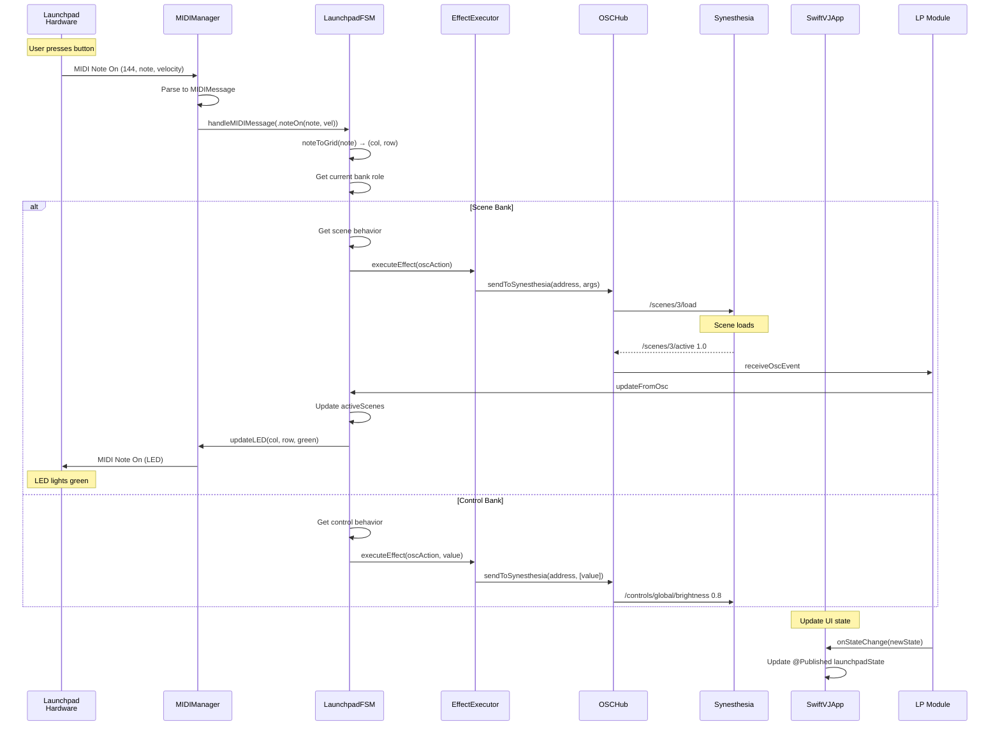
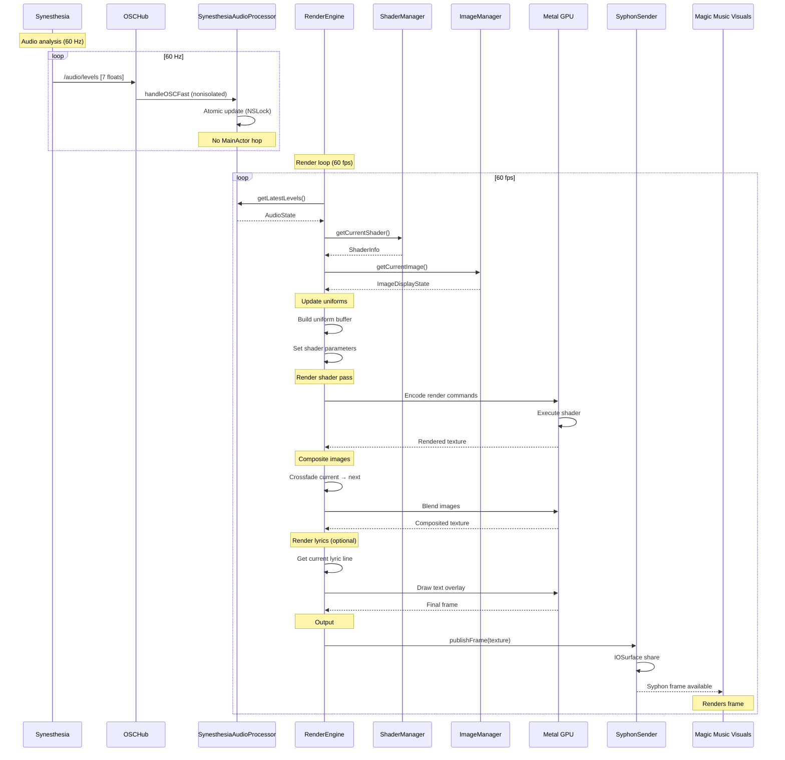
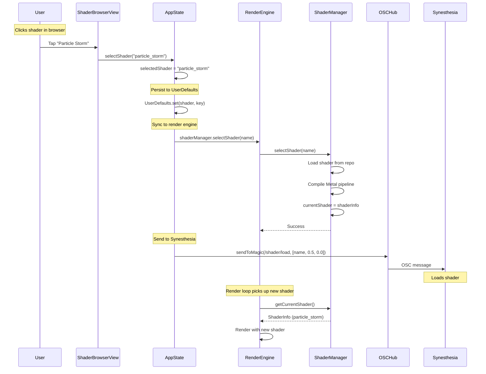
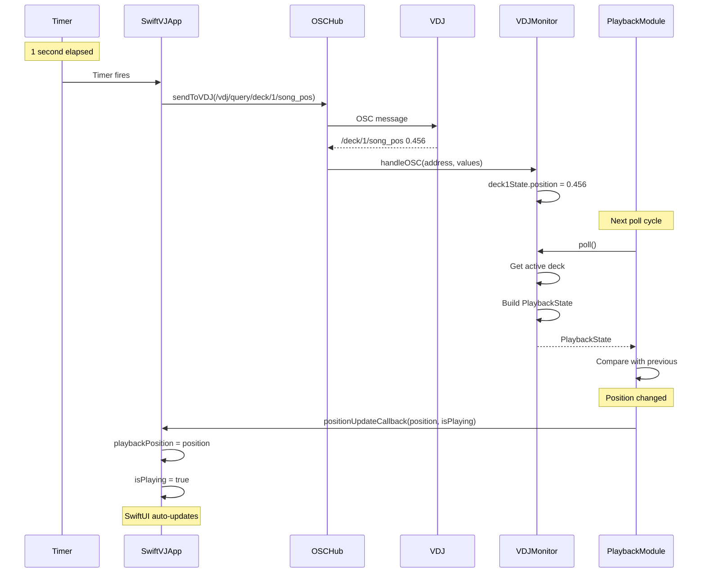
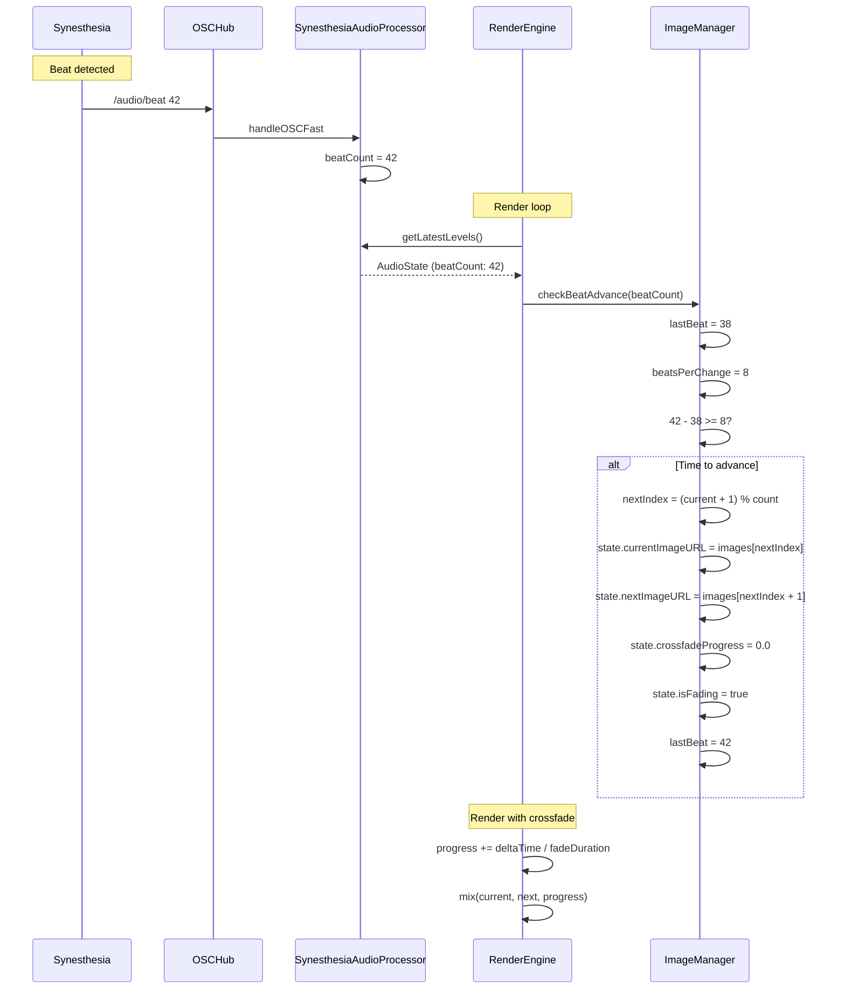
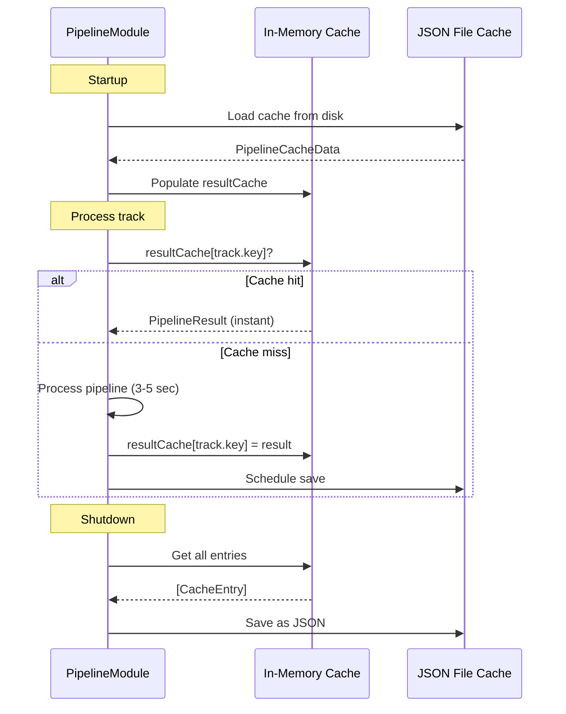

# SwiftVJ Data Flow

## Overview

This document describes the end-to-end data flows in SwiftVJ, from user actions and external events to rendered output. Each flow is documented with sequence diagrams, data transformations, and performance characteristics.

---

## Primary Data Flows

### 1. Track Change Detection and Processing

**Trigger:** New track plays in VirtualDJ

**Flow:** VDJ → SwiftVJ → Pipeline → External Apps



**Data Transformations:**

1. **OSC → Domain:**
   - OSC strings → `Track(artist, title, album, duration, bpm)`

2. **LRC → Domain:**
   - LRC string → `[LyricLine(timeSec, text)]`
   - Refrain detection → `isRefrain` flag added
   - Keyword extraction → `keywords` field populated

3. **AI → Domain:**
   - JSON response → `SongAnalysis(keywords, themes, mood, categories)`
   - Categories → `SongCategories(scores, primaryMood, estimatedEnergy, estimatedValence)`

4. **Shader Matching:**
   - `(energy, valence)` → Euclidean distance to each shader
   - Top match → `ShaderMatchResult(name, path, score)`

5. **Images:**
   - Query string → DuckDuckGo scrape
   - URLs → Downloaded files
   - Files → `ImageResult(images, folder, source)`

6. **Pipeline Result:**
   - All intermediate results → `PipelineResult(artist, title, ...all fields...)`
   - Serialized to JSON → Cached on disk

**Performance:**
- **Typical:** 3-5 seconds (parallel lyrics + AI)
- **Cached:** < 10ms (disk read + deserialization)
- **Bottleneck:** AI analysis (~2s with 3B model)

**Error Handling:**
- Missing lyrics → Continue with AI analysis
- AI failure → Use default categories (energy=0.5, valence=0)
- Shader match failure → Random shader selection
- Image search failure → Use cached images if available

---

### 2. Launchpad Button Press to Visual Effect

**Trigger:** User presses Launchpad button

**Flow:** Hardware → MIDI → FSM → OSC → Synesthesia → LED Feedback



**Data Transformations:**

1. **MIDI → Domain:**
   - MIDI bytes `(144, 57, 127)` → `MIDIMessage.noteOn(note: 57, velocity: 127)`
   - Note 57 → Grid `(col: 6, row: 4)` via `noteToGrid()`

2. **Grid → Behavior:**
   - `(col, row)` → Lookup in `state.pads[ButtonId(col, row)]`
   - Behavior → `PadBehavior(mode, oscAction, onColor, offColor)`

3. **Behavior → OSC:**
   - `oscAction: OscCommand(address, args)` → OSC message
   - `OscArg` enum → OSCKit `OSCValue`

4. **OSC Feedback → LED:**
   - `/scenes/3/active 1.0` → Scene 3 is active
   - Update `activeScenes` set
   - Compute LED color (green if active, dim if inactive)
   - `LaunchpadColor` enum → MIDI velocity value

**Performance:**
- **Latency:** < 10ms (button press → LED update)
- **MIDI Processing:** < 1ms
- **OSC Send:** < 1ms (local UDP)
- **Synesthesia Processing:** ~5-10ms
- **LED Update:** < 1ms

**Modes:**
- **Toggle:** Button alternates on/off, sends OSC on each press
- **Momentary:** OSC sent on press, release sends off value
- **Scene:** Activates scene, deactivates previous (mutually exclusive)

---

### 3. Audio Reactive Rendering

**Trigger:** Synesthesia sends audio levels (60 Hz)

**Flow:** Synesthesia → SwiftVJ → Metal Rendering → Syphon Output



**Data Transformations:**

1. **OSC → Audio State:**
   - `/audio/levels [f1, f2, ..., f7]` → `AudioState(levels: [Float], ...)`
   - 7 bands: sub-bass, bass, low-mid, mid, high-mid, presence, air

2. **Audio State → Shader Uniforms:**
   - `AudioState.levels[1]` (bass) → `uniform float bass_level`
   - `AudioState.rms` → `uniform float overall_level`
   - `AudioState.spectrum` → `uniform sampler1D spectrum_texture`

3. **Image State → Textures:**
   - `currentImageURL` → Load to `MTLTexture`
   - `nextImageURL` → Load to `MTLTexture`
   - `crossfadeProgress` (0.0-1.0) → Blend factor

4. **Shader Execution:**
   - Vertex shader → Full-screen quad
   - Fragment shader → Per-pixel color
   - Uniforms + Textures → Final color output

5. **Syphon Output:**
   - `MTLTexture` → IOSurface-backed texture
   - IOSurface → Shared memory (zero-copy)
   - Other apps read same memory

**Performance:**
- **Audio OSC Rate:** ~1000 messages/sec
- **Render Frame Rate:** 60 fps (16.67ms per frame)
- **Frame Budget:**
  - Shader execution: ~10ms
  - Image compositing: ~2ms
  - Lyrics rendering: ~1ms
  - Syphon publish: ~1ms
  - Overhead: ~2ms
- **Typical Frame Time:** ~14ms (within budget)

**Optimization:**
- **Nonisolated Audio Path:** Avoids 1000+ MainActor hops/sec
- **Atomic Updates:** NSLock instead of actor re-entrancy
- **Shader Caching:** Pre-compiled Metal shaders
- **Texture Pooling:** Reuse textures across frames
- **IOSurface Sharing:** Zero-copy Syphon output

---

### 4. Manual Shader Selection

**Trigger:** User selects shader in UI

**Flow:** SwiftUI → AppState → RenderEngine → Synesthesia



**Data Transformations:**

1. **UI → Domain:**
   - Button tap → `String` shader name
   - Name → Lookup in shader repository

2. **Shader Loading:**
   - Name → `ShaderInfo` (metadata)
   - GLSL file → MSL wrapper generation
   - MSL → Metal library compilation
   - Library → `MTLRenderPipelineState`

3. **State Sync:**
   - `selectedShader` (AppState) → UserDefaults persistence
   - AppState → RenderEngine (via observer)
   - RenderEngine → Metal pipeline update

**Performance:**
- **UI Response:** < 50ms
- **Shader Compilation:** ~100-500ms (first time)
- **Cached Compilation:** < 10ms
- **Pipeline Switch:** < 5ms

---

### 5. VDJ Playback Position Polling

**Trigger:** Timer (1 Hz polling)

**Flow:** SwiftVJ → VDJ → SwiftVJ → UI Update



**Data Transformations:**

1. **Query → Response:**
   - `/vdj/query/deck/1/song_pos` → `/deck/1/song_pos [0.456]`
   - Normalized position (0.0-1.0)

2. **Position → Time:**
   - `position * track.duration` → Absolute time (seconds)
   - Used for lyrics timing, image auto-advance

3. **Deck Selection:**
   - Check `deck1State.isAudible` and `deck2State.isAudible`
   - Fallback to crossfader position (< 0.5 = deck1)
   - Select active deck → `PlaybackState`

**Performance:**
- **Query Rate:** 1 Hz (not time-critical)
- **VDJ Response:** < 10ms
- **State Update:** < 1ms
- **UI Update:** Next frame (16.67ms)

---

### 6. Image Auto-Advance (Beat-Sync)

**Trigger:** Beat counter from Synesthesia

**Flow:** Synesthesia → SwiftVJ → Image Crossfade



**Data Transformations:**

1. **Beat Counter:**
   - OSC `[42]` → `beatCount: Int`
   - Monotonically increasing

2. **Beat Difference:**
   - `currentBeat - lastAdvanceBeat` → Beats elapsed
   - `>= beatsPerChange` → Trigger advance

3. **Crossfade:**
   - `progress: 0.0 → 1.0` over fade duration (e.g. 0.5 seconds)
   - `mix(currentImage, nextImage, progress)` → Blended output

**Performance:**
- **Beat Rate:** ~120 BPM = 2 beats/sec
- **Advance Check:** Every frame (60 fps)
- **Crossfade Duration:** ~30 frames (0.5 sec @ 60 fps)

---

## State Management Data Flow

### AppState Updates

```mermaid
graph LR
    User[User Action] --> UI[SwiftUI View]
    UI --> AppState[@Published Properties]
    
    VDJ[VDJ OSC] --> Playback[PlaybackModule]
    Playback --> Callback[Callback to AppState]
    Callback --> AppState
    
    Pipeline[PipelineModule] --> Callback
    Launchpad[LaunchpadModule] --> Callback
    
    AppState --> SwiftUI[SwiftUI Auto-Update]
    
    style AppState fill:#ff6b6b
```

**Published Properties:**
- `currentTrack: Track?`
- `playbackPosition: Double`
- `isPlaying: Bool`
- `selectedShader: String?`
- `pipelineResult: PipelineResult?`
- `launchpadState: ControllerState?`

**Update Sources:**
1. **User Actions:** Direct `@Published` updates
2. **Module Callbacks:** Async tasks update `@Published` on MainActor
3. **OSC Events:** Forwarded through modules → callbacks → AppState

---

## Cache Data Flow

### Pipeline Result Caching



**Cache Key:** `"\(artist)::\(title)"` (from `Track.key`)

**TTL:** 7 days (configurable)

**Serialization:** JSON via `Codable`

**Storage:** `~/Library/Application Support/SwiftVJ/pipeline/pipeline_cache.json`

---

## Performance Bottlenecks

### Identified Bottlenecks

1. **AI Analysis:** ~2 seconds (using llama-3.2-3b-instruct)
   - **Mitigation:** Parallel execution with lyrics fetch
   - **Alternative:** Smaller model (1B) or GPU acceleration

2. **Image Download:** ~1-3 seconds (DuckDuckGo scrape + download)
   - **Mitigation:** Background task, don't block pipeline
   - **Alternative:** Pre-download popular artists

3. **Shader Compilation:** ~100-500ms (first load)
   - **Mitigation:** Pre-compile to `.metallib`
   - **Alternative:** Lazy compilation in background

4. **Audio OSC Flood:** ~1000 messages/sec
   - **Mitigation:** Nonisolated fast path (no MainActor)
   - **Alternative:** Batch messages (OSC bundles)

---

## Conclusion

SwiftVJ's data flows demonstrate:

1. **Clear Separation:** Domain → Adapters → Modules → App
2. **Async Orchestration:** Pipeline coordinates independent tasks
3. **Low-Latency Paths:** Audio and MIDI optimized for real-time
4. **Graceful Degradation:** Missing data doesn't block pipeline
5. **Smart Caching:** Avoid redundant network/AI calls

**Key Optimization:** Nonisolated audio path avoids 1000+ MainActor hops/sec while maintaining thread safety via NSLock.

**Future Improvements:**
- Unidirectional data flow (eliminate callbacks)
- Reactive pipelines (Combine publishers)
- Distributed caching (multi-machine setups)
- WebSocket OSC (remote VJ control)
