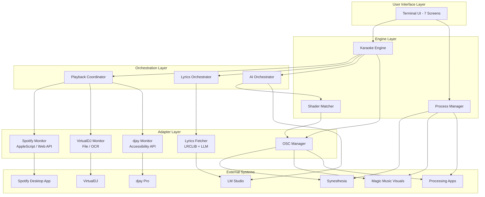
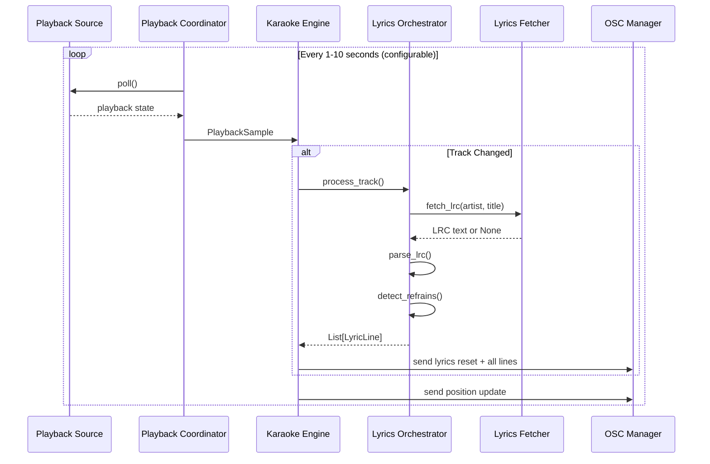
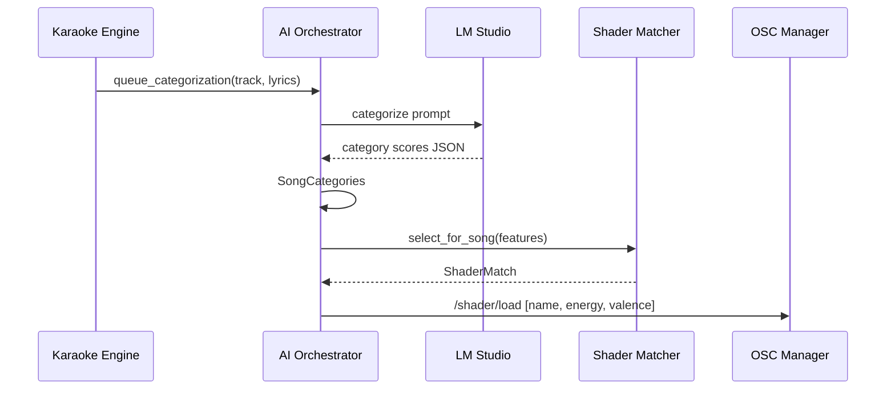
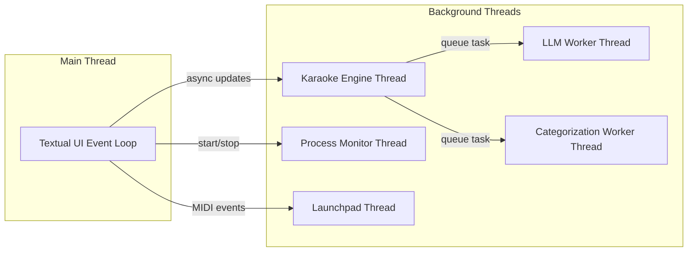

# VJ Console Architecture Overview

## Purpose

The VJ Console is a **master control center** for live VJ performances, providing:
- Real-time music source monitoring (Spotify, VirtualDJ, djay Pro)
- Synchronized karaoke lyrics display via OSC
- AI-powered song analysis and shader matching
- External application management (Synesthesia, Magic, Processing apps)
- MIDI controller integration (Launchpad Mini MK3)

---

## System Architecture

---

## Component Overview

### User Interface

| Component | Description |
|-----------|-------------|
| **Terminal UI** | 7-screen Textual TUI with keyboard navigation |
| **Screen 1: Master Control** | Dashboard, service toggles, playback source selection |
| **Screen 2: OSC View** | Real-time OSC message debug log |
| **Screen 3: Song AI Debug** | Pipeline visualization, categorization results |
| **Screen 4: All Logs** | Application log viewer |
| **Screen 5: MIDI** | MIDI device status and routing |
| **Screen 6: Launchpad** | Launchpad Mini MK3 control and LED test |
| **Screen 7: Shaders** | Shader browser, search, analysis |

### Engine Layer

| Component | Description |
|-----------|-------------|
| **Karaoke Engine** | Background thread monitoring music, syncing lyrics |
| **Process Manager** | Starts/stops external apps with auto-restart |
| **Shader Matcher** | Feature-based shader-to-music matching with ChromaDB |

### Orchestration Layer

| Component | Description |
|-----------|-------------|
| **Playback Coordinator** | Polls active playback source, detects track changes |
| **Lyrics Orchestrator** | Fetches LRC lyrics, parses, detects refrains |
| **AI Orchestrator** | Background LLM analysis, categorization, shader selection |

### Adapter Layer

| Component | Description |
|-----------|-------------|
| **Spotify AppleScript Monitor** | Reads Spotify desktop via osascript |
| **Spotify Web API Monitor** | OAuth-based Spotify API access |
| **VirtualDJ File Monitor** | Polls tracklist.txt file |
| **VirtualDJ OCR Monitor** | Screenshot + Vision framework OCR |
| **djay Monitor** | macOS Accessibility API for djay Pro |
| **Lyrics Fetcher** | LRCLIB API + LM Studio web-search fallback |
| **OSC Manager** | Centralized UDP OSC message sender |

---

## Data Flow

### Track Detection Flow

### AI Analysis Flow

---

## Pipeline Stages

The Karaoke Engine processes each track through these stages:

| Stage | Description | Output |
|-------|-------------|--------|
| **detect_playback** | Poll active source for current track | Track metadata |
| **fetch_lyrics** | Get LRC from LRCLIB or cache | LRC text |
| **metadata_analysis** | LLM fetches plain lyrics, keywords, song info | metadata dict |
| **detect_refrain** | Find repeated lines in lyrics | is_refrain flags |
| **extract_keywords** | Extract significant words from lines | keywords per line |
| **categorize_song** | AI scores mood categories | SongCategories |
| **shader_selection** | Match shader features to song | ShaderMatch |

---

## Configuration

### Settings Storage

Settings are persisted to `python-vj/.cache/settings.json`:

| Setting | Type | Description |
|---------|------|-------------|
| `timing_offset_ms` | int | Lyrics timing adjustment (ms) |
| `playback_source` | string | Active source key |
| `playback_poll_interval_ms` | int | Poll interval (1000-10000ms) |
| `start_synesthesia` | bool | Auto-start on launch |
| `start_karaoke_overlay` | bool | Auto-start on launch |
| `start_lmstudio` | bool | Auto-start on launch |
| `start_music_monitor` | bool | Auto-start on launch |
| `start_magic` | bool | Auto-start on launch |
| `autorestart_*` | bool | Auto-restart if crashed |
| `magic_file_path` | string | .magic file to open |

### Environment Variables

| Variable | Description |
|----------|-------------|
| `SPOTIPY_CLIENT_ID` | Spotify OAuth client ID |
| `SPOTIPY_CLIENT_SECRET` | Spotify OAuth client secret |
| `SPOTIFY_REDIRECT_URI` | OAuth callback URL |
| `OPENAI_API_KEY` | OpenAI API key (optional) |
| `IMAGE_PROMPT_ENABLED` | Enable AI image prompt generation |
| `SPOTIFY_WEBAPI_ENABLED` | Enable Spotify Web API monitor |
| `SPOTIFY_APPLESCRIPT_ENABLED` | Enable Spotify AppleScript monitor |

---

## External Dependencies

### macOS-Specific

| Dependency | Purpose |
|------------|---------|
| **osascript** | Run AppleScripts for Spotify |
| **ApplicationServices** | Accessibility API for djay Pro |
| **Vision framework** | OCR for VirtualDJ screenshots |
| **Quartz** | Window capture for screenshots |

### Python Packages

| Package | Purpose |
|---------|---------|
| **textual** | Terminal UI framework |
| **python-osc** | OSC protocol (UDP) |
| **spotipy** | Spotify Web API client |
| **requests** | HTTP for LM Studio, LRCLIB |
| **pyobjc** | macOS API bindings |
| **chromadb** | Vector database for shader search |

### External Applications

| Application | Integration Method |
|-------------|-------------------|
| **Synesthesia** | OSC (port 7777 send, 9999 receive) |
| **Magic Music Visuals** | OSC (port 9000) |
| **Processing apps** | OSC (port 9000), process launch |
| **LM Studio** | HTTP API (port 1234) |
| **djay Pro** | macOS Accessibility API |
| **VirtualDJ** | File polling or screenshot+OCR |
| **Spotify** | AppleScript or Web API |

---

## Threading Model

| Thread | Purpose |
|--------|---------|
| **Main** | Textual TUI event loop, UI rendering |
| **Karaoke Engine** | Playback polling, lyrics sync loop |
| **LLM Worker** | Background lyrics analysis |
| **Categorization Worker** | Background song categorization |
| **Process Monitor** | Watch/restart external apps |
| **Launchpad** | MIDI input handling, LED updates |
