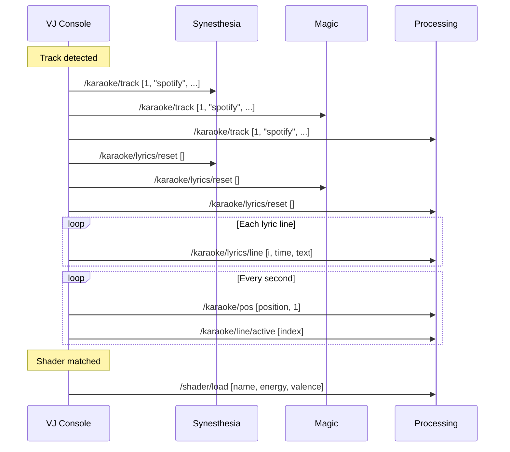

# OSC Protocol Specification

## Overview

The VJ Console communicates with visual software via **OSC (Open Sound Control)** over UDP. All messages use **flat arrays** (no nested structures) for easy parsing in Processing/TouchDesigner/Max.

---

## Network Configuration

### Default Ports

| Application | Port | Direction |
|-------------|------|-----------|
| **General VJ apps** | 9000 | Send |
| **Synesthesia** | 7777 | Send |
| **Synesthesia** | 9999 | Receive |

### Host Configuration

Default host: `127.0.0.1` (localhost)

---

## Message Format

All OSC messages follow this pattern:

```text
/category/subcategory/event [arg1, arg2, ...]
```

Arguments are primitives only:
- `int` - Integer values
- `float` - Floating point values
- `string` - Text strings

---

## Karaoke Messages

### Track Information

**Address:** `/karaoke/track`

**Arguments:**
| Index | Type | Description |
|-------|------|-------------|
| 0 | int | active (1=playing, 0=stopped) |
| 1 | string | source ("spotify_applescript", "virtualdj_file", "djay", etc.) |
| 2 | string | artist |
| 3 | string | title |
| 4 | string | album |
| 5 | float | duration (seconds) |
| 6 | int | has_lyrics (1=yes, 0=no) |

**Example:**
```text
/karaoke/track [1, "spotify_applescript", "The Weeknd", "Blinding Lights", "After Hours", 200.5, 1]
```

---

### Position Update

**Address:** `/karaoke/pos`

**Arguments:**
| Index | Type | Description |
|-------|------|-------------|
| 0 | float | position (seconds) |
| 1 | int | is_playing (1=yes, 0=no) |

**Example:**
```text
/karaoke/pos [125.4, 1]
```

---

### Lyrics Reset

**Address:** `/karaoke/lyrics/reset`

**Arguments:** None (empty)

Sent when starting a new track to clear previous lyrics.

---

### Lyrics Line

**Address:** `/karaoke/lyrics/line`

**Arguments:**
| Index | Type | Description |
|-------|------|-------------|
| 0 | int | line index (0-based) |
| 1 | float | timestamp (seconds) |
| 2 | string | lyrics text |

**Example:**
```text
/karaoke/lyrics/line [0, 12.5, "I've been tryna call"]
/karaoke/lyrics/line [1, 15.2, "I've been on my own for long enough"]
```

---

### Active Line

**Address:** `/karaoke/line/active`

**Arguments:**
| Index | Type | Description |
|-------|------|-------------|
| 0 | int | active line index (-1 if none) |

**Example:**
```text
/karaoke/line/active [3]
```

---

### Refrain Reset

**Address:** `/karaoke/refrain/reset`

**Arguments:** None (empty)

Sent when starting a new track to clear refrain data.

---

### Refrain Line

**Address:** `/karaoke/refrain/line`

**Arguments:**
| Index | Type | Description |
|-------|------|-------------|
| 0 | int | refrain line index |
| 1 | float | timestamp (seconds) |
| 2 | string | refrain text |

---

### Active Refrain

**Address:** `/karaoke/refrain/active`

**Arguments:**
| Index | Type | Description |
|-------|------|-------------|
| 0 | int | refrain line index (-1 if none) |
| 1 | string | refrain text |

---

## Shader Messages

### Load Shader

**Address:** `/shader/load`

**Arguments:**
| Index | Type | Description |
|-------|------|-------------|
| 0 | string | shader name (e.g., "BitStreamer") |
| 1 | float | energy score (0.0-1.0) |
| 2 | float | mood valence (-1.0 to 1.0) |

**Example:**
```text
/shader/load ["BitStreamer", 0.75, 0.3]
```

---

### Audio Binding

**Address:** `/shader/audio_binding`

**Arguments:**
| Index | Type | Description |
|-------|------|-------------|
| 0 | string | uniform name |
| 1 | string | audio source (bass, mid, highs, kickEnv, level, etc.) |
| 2 | string | modulation type (add, multiply, replace, threshold) |
| 3 | float | multiplier |
| 4 | float | smoothing (0=instant, 1=slow) |
| 5 | float | base value |
| 6 | float | min value |
| 7 | float | max value |

**Example:**
```text
/shader/audio_binding ["scale", "bass", "multiply", 0.5, 0.15, 0.5, 0.0, 1.0]
```

---

## Audio Analysis Messages

### Frequency Levels

**Address:** `/audio/levels`

**Arguments:**
| Index | Type | Description |
|-------|------|-------------|
| 0 | float | sub bass (20-60 Hz) |
| 1 | float | bass (60-250 Hz) |
| 2 | float | low mid (250-500 Hz) |
| 3 | float | mid (500-2000 Hz) |
| 4 | float | high mid (2000-4000 Hz) |
| 5 | float | presence (4000-6000 Hz) |
| 6 | float | air (6000-20000 Hz) |
| 7 | float | RMS level |

---

### Spectrum

**Address:** `/audio/spectrum`

**Arguments:** 32 float values (frequency bins 0-31)

---

### Beat Detection

**Address:** `/audio/beat`

**Arguments:**
| Index | Type | Description |
|-------|------|-------------|
| 0 | int | is_onset (1=beat detected, 0=no) |
| 1 | float | spectral flux |

---

### BPM

**Address:** `/audio/bpm`

**Arguments:**
| Index | Type | Description |
|-------|------|-------------|
| 0 | float | tempo (BPM) |
| 1 | float | confidence (0.0-1.0) |

---

### Structure Analysis

**Address:** `/audio/structure`

**Arguments:**
| Index | Type | Description |
|-------|------|-------------|
| 0 | float | buildup (0.0-1.0) |
| 1 | float | drop intensity (0.0-1.0) |
| 2 | float | energy trend (-1.0 to 1.0) |
| 3 | float | brightness (0.0-1.0) |

---

## Pipeline Messages

### Step Status

**Address:** `/pipeline/step`

**Arguments:**
| Index | Type | Description |
|-------|------|-------------|
| 0 | string | step name |
| 1 | string | status (pending, running, complete, error, skipped) |
| 2 | string | message |

**Example:**
```text
/pipeline/step ["fetch_lyrics", "complete", "3.2KB fetched"]
```

---

## Category Messages

### Song Category

**Address:** `/karaoke/categories`

**Arguments:**
| Index | Type | Description |
|-------|------|-------------|
| 0 | string | category name |
| 1 | float | score (0.0-1.0) |

**Example:**
```text
/karaoke/categories ["energetic", 0.82]
/karaoke/categories ["happy", 0.71]
/karaoke/categories ["love", 0.45]
```

---

## VJ Application Status

### App Status

**Address:** `/vj/{subsystem}/status`

**Subsystems:** `apps`, `synesthesia`, `milksyphon`, `master`

**Arguments:** Varies by subsystem (key-value pairs flattened)

---

## Synesthesia-Specific

### Scene Control

**Address:** `/scene/load`

**Arguments:**
| Index | Type | Description |
|-------|------|-------------|
| 0 | string | scene name |

---

### Parameter Control

**Address:** `/param/{name}`

**Arguments:**
| Index | Type | Description |
|-------|------|-------------|
| 0 | float | value (0.0-1.0) |

---

## Message Flow Diagram



---

## Implementation Notes

### Message Rate

| Message Type | Rate |
|--------------|------|
| Position updates | 1 Hz (configurable) |
| Line active | On change only |
| Track info | On track change |
| Audio levels | 60 Hz |
| Beat detection | On beat only |

### Thread Safety

OSC sends are non-blocking UDP. The OSC manager maintains:
- Thread-safe message queue
- Last 200 messages logged for debug view
- No blocking on network failures

### Error Handling

- Invalid destinations: Silent fail (UDP)
- Network errors: Logged, no retry
- Rate limiting: None (consumer responsibility)

---

## VDJStatus Incoming Messages

VDJStatus (macOS app) sends deck detection data to the VJ Console via OSC. Rate limited to **1 Hz max**, messages are only sent when state changes.

### Network Configuration

| Setting | Value |
|---------|-------|
| Port | 9000 (same as general VJ apps) |
| Host | 127.0.0.1 |
| Direction | VDJStatus → VJ Console |

---

### Deck Info

**Address:** `/vdj/deck/1`, `/vdj/deck/2`

**Arguments:**
| Index | Type | Description |
|-------|------|-------------|
| 0 | string | artist |
| 1 | string | title |
| 2 | float | elapsed (seconds) |
| 3 | float | fader (0.0=top/loud, 1.0=bottom/quiet) |
| 4 | int | playState (0=unknown, 1=playing, 2=stopped) |

**Example:**
```text
/vdj/deck/1 ["The Weeknd", "Blinding Lights", 125.5, 0.1, 1]
/vdj/deck/2 ["Daft Punk", "One More Time", 45.0, 0.9, 2]
```

---

### Master Deck (Aggregated)

**Address:** `/vdj/master`

Aggregated info from the currently active master deck. Allows receivers to use this directly without implementing master selection logic.

**Arguments:**
| Index | Type | Description |
|-------|------|-------------|
| 0 | string | artist (empty if no master) |
| 1 | string | title (empty if no master) |
| 2 | float | elapsed (seconds, 0 if no master) |
| 3 | float | fader (0.5 if no master) |
| 4 | int | activeDeck (1, 2, or 0=none) |

**Example:**
```text
/vdj/master ["The Weeknd", "Blinding Lights", 125.5, 0.1, 1]
```

When no master is detected (both decks stopped or faders equal):
```text
/vdj/master ["", "", 0.0, 0.5, 0]
```

---

### Status

**Address:** `/vdj/status`

System-level status including play states and detection confidence.

**Arguments:**
| Index | Type | Description |
|-------|------|-------------|
| 0 | int | deck1PlayState (0=unknown, 1=playing, 2=stopped) |
| 1 | int | deck2PlayState (0=unknown, 1=playing, 2=stopped) |
| 2 | int | masterDeck (1, 2, or 0=none) |
| 3 | float | deck1FaderConfidence (0.0-1.0) |
| 4 | float | deck2FaderConfidence (0.0-1.0) |

**Example:**
```text
/vdj/status [1, 2, 1, 0.85, 0.92]
```

---

### Master Determination Logic

The master deck is determined by VDJStatus using:

1. **Play state priority**: If only one deck is playing → that deck is master
2. **Fader comparison**: If both playing → deck with higher fader (lower position value) wins
3. **Hysteresis**: If faders are within 5% → keep previous master to avoid flicker
4. **No master**: If neither deck is playing → no master (activeDeck=0)
