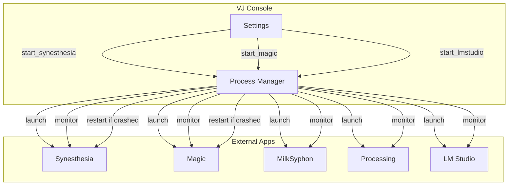

# External Integrations Specification

## Overview

The VJ Console integrates with multiple external applications and services:

- **Visual Software**: Synesthesia, Magic Music Visuals, Processing
- **Music Sources**: Spotify, VirtualDJ, djay Pro
- **AI Services**: LM Studio, OpenAI
- **Lyrics Database**: LRCLIB

---

## Synesthesia Integration

### Description

Synesthesia is a music visualizer application with audio-reactive scenes and OSC control.

### Communication

| Direction | Protocol | Port |
|-----------|----------|------|
| Send | OSC/UDP | 7777 |
| Receive | OSC/UDP | 9999 |

### Capabilities

- Scene loading via OSC
- Parameter control via OSC
- Launchpad MIDI control sync
- Audio analysis passthrough

### OSC Commands

| Address | Purpose |
|---------|---------|
| `/scene/load` | Load scene by name |
| `/param/{name}` | Set parameter value |
| `/audio/level` | Forward audio level |

### Launchpad Sync

When connected to Synesthesia:

1. VJ Console sends pad press to Synesthesia OSC
2. Synesthesia responds with scene info
3. VJ Console updates Launchpad LEDs

---

## Magic Music Visuals Integration

### Description

Magic Music Visuals is a modular VJ environment with audio reactivity and multiple outputs.

### Communication

| Direction | Protocol | Port |
|-----------|----------|------|
| Send | OSC/UDP | 9000 |

### File Launch

The VJ Console can launch Magic with a specific `.magic` project file:

1. User configures `magic_file_path` in settings
2. On startup (if enabled), Magic opens with the file
3. Process is monitored for crashes/restarts

### Application Path (macOS)

```text
/Applications/Magic Music Visuals.app
```

### OSC Mapping in Magic

Magic receives VJ Console messages and maps them to modules:

| OSC Address | Magic Target |
|-------------|--------------|
| `/karaoke/track` | Text module with track info |
| `/karaoke/lyrics/line` | Scrolling text module |
| `/audio/levels` | Audio input sliders |

---

## Processing Apps Integration

### Description

Custom Processing sketches for VJ games and visualizations.

### Communication

| Direction | Protocol | Port |
|-----------|----------|------|
| Send | OSC/UDP | 9000 |

### Process Management

The Process Manager can:

- Discover sketches in `processing-vj/src/`
- Launch sketches via `processing-java` CLI
- Monitor process health
- Auto-restart crashed sketches

### Sketch Discovery

1. Scan `processing-vj/src/` for directories
2. Find `.pde` files in each directory
3. Extract description from comments
4. Present in UI for launch

### Launch Command

```bash
processing-java --sketch=/path/to/sketch --run
```

### KaraokeOverlay

A specialized Processing sketch that:

- Receives lyrics via OSC
- Displays synchronized lyrics overlay
- Outputs via Syphon for compositing

### OSC Messages Consumed

| Address | Usage |
|---------|-------|
| `/karaoke/track` | Show track info |
| `/karaoke/lyrics/line` | Buffer lyrics lines |
| `/karaoke/line/active` | Highlight current line |
| `/karaoke/pos` | Sync position |

---

## LM Studio Integration

### Description

LM Studio is a local LLM server with OpenAI-compatible API.

### Communication

| Protocol | Endpoint | Port |
|----------|----------|------|
| HTTP | `/v1/chat/completions` | 1234 |
| HTTP | `/v1/models` | 1234 |

### Features

- Lyrics analysis (keywords, themes)
- Song categorization (mood scores)
- Shader analysis (GLSL parsing)
- Image prompt generation
- Web search (via MCP plugin)

### Health Check

```http
GET http://localhost:1234/v1/models
```

Returns JSON with available models.

### Chat Completion

```http
POST http://localhost:1234/v1/chat/completions
Content-Type: application/json

{
  "model": "qwen2.5-coder-32b",
  "messages": [
    {"role": "system", "content": "..."},
    {"role": "user", "content": "..."}
  ],
  "max_tokens": 1000,
  "temperature": 0.3
}
```

### MCP Web Search

LM Studio can be configured with MCP (Model Context Protocol) to enable web search. The VJ Console's lyrics fetcher uses this for:

- Finding complete lyrics when LRCLIB fails
- Fetching song metadata (release date, genre)
- Getting song analysis and context

---

## OpenAI Integration

### Description

Optional cloud-based LLM fallback when LM Studio is unavailable.

### Configuration

Environment variable: `OPENAI_API_KEY`

### Usage

Same as LM Studio but with:

- Different model names (gpt-3.5-turbo, gpt-4o-mini)
- Cloud latency
- API costs

---

## LRCLIB Integration

### Description

LRCLIB is a free lyrics database with synchronized LRC format.

### Communication

| Protocol | Endpoint |
|----------|----------|
| HTTPS | `https://lrclib.net/api` |

### Endpoints

**Search by track:**

```http
GET https://lrclib.net/api/get?artist_name={artist}&track_name={title}&album_name={album}&duration={seconds}
```

### Response

```json
{
  "syncedLyrics": "[00:12.50]First line of lyrics\n[00:15.20]Second line..."
}
```

### Caching

Lyrics are cached locally at:

```text
python-vj/.cache/lyrics/{artist}_{title}.json
```

Cache TTL: 7 days

---

## MilkSyphon / projectM Integration

### Description

MilkSyphon (projectM) is a music visualizer inspired by Winamp's Milkdrop.

### Process Management

| Platform | Application Path |
|----------|-----------------|
| macOS | `/Applications/ProjMilkSyphon.app` |

### Features

- Preset visualization
- Syphon output for compositing
- Audio reactive

### Control

Managed via Process Manager (start/stop/restart).

---

## Application Management Flow



---

## Application Launch Paths (macOS)

| Application | Bundle Path |
|-------------|-------------|
| Synesthesia | `/Applications/Synesthesia.app` |
| Magic Music Visuals | `/Applications/Magic Music Visuals.app` |
| MilkSyphon | `/Applications/ProjMilkSyphon.app` |
| LM Studio | `/Applications/LM Studio.app` |
| Processing | `/Applications/Processing.app` |

---

## Service Health Monitoring

Each external service has health tracking:

| Property | Description |
|----------|-------------|
| `available` | Currently reachable |
| `last_check` | Timestamp of last check |
| `last_error` | Most recent error message |
| `error_count` | Total errors since start |

### Reconnection Policy

- Check interval: 30 seconds
- Exponential backoff on repeated failures
- Silent retry (no spam logging)
