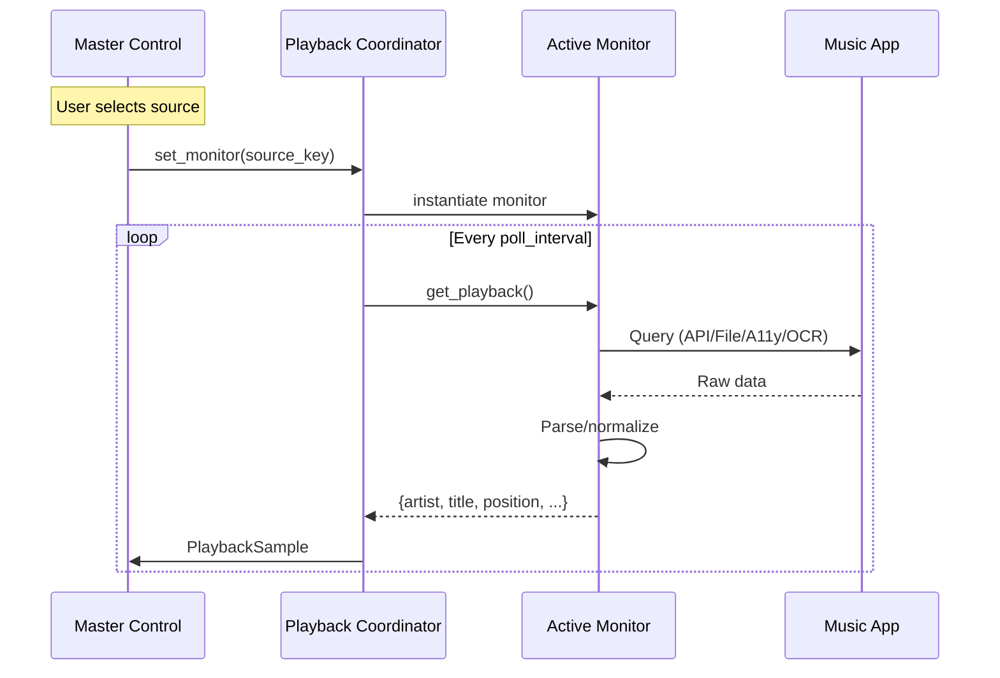

# Playback Sources Specification

## Overview

The VJ Console supports multiple music playback sources. Each source uses a different detection mechanism based on application capabilities.

---

## Supported Sources

| Source Key | Label | Detection Method |
|------------|-------|------------------|
| `spotify_applescript` | Spotify (AppleScript) | macOS AppleScript |
| `spotify_webapi` | Spotify (Web API) | OAuth REST API |
| `virtualdj_file` | VirtualDJ (File) | File polling |
| `virtualdj_ocr` | VirtualDJ (OCR Fast) | Screenshot + Vision OCR |
| `virtualdj_ocr_slow` | VirtualDJ (OCR Accurate) | Screenshot + Vision OCR + language correction |
| `djay` | djay Pro | macOS Accessibility API |

---

## Source Selection

Only **one source** is active at a time. The user explicitly selects via:

- Radio buttons in Master Control screen
- Persisted to `settings.json` as `playback_source`

**No automatic fallback** - if selected source fails, polling returns no data.

---

## Spotify AppleScript Monitor

### Detection Method

Executes bundled AppleScript via `osascript` command.

### Script Location

```text
python-vj/scripts/spotify_track.applescript
```

### Data Retrieved

| Field | Source |
|-------|--------|
| artist | Spotify track artist |
| title | Spotify track name |
| album | Spotify album name |
| duration_ms | Track duration |
| progress_ms | Current position |
| is_playing | Player state |

### Requirements

- macOS only
- Spotify desktop app running
- Spotify must be playing (not paused)

### Response Time

~50-100ms per poll

### Limitations

- macOS only
- Requires Spotify desktop (not web player)
- No OAuth required

---

## Spotify Web API Monitor

### Detection Method

OAuth 2.0 authenticated REST API calls.

### Endpoint

```http
GET https://api.spotify.com/v1/me/player/currently-playing
```

### Configuration

Environment variables required:

| Variable | Description |
|----------|-------------|
| `SPOTIPY_CLIENT_ID` | OAuth client ID |
| `SPOTIPY_CLIENT_SECRET` | OAuth client secret |
| `SPOTIFY_REDIRECT_URI` | Callback URL (default: `http://localhost:8888/callback`) |

### Token Storage

OAuth tokens cached at:

```text
python-vj/.cache/spotify_token.cache
```

### Data Retrieved

Same as AppleScript monitor, plus:

- Cover art URL
- Spotify URI
- Track ID

### Response Time

~100-300ms per poll (network dependent)

### Limitations

- Requires Spotify Premium for full API access
- Internet connection required
- Token refresh needed periodically

---

## VirtualDJ File Monitor

### Detection Method

Polls `tracklist.txt` file written by VirtualDJ.

### File Locations Searched

1. `~/Library/Application Support/VirtualDJ/History/tracklist.txt`
2. `~/Documents/VirtualDJ/History/tracklist.txt`
3. `~/Documents/VirtualDJ/History/now_playing.txt`
4. `~/Documents/VirtualDJ/now_playing.txt`
5. `~/Music/VirtualDJ/now_playing.txt`
6. `/tmp/virtualdj_now_playing.txt`

### File Formats Supported

**Simple format:**

```text
Artist - Title
```

**Tracklist format:**

```text
VirtualDJ History 2024/11/30
------------------------------
22:50 : Bolier, Joe Stone - Keep This Fire Burning
22:53 : Artist - Another Song
```

### Parsing Logic

1. Read file content
2. If multi-line, find last timestamped entry (`HH:MM :`)
3. Split on ` - ` to get artist and title
4. Track duration: estimated from playback time

### Position Tracking

Since file only contains track info (not position):

- Position = time since track started
- Resets on track change detection

### Response Time

~5-10ms per poll (local file I/O)

### Limitations

- VirtualDJ must write to expected location
- No real position tracking
- No album/duration metadata

---

## VirtualDJ OCR Monitor

### Detection Method

1. Capture VirtualDJ window screenshot
2. Run OCR via macOS Vision framework
3. Parse text for track info and deck detection

### macOS APIs Used

| API | Purpose |
|-----|---------|
| Quartz `CGWindowListCreateImage` | Window capture |
| Vision `VNRecognizeTextRequest` | Text recognition |

### Window Detection

Finds VirtualDJ window by name containing "VirtualDJ".

### Master Deck Detection

**Method 1: GAIN fader position**

- Analyze pixel brightness in fader regions
- Higher fader = master deck

**Method 2: Elapsed time tracking**

- Track which deck's time is progressing
- Fallback when fader detection fails

### OCR Regions

| Region | Content |
|--------|---------|
| Deck 1 title area | Left deck track info |
| Deck 2 title area | Right deck track info |
| Deck 1 time | Elapsed/remaining time |
| Deck 2 time | Elapsed/remaining time |

### Modes

| Mode | Speed | Accuracy |
|------|-------|----------|
| Fast | ~400ms | Basic OCR, no language correction |
| Slow | ~800ms | Full language correction, better parsing |

### Data Retrieved

| Field | Source |
|-------|--------|
| artist | OCR from deck |
| title | OCR from deck |
| elapsed_sec | Parsed time display |
| duration_sec | Parsed time display |
| active_deck | Fader/time analysis |

### Limitations

- macOS only (Vision framework)
- VirtualDJ window must be visible (not minimized)
- OCR accuracy varies with font/skin
- Slower than file-based detection

---

## djay Pro Monitor

### Detection Method

macOS Accessibility API (AXUIElement).

### Application Bundle ID

```text
com.algoriddim.djay-iphone-free
```

### Accessibility Elements Accessed

| Element | Role | Purpose |
|---------|------|---------|
| Play/Pause buttons | Button | Detect active deck |
| Crossfader | Slider | Determine master deck |
| Title labels | StaticText | Track name |
| Artist labels | StaticText | Artist name |
| Time labels | StaticText | Elapsed/remaining |
| Key labels | StaticText | Musical key |
| Automix table | Table | BPM, duration |

### Deck Detection Strategy

1. **Crossfader position**: Value < 0.5 = deck 1, > 0.5 = deck 2
2. **Play state**: Check Play/Pause button accessibility value
3. **Time progression**: Track which deck's time is advancing

### Data Retrieved

| Field | Source |
|-------|--------|
| artist | Deck artist label |
| title | Deck title label |
| elapsed_sec | Elapsed time label |
| remaining_sec | Remaining time label |
| duration_sec | Calculated or from Automix table |
| key | Key label (e.g., "Am") |
| bpm | From Automix table |

### Requirements

- macOS only
- Accessibility permissions granted
- djay Pro running

### Response Time

~50ms per poll

### Permissions

System Preferences > Privacy & Security > Accessibility must include:

- Terminal (if running from terminal)
- Python (if running as app)

---

## Playback Data Structure

All monitors return a common structure:

| Field | Type | Description |
|-------|------|-------------|
| `artist` | string | Artist name |
| `title` | string | Track title |
| `album` | string | Album name (may be empty) |
| `duration_ms` | int | Track duration in milliseconds |
| `progress_ms` | int | Current position in milliseconds |
| `is_playing` | bool | Whether actively playing |

---

## Polling Configuration

| Setting | Default | Range |
|---------|---------|-------|
| `playback_poll_interval_ms` | 1000 | 1000-10000 |

### Poll Timing Display

The UI shows last poll duration in milliseconds next to "Poll:" label.

---

## Source Health Tracking

Each monitor tracks:

| Property | Description |
|----------|-------------|
| `available` | Currently working |
| `last_error` | Most recent error |
| `error_count` | Total errors |
| `should_retry` | 30 seconds since last failure |

### Status Display

The Master Control screen shows source status:

| Indicator | Meaning |
|-----------|---------|
| Green | Connected, returning data |
| Yellow | Connecting/retrying |
| Red | Failed, error message shown |
| Dim | Not selected |

---

## Detection Flow



---

## Source Comparison

| Feature | Spotify AS | Spotify API | VDJ File | VDJ OCR | djay |
|---------|------------|-------------|----------|---------|------|
| Speed | ~80ms | ~200ms | ~5ms | ~400ms | ~50ms |
| Position | Accurate | Accurate | Estimated | Accurate | Accurate |
| Duration | Yes | Yes | No | Yes | Yes |
| Album | Yes | Yes | No | No | No |
| Key | No | No | No | No | Yes |
| BPM | No | Yes* | No | No | Yes |
| Internet | No | Yes | No | No | No |
| Setup | None | OAuth | None | None | A11y |

*Spotify API provides audio features including tempo.
