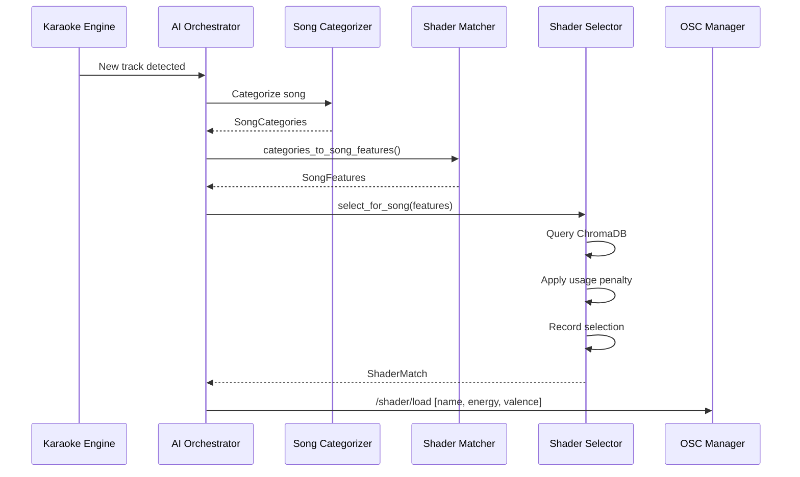

# Shader Matching Specification

## Overview

The shader matching system selects visual shaders based on song analysis. It uses:

- **Feature vectors**: 6-dimensional numeric representation
- **ChromaDB**: Vector database for fast similarity search
- **LLM analysis**: GLSL code understanding
- **Session tracking**: Usage-based variety preference

---

## Feature Vector

Each shader and song is represented as a 6-dimensional vector:

| Index | Feature | Range | Description |
|-------|---------|-------|-------------|
| 0 | `energy_score` | 0.0-1.0 | Intensity/activity level |
| 1 | `mood_valence` | -1.0 to 1.0 | Dark (-1) to bright (+1) |
| 2 | `color_warmth` | 0.0-1.0 | Cool blues (0) to warm reds (1) |
| 3 | `motion_speed` | 0.0-1.0 | Static (0) to fast (1) |
| 4 | `geometric_score` | 0.0-1.0 | Organic (0) to geometric (1) |
| 5 | `visual_density` | 0.0-1.0 | Minimal (0) to dense (1) |

---

## Shader Analysis

### Source

Shaders are analyzed from:

- ISF shaders: `processing-vj/src/VJUniverse/data/shaders/isf/*.fs`
- GLSL shaders: `processing-vj/src/VJUniverse/data/shaders/glsl/*.txt`

### Analysis JSON

Each shader has a companion `.analysis.json`:

```json
{
  "shaderName": "isf/BitStreamer",
  "shaderType": "isf",
  "mood": "energetic",
  "colors": ["cyan", "magenta", "black"],
  "effects": ["streaming", "digital", "pulsing"],
  "energy": "high",
  "complexity": "medium",
  "description": "Digital bit streams flowing across screen",
  "features": {
    "energy_score": 0.85,
    "mood_valence": 0.3,
    "color_warmth": 0.4,
    "motion_speed": 0.9,
    "geometric_score": 0.8,
    "visual_density": 0.6
  },
  "inputs": {
    "floatCount": 3,
    "point2DCount": 0,
    "colorCount": 1,
    "boolCount": 0,
    "imageCount": 0,
    "hasAudio": false,
    "inputNames": ["speed", "density", "mainColor"]
  },
  "audioMapping": {
    "primarySource": "bass",
    "songStyle": 0.5
  }
}
```

### LLM Prompt Structure

The LLM analyzes GLSL code looking for:

| Pattern | Feature Impact |
|---------|----------------|
| `TIME*fast_multiplier` | High energy/motion |
| `sin/cos with high freq` | High motion speed |
| `step(), mod(), floor()` | Geometric |
| `smoothstep(), noise(), fbm()` | Organic |
| `vec3(1,0.5,0)` warm colors | High warmth |
| `vec3(0,0.5,1)` cool colors | Low warmth |
| Many loop iterations | High density |
| Feedback loops | High energy |

---

## Song Analysis

### Category Mapping

Song categories from AI analysis map to features:

| Category | Feature Impact |
|----------|----------------|
| `energetic` | +energy, +motion |
| `calm` | -energy, -motion |
| `happy` | +valence, +warmth |
| `sad` | -valence, -warmth |
| `dark` | -valence |
| `aggressive` | +energy, -valence |
| `peaceful` | -energy, +valence |
| `nostalgic` | -valence (mild) |
| `love` | +warmth, +valence |

### Theme Modifiers

LLM-extracted themes adjust features:

| Theme | Adjustment |
|-------|------------|
| `party`, `dance`, `fight` | +energy |
| `sleep`, `meditation`, `rest` | -energy |
| `love`, `joy`, `celebration` | +valence |
| `death`, `loss`, `despair` | -valence |
| `synth`, `electronic`, `digital` | +geometric, -acoustic |
| `nature`, `acoustic`, `organic` | -geometric, +acoustic |

---

## Matching Algorithm

### Weighted Distance

Features have different importance weights:

| Feature | Weight |
|---------|--------|
| `energy_score` | 1.5 |
| `mood_valence` | 1.3 |
| `motion_speed` | 1.0 |
| `color_warmth` | 0.8 |
| `visual_density` | 0.8 |
| `geometric_score` | 0.6 |

### Distance Calculation

```text
distance = sqrt(sum(weight[i] * (shader[i] - song[i])^2))
```

Lower distance = better match.

### Diversity Penalty

To avoid repetition, used shaders receive a penalty:

```text
adjusted_score = distance + (usage_count * USAGE_PENALTY)
```

`USAGE_PENALTY = 0.15` per previous use this session.

---

## ChromaDB Index

### Collections

| Collection | Purpose |
|------------|---------|
| `shader_features` | 6D feature vectors for similarity |
| `shader_text` | Text documents for semantic search |

### Feature Collection Schema

| Field | Type | Description |
|-------|------|-------------|
| id | string | Shader name (prefixed) |
| embedding | float[6] | Feature vector |
| metadata.path | string | File path |
| metadata.mood | string | Primary mood |
| metadata.analysis_hash | string | Cache validation |

### Text Collection Schema

| Field | Type | Description |
|-------|------|-------------|
| id | string | Shader name |
| document | string | Searchable text blob |
| metadata | dict | mood, colors, effects |

---

## Query Types

### Feature Match

Find shaders similar to song features:

1. Convert song categories to feature vector
2. Query ChromaDB with weighted distance
3. Apply usage penalty
4. Return top N matches

### Mood Match

Find shaders matching a mood keyword:

| Mood | Target Vector |
|------|---------------|
| `energetic` | [0.9, 0.5, 0.6, 0.8, 0.5, 0.7] |
| `calm` | [0.2, 0.3, 0.4, 0.2, 0.4, 0.3] |
| `dark` | [0.6, -0.6, 0.3, 0.5, 0.4, 0.6] |
| `bright` | [0.6, 0.7, 0.7, 0.5, 0.5, 0.5] |
| `psychedelic` | [0.7, 0.2, 0.5, 0.7, 0.3, 0.8] |
| `aggressive` | [0.95, -0.3, 0.4, 0.9, 0.6, 0.8] |

### Text Search

Semantic search across shader metadata:

- Uses ChromaDB embeddings
- Searches: name, mood, colors, effects, description
- Falls back to keyword matching if ChromaDB unavailable

---

## Shader Input Capabilities

Parsed from ISF JSON header or GLSL uniform declarations.

### Capability Flags

| Capability | Condition |
|------------|-----------|
| `is_interactive` | Has point2D inputs |
| `is_compositable` | Has image inputs |
| `is_midi_mappable` | Has 2+ float inputs |
| `is_audio_reactive` | Has audio/audioFFT inputs |
| `is_autonomous` | No inputs (self-running) |

### Filtering

Shaders can be filtered by capability before matching.

---

## Audio Reactive Profile

Suggests how to map audio to shader uniforms.

### Audio Sources

| Source | Frequency Range | Description |
|--------|-----------------|-------------|
| `bass` | 20-120 Hz | Kick, sub bass |
| `lowMid` | 120-350 Hz | Drum body, bass guitar |
| `mid` | 350-2000 Hz | Vocals, instruments |
| `highs` | 2000-6000 Hz | Hats, cymbals |
| `kickEnv` | 40-120 Hz | Kick attack envelope |
| `kickPulse` | - | Binary kick trigger |
| `beat4` | - | 4-step counter |
| `energyFast` | - | Weighted band mix |
| `level` | - | Overall loudness |

### Modulation Types

| Type | Formula |
|------|---------|
| `add` | `base + (audio * mult)` |
| `multiply` | `base * (1 + audio * mult)` |
| `replace` | `audio * mult` |
| `threshold` | `1 if audio > threshold else 0` |

---

## Session Management

### Usage Tracking

Per-session tracking of shader usage:

| Data | Purpose |
|------|---------|
| Usage count per shader | Variety penalty |
| Last selected shader | Exclude from immediate reselection |
| Total selections | Statistics |

### Reset Triggers

Usage tracking resets on:

- Application restart
- Manual reset call
- New performance session

---

## Matching Flow



---

## Indexer Operations

### Sync

Loads all `.analysis.json` files into memory and ChromaDB:

1. Scan shader directories
2. Load analysis JSON for each shader
3. Compute analysis hash
4. Upsert to ChromaDB if changed
5. Update in-memory cache

### Unanalyzed Detection

Shaders without `.analysis.json` are flagged for analysis.

### Bulk Analysis

LLM can analyze unanalyzed shaders:

1. Read shader source
2. Parse ISF/GLSL inputs
3. Find screenshot (if available)
4. Send to LLM with structured prompt
5. Parse JSON response
6. Save `.analysis.json`

### Error Handling

Failed analyses save `.error.json`:

```json
{
  "shaderName": "isf/BrokenShader",
  "error": "LLM timeout",
  "failedAt": "2024-01-15 14:23:00"
}
```

Delete `.error.json` to retry.

---

## Statistics

### Indexer Stats

| Stat | Description |
|------|-------------|
| `total_shaders` | ISF + GLSL count |
| `analyzed` | With `.analysis.json` |
| `unanalyzed` | Missing analysis |
| `chromadb_count` | Vectors in database |

### Matcher Stats

| Stat | Description |
|------|-------------|
| `count` | Loaded shaders |
| `with_features` | Have feature vectors |
| `avg_energy` | Average energy score |
| `avg_motion` | Average motion score |

### Selector Stats

| Stat | Description |
|------|-------------|
| `total_selections` | This session |
| `unique_shaders_used` | Variety count |
| `top_used` | Most selected shaders |
