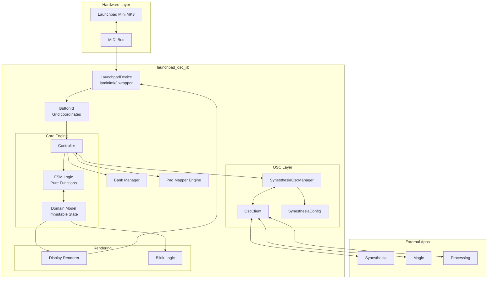
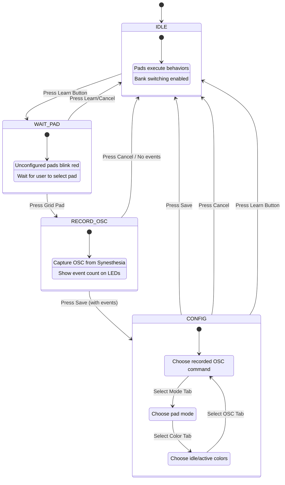
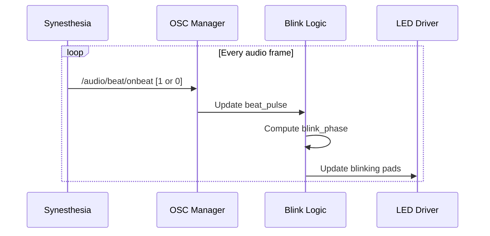

# Launchpad OSC Library Specification

Reusable library for Launchpad Mini MK3 control with Synesthesia OSC integration.

## Overview

The `launchpad_osc_lib` is a standalone library that provides:
- **Launchpad Mini MK3 hardware abstraction** (button events, LED control)
- **OSC bidirectional communication** (Synesthesia, Magic, Processing)
- **Pad mapping engine** with configurable behaviors
- **Learn mode** for recording OSC commands and mapping to pads
- **Bank switching** for organizing pad configurations
- **Beat-synced LED blinking** for visual feedback

## Architecture



---

## Coordinate System

### Button Grid Layout

```
    [0]   [1]   [2]   [3]   [4]   [5]   [6]   [7]   y=-1 (Top Row)
   ┌─────┬─────┬─────┬─────┬─────┬─────┬─────┬─────┬─────┐
   │ Up  │Down │Left │Right│Sess │Drums│Keys │User │     │  Panel Buttons
   ├─────┼─────┼─────┼─────┼─────┼─────┼─────┼─────┼─────┤
y=7│     │     │     │     │     │     │     │     │ Sc7 │
   ├─────┼─────┼─────┼─────┼─────┼─────┼─────┼─────┼─────┤
y=6│     │     │     │     │     │     │     │     │ Sc6 │
   ├─────┼─────┼─────┼─────┼─────┼─────┼─────┼─────┼─────┤
y=5│     │     │     │     │     │     │     │     │ Sc5 │  8x8 Grid
   ├─────┼─────┼─────┼─────┼─────┼─────┼─────┼─────┼─────┤
y=4│     │     │     │     │     │     │     │     │ Sc4 │
   ├─────┼─────┼─────┼─────┼─────┼─────┼─────┼─────┼─────┤
y=3│     │     │     │     │     │     │     │     │ Sc3 │  Scene Buttons
   ├─────┼─────┼─────┼─────┼─────┼─────┼─────┼─────┼─────┤  x=8
y=2│     │     │     │     │     │     │     │     │ Sc2 │
   ├─────┼─────┼─────┼─────┼─────┼─────┼─────┼─────┼─────┤
y=1│     │     │     │     │     │     │     │     │ Sc1 │
   ├─────┼─────┼─────┼─────┼─────┼─────┼─────┼─────┼─────┤
y=0│     │     │     │     │     │     │     │     │ Sc0 │
   └─────┴─────┴─────┴─────┴─────┴─────┴─────┴─────┴─────┘
   x=0   x=1   x=2   x=3   x=4   x=5   x=6   x=7   x=8
```

### Button Regions

| Region | Coordinates | Purpose |
|--------|-------------|---------|
| **Grid** | x=0-7, y=0-7 | Main mapping area (64 pads) |
| **Top Row** | x=0-7, y=-1 | Bank switching (8 banks) |
| **Scene Column** | x=8, y=0-7 | Special functions (Learn mode, etc.) |

---

## Domain Model

### Pad Modes

| Mode | Behavior | OSC Pattern | Use Case |
|------|----------|-------------|----------|
| **SELECTOR** | Radio button - one active per group | `osc_action` on press | Scene/preset selection |
| **TOGGLE** | On/Off state | `osc_on` / `osc_off` | Effects enable/disable |
| **ONE_SHOT** | Single trigger | `osc_action` on press | Playlist next/prev, actions |
| **PUSH** | Momentary | `1.0` on press, `0.0` on release | Sustain pedal behavior |

### Button Groups

Groups enforce radio-button behavior for SELECTOR pads:

| Group | Parent | Description |
|-------|--------|-------------|
| `SCENES` | - | Scene selection (only one scene active) |
| `PRESETS` | SCENES | Preset selection (resets when scene changes) |
| `COLORS` | - | Hue/color palette selection |
| `CUSTOM` | - | User-defined groups |

### Color Palette

Base colors with 3 brightness levels (DIM, NORMAL, BRIGHT):

| Color | DIM | NORMAL | BRIGHT |
|-------|-----|--------|--------|
| Red | 1 | 5 | 6 |
| Orange | 7 | 9 | 10 |
| Yellow | 11 | 13 | 14 |
| Lime | 15 | 17 | 18 |
| Green | 19 | 21 | 22 |
| Cyan | 33 | 37 | 38 |
| Blue | 41 | 45 | 46 |
| Purple | 49 | 53 | 54 |
| Pink | 55 | 57 | 58 |
| White | 1 | 3 | 119 |

---

## OSC Protocol (Synesthesia)

### Port Configuration

| Port | Direction | Description |
|------|-----------|-------------|
| **7777** | → Synesthesia | Commands sent to Synesthesia |
| **9999** | ← Synesthesia | Events received from Synesthesia |

### Controllable OSC Addresses

These addresses can be mapped to Launchpad pads:

| Prefix | Category | Default Mode | Group |
|--------|----------|--------------|-------|
| `/scenes/*` | Scene selection | SELECTOR | scenes |
| `/presets/*` | Preset selection | SELECTOR | presets |
| `/favslots/*` | Favorite slots | SELECTOR | favslots |
| `/playlist/*` | Playlist control | ONE_SHOT | - |
| `/controls/meta/*` | Meta controls (hue, etc.) | TOGGLE | colors (for hue) |
| `/controls/global/*` | Global effects | TOGGLE | - |

### Informational OSC Addresses (not controllable)

| Address | Use |
|---------|-----|
| `/audio/beat/onbeat` | Beat sync for LED blinking |
| `/audio/bpm` | Current tempo |
| `/audio/level*` | Audio levels (high-frequency, filtered from UI) |
| `/audio/fft/*` | FFT data (high-frequency, filtered from UI) |
| `/audio/timecode` | Playback position (filtered from UI) |

### Priority System (Learn Mode Recording)

| Priority | Addresses | Behavior |
|----------|-----------|----------|
| 1 | `/scenes/*` | Stops recording immediately |
| 2 | `/presets/*`, `/favslots/*` | Stops recording immediately |
| 3 | `/controls/*` | Stops recording immediately |
| 99 | `/audio/*` | Ignored (noise) |

---

## State Machine (FSM)

### Learn Mode Phases



### CONFIG Phase Registers

| Register | Row | Content |
|----------|-----|---------|
| **Top Row (y=7)** | Navigation | 3 register tabs, pagination |
| **OSC_SELECT** | Row 3 | Up to 8 recorded OSC commands (paginated) |
| **MODE_SELECT** | Row 3 | TOGGLE, PUSH, ONE_SHOT, SELECTOR |
| **COLOR_SELECT** | Rows 1-6 | Color grids, brightness controls, preview |
| **Action Row (y=0)** | Bottom | Save (green), Test (blue), Cancel (red) |

### CONFIG Phase LED Layout

```
   [OSC] [Mode][Color]  ·    ·   [<Pg] [Pg>]   ← Register tabs + pagination (y=7)
   [ ]  [ ]  [ ]  [ ]  [ ]  [ ]  [ ]  [ ]      ← Preview row (y=6)
   [B1] [B2] [B3]  ·    ·   [B1] [B2] [B3]     ← Brightness indicators (y=5)
   [C1] [C2] [C3] [C4] [C5] [C6] [C7] [C8]     ← Color grid top (y=4)
   [C1] [C2] [C3] [C4] [C5] [C6] [C7] [C8]     ← Color grid mid (y=3)
   [C1] [C2]  ·    ·   [C1] [C2]  ·    ·       ← Color grid bot (y=2)
   [↓I] [↑I]  ·    ·    ·    ·   [↓A] [↑A]    ← Brightness +/- (y=1)
   [SAV][TST]  ·    ·    ·    ·    ·  [CAN]    ← Actions (y=0)
   
   Left half: Idle colors    Right half: Active colors
```

---

## Bank Management

### Bank System

- **8 banks** available (one per top row button)
- **Groups shared** across banks (active scene persists when switching)
- **Bank switching blocked** during CONFIG phase

### Default Banks

| Index | Button | Name | Purpose |
|-------|--------|------|---------|
| 0 | Up | Scenes | Scene selection |
| 1 | Down | Presets | Preset selection |
| 2 | Left | Effects | Global effects toggles |
| 3 | Right | Transitions | Transition controls |
| 4 | Session | Media | Media controls |
| 5 | Drums | Audio | Audio reactive controls |
| 6 | Keys | Color | Color/hue selection |
| 7 | User | Custom | User-defined |

### Bank LED Indicators

| State | Color |
|-------|-------|
| Inactive bank | Blue (dim) |
| Active bank | Green (bright) |
| No bank defined | Off |

---

## Beat-Synced Blinking

### Blink Logic



### Blink Behavior

| Pad State | Blink Enabled | Behavior |
|-----------|---------------|----------|
| Active SELECTOR | Yes | Pulses with beat (full→dim) |
| Inactive SELECTOR | No | Static idle color |
| Toggle ON | No | Static active color |
| Toggle OFF | No | Static idle color |
| ONE_SHOT | No | Flash on press only |

---

## Controller Interface

### Input Events (from hardware)

```
on_button_press(pad_id: ButtonId)
on_button_release(pad_id: ButtonId)
on_osc_event(address: string, args: array)
```

### Output Effects

| Effect Type | Description |
|-------------|-------------|
| `SendOscEffect` | Send OSC command |
| `LedEffect` | Set LED color/blink |
| `SaveConfigEffect` | Persist configuration |
| `LogEffect` | Log message |

### Hardware Abstraction

The library uses dependency injection for hardware:

```
┌─────────────────────────────────────────┐
│           LaunchpadController           │
│                                         │
│  set_launchpad(LaunchpadInterface)      │
│  set_osc(OscInterface)                  │
└──────────────────┬──────────────────────┘
                   │
       ┌───────────┴───────────┐
       │                       │
┌──────▼──────┐        ┌───────▼──────┐
│ Launchpad   │        │     OSC      │
│ Interface   │        │  Interface   │
│             │        │              │
│ set_led()   │        │ send()       │
│ set_panel   │        │              │
│   _led()    │        │              │
│ clear_all() │        │              │
└─────────────┘        └──────────────┘
```

---

## Persistence

### Configuration File Format

```json
{
  "version": 2,
  "pads": {
    "0,0": {
      "mode": "toggle",
      "idle_color": 21,
      "active_color": 5,
      "label": "strobe",
      "osc_on": {
        "address": "/controls/global/strobe",
        "args": [1.0]
      },
      "osc_off": {
        "address": "/controls/global/strobe",
        "args": [0.0]
      }
    },
    "1,0": {
      "mode": "selector",
      "group": "scenes",
      "idle_color": 19,
      "active_color": 21,
      "label": "AlienCavern",
      "osc_action": {
        "address": "/scenes/AlienCavern",
        "args": []
      }
    }
  }
}
```

### Bank File Format

```json
{
  "version": 1,
  "active_bank_index": 0,
  "banks": [
    {
      "name": "Scenes",
      "color": 45,
      "active_color": 21,
      "pads": { /* pad configurations */ }
    }
  ],
  "active_by_group": {
    "scenes": [1, 0],
    "presets": null
  }
}
```

---

## Module Reference

### Core Modules

| Module | Purpose |
|--------|---------|
| `button_id.py` | Type-safe (x, y) coordinates |
| `model.py` | Immutable domain models |
| `fsm.py` | Pure state transition functions |
| `controller.py` | High-level controller orchestration |
| `engine.py` | Pad mapping engine |
| `banks.py` | Bank management system |
| `display.py` | LED rendering (state → effects) |
| `blink.py` | Beat-synced blink calculations |

### OSC Modules

| Module | Purpose |
|--------|---------|
| `osc_client.py` | Generic async OSC client |
| `synesthesia_osc.py` | Synesthesia-specific OSC manager |
| `synesthesia_config.py` | Synesthesia OSC address knowledge |

### Utility Modules

| Module | Purpose |
|--------|---------|
| `launchpad.py` | lpminimk3 usage documentation |
| `config.py` | Configuration loading/saving |
| `cli.py` | Command-line interface |

---

## .NET Implementation Notes

### Recommended Libraries

| Component | .NET Library |
|-----------|--------------|
| MIDI | NAudio, RtMidi.Core |
| OSC | Rug.Osc, SharpOSC |
| Async | Built-in Task/async |
| JSON | System.Text.Json |

### Key Design Patterns to Preserve

1. **Immutable State** - Use records with `with` expressions
2. **Pure FSM Functions** - State in, (state, effects) out
3. **Effect Pattern** - Return effect descriptions, execute in shell
4. **Dependency Injection** - Hardware interfaces injected
5. **Callback Registration** - Multiple listeners per event type

### State Machine Implementation

```
// C# pattern suggestion
public record ControllerState { ... }
public abstract record Effect;
public record SendOscEffect(OscCommand Command) : Effect;
public record LedEffect(ButtonId PadId, int Color, bool Blink = false) : Effect;

public static (ControllerState, IReadOnlyList<Effect>) HandlePadPress(
    ControllerState state, 
    ButtonId padId) { ... }
```
