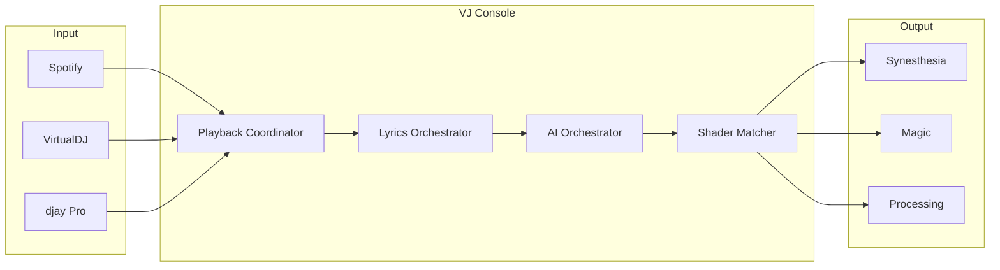

# VJ Console Specification

Functional specification for reimplementing the Python VJ Console as a .NET console application.

## Documents

| Document | Description |
|----------|-------------|
| [01-architecture.md](01-architecture.md) | System overview, component diagram, threading model |
| [02-user-interface.md](02-user-interface.md) | 7-screen TUI, keyboard navigation, widgets |
| [03-osc-protocol.md](03-osc-protocol.md) | All OSC message formats and addresses |
| [04-external-integrations.md](04-external-integrations.md) | Synesthesia, Magic, LM Studio, LRCLIB |
| [05-playback-sources.md](05-playback-sources.md) | Spotify, VirtualDJ, djay Pro detection |
| [06-shader-matching.md](06-shader-matching.md) | Feature vectors, ChromaDB, LLM analysis |
| [07-launchpad-osc-lib.md](07-launchpad-osc-lib.md) | Launchpad Mini MK3 control, OSC mapping, learn mode |

---

## Quick Reference

### Key Features

- 7-screen terminal UI with keyboard navigation
- Real-time music source monitoring (Spotify, VirtualDJ, djay Pro)
- Synchronized karaoke lyrics via OSC
- AI-powered song categorization and shader matching
- External application management with auto-restart
- Launchpad Mini MK3 MIDI integration

### Primary Protocols

- **OSC/UDP** (port 9000): Communication with visual software
- **HTTP** (port 1234): LM Studio LLM API
- **macOS APIs**: Accessibility, Vision, AppleScript

### External Dependencies

- Synesthesia (visual synthesizer)
- Magic Music Visuals (VJ mixer)
- LM Studio (local LLM)
- Processing (custom sketches)
- LRCLIB (lyrics database)

---

## Architecture Summary

---

## .NET Implementation Notes

### Recommended Libraries

| Python | .NET Equivalent |
|--------|-----------------|
| Textual (TUI) | Terminal.Gui, Spectre.Console |
| python-osc | Rug.Osc, SharpOSC |
| requests | HttpClient |
| spotipy | SpotifyAPI-NET |
| chromadb | Qdrant.Client, Milvus.Client |

### macOS-Specific Considerations

For macOS-specific features (Accessibility API, Vision, AppleScript):

- Use native interop via P/Invoke
- Consider .NET MAUI for macOS bindings
- AppleScript: shell out to `osascript`

### Cross-Platform Notes

| Feature | macOS | Windows | Linux |
|---------|-------|---------|-------|
| Spotify AppleScript | ✓ | ✗ | ✗ |
| Accessibility API | ✓ | UI Automation | AT-SPI |
| Vision OCR | ✓ | Windows.Media.Ocr | Tesseract |
| Syphon | ✓ | Spout | ✗ |
